# ADR-0001: Smart Ads Read Gateway & Recurrent Analytics Architecture

- **Status:** Proposed / Awaiting Formal Approval (GATE HUMANO 2)
- **Decision Date:** 2026-08-30
- **Scope:** Read Plane Gateway, Lakehouse-Style Embedded Data Plane (`landing/`), Single Initial Operational Driver (`pipeboard_hosted`), Metric Certification Model, Semantic Metric Registry, and Canonical Migration DAG
- **Decision Owners:** MBRAS Group / aiconnai
- **Target Canonical Repository:** `aiconnai/smart-ads`
- **Source Legacy Repository:** `mbras-tech/mbras-campaigns`
- **Consumer Repository:** `limaronaldo/hermes-ronaldo`

---

## 1. Context & Problem Statement

Historical ad operations in luxury real estate (MBRAS Group / Pinna) required manual, ad-hoc pulls and human verification for every performance report. While the legacy workspace (`mbras-tech/mbras-campaigns`) established valuable contracts, safety boundaries, and naming governance, recurrence was blocked by structural coupling between business rules, customer data, and execution runtime.

The missing product is not another general-purpose marketing backend. It is a **governed, recurrent, read-only media intelligence gateway** that:
1. Operates within tenant private cells with zero raw PII or secret leakage;
2. Packages live and historical evidence deterministically into an embedded lakehouse-style data plane (`landing/`);
3. Normalizes marketing metrics into immutable semantic identities with certified UI reconciliation;
4. Enforces the foundational law of regression testing: `conversions = 65` vs `canonical leads = 23` are distinct semantic entities;
5. Evaluates functional intelligence rules (audience saturation, budget waste, stalled delivery, and retroactive restatements) over synthetic truth tables; and
6. Exposes a clean, read-only MCP interface for consumers (such as Hermes) while strictly isolating all mutation capabilities.

---

## 2. Supersession & Lineage Map (`Supersedes`)

This document defines the target architecture for the Read Plane. Formal supersession of `DOCUMENTATION/IBVI_ADS_OPERATOR_ADR.md` is **strictly conditional and phased**: the legacy ADR remains active during `direct → shadow → gateway → rollback` and is formally superseded only upon completion of the post-retirement verification window and issuance of the verified `legacy_read_retirement_receipt/v1`.

| Decision / Area in Legacy ADR | Phased Transition Status | Target Disposition in ADR-0001 |
|---|---|---|
| `/ibvi-ads` as sole business entrypoint | **Active in Legacy during Transition** | Preserved in `mbras-campaigns` throughout transition. In `aiconnai/smart-ads`, the initial transport is the MCP server (`smart_ads.transports.mcp`) with tenant context pinned by the cell runtime. CLI surfaces are reserved for future administration tooling. |
| Pipeboard as sole live integration | **Active in Legacy** | Refined to single operational driver (`pipeboard_hosted`) under a closed `ProviderPort`. `independent_meta_reference_harness` is decoupled as an independent certification reference harness. |
| `operator_run/v1` execution contract | **Preserved & Wrapped** | `operator_run/v1` is preserved intact for exact parity; it is wrapped by `smart_ads/tenant_execution/v1`. |
| Operational Acceptance Gate | **Preserved & Reconciled** | Literal requirement: **5 relatórios consecutivos em dias úteis aceitos por operador + 4 drafts/ciclos semanais consecutivos aceitos operacionalmente**. |
| Synthetic Collector `daily_collector.py` | **Preserved Fixture-Only** | Retained strictly as offline fixture harness; live collection uses the legacy runner seam. |
| Pinna Mutation Scripts (5,255 LOC) | **Deferred (`defer_to_write_plane`)** | 100% of mutation scripts and Customer Match loaders are deferred to the future **Write Plane ADR**. |

---

## 3. Scope Boundary: 100% Read Plane Isolation

ADR-0001 establishes **exclusively the Read Plane**:

```text
┌────────────────────────────────────────────────────────────────────────┐
│                        SMART ADS READ PLANE ARCHITECTURE               │
├────────────────────────────────────────────────────────────────────────┤
│ 1. Contracts & Schemas (smart_ads.contracts)                           │
│    • smart_ads/tenant/v1, front/v1, tenant_execution/v1                │
│    • smart_ads/analytics_landing/v1, curation_execution/v1            │
│    • smart_ads/generation_manifest/v1, analysis_execution/v1          │
│    • smart_ads/certification_record/v1, finding/v1, report_execution/v1│
├────────────────────────────────────────────────────────────────────────┤
│ 2. Data Plane (Single Persisted Zone: landing/)                        │
│    • In-memory provider sanitization (zero raw payload stored)         │
│    • Atomic partition generation promotion via generation_manifest/v1  │
│    • Ephemeral, rebuildable DuckDB analytical index                    │
├────────────────────────────────────────────────────────────────────────┤
│ 3. Pure Intelligence Layer (smart_ads.application.intelligence)        │
│    • Functional rules: Saturation, Waste, Stalled Delivery, Restatement│
│    • Restatement findings fail-closed (block mutation recommendations) │
├────────────────────────────────────────────────────────────────────────┤
│ 4. Provider Adapter & Certification Model                              │
│    • ProviderPort: closed boundary returning sanitized candidates      │
│    • PipeboardHostedAdapter (driver_id: pipeboard_hosted)              │
│    • 7A Offline Certification + Synthetic 65×23 Regression Law         │
│    • 7B Live Certification against independent reference               │
├────────────────────────────────────────────────────────────────────────┤
│ 5. Read-Only Transport                                                 │
│    • MCP Server (smart_ads.transports.mcp) for Hermes consumption       │
└────────────────────────────────────────────────────────────────────────┘
```

> **Explicit Non-Goals for ADR-0001:**
> Staging Ports, Approval Stores (SQLite/Postgres), CAS Execution Workers, Customer Match uploads, campaign creation/mutation, budget changes, CAPI lead writes, autonomous schedulers, and commercial multi-tenant SaaS features are **strictly out of scope**.

---

## 4. Single Operational Driver & ProviderPort Boundary

### 4.1 Driver Declaration
Phase 1 operates with exactly one operational driver:
```yaml
driver_id: pipeboard_hosted
transport_provider_ref: pipeboard
ad_platform_ref: meta
ad_platform_api_version:
  status: opaque
  value: null
```

* **Independent Live Reference:** `independent_meta_reference_harness` is used strictly during Gate 3 / 7B live certification. It is not an active operational fallback in Phase 1.
* **API Version Handling:** `pipeboard_hosted` declares `status: opaque` and `value: null` until verifiable upstream vendor attestation is provided. No global static API version is hardcoded into schemas.

### 4.2 Closed Boundary `ProviderPort` Contract
```python
def collect(request: CollectionRequest) -> CollectionResult:
    ...
```
* **`CollectionRequest`:** Carries `binding_ref`, `resource_scope_ref`, `registry_snapshot_digest`, and ordered `requested_capabilities`.
* **`CollectionResult`:**
  * `outcome_status`: strictly closed enum `complete | partial | failed`.
  * `capabilities_requested`: list of requested capability refs.
  * `capabilities_observed`: list of validated capability refs present in candidate.
  * `registry_snapshot_digest`: echo of the authorized input registry snapshot digest.
  * `candidates`: list of validated, sanitized `analytics_landing/v1` observations.
  * `errors`: normalized local error classifications (fail closed).
* **Invariants:**
  1. Accepts only opaque, authorized references.
  2. **Never leaks** raw provider payloads, API tokens, cleartext account IDs, provider request URLs, HTTP headers, or raw provider error bodies.

### 4.3 Presence Status & `unknown != zero`
Every metric field in an observation carries an explicit presence classification, decoupled from downstream semantic certification:
```text
presence_status:
  - observed        # Explicitly returned by provider in payload (independent of certification)
  - unknown         # Missing, unproven zero, partial pagination, or provider timeout
  - not_applicable  # Metric not supported by resource level or breakdown
```
*Invariant:* `unknown != zero`. A numerical value of zero is valid only when explicitly returned as observed in provider payloads.

---

## 5. Metric Certification Model & The 65×23 Regression Law

### 5.1 Capability Registry & Lifecycle States
The engine maintains a capability registry defining five discrete capability lifecycle states:
```text
capability_state:
  - declared          # Defined in schema/contracts, no test proof yet
  - fixture_certified # Proven offline against frozen synthetic fixtures (7A)
  - live_certified    # Certified live against independent reference (7B)
  - unavailable       # Confirmed unsupported by transport provider
  - deferred          # Valid capability postponed to future phase
```
*Invariants:*
* **7A Offline Certification** promotes capabilities strictly to `fixture_certified`. It **never** promotes a capability to `live_certified`.
* Promotion to `live_certified` requires successful execution of 7B live verification against `independent_meta_reference_harness`.

### 5.2 Scoped Certification Records & Verification States
Every metric observation evaluated in a certification run produces a `certification_record/v1`. To prevent cross-account, cross-tenant, or stale certificate leakage, every record is strictly keyed by the 7-tuple:
```text
(tenant_ref, binding_ref, account_ref, resource_scope_ref,
 metric_semantic_ref, source_contract_ref, generation_id)
```

Verification status and reconciliation outcomes are strictly classified:
```text
metric_verification_status:
  - VERIFIED      # Semantically valid and numerically verified against reference harness
  - DEGRADED      # Semantically valid with documented operational limitation (freshness/tolerance)
  - UNRECONCILED  # Uncertified metric, numerical mismatch, or inconclusive comparison
  - UNAVAILABLE   # Capability confirmed unsupported in that specific provider/platform context
  - BLOCKED       # Metric usage prohibited by governance or security policy

reconciliation_outcome:
  - exact_match
  - within_declared_tolerance
  - mismatch
  - not_comparable
```

*Invariants:*
* A semantic discrepancy can **never** be classified as `DEGRADED`; any semantic difference fails to `UNRECONCILED` or `BLOCKED`.
* Absence of a metric in a partial response is classified as `unknown` / `UNRECONCILED`, never as `UNAVAILABLE`.

### 5.3 The 65×23 Regression Law
```text
Aggregate Provider Conversions = 65
Canonical Business Leads       = 23
```
* **Invariants:**
  1. `conversions` and `leads` have distinct `metric_semantic_ref` identifiers.
  2. They are **never aliases**, **never fallbacks**, and **never derived from one another**.
  3. Test suites must enforce counter-proofs: `(65, unknown)`, `(0, 23)`, and `(unknown, unknown)`.

### 5.4 Immutable Semantic Metric Identity
A canonical base metric is defined by the immutable tuple:
```text
(transport_provider_ref, ad_platform_ref, source_contract_ref, source_metric_ref,
 metric_action_type, resource_level, attribution_setting, reporting_timezone,
 currency_unit, aggregation_rule, breakdowns)
```
Where `source_contract_ref` is strictly formatted as:
* `api-version:<exact-version>` (for direct platform harnesses); or
* `opaque-driver-contract:<driver_contract_digest>` (for opaque intermediate drivers like Pipeboard).

### 5.5 Derived Metrics Contract
For derived metrics (e.g. CTR, CPC, CPA, CPL, ROAS):
* **Inputs:** Formally declared as an ordered list of certified base metrics.
* **Calculation:** Denominators must be validated strictly non-zero before division.
* **Rounding:** Versioned rounding mode and precision explicitly recorded.
* **Formula Integrity:** Digest of the derivation formula is cryptographically bound.
* **Certification Inheritance:** A derived metric inherits the **worst** certification status among its constituent base metrics (`presence_status = unknown` if any input is `unknown` or `UNRECONCILED`).

---

## 6. Single Persisted Zone Data Plane (`landing/`)

```text
┌────────────────────────────────────────────────────────────────────────┐
│                        DATA PLANE LIFECYCLE                            │
├────────────────────────────────────────────────────────────────────────┤
│ 1. Provider Response in Memory                                         │
│    ├── Validated against transport schema                              │
│    ├── Sanitized & Normalized (opaque resource_ref assigned)           │
│    └── Raw JSON immediately discarded (Zero raw payload persisted)     │
│                                                                        │
│ 2. Candidate Creation: analytics_landing/v1                            │
│    ├── Computes typed logical_row_digest & payload_provenance_digest   │
│    └── Validated against declared capabilities                         │
│                                                                        │
│ 3. Curation Execution: curation_execution/v1                           │
│    ├── Records restatement_lookback_days and curation policy           │
│    └── Prepares atomic partition generation                            │
│                                                                        │
│ 4. Atomic Partition Generation: landing/year=YYYY/month=MM/            │
│    ├── Written to temporary generation file                            │
│    ├── Embeds generation_id and curation_execution_digest in rows      │
│    ├── Verifies complete coverage (partial pagination fails closed)    │
│    ├── Computes physical_parquet_digest and logical_row_digest         │
│    └── Promotes generation atomically via generation_manifest/v1 (CAS)│
│                                                                        │
│ 5. Analysis & Reporting Envelopes (Downstream of Storage Promotion):   │
│    ├── analysis_execution/v1 (binds generation_manifest_digest + policy)│
│    ├── finding/v1 (binds analysis_execution_digest)                    │
│    └── report_execution/v1 (records certified report output)           │
│                                                                        │
│ 6. Ephemeral Query Layer: analytics/analytics.duckdb                   │
│    └── Rebuildable index over Parquet generations; never source of truth
└────────────────────────────────────────────────────────────────────────┘
```

### 6.1 Long Fact Parquet Grain
```text
binding_ref
account_ref
resource_ref
resource_level
metric_date
metric_semantic_ref
source_metric_ref
value
unit
currency
attribution_ref
breakdown_signature
collected_at
adapter_version
semantic_contract_version
generation_id
curation_execution_digest
```

*Invariants:*
* Fact rows store `generation_id` and `curation_execution_digest`. Fact rows do **not** store `generation_manifest_digest` (which avoids circular preimages, since `generation_manifest_digest` is computed after sealing Parquet files).
* `analysis_execution_digest` is decoupled from the storage grain. Downstream analysis executions reference `generation_manifest_digest`, permitting multiple analysis policies over the same immutable partition generation without storage mutation.

### 6.2 Strict Numeric Typing
* Counts: integers (`int64`).
* Money: integer minor currency units (e.g. BRL centavos) + ISO-4217 currency code; or exact `Decimal`.
* **Prohibition:** `float`, `NaN`, and `Infinity` are strictly forbidden in storage and contracts.
* Ratios/Percentages: computed dynamically in query views only after validating non-zero denominators.

### 6.3 Generation Manifest & Retention Pinning
* **`generation_manifest/v1`:** Records `generation_id`, `created_at`, `physical_parquet_digest` (SHA-256 of raw Parquet file bytes), `logical_row_digest` (SHA-256 over RFC 8785 canonical rows), `row_count`, `partition_key`, and `curation_execution_ref`.
* **Retention Pinning Rule:** Data retention policies must never prune or delete a Parquet generation that is referenced by an active `analysis_execution/v1`, `finding/v1`, `report_execution/v1`, `certification_record/v1`, legal hold, or migration receipt.
* **Privacy & LGPD Boundary:** Zero persistence of raw payloads reduces the data attack surface and exposure risks. It **does not eliminate** privacy obligations (LGPD/GDPR): `landing/`, audit logs, and binding registries remain subject to legal basis, purpose limitation, necessity, security, access controls, and accountability.

---

## 7. Pure Intelligence Layer & Operational Signals

Pure functional evaluation:
$$\text{Analyze}(\text{LandingDataset},\ \text{TenantThresholdPolicy}) \longrightarrow \text{List}[\text{Finding}]$$

1. **Audience Saturation:** High frequency paired with declining First-Time Impression Ratio (FTIR).
2. **Budget Waste:** CPA/CPL statistically exceeding peer cohort median.
3. **Stalled Delivery:** Active budget allocated with near-zero impression delivery.
4. **Retroactive Restatement:** Retrospective degradation of conversion metrics without incremental spend. **Emits a First-Class Finding that strictly blocks automated mutation recommendations.**

*Invariants:* Thresholds are tenant-configurable policies (`smart_ads/threshold_policy/v1`), never hardcoded engine constants.

---

## 8. Relational Registry Authority & Binding Security

* **Relational Authority:** Cryptographic hashes and opaque references are transport mechanisms; relational truth resides in the private cell registry.
* **Uniqueness Constraints:**
  * `binding_ref` is unique per tenant.
  * `account_ref` is unique per tenant.
  * Provider accounts are unique per `(tenant, transport_provider_ref, ad_platform_ref, private_account_key)`.
* **Sub-Scope Authorization (`shared_with`):**
  ```yaml
  account_bindings:
    - binding_ref: binding:opaque-primary-01
      transport_provider_ref: pipeboard
      ad_platform_ref: meta
      shared_with:
        - front_ref: front:front-alpha
          profile_ref: profile:profile-core
          resource_scope_ref: scope:scope-alpha-core
        - front_ref: front:front-beta
          profile_ref: profile:profile-ops
          resource_scope_ref: scope:scope-beta-ops
  ```
*Invariant:* Any collision between references, digests, or unauthorized scope cross-talk fails closed.

---

## 9. Baseline Audit & Decomposition Manifest Contract

Audited at commit `d26c73d8508c7c3d43161fe36a80c44a46bf0f2d` (`d26c73d`):
* **Pytest Baseline:** `2172 passed, 1 skipped, 3 warnings` (pytest 9.1.1, Python 3.12.11).
* **Linter Baseline:** `uv run ruff check --select E4,E7,E9,F scripts tests` — PASS (0 errors).
* **Typecheck Baseline:** `uv run basedpyright` — PASS (0 errors).
* **Security Guards:** 267 collected test cases (1,529 LOC).

### 9.1 Executable Contract for `MIGRATION_DECOMPOSITION_MANIFEST.json`
Immediately following Gate 2, the formal decomposition manifest will be generated conforming to the following exact contract:

```json
{
  "$schema": "smart_ads/decomposition_manifest/v1",
  "manifest_digest": "sha256:<64_hex_chars>",
  "supersedes_digest": null,
  "generated_at": "<ISO-8601-TIMESTAMP>",
  "source_baseline_commit": "d26c73d8508c7c3d43161fe36a80c44a46bf0f2d",
  "entries": [
    {
      "source_repository": "mbras-tech/mbras-campaigns",
      "source_sha": "d26c73d8508c7c3d43161fe36a80c44a46bf0f2d",
      "source_path": "scripts/operator/conductor.py",
      "source_symbol": "conduct_offline_run",
      "source_digest": "sha256:<64_hex_chars>",
      "system_id": "operator-core",
      "system_owner": "legacy-operator",
      "target_repository": "aiconnai/smart-ads",
      "target_layer": "core_engine",
      "migration_mode": "reimplement_clean",
      "decision_status": "approved",
      "preserved_invariants": ["fail_closed_on_missing_evidence", "digest_provenance"],
      "compatibility_surface": ["operator_run_v1"],
      "blocking_defects": [],
      "required_tests": ["test_conductor_parity.py"]
    }
  ]
}
```

* **Normative Hashing Standard:** All JSON digests are computed strictly according to **RFC 8785 (JSON Canonicalization Scheme / JCS)**.
* **Digest Preimage:** `manifest_digest` is computed as the SHA-256 over RFC 8785 canonical JSON bytes of the entire manifest object excluding the `manifest_digest` property.
* **Closed Enums:**
  * `target_repository`: `aiconnai/smart-ads | mbras-tech/mbras-campaigns | limaronaldo/hermes-ronaldo | runtime-private | none`
  * `target_layer`: `core_engine | data_plane | repository_tooling | legacy_governance | consumer_integration | null`
  * `migration_mode`: `reimplement_clean | compatibility_seam | split_by_invariant | legacy_governance_only | repository_tooling | reference_only | defer_to_funnel_integration | defer_to_google_phase | defer_to_write_plane`
  * `decision_status`: `approved | deferred | rejected`
* **Invariants:** Full 40-char SHAs and 64-char SHA-256 digests (zero abbreviated hashes). Corrections require generating a new manifest referencing `supersedes_digest`.

### 9.2 Legacy Systems Decomposition Summary

> `source_loc` and `test_loc` are informative dimensioning metadata; canonical authority is strictly the 4-tuple: `(source_sha, source_path, source_symbol, source_digest)`.

| Legacy System / Module | Primary Source Path | `source_loc` | `test_loc` (Associated Suites) | Manifest Disposition | Target Destination |
|---|---|---:|---:|---|---|
| **Ledger & Controller** | `scripts/autonomy/ledger.py` + `controller.py` | **5.943** | **3.459** (`test_controller.py`) | `legacy_governance_only` | Retained in legacy repository (P0 ledger defect blocks autonomous delivery only) |
| **Codex Gate & Scanners** | `docs/harness/bin/scan_codex_payload.py` + `sh` | **2.754** | **2.806** (`test_codex_gate.py`) | `repository_tooling` | Minimal re-implementation in `tooling/governance/` (outside wheel) |
| **Funnel Validator** | `scripts/analytics/validate_funnel_contract.py` | **2.786** | **1.677** (`test_funnel_contract.py`) | `defer_to_funnel_integration` | Deferred to dedicated funnel phase |
| **Google Canary Transport** | `scripts/operator/google_canary.py` | **2.125** | **3.148** (`tests/operator/test_google_canary.py`) | `defer_to_google_phase` | Deferred to future Google phase |
| **Security Boundaries** | `tests/test_security_boundaries.py` | — | **1.467** (262 test cases) | `split_by_invariant` | Pure invariants (umask 0600, symlinks, redaction) ported to `smart_ads` |
| **Disablement Packets** | Service account disablement docs | **656** | **2.014** (2 test suites) | `legacy_governance_only` | Retained in legacy repository |
| **Pinna Scripts (16 files)** | `scripts/google_ads/pinna5109/*.py` | **5.255** | — | `defer_to_write_plane` | 100% deferred to Write Plane ADR |

---

## 10. Canonical Repository Structure (`src/` Layout)

```text
smart-ads/
├── pyproject.toml                     # Package metadata and build definitions
├── uv.lock                            # Deterministic dependency resolution lockfile
├── README.md                          # Operational runbook
├── MIGRATION_DECOMPOSITION_MANIFEST.json # Granular decomposition contract (path + symbol)
├── docs/
│   ├── adr/
│   │   └── ADR-0001-smart-ads-read-gateway.md # This document
│   └── source-packets/                # Evidence packets and official API documentation
├── tooling/
│   └── governance/                    # Repo-local governance tooling (EXCLUDED from wheel)
├── src/
│   └── smart_ads/
│       ├── __init__.py
│       ├── domain/                    # Pure entities, metric value objects, invariants
│       ├── application/               # Read use cases (queries, reports, intelligence, ingestion)
│       │   ├── queries/
│       │   ├── reports/
│       │   ├── intelligence/
│       │   └── ingestion/
│       ├── ports/                     # Closed ProviderPort and StoragePort interfaces
│       ├── adapters/                  # Concrete I/O implementations
│       │   ├── pipeboard/             # PipeboardHostedAdapter and 7A mappings
│       │   └── storage/               # ParquetAtomicStorage and DuckDBViewEngine
│       ├── analytics/                 # Columnar SQL views and aggregations
│       ├── reconciliation/            # Certification registry and 7B live verification
│       ├── contracts/                 # JSON Schemas distributed via importlib.resources
│       │   └── v1/
│       ├── audit/                     # Append-only audit logger and event envelopes
│       └── transports/
│           └── mcp/                   # MCP server for Hermes (protocol frozen, library evaluated at impl)
└── tests/
    ├── unit/                          # Pure intelligence rule tests over truth tables
    ├── contract/                      # Schema validations and fail-closed property tests
    ├── certification_7a/              # Pipeboard offline mapping & 65×23 regression law
    ├── analytics/                     # DuckDB view queries and ratio calculations
    ├── integration/                   # Atomic Parquet generation and rebuild benchmarks
    ├── security/                      # Ported security invariants (umask, redaction, symlink)
    ├── migration/                     # Seam parity and decomposition manifest validation
    └── rollback/                      # Human-only feature flag toggle automated test
```

---

## 11. Canonical Migration DAG

```mermaid
flowchart TD
    DRAFT["0. In-Memory Canonical Draft"] --> G1["[GATE HUMANO 1: CONCEDIDO]
    Authorization to Create Private Repo aiconnai/smart-ads"]
    
    G1 --> BOOTSTRAP["1. Bootstrap Repository & Record ADR-0001
    (docs/adr/ADR-0001-smart-ads-read-gateway.md)"]
    
    BOOTSTRAP --> G2["[GATE HUMANO 2]
    Formal Approval of ADR-0001 on Exact Commit SHA"]
    
    G2 --> DELIV_MODE{"Delivery Mode Selection
    (Manual / Human vs. Autonomous Engine)"}
    
    DELIV_MODE -->|Manual / Human| DELIV_REC["Emit delivery_mode_decision_receipt/v1"] --> DEC_MAN["2. Generate MIGRATION_DECOMPOSITION_MANIFEST.json
    (Path + Symbol 4-Tuple Mapping)"]
    DELIV_MODE -->|Autonomous Engine| LEDGER_FIX["P0 Fix on Legacy Ledger Required"] --> DEC_MAN
    
    DEC_MAN --> PR1["3. PR 1 (Smart Ads): Packaging (src/), Schemas,
    Semantic Metric Registry & ProviderPort"]
    DEC_MAN --> GOV1["3b. GOV 1: Governance & CI Tooling"]
    
    PR1 --> CONV_GATE["[CONVERGENCE GATE: PR 1 + GOV 1]"]
    GOV1 --> CONV_GATE
    
    CONV_GATE --> PR2["4. PR 2 (Smart Ads): Pure Intelligence Layer
    & Truth Table Edge Cases"]
    
    PR2 --> PR3["5. PR 3 (Smart Ads): Pipeboard Hosted Adapter Offline,
    Capability Registry & 7A Offline Certification (CI)"]
    
    PR3 --> PR4["6. PR 4 (Smart Ads): landing/ Atomic Parquet Generation
    & curation_execution/v1 Lookback"]
    
    PR4 --> PR5["7. PR 5 (Smart Ads): Rebuildable DuckDB Analytics
    & Sanitized CSV Reports"]
    
    PR5 --> LEG_PR["8. Legacy Seam PR (mbras-tech/mbras-campaigns):
    Dual Projection Seam (Granular + Aggregated)"]
    
    LEG_PR --> PR6["9. PR 6 (Smart Ads): Granular Seam Adapter
    & operator_run/v1 Exact Parity"]
    
    PR6 --> SEAM_REC["10. Emit seam_parity_record/v1"]
    
    SEAM_REC --> HERMES_PR["11. Consumer PR (limaronaldo/hermes-ronaldo):
    Gateway Integration with Feature Flag (Default OFF)"]
    
    HERMES_PR --> G3["[GATE HUMANO 3]
    Versão exata suportada, revalidada e selecionada
    + Escopo de certificação atestado
    Emits gate3_selection_receipt/v1"]
    
    G3 --> AUTH_ID["[HUMAN AUTHORIZATION: WORKLOAD IDENTITY]
    Emits workload_identity_authorization_receipt/v1"]
    
    AUTH_ID --> AUTH_DEPLOY["[HUMAN AUTHORIZATION: DEPLOYMENT & CONFIG]
    Emits deployment_config_authorization_receipt/v1"]
    
    AUTH_DEPLOY --> AUTH_CALLS["[HUMAN AUTHORIZATION: 7B LIVE CALLS]
    Emits live_call_authorization_receipt/v1"]
    
    AUTH_CALLS --> CERT7B["12. 7B Live Certification:
    Pipeboard vs. independent_meta_reference_harness
    Emits certification_7b_record/v1 + live_execution_receipt/v1"]
    
    CERT7B --> AUTH_SHADOW["[HUMAN AUTHORIZATION: SHADOW MODE]
    Emits shadow_mode_authorization_receipt/v1"]
    
    AUTH_SHADOW --> SHADOW["13. Shadow Mode in Hermes:
    Compare Direct vs. Gateway Responses"]
    
    SHADOW --> ACC["14. Operational Acceptance:
    5 relatórios consecutivos em dias úteis aceitos por operador
    + 4 drafts/ciclos semanais consecutivos aceitos operacionalmente
    Emits shadow_acceptance_record/v1"]
    
    ACC --> AUTH_RB["[HUMAN AUTHORIZATION: ROLLBACK TEST]
    Emits rollback_test_authorization_receipt/v1"]
    
    AUTH_RB --> ROLLBACK["15. Human-Only Rollback Test & Validation
    Emits rollback_test_receipt/v1"]
    
    ROLLBACK --> MAN_FINAL["16. Tripartite MIGRATION_MANIFEST.json Generated
    (Proves Readiness; binds all digests, receipts & SHAs)"]
    
    MAN_FINAL --> G4["[GATE HUMANO 4]
    Formal Authorization of Read-Only Cutover on Exact Manifest
    Emits cutover_authorization_receipt/v1"]
    
    G4 --> AUTH_CUTOVER["[HUMAN AUTHORIZATION: EXECUTE CUTOVER]"]
    
    AUTH_CUTOVER --> CUTOVER_EXEC["17. Cutover Execution (Toggle Feature Flag to Gateway)
    Emits cutover_execution_receipt/v1"]
    
    CUTOVER_EXEC --> STABILIZE["18. Post-Cutover Verification & Stabilization Window"]
    
    STABILIZE --> RETIRE_GATE["[GATE DE RETIRADA]
    Formal Authorization of Legacy Direct Read Retirement"]
    
    RETIRE_GATE --> AUTH_RETIRE["[HUMAN AUTHORIZATION: EXECUTE RETIREMENT]
    Emits retirement_authorization_receipt/v1"]
    
    AUTH_RETIRE --> RETIRE_EXEC["19. Decommission Legacy Direct Path"]
    
    RETIRE_EXEC --> RETIRE_VERIF["20. Post-Retirement Verification Window"]
    
    RETIRE_VERIF --> RETIRE_REC["21. Emit legacy_read_retirement_receipt/v1
    (Formally triggers supersession of legacy ADR)"]
    
    RETIRE_REC -.-> WRITE_PLANE["[Future Decoupled Phase]
    Write Plane ADR & Pinna Operational Mutation Engine"]
```



---

## 12. Tripartite Cutover Readiness Manifest Schema

The `MIGRATION_MANIFEST.json` is generated **prior to Gate 4** to attest readiness. Gate 4 subsequently references the immutable `manifest_digest` of this document:

```json
{
  "manifest_schema_version": "smart_ads/migration_manifest/v1",
  "manifest_digest": "sha256:<64_hex_chars>",
  "generated_at": "<ISO-8601-TIMESTAMP>",
  "decomposition_manifest_digest": "sha256:<64_hex_chars>",
  "source_packet_digest": "sha256:<64_hex_chars>",
  "delivery_mode_decision_receipt_digest": "sha256:<64_hex_chars>",
  "gate3_selection_receipt_digest": "sha256:<64_hex_chars>",
  "workload_identity_authorization_receipt_digest": "sha256:<64_hex_chars>",
  "deployment_config_authorization_receipt_digest": "sha256:<64_hex_chars>",
  "live_call_authorization_receipt_digest": "sha256:<64_hex_chars>",
  "certification_7b_record_digest": "sha256:<64_hex_chars>",
  "live_execution_receipt_digest": "sha256:<64_hex_chars>",
  "seam_parity_record_digest": "sha256:<64_hex_chars>",
  "shadow_acceptance_record_digest": "sha256:<64_hex_chars>",
  "rollback_test_receipt_digest": "sha256:<64_hex_chars>",
  "tripartite_cutover": {
    "legacy_side": {
      "repository": "mbras-tech/mbras-campaigns",
      "commit_sha": "<seam_commit_sha_40_chars>",
      "seam_adapter_digest": "sha256:<64_hex_chars>"
    },
    "canonical_side": {
      "repository": "aiconnai/smart-ads",
      "commit_sha": "<canonical_commit_sha_40_chars>",
      "wheel_digest": "sha256:<64_hex_chars>"
    },
    "consumer_side": {
      "repository": "limaronaldo/hermes-ronaldo",
      "commit_sha": "<consumer_commit_sha_40_chars>",
      "feature_flag_digest": "sha256:<64_hex_chars>"
    }
  },
  "readiness_attestation": {
    "subject_digest": "sha256:<64_hex_chars>",
    "authorization_ref": "receipt:auth-readiness-attestation-01",
    "attestor_principal_ref": "principal:operator-authorized",
    "issued_at": "<ISO-8601-TIMESTAMP>",
    "signature_or_receipt_ref": "receipt:00000000-0000-4000-8000-000000000000"
  }
}
```

* **Digest Calculation Standard:**
  * `manifest_digest` is computed as the SHA-256 over RFC 8785 canonical JSON bytes of the manifest object excluding `manifest_digest` and `readiness_attestation`.
  * `readiness_attestation.subject_digest` equals `manifest_digest` exactly (computed over RFC 8785 canonical JSON bytes excluding the `readiness_attestation` property).

---

## 13. Audit & Governance Status

```text
========================================================================
ADR Status:                       PROPOSED / RECORDED ON CANONICAL REPO
Target Repository:                aiconnai/smart-ads
Source Commit Baseline:           d26c73d8508c7c3d43161fe36a80c44a46bf0f2d
------------------------------------------------------------------------
Next Human Checkpoint:            [GATE HUMANO 2]
                                  Formal Approval of ADR-0001 on Exact Commit
Subsequent Step Post-Gate 2:      Generation of MIGRATION_DECOMPOSITION_MANIFEST.json
========================================================================
```
