# ADR-0001: Smart Ads Read Gateway & Recurrent Analytics Architecture

- **Status:** Proposed / Awaiting Formal Approval (GATE HUMANO 2)
- **Decision Date:** 2026-08-30
- **Scope:** Governed Read Plane only
- **Decision Owners:** MBRAS Group / aiconnai
- **Target Canonical Repository:** `aiconnai/smart-ads`
- **Source Legacy Repository:** `mbras-tech/mbras-campaigns`
- **Consumer Repository:** `limaronaldo/hermes-ronaldo`

---

## 1. Context & Decision

Historical ad operations relied on ad-hoc pulls and repeated human
reconciliation. The target is a **governed, recurrent, read-only media
intelligence gateway** that:

1. operates inside a tenant-private cell;
2. persists no original provider payload;
3. keeps `unknown` distinct from an observed zero;
4. stores sanitized long-form facts in immutable Parquet generations;
5. runs deterministic analysis over atomic dataset snapshots;
6. certifies the initial Pipeboard transport against an independent Meta
   reference; and
7. exposes only a closed read-only MCP inventory to Hermes.

ADR-0001 separates analytics, certification, storage, reporting, and transport
from every mutation workflow. It remains **Proposed** until Gate 2 approves the
exact repository, commit, path, and Git blob of this document.

## 2. Supersession & Scope Boundary

`DOCUMENTATION/IBVI_ADS_OPERATOR_ADR.md` remains active throughout
`direct -> shadow -> gateway -> rollback`. ADR-0001 supersedes it only after a
valid `migration_completion_record/v1`, and only for this Read Plane allowlist:

1. analytical collection and reporting;
2. ad-platform metric semantics, excluding commercial funnel semantics;
3. Parquet generations, dataset snapshots, DuckDB views, and analysis; and
4. the read-only MCP gateway.

The following remain legacy-governed until a separate Write Plane ADR is
approved: `/ibvi-ads`, campaign and budget mutation, Customer Match, CAPI,
commercial funnel contracts, Pinna mutation scripts, service-account
disablement packets, and autonomous-controller policy.

The direct legacy read path remains the rollback target through stabilization.
Its later retirement has a distinct human gate and does not retire any Write
Plane capability.

## 3. Security & Repository Governance

### 3.1 Explicit Non-Goals

Staging ports, approval stores, mutation workers, campaign creation, budget
changes, Customer Match, CAPI writes, public filesystem APIs, and autonomous
schedulers are out of scope.

### 3.2 Hermetic 7A Sandbox

`fixture_7a` may execute only under
`smart_ads_7a_hermetic_linux_amd64_oci_v1`. macOS, Windows, a host process, an
unpinned image, or a fallback profile is `BLOCKED` and cannot produce passing
certification evidence.

```json
{
  "$schema": "smart_ads/sealed_sandbox_profile/v1",
  "profile_id": "smart_ads_7a_hermetic_linux_amd64_oci_v1",
  "runtime_kind": "oci",
  "platform": "linux/amd64",
  "rootfs_read_only": true,
  "oci_image_digest": "sha256:<64_lowercase_hex>",
  "runner_binary_digest": "sha256:<64_lowercase_hex>",
  "exact_environment": {
    "HOME": "/nonexistent",
    "LANG": "C.UTF-8",
    "PATH": "/usr/bin:/bin",
    "PYTHONNOUSERSITE": "1",
    "PYTHONSAFEPATH": "1",
    "TMPDIR": "/tmp",
    "TZ": "UTC"
  },
  "namespaces": ["mount", "network", "pid", "ipc", "uts", "user"],
  "read_only_mounts": ["/app", "/fixtures"],
  "fresh_tmpfs_mounts": ["/tmp"],
  "masked_empty_mounts": ["/proc", "/sys", "/dev", "/home", "/run", "/var/run"],
  "host_bind_mounts_forbidden": true,
  "all_capabilities_dropped": true,
  "no_new_privs": true,
  "inherited_fds_above_2_closed": true,
  "seccomp_profile_digest": "sha256:<64_lowercase_hex>"
}
```

The OCI runtime creates namespaces before the supervisor starts. Candidate
wheel, fixtures, and runner originate only from digest-pinned OCI layers. The
only writable path is fresh `/tmp`. Network and loopback are absent. Seccomp is
allowlist-based with `SCMP_ACT_ERRNO` for disallowed calls. It denies at least
`execve`, `execveat`, `fork`, `vfork`, `clone`, `clone3`, `unshare`, `setns`,
`mount`, `umount2`, `pivot_root`, `socket`, `socketpair`, `connect`, `bind`,
`listen`, `accept`, `accept4`, `sendto`, `sendmsg`, `recvfrom`, `recvmsg`,
`ptrace`, `bpf`, `keyctl`, and `open_by_handle_at`. OCI setup completes before
the supervisor is placed under this profile.

`negative_security_test_report/v1` is mandatory and non-empty. Its sorted,
unique case set must equal exactly:

```text
credential_paths_denied
env_is_exact_allowlist
host_dev_denied
host_home_denied
host_proc_denied
host_sys_denied
inherited_fd_denied
process_creation_denied
socket_denied
write_outside_tmp_denied
```

Every case must be `passed`; missing, extra, duplicate, skipped, inconclusive,
or failed cases block 7A. The report binds the sandbox, image, runner, wheel,
and test-suite digests. The case list above is sorted by raw UTF-8 lexical byte
order and that exact order is signed. Runtime evidence records the effective
read-only rootfs and writable-mount inventory; the negative write case attempts
creation in a non-`/tmp` rootfs path and must observe denial.

### 3.3 MCP Deny-Before-I/O Boundary

The initial MCP inventory is exactly:

```text
smart_ads.queries.get_campaign_performance_v1
smart_ads.queries.get_adset_performance_v1
smart_ads.queries.get_ad_performance_v1
smart_ads.queries.get_intelligence_findings_v1
smart_ads.reports.generate_recurrent_summary_v1
```

All parameter schemas use `additionalProperties: false`; responses are
in-memory JSON and expose no filesystem API. Before registry lookup, audit
write, credential resolution, provider dispatch, or network activity, the
transport enforces strict UTF-8, a 64 KiB body limit, nesting depth at most 8,
duplicate-key rejection, no batches, the exact method allowlist, and strict
parameters.

`mcp_rejection_matrix_report/v1` runs the exact non-empty case set
`{body_over_64k, invalid_utf8, malformed_json, duplicate_json_key,
nesting_depth_over_8, batch_array, non_object_request, unsupported_method,
invalid_params, additional_property}`. Each case records the expected and
observed JSON-RPC code and proves zero calls to registry, audit, filesystem,
credential, provider, and network adapters. Any missing case or non-zero I/O
blocks GOV1.

The expected result is not producer-selected. The closed mapping is:

| Case | JSON-RPC code | Standard message | Response `id` |
|---|---:|---|---|
| `body_over_64k` | `-32600` | `Invalid Request` | `null` |
| `invalid_utf8` | `-32700` | `Parse error` | `null` |
| `malformed_json` | `-32700` | `Parse error` | `null` |
| `duplicate_json_key` | `-32600` | `Invalid Request` | `null` |
| `nesting_depth_over_8` | `-32600` | `Invalid Request` | `null` |
| `batch_array` | `-32600` | `Invalid Request` | `null` |
| `non_object_request` | `-32600` | `Invalid Request` | `null` |
| `unsupported_method` | `-32601` | `Method not found` | validated request ID |
| `invalid_params` | `-32602` | `Invalid params` | validated request ID |
| `additional_property` | `-32602` | `Invalid params` | validated request ID |

Every rejection is exactly the JSON-RPC 2.0 error object with `jsonrpc`, `id`,
and `error: {code, message}`; `error.data`, echoed input, and extra members are
forbidden. A body of 65,536 bytes may proceed to parsing and 65,537 bytes must
be rejected. A batch produces one `-32600` response, never per-item responses.
The signed report contains this exact unique case set sorted by raw UTF-8 bytes,
requires `observed_code == expected_code` for every member, and records zero for
all six I/O counters.

## 4. ProviderPort & Admission

### 4.1 Grounded Phase 1 Driver

```yaml
driver_id: pipeboard_hosted
transport_provider_ref: pipeboard
ad_platform_ref: meta
ad_platform_api_version:
  status: opaque
  value: null
resource_level: campaign
metric_semantic_refs:
  - metric:impressions_v1
  - metric:clicks_v1
  - metric:spend_v1
date_rule: previous_local_day
breakdowns: []
attribution_semantics: not_applicable_to_selected_metrics
```

Phase 1 has one candidate operational transport: `pipeboard_hosted`. Its
contract is limited to campaign-level `impressions`, `clicks`, and `spend` for
the previous local day, with no breakdowns. Hosted availability and parity are
not presumed: declaration and fixture evidence do not establish live support;
only successful 7B evidence may do so. Actions, conversions, reach, frequency,
custom attribution, and other resource levels are `deferred`.

The declaration above is valid only through a resolved and signed
`pipeboard_phase1_contract/v1`; a naked `driver_contract_digest` is not a
contract. Its closed `legacy_source_packet.members` binds these exact Git
artifacts at `mbras-tech/mbras-campaigns@d26c73d8508c7c3d43161fe36a80c44a46bf0f2d`:

| Role | Path | Git blob OID | File SHA-256 |
|---|---|---|---|
| reducer | `scripts/operator/meta_daily_contract.py` | `0dbdfede6c4a9eaffb35197118e80d8d72507335` | `sha256:9e5b2f24a05029980748a9e7a8ae40e00fedc30b9bdf07be532d8a55a7eab9c9` |
| frozen config | `config/operator/meta_daily_get_insights_v1.yaml` | `e0c86c24b0a5ac2aa761406bd6df7c4643b99af9` | `sha256:08591f51a13424115dc1f138753cbee140403ae8c132848e495d367ec71f480e` |
| generic-gate limitations | `scripts/meta_ads/pipeboard_mcp.py` | `434be6136972c4316a4593f3fc63250b79eb8f95` | `sha256:b2fd1efd242067f08a7e0d4445076179736c5cd3e8adfc3181af0778ed7b4206` |
| strict transport | `scripts/operator/daily_strict_transports.py` | `dfcaab5c2fa5c57384cfc5052acbf9aedf3d8ae1` | `sha256:252c078d83ccf7eb726a19aaf226882731d55389c2c8f907491f955b8535e6ac` |
| transport limits | `scripts/pipeboard_limits.py` | `306d2b1f5eae7084f5c1daca7f042e1b1d89350b` | `sha256:cb1b73273d1942fdc9fc334639bd74eaddcf6af3e65a02a29eb8b60f94ff0ce5` |

Each member carries a `git_artifact_provenance/v1` locator and must resolve to
the repeated repository, commit, path, blob, and bytes. The packet digest is
SHA-256 over RFC 8785 of the complete packet with only its digest member
deleted. The outer P1 signature covers the complete packet. The pinned upstream
reference remains `pipeboard-co/meta-ads-mcp@2ef198e266ca6a37b6dc2c42335f0a0885002771`,
path `meta_ads_mcp/core/insights.py`, symbol `get_insights`, with
`hosted_parity_proven: false`; it is evidence, not live authority.

After admission, the adapter builds only this in-memory wire object:

```json
{
  "jsonrpc": "2.0",
  "id": 1,
  "method": "tools/call",
  "params": {
    "name": "get_insights",
    "arguments": {
      "object_id": "<private_runtime_binding_only>",
      "time_range": {
        "since": "<same_previous_local_day>",
        "until": "<same_previous_local_day>"
      },
      "level": "campaign",
      "limit": 100,
      "compact": true
    }
  }
}
```

No other argument key is accepted. The argument keys `access_token`, `after`,
`breakdown`, `action_attribution_windows`, `action_breakdowns`, `account_id`,
`campaign_id`, `adset_id`, and `ad_id`, plus retries, pagination calls,
redirects, proxies, and fallback are forbidden. The mandatory private
`object_id` is resolved privately after admission and never
enters an artifact, digest, log, prompt, or retained result. The target is
exactly `https://meta-ads.mcp.pipeboard.co/` over `POST`, with connect timeout
5 seconds, total wall deadline 60 seconds,
`Content-Type: application/json`,
`Accept: application/json, text/event-stream`, `Accept-Encoding: identity`,
64 KiB read chunks, and a hard 2,097,152-byte ceiling on both streamed response
bytes and decoded text bytes. The generic legacy
gate does not prove this ceiling; the strict transport must implement it.
The HTTP response requires `Content-Type: application/json` and a
`Content-Encoding` that is absent, empty, or exactly `identity`; any other
media type or content encoding is terminal before JSON decoding.
The response object contains exactly `jsonrpc`, `id`, and one of `result` or
`error`; `jsonrpc` is `"2.0"` and `id` is `1`. An `error` object contains
exactly integer `code`, string `message`, and optional `data`; it is sanitized
and terminal.
A successful `result` has only `content` and optional `isError: false`;
`content` is exactly one `{type: "text", text: <string>}` item. The decoded text
is a JSON object with mandatory array `data` and optional object `paging`, with
no other keys. `paging`, when present, contains only optional `cursors`, `next`,
and `previous`; `next` must be absent, `null`, or the empty string, and any
non-empty continuation is terminal rather than followed. `cursors`, when
present, contains only optional string `before` and `after`; `previous`, when
present, must be `null` or empty. Cursor and paging strings are discarded
before `CollectionResult` construction and never enter provenance, retained
artifacts, logs, or digests. `data` contains at most 100 campaign rows, and only `impressions`,
`clicks`, and BRL `spend` survive the reducer. Duplicate facts later make the
collection non-complete; uniqueness is not falsely attributed to the legacy
reducer. Any hosted mismatch is terminal and cannot widen the envelope.

`independent_meta_reference_harness` is a certification workload, never an
operational fallback. Pipeboard retains
`opaque-driver-contract:<driver_contract_digest>` provenance; it never inherits
the Meta API version selected for the independent reference.

### 4.2 External Intent and Trusted Admission

```python
def collect(request: CollectionRequest) -> CollectionResult:
    ...
```

The external `CollectionRequest` contains intent only:

```text
request_id
collection_purpose: fixture_7a | live_verification_7b | operational_read
tenant_ref
binding_ref
resource_scope_ref
date_rule: previous_local_day
resource_level: campaign
requested_capabilities
breakdowns: []
```

It cannot supply a trusted timestamp, reporting timezone, provider account,
currency, driver, registry digest, certification state, or authorization
evidence. The cell runtime resolves these values from protected cell state and
creates an immutable
`admitted_collection/v1` before credentials or transport can be reached:

```json
{
  "$schema": "smart_ads/admitted_collection/v1",
  "admission_id": "admission:<opaque_id>",
  "collection_purpose": "live_verification_7b",
  "external_request_digest": "sha256:<64_lowercase_hex>",
  "admitted_at_utc": "<ISO-8601-UTC>",
  "clock_attestation_locator": {
    "artifact_type": "smart_ads/clock_attestation/v1",
    "content_digest": "sha256:<64_lowercase_hex>",
    "serialization": "rfc8785-json",
    "store_kind": "cell_immutable_object",
    "object_ref": "cell-object:sha256:<64_lowercase_hex>"
  },
  "maximum_clock_uncertainty_ms": 1000,
  "tzdb_version": "<exact_runtime_tzdb_version>",
  "reporting_timezone": "America/Sao_Paulo",
  "computed_date_range": {
    "start_date": "<runtime_previous_local_day>",
    "end_date": "<runtime_previous_local_day>",
    "inclusive": true
  },
  "registry_snapshot_locator": {
    "artifact_type": "smart_ads/private_registry_snapshot/v1",
    "content_digest": "sha256:<64_lowercase_hex>",
    "serialization": "rfc8785-json",
    "store_kind": "cell_immutable_object",
    "object_ref": "cell-object:sha256:<64_lowercase_hex>"
  },
  "registry_snapshot_digest": "sha256:<64_lowercase_hex>",
  "account_ref": "account:<opaque>",
  "currency": "BRL",
  "driver_id": "pipeboard_hosted",
  "driver_capability_snapshot_digest": "sha256:<64_lowercase_hex>",
  "required_effect_roles": ["candidate_7b_call", "reference_7b_call"]
}
```

The admission object contains no authorization, reservation, execution, or
consumption locator. Those later artifacts reference the already-finalized
admission, so the content graph cannot cycle. `required_effect_roles` is a
closed purpose-derived expectation only: it is `[]` for `fixture_7a`, the two
ordered roles shown for `live_verification_7b`, and
`["operational_provider_read"]` for `operational_read`.

The clock is runtime-owned and authenticated. Missing or invalid clock
attestation, uncertainty above the configured bound, unknown timezone, missing
tzdb version, or a requested date inconsistent with the runtime-derived
previous local day fails before credential lookup. `retrieved_at_utc` is a
separate adapter timestamp and never substitutes for `admitted_at_utc`.

The runtime resolves the registry snapshot from protected cell configuration,
loads the immutable object, verifies its signature and content digest, and uses
that exact object for tenant, binding, account, scope, currency, driver, and
capability decisions. A caller-provided or unresolved digest is rejected.

Purpose-specific admission is fail-closed:

| Purpose | Required capability state | Required evidence before any credential or RPC |
|---|---|---|
| `fixture_7a` | `declared` or `fixture_certified` | sealed sandbox and fixture locators; network is forbidden |
| `live_verification_7b` | `fixture_certified` or `live_certified` | same-run `legacy_step2_authorization_receipt/v1` prerequisite and Gate 3 selection; completed authorization + reservation + execution + consumption proofs for workload identity and deployment; plus distinct current candidate/reference live-call authorizations and successful pre-I/O reservations for this exact admitted query and each exact target |
| `operational_read` | `live_certified` | same-run `legacy_step2_authorization_receipt/v1` and current fresh Gate-3 selection; exact current `live_certification_transition/v1` and `live_certification_certificate/v1` locators; completed workload/deployment effect proofs; and the current provider-read authorization plus successful pre-I/O reservation for this exact admitted query/cell/scope |

`requested_capabilities` is non-empty, unique, and a subset of the resolved
driver snapshot. Every prerequisite and every current authorization/reservation
locator is resolved and validated before credential lookup, token decryption,
socket creation, or RPC. The execution and consumption records for the current
provider call are necessarily emitted only after that reserved call terminates;
for 7B this rule applies independently to both targets. Each must then complete
its own four-record effect proof before the result can enter the destination
permitted by its purpose. A `live_verification_7b` result may enter only the
quarantined 7B certification bundle; it cannot enter curation, landing, or an
operational downstream artifact. Only a completed `operational_read` result
may enter persisted curation and its downstream analytical graph. Failure
before dispatch emits a local admission error with all external-I/O counters
equal to zero.

The legacy Step 2 receipt is necessary historical governance evidence, never
sufficient live authority. Both live purposes resolve it against the current
migration run before credential or network access. Operational admission also
resolves the current signed certification transition and its certificate
locator; capability-state text or a registry enum alone is insufficient.

The Phase 1 native request must omit action-attribution parameters entirely,
including `action_attribution_windows` and `action_breakdowns`. Their presence,
even with null values, is invalid.

The immutable action-result schema is `collection_result/v1`. `CollectionResult`
binds `admitted_collection_digest`, call side, the resolved registry
digest, requested and observed capabilities, sanitized candidates, retrieval
context, and normalized errors; it is the exact result artifact required by the
effect-action matrix for provider calls. `outcome_status` is:

1. `failed` for admission, network, authentication, or transport failure, or
   when no requested metric is observed;
2. `partial` for schema failure, truncation, duplication, or any missing
   requested metric; and
3. `complete` only when every requested metric is observed exactly once and
   the result is complete.

`partial` and `failed` results can never create or promote a Parquet generation.
Raw provider payloads, tokens, URLs, headers, account IDs, and raw error bodies
never cross `ProviderPort`.

### 4.3 Closed Numeric Discriminated Union

```text
value_type: int64_count | int64_minor_currency | decimal_ratio | null
raw_numeric_value: string | null
unit: count | minor_currency | ratio | null
currency: ISO-4217 uppercase code | null
```

Normative lexical and range rules:

- `int64_count` and `int64_minor_currency` match
  `^(0|[1-9][0-9]*)$`, parse as an arbitrary-precision unsigned integer, and
  must fall in `0..9223372036854775807`.
- `decimal_ratio` matches `^(0|[1-9][0-9]*)\.[0-9]{6}$` exactly.
- signs, whitespace, separators, leading zeroes, non-ASCII digits, exponents,
  native floats, `NaN`, and `Infinity` are forbidden.
- negative adjustments are not representable in v1 and require a future
  versioned schema.
- count requires `unit: count` and `currency: null`; minor currency requires
  `unit: minor_currency` and the query currency; ratio requires `unit: ratio`
  and `currency: null`.
- a null value requires `value_type`, value, unit, and currency all null.

Provider observations use `calculation_status: not_applicable`. Only
`presence_status: observed` carries a value; `missing`, `unproven_zero`,
`timeout`, `not_applicable_at_level`, and `retracted_tombstone` carry no value.
Derived metrics use `presence_status: not_applicable`; only
`calculation_status: computed` carries a value. All other combinations fail
schema validation. An observed zero is valid; an unknown value is never
coerced to zero.

The closed semantic enums are:

```text
metric_origin: provider_observation | derived_formula
presence_status: observed | missing | unproven_zero | timeout |
                 not_applicable_at_level | retracted_tombstone |
                 not_applicable
unknown_reason: provider_omitted | provider_timeout | zero_not_proven |
                metric_not_applicable_at_level | source_retracted |
                input_missing | input_unproven | division_by_zero | null
calculation_status: not_applicable | computed | input_missing |
                    input_unproven | division_by_zero
```

The following matrix is exhaustive; an unlisted combination rejects:

| `metric_origin` | presence/calculation state | `unknown_reason` | value/type/unit/currency |
|---|---|---|---|
| `provider_observation` | `observed` / `not_applicable` | `null` | non-null closed numeric union; count=`int64_count/count/null`, money=`int64_minor_currency/minor_currency/<query currency>`, ratio=`decimal_ratio/ratio/null` |
| `provider_observation` | `missing` / `not_applicable` | `provider_omitted` | all null |
| `provider_observation` | `unproven_zero` / `not_applicable` | `zero_not_proven` | all null |
| `provider_observation` | `timeout` / `not_applicable` | `provider_timeout` | all null |
| `provider_observation` | `not_applicable_at_level` / `not_applicable` | `metric_not_applicable_at_level` | all null |
| `provider_observation` | `retracted_tombstone` / `not_applicable` | `source_retracted` | all null |
| `derived_formula` | `not_applicable` / `computed` | `null` | non-null output required by the formula signature |
| `derived_formula` | `not_applicable` / `input_missing` | `input_missing` | all null |
| `derived_formula` | `not_applicable` / `input_unproven` | `input_unproven` | all null |
| `derived_formula` | `not_applicable` / `division_by_zero` | `division_by_zero` | all null |

Null precedence is deterministic: a tombstone applies before formula
evaluation; otherwise `provider_timeout > provider_omitted > zero_not_proven >
metric_not_applicable_at_level`; derived dependency propagation maps any
timeout or missing input to `input_missing`, any unproven zero to
`input_unproven`, and tests division by zero only after every input is observed.

## 5. Certification & Metric Semantics

### 5.1 Capability Lifecycle

```text
declared -> fixture_certified -> live_certified
declared -> unavailable
declared -> deferred
```

Each capability has a non-empty, unique `required_metrics` set and an exact
resource scope. 7A can promote a real capability only to `fixture_certified`.
7B can promote it to `live_certified` only when every required metric is
`VERIFIED` with `exact_match` or `within_declared_tolerance`. A mismatch,
`not_comparable`, `UNRECONCILED`, `UNAVAILABLE`, or `BLOCKED` result denies
promotion. Semantic disagreement is never `DEGRADED`.

`certification_7a_record/v1` is the offline capability record. It binds the
capability, wheel, parser, adapter, mappings, fixtures, sandbox, and mandatory
negative-report locators and has no generation. `certification_7b_record/v1` is
the separate live record; it binds the migration run, both admitted effect
chains, immutable candidate and reference collection results, registry
snapshot, canonical query, reference workload, and row-level reconciliation.
It does not create or reference a persisted generation. Neither is
interchangeable with the analytical
`certification_record/v1` used later for findings and reports.

### 5.2 Canonical Phase 1 Query

```yaml
schema: smart_ads/canonical_query_contract/v1
tenant_ref: tenant:opaque
binding_ref: binding:opaque
account_ref: account:opaque
resource_scope_ref: scope:opaque
ad_platform_ref: meta
date_rule: previous_local_day
date_range:
  start_date: "<runtime_previous_local_day>"
  end_date: "<runtime_previous_local_day>"
  inclusive: true
reporting_timezone: America/Sao_Paulo
tzdb_version: "<exact_runtime_tzdb_version>"
resource_level: campaign
metric_semantic_refs:
  - metric:impressions_v1
  - metric:clicks_v1
  - metric:spend_v1
requested_capabilities:
  - cap:campaign-basic-v1
breakdowns: []
currency: BRL
attribution_semantics: not_applicable_to_selected_metrics
pagination_semantics: complete_result_required
aggregation_semantics: per_campaign_rows_no_cross_campaign_aggregation
```

`canonical_query_digest` is
`SHA-256(RFC8785(canonical_query_contract))`. Candidate and reference persist
their complete normalized projections. The verifier recomputes both projection
digests and requires byte-identical JCS projections to the canonical contract;
an asserted digest alone is insufficient.

### 5.3 Gate 3 Selection

Gate 3 selects one exact supported Meta API version after activation-time
revalidation. A newer version is not presumed compatible.

```json
{
  "$schema": "smart_ads/gate3_selection_receipt/v1",
  "migration_run_context_locator": {
    "artifact_type": "smart_ads/migration_run_context/v1",
    "content_digest": "sha256:<64_lowercase_hex>",
    "serialization": "rfc8785-json",
    "store_kind": "cell_immutable_object",
    "object_ref": "cell-object:sha256:<64_lowercase_hex>"
  },
  "selected_meta_api_version": "<EXACT_VERSION_SELECTED_AT_GATE_3>",
  "implementation_kind": "official_sdk",
  "reference_client_identity": {
    "client_name": "<exact_sdk_package_or_direct_rest_client>",
    "client_version": "<exact_client_version>",
    "package_or_binary_digest": "sha256:<64_lowercase_hex>"
  },
  "selection_status": "selected",
  "revalidated_at_utc": "<ISO-8601-UTC>",
  "maximum_age_seconds": 900,
  "valid_until_utc": "<REVALIDATED_AT_PLUS_900_SECONDS>",
  "freshness_profile_locator": "<gate3_freshness_profile/v1 artifact_locator>",
  "candidate_driver_contract_locator": "<pipeboard_phase1_contract/v1 artifact_locator>",
  "candidate_driver_contract_digest": "sha256:<64_lowercase_hex>",
  "canonical_query_digest": "sha256:<64_lowercase_hex>",
  "authorized_certification_scope": "scope:<opaque>",
  "evidence_packet_locator": {
    "artifact_type": "smart_ads/gate3_evidence_packet/v1",
    "content_digest": "sha256:<64_lowercase_hex>",
    "serialization": "rfc8785-json",
    "store_kind": "cell_immutable_object",
    "object_ref": "cell-object:sha256:<64_lowercase_hex>"
  },
  "supported_versions_observed_digest": "sha256:<64_lowercase_hex>",
  "integrity": {
    "content_digest": "sha256:<64_lowercase_hex>",
    "key_registry_snapshot_locator": {
      "artifact_type": "smart_ads/key_authorization_registry/v1",
      "content_digest": "sha256:<64_lowercase_hex>",
      "serialization": "rfc8785-json",
      "store_kind": "cell_immutable_object",
      "object_ref": "cell-object:sha256:<64_lowercase_hex>"
    },
    "key_id": "key:ed25519:<sha256_public_key>",
    "signature_base64": "<base64_signature>"
  }
}
```

`implementation_kind` is `official_sdk` or `direct_rest`. The exact selected
string is copied mechanically into reference
`source_contract_ref: api-version:<selected_meta_api_version>`. Missing, stale,
unsupported, or unequal values fail 7B. Pipeboard remains version-opaque.

`gate3_freshness_profile/v1` is P1-signed by the Gate-3 policy owner and fixes
`maximum_age_seconds: 900`, `maximum_clock_uncertainty_ms: 1000`, and
`maximum_provider_dispatch_deadline_seconds: 60`. The selection and its
`gate3_evidence_packet/v1` bind the same profile, run, scope, canonical query,
and Phase-1 driver contract. `valid_until_utc` must equal exactly
`revalidated_at_utc + 900 seconds`; the selected version must be a member of
the recomputed sorted supported-version evidence.

Immediately before reservation and again after credential materialization but
before socket construction, candidate, reference, and operational calls
independently
resolve the protected current selection and compute the authenticated clock
interval `I = [now - uncertainty, now + uncertainty]`. `I` must lie inside the
selection validity interval and `now + uncertainty + 60 seconds` must not
exceed `valid_until_utc`. Staleness, supersession, signature/current-key,
profile, query, driver, run, scope, or time-equation failure occurs before
credential lookup on the first check and before provider I/O on the second;
first-check failure leaves reservation, credential, transport, socket, and
provider counters at zero. Second-check failure may have one reservation and
credential lookup, but transport/socket/provider-dispatch counters remain zero;
the reservation becomes terminal `in_doubt`, requires signed reconciliation,
and any retry requires a new authorization and nonce. It is never released or
reused. Gate-3 reference-version freshness is distinct from the version-opaque
Pipeboard contract and from current-key anti-rollback.

### 5.4 Recomputable 7B Bundle

`certification_7b_record/v1` seals the exact set
`{impressions, clicks, spend}`. Each member occurs exactly once. The record
contains:

```yaml
schema: smart_ads/certification_7b_record/v1
migration_run_context_locator: "<artifact_locator/v1>"
gate3_selection_locator: "<artifact_locator/v1>"
canonical_query_contract: "<complete canonical_query_contract/v1 object>"
canonical_query_digest: "sha256:<64_lowercase_hex>"
required_metrics:
  - metric:impressions_v1
  - metric:clicks_v1
  - metric:spend_v1
candidate_execution:
  driver_id: pipeboard_hosted
  provider_target_ref: provider-target:pipeboard-hosted
  admitted_collection_locator: "<artifact_locator/v1>"
  effect_proof_locator: "<candidate provider_call_7b effect_proof/v1 locator>"
  registry_snapshot_locator: "<artifact_locator/v1>"
  driver_contract_locator: "<pipeboard_phase1_contract/v1 artifact_locator>"
  driver_contract_digest: "sha256:<64_lowercase_hex>"
  source_contract_ref: "opaque-driver-contract:<driver_contract_digest>"
  wheel_digest: "sha256:<64_lowercase_hex>"
  adapter_code_digest: "sha256:<64_lowercase_hex>"
  parser_code_digest: "sha256:<64_lowercase_hex>"
  mapping_rules_digest: "sha256:<64_lowercase_hex>"
  native_request_projection: "<complete redacted native_request_projection/v1>"
  native_request_digest: "sha256:<64_lowercase_hex>"
  native_to_canonical_projection_algorithm_digest: "sha256:<64_lowercase_hex>"
  canonical_query_projection: "<complete normalized object>"
  canonical_query_projection_digest: "sha256:<64_lowercase_hex>"
  retrieved_at_utc: "<ISO-8601-UTC>"
  result_status: complete
  row_count: "<nonnegative integer>"
  row_universe_digest: "sha256:<64_lowercase_hex>"
  normalized_fact_set_digest: "sha256:<64_lowercase_hex>"
reference_execution:
  reference_workload_ref: workload:independent_meta_reference_harness
  provider_target_ref: provider-target:independent-meta-reference
  admitted_collection_locator: "<artifact_locator/v1>"
  effect_proof_locator: "<reference provider_call_7b effect_proof/v1 locator>"
  reference_workload_binary_digest: "sha256:<64_lowercase_hex>"
  reference_code_digest: "sha256:<64_lowercase_hex>"
  source_contract_ref: "api-version:<exact_gate3_selected_version>"
  implementation_kind: official_sdk
  native_request_projection: "<complete redacted native_request_projection/v1>"
  native_request_digest: "sha256:<64_lowercase_hex>"
  native_to_canonical_projection_algorithm_digest: "sha256:<64_lowercase_hex>"
  canonical_query_projection: "<complete normalized object>"
  canonical_query_projection_digest: "sha256:<64_lowercase_hex>"
  retrieved_at_utc: "<ISO-8601-UTC>"
  result_status: complete
  row_count: "<nonnegative integer>"
  row_universe_digest: "sha256:<64_lowercase_hex>"
  normalized_fact_set_digest: "sha256:<64_lowercase_hex>"
  reference_run_digest: "sha256:<64_lowercase_hex>"
row_pairing:
  canonical_key: "resource_ref,metric_date,resource_level,breakdown_signature"
  aggregation_rule: sum_by_canonical_fact_key
  deduplication_rule: canonical_fact_key_unique
  maximum_retrieval_skew_seconds: 300
fact_reconciliations: "<non-empty sorted array of fact_reconciliation/v1 objects>"
logical_fact_reconciliation_digest: "sha256:<64_lowercase_hex>"
bundle_outcome: verified
```

The row universe is the ordered set of canonical row keys. Candidate and
reference row counts and universe digests must match, with no duplicates or
truncation. Both retrieval timestamps must be inside the allowed skew and
belong to the same admitted query window.

The candidate contract locator resolves the exact Phase-1 packet in section
4.1; its content digest must equal `driver_contract_digest`, and
`source_contract_ref` must be exactly
`opaque-driver-contract:<driver_contract_digest>`. Both sides resolve the
same fresh Gate-3 selection, but only the independent reference inherits its
selected Meta API version. The selected-version, driver-contract, canonical-
query, run, and scope equalities are recomputed before both effects.

The two live calls are distinct external effects. The candidate and reference
each require their own `authorization_receipt/v1` and successful pre-I/O
`authorization_reservation_record/v1`, scoped to the same admitted canonical
query but to different `provider_target_ref` values. Each call later emits its
own `execution_receipt/v1`, `authorization_consumption_record/v1`, and
`effect_proof/v1`. No receipt, nonce, reservation, execution, consumption, or
effect proof may satisfy both sides. Both effect proofs bind the exact
admission, canonical query, provider target, native request, result evidence,
run, tenant, binding, and scope; either missing or failed proof blocks 7B.

`fact_reconciliations` is the authoritative comparison surface. It contains
exactly one closed `fact_reconciliation/v1` object for every tuple
`(canonical_fact_key, canonical_metric_ref)` in the common row universe and is
sorted lexicographically by the RFC 8785 bytes of that tuple. Each object
contains:

```text
canonical_fact_key
canonical_fact_key_digest
canonical_metric_ref
candidate: {source_metric_ref, evidence_locator, presence_status,
            value_type, raw_numeric_value, unit, currency}
reference: {source_metric_ref, evidence_locator, presence_status,
            value_type, raw_numeric_value, unit, currency}
tolerance_profile_locator
measured_absolute_delta
measured_relative_delta
relative_delta_status: computed | reference_zero | not_computable
reconciliation_outcome: exact_match | within_declared_tolerance |
                        mismatch | not_comparable
metric_verification_status: VERIFIED | UNRECONCILED | UNAVAILABLE | BLOCKED
```

Counts use `int64_count/count/null`; spend uses
`int64_minor_currency/minor_currency/BRL`. Both sides must be observed and
type-identical for `VERIFIED`. Evidence locators resolve the normalized fact
that supplied each value; scalar totals without the complete row-level array
cannot certify the bundle. `logical_fact_reconciliation_digest` is
`SHA-256(RFC8785(fact_reconciliations))`. The verifier recomputes every key,
value, type, unit, currency, delta, outcome, status, fact-set digest, and the
aggregate digest; asserted fields are never trusted. `bundle_outcome:
verified` is valid only when the array has exact set equality with the common
row universe times the required-metric set and every member is `VERIFIED`.

The two normalized fact sets are quarantined certification evidence only.
They have `collection_purpose: live_verification_7b`, are retained through the
7B record and their effect chains, emit no `curation_execution/v1` or
`generation_manifest/v1`, and cannot enter the operational driver snapshot or
landing catalog. Only a later, separately authorized
`collection_purpose: operational_read` result may feed persisted curation.

Each side's closed `native_request_projection/v1` contains only endpoint,
HTTP method, exact Gate-3 endpoint/API version (or the candidate's exact opaque
driver endpoint/version identity), tenant-scoped resource refs, date range,
level, sorted metrics, breakdowns, pagination, currency, and attribution
omission state. It has `additionalProperties: false`; secrets, headers, URLs
with authority/query strings, and raw provider identifiers are forbidden.
The verifier recomputes `native_request_digest` from RFC 8785 bytes, runs the
digest-pinned mapping/projection algorithm, and requires the resulting complete
canonical projection to equal the canonical query byte-for-byte. Extra native
parameters—including default-valued parameters—fail 7B.

Every metric comparison contains a protected content-addressed
`tolerance_profile_locator` resolving `tolerance_profile/v1`. The profile is
closed by metric and numeric type and declares exact absolute and relative
limits, decimal scale, rounding mode, and the reference-zero rule. Phase 1
defaults to absolute zero and relative zero tolerance; any non-zero limit
requires an explicit Gate-3-authorized profile bound to the same query, scope,
and run. The verifier ignores asserted tolerance outcomes and recomputes them
from the resolved profile and canonical values.

The verifier ignores asserted deltas and recomputes:

```text
absolute_delta = abs(candidate - reference)
if reference == 0:
    relative_delta = null
    relative_delta_status = reference_zero
    outcome = exact_match only when candidate == 0 and absolute tolerance passes
else:
    relative_delta = absolute_delta / abs(reference), fixed scale 6
```

An unknown reference is `not_comparable`, never zero. Missing, extra,
duplicated, partial, truncated, differently typed, noncanonical, negative, or
out-of-tolerance evidence fails the entire 7B bundle and blocks shadow mode.

Successful 7B does not mutate a registry enum in place. First it finalizes one
immutable signed `live_certification_transition/v1` binding the successful 7B
locator, both candidate/reference effect-proof locators, exact prior immutable
registry snapshot (`fixture_certified`), exact new immutable snapshot
(`live_certified`), transition execution time, driver contract/query/scope/
code/schema fingerprints, validity start/end, and `maximum_age_seconds`. The
transition contains no certificate locator or certificate digest. The prior
and new snapshot digests may differ only by the authorized capability
transition and both snapshot signatures must verify.

Only after that transition is content-addressed may a separate immutable
`live_certification_certificate/v1` be issued. The certificate references the
already-finalized transition locator and new snapshot locator and repeats the
fingerprints, validity, and maximum age byte-identically. The transition never
references the certificate, so the content graph is acyclic. Operational
admission requires both locators and verifies certificate -> transition ->
successful 7B without accepting a reverse edge. Expiry, current key revocation,
driver or query drift, scope/code/schema fingerprint change, registry
supersession, or a new Gate-3 selection invalidates it and requires a fresh 7B
and transition. Hosted availability remains unproven until this passes.

### 5.5 Synthetic 65x23 Regression Law

```json
{
  "$schema": "smart_ads/regression_fixture/v1",
  "fixture_id": "fixture:semantic-metric-65x23-v1",
  "fixture_role": "regression_only",
  "provider_provenance": "synthetic",
  "registry_transition": "none",
  "capability_promotion": "none",
  "before_registry_snapshot_digest": "sha256:<64_lowercase_hex>",
  "after_registry_snapshot_digest": "sha256:<same_64_lowercase_hex>",
  "truth_vectors": [
    {"aggregate_conversions": "65", "canonical_leads": "unknown"},
    {"aggregate_conversions": "0", "canonical_leads": "23"},
    {"aggregate_conversions": "unknown", "canonical_leads": "unknown"}
  ],
  "semantic_refs": {
    "aggregate_conversions": "metric:aggregate_conversions_v1",
    "canonical_leads": "metric:canonical_leads_v1"
  }
}
```

The fixture emits no `certification_record/v1`, capability state transition,
provider evidence, or live execution. Before and after registry digests must be
equal. The two metrics are never aliases, fallbacks, or imputations.

### 5.6 Derived Metric Definitions

```json
{
  "$schema": "smart_ads/derived_metric_definition/v1",
  "metric_semantic_ref": "metric:derived_cpc_v1",
  "input_metrics": ["metric:clicks_v1", "metric:spend_v1"],
  "formula_ast": {
    "operator": "DIVIDE_MONEY_BY_COUNT",
    "numerator_metric_ref": "metric:spend_v1",
    "denominator_metric_ref": "metric:clicks_v1",
    "output_value_type": "int64_minor_currency",
    "rounding_mode": "ROUND_HALF_UP"
  },
  "formula_digest": "sha256:<64_lowercase_hex>"
}
```

`input_metrics` is non-empty, unique, canonically sorted, and exactly equals
the set of metric references in the AST. Operator signatures are closed:

- `DIVIDE_MONEY_BY_COUNT`: minor currency / count -> minor currency;
- `DIVIDE_COUNT_BY_COUNT`: count / count -> six-place decimal ratio; and
- `DIVIDE_MONEY_BY_MONEY`: same-currency money / money -> six-place ratio.

Operand order, value types, currencies, output type, scale, and rounding must
match the operator. Division by zero returns a null value and
`division_by_zero`; missing/unproven inputs return the corresponding null
calculation state. Let `F` be the complete closed
`derived_metric_definition/v1` object with its `formula_digest` member removed.
The only valid formula identity is
`formula_digest = "sha256:" || lowercase_hex(SHA-256(RFC8785(F)))`; the member
is never blanked, retained as null, or replaced by an asserted digest in the
preimage. The verifier recomputes this equation before using the digest as the
derived row's `source_metric_ref`. Derived certification inherits the worst
input status in the closed order
`BLOCKED < UNRECONCILED < UNAVAILABLE < DEGRADED < VERIFIED`.

`derived_certification_status` is exactly the closed enum in that ordering.
`BLOCKED` covers an invalid formula/bundle or blocked input;
`UNRECONCILED` covers a semantic mismatch or unreconciled input;
`UNAVAILABLE` covers unavailable input or a required non-computable value;
`DEGRADED` is permitted only when recomputation succeeds, no semantic
disagreement or worse status exists, and at least one independently validated
derived input is already `DEGRADED`; `VERIFIED` requires successful
recomputation and all inputs `VERIFIED`. Phase-1 7B never originates
`DEGRADED`, and an unprofiled source of it rejects. A provider mismatch remains
`UNRECONCILED` and can never be softened into degradation or capability
promotion.

Definitions are admitted only as one content-addressed
`formula_bundle/v1`. The verifier builds the complete directed dependency
graph before evaluation, rejects a direct self-reference, any indirect cycle,
unknown dependency, duplicate output, or dependency outside the bundle/base
metric registry, then computes the unique deterministic topological order using
raw UTF-8 `metric_semantic_ref` as the tie-break among ready nodes. The signed
bundle records that recomputed order and bundle digest. Mandatory negative
fixtures cover direct self-reference, a two-node cycle, a longer cycle, an
unknown dependency, duplicate output, and an asserted topological order that
differs from recomputation; every fixture must reject.

## 6. Data Plane

### 6.1 Lifecycle and Long Fact Grain

```text
provider payload in memory
  -> validate, sanitize, normalize
  -> analytics_landing/v1 candidate in memory
  -> curation_execution/v1
  -> temporary Parquet generation
  -> schema/count/digest validation
  -> global dataset_catalog/v1 CAS promotion in landing/
  -> dataset_snapshot/v1 from the successful catalog cut
  -> analysis_execution/v1
  -> finding/v1 -> certification_record/v1 -> report_execution/v1
```

There is no persisted provider-raw or curated zone. Original payload bytes are
discarded after in-memory normalization. DuckDB is an ephemeral, rebuildable
index.

The canonical fact key is:

```text
(binding_ref, account_ref, resource_ref, resource_level, metric_date,
 metric_semantic_ref, source_metric_ref, attribution_ref,
 breakdown_signature)
```

The persisted row projection is exactly this closed object; every field is
required, no additional property is allowed, and nullability is only that
permitted by the exhaustive matrix in section 4.3:

```json
{
  "$schema": "smart_ads/analytics_landing_row/v1",
  "fact_key": {
    "binding_ref": "binding:<opaque>",
    "account_ref": "account:<opaque>",
    "resource_ref": "resource:<opaque>",
    "resource_level": "campaign",
    "metric_date": "<YYYY-MM-DD>",
    "metric_semantic_ref": "metric:<versioned_ref>",
    "source_metric_ref": "source-metric:<versioned_ref>",
    "attribution_ref": "attribution:not_applicable",
    "breakdown_signature": "breakdown:none"
  },
  "value_type": "int64_count",
  "raw_numeric_value": "0",
  "unit": "count",
  "currency": null,
  "metric_origin": "provider_observation",
  "presence_status": "observed",
  "unknown_reason": null,
  "calculation_status": "not_applicable",
  "collected_at_utc": "<CANONICAL_RFC3339_UTC_6_DIGITS>",
  "source_observation_ref": "observation:<opaque_sanitized_ref>",
  "adapter_version": "<exact_adapter_version>",
  "semantic_version": "<exact_semantic_schema_version>",
  "generation_id": "generation:<opaque>",
  "curation_execution_digest": "sha256:<64_lowercase_hex>",
  "semantic_observation_digest": "sha256:<64_lowercase_hex>",
  "row_digest": "sha256:<64_lowercase_hex>"
}
```

Duplicate `fact_key` objects in a promoted generation are forbidden. A
tombstone is represented only by the closed `presence_status:
retracted_tombstone` row of section 4.3; there is no second tombstone flag.

`semantic_observation_digest` is SHA-256 over the RFC 8785 stable observation
projection: the complete fact key, typed numeric union, presence/calculation/
origin/unknown states, canonical `collected_at_utc`,
`source_observation_ref`, `adapter_version`, `semantic_version`, and the
presence-encoded tombstone state. It excludes
`generation_id`, `curation_execution_digest`, physical path/file/row-group
coordinates, Parquet encoding/compression, ingestion/materialization times,
and every other materialization metadata field. `row_digest` separately hashes
the complete closed persisted logical row and is never used as a semantic
tie-break. Let `P` be that row object after deleting exactly `/row_digest`;
the member is absent, never blank or null. Its sole identity is:

```text
row_digest = "sha256:" || lowercase_hex(SHA-256(
  UTF8("SMART-ADS:ROW:V1\n") || 0x00 || RFC8785(P)
))
```

The verifier first recomputes `semantic_observation_digest` and then this
`row_digest` for every decoded row. Parquet path, row-group position, encoding,
compression, and materialization timestamp are not row members; they belong
only to the enclosing typed immutable-object locator. Unknown or extra row
members reject.

The numeric digest projection is exactly
`{"_type":"<value_type>","value":"<raw_numeric_value>"}`; null remains JSON
`null`. Alternate tags or lexical spellings are rejected.

### 6.2 Deterministic Curation

`curation_execution/v1` contains:

```yaml
curation_anchor_date: "<YYYY-MM-DD>"
curation_timezone: America/Sao_Paulo
tzdb_version: "<exact_runtime_tzdb_version>"
restatement_lookback_days: "<integer_N_greater_than_or_equal_to_1>"
curation_window:
  start_date: "anchor_date - (N - 1) local calendar days"
  end_date: "anchor_date"
  inclusive: true
```

`N` denotes exactly `N` local calendar dates. `N < 1`, an unknown timezone, or
missing tzdb version fails closed.

Before any output exists, `curation_execution/v1` binds a typed immutable
`sanitized_candidate_fact_set/v1` locator and complete curation algorithm
identity. The algorithm identity includes its ID/version, Git provenance
locator, repository/commit/path/blob/file-digest equalities, deterministic
runtime ABI, and schema identity.

`curation_mode` is a closed discriminator:

- `genesis` requires the externally protected
  `dataset_catalog_genesis_record/v1`, its epoch-0 empty catalog locator,
  `base_dataset_snapshot_locator: null`, `base_catalog_cut_receipt_locator:
  null`, and `historical_generation_manifest_locators: []`; and
- `incremental` requires non-null, mutually agreeing base snapshot, catalog,
  and cut-receipt locators plus the complete ordered historical generation set
  selected from that catalog.

No other nullability is representable. The signed genesis record binds the
cell, run, empty epoch-0 catalog locator/digest, external bootstrap authority,
issuance time, and P1 integrity. It is single-use for the first catalog cut and
cannot be fabricated from an empty caller list.

The candidate set contains only the closed sanitized stable-observation
projection and is unique and sorted by RFC 8785 bytes of
`(fact_key, collected_at_utc, semantic_observation_digest)`. It also binds the
exact sorted immutable `CollectionResult` locator set, corresponding
`operational_read_evidence/v1` locator set, their digests, and the pinned
sanitization algorithm identity. Each row must be the complete deterministic
sanitization projection of those source results; omission, addition, or an
unrelated valid effect proof rejects. Only completed operational-read evidence
may feed persisted curation; 7A fixtures never do. Raw provider payloads,
identifiers, URLs, headers, tokens, and raw errors are forbidden.
Historical locators are sorted by partition key and must equal exactly every
active catalog entry intersecting the curation window. Missing, extra,
duplicate, reordered, cross-catalog, or cross-window inputs reject.

The curation artifact has no output-generation or output-row locator, avoiding
a reverse edge. After it finalizes, the generation verifier resolves every
candidate and historical input, executes the pinned algorithm, applies the
precedence below, and requires exact equality with every decoded Parquet row,
row count, partition, `logical_rows_digest`, and curation identity. Asserted
winners, counts, or digests are insufficient. The candidate evidence set must
equal the generation's operational-evidence set exactly. Retention includes
the source results, operational evidence/effect chains, sanitization and
curation Git provenance, candidate set, catalog inputs, and historical data.

`collected_at_utc` uses one canonical fixed-width RFC 3339 UTC representation
with six fractional digits and `Z`, so lexical and chronological order agree.
For equal fact keys, precedence is:

1. later `collected_at_utc`;
2. at equal time, `retracted_tombstone` over a non-tombstone; and
3. otherwise, lexicographically greater `semantic_observation_digest`.

Incoming and historical rows use the identical stable-observation projection.
Regeneration, compaction, or re-curation of the same observation cannot change
the winner. Tombstones carry null numeric/unit/currency values.

### 6.3 Atomic Generations and Snapshots

`generation_manifest/v1` binds `generation_id`, `partition_key`, a nullable
parent generation-manifest locator, creation time, row count,
`logical_rows_digest`, row schema, registry-snapshot locator,
curation-execution locator, base dataset-catalog locator, and a non-empty
ordered set of embedded
`parquet_object_locator/v1` objects. Each Parquet locator is closed and contains
exactly:

```json
{
  "$schema": "smart_ads/parquet_object_locator/v1",
  "partition_key": "year=2026/month=08",
  "store_kind": "cell_immutable_object",
  "object_ref": "cell-object:sha256:<64_lowercase_hex>",
  "media_type": "application/vnd.apache.parquet",
  "physical_parquet_digest": "sha256:<64_lowercase_hex>",
  "size_bytes": 12345
}
```

The object reference must resolve immutable Parquet bytes whose byte length and
SHA-256 equal the locator. A filesystem-relative path, filename, URI, or bare
digest is never sufficient. The signed generation manifest is the authority
for the locator set and also binds a recomputed aggregate
`physical_parquet_set_digest` over the sorted complete locator objects.

`logical_rows_digest` is SHA-256 over the RFC 8785 array of canonical row
projections `P` sorted lexicographically by the full fact key. It is distinct
from every `row_digest`. Every row's `curation_execution_digest`, the manifest's
curation locator/digest, and the base-catalog identity must agree.

Every operationally sourced generation also carries a non-empty, sorted,
unique array of `operational_read_evidence/v1` locators. Each wrapper resolves
the exact admitted collection, immutable result, provider-read authorization,
reservation, execution, consumption, and effect proof, and repeats the same
query, registry, tenant, binding, account, scope, and result digest. A result
without its completed same-run effect chain cannot feed a generation.

`dataset_catalog/v1` is the sole immutable active-partition catalog. It has a
monotonic `catalog_epoch` and the complete unique, raw-UTF8-sorted array of
embedded `active_partition_head/v1` values, each containing exactly
`partition_key`, `head_sequence_number`, and a typed generation-manifest
locator. The array may be empty only at epoch 0 when paired with the verified
single-use `dataset_catalog_genesis_record/v1`; every later catalog is
non-empty. Standalone mutable partition `HEAD` files are not authorities.

The global catalog service is the sole writer. It reads one current
`{catalog_locator, catalog_epoch}`, builds a complete successor by replacing
an existing authorized partition entry or adding exactly one authorized absent
partition, and performs one linearizable CAS against that exact pair. The first
CAS must add exactly one entry to the verified epoch-0 catalog. In the same
linearization transaction it appends one unique
`dataset_catalog_genesis_consumption_record/v1`, keyed by the resolved genesis
record digest, that binds the genesis locator/digest, exact empty epoch-0
catalog locator/digest, first successor catalog locator/digest, preallocated
cut ID, and CAS linearization identifier. Success emits
`dataset_catalog_cut_receipt/v1` with the old identity, complete new catalog
locator/digest/epoch, CAS request projection, linearization identifier, and,
for the first cut only, the exact genesis-record and genesis-consumption
locators/digests. Those four genesis fields are mandatory at epoch 0 and
forbidden on every later cut. The consumption record never references the cut
receipt, so the receipt may reference it without a content-addressed cycle. A
stale, conflicting, ambiguous, or already-consumed genesis CAS publishes
nothing and emits no successful receipt.

Every successful successor has `new_catalog.catalog_epoch ==
old_catalog.catalog_epoch + 1`. The new or replacement generation is finalized
before the catalog CAS and must bind the exact old catalog as its base; all
unmodified entries are byte-identical to the old catalog. Neither that
generation nor any new-catalog member may reference the successor catalog,
cut receipt, or another artifact created after the CAS. These equalities make
the old catalog the strict predecessor and prohibit catalog-generation cycles.

An entry added for a previously absent partition has
`head_sequence_number: 1` and a generation with null parent. A replacement
keeps the identical `partition_key`, requires
`new.head_sequence_number == old.head_sequence_number + 1`, and its generation
parent locator must be byte-identical to the old entry's generation locator.
Zero, reuse, skipping, decrement, partition-key substitution, or a parent that
does not equal the catalog predecessor rejects before CAS. Thus the global
epoch cannot mask a per-partition rollback.

```json
{
  "$schema": "smart_ads/dataset_snapshot/v1",
  "snapshot_id": "snapshot:<opaque_id>",
  "snapshot_digest": "sha256:<64_lowercase_hex>",
  "catalog_epoch": 42,
  "dataset_catalog_locator": "<dataset_catalog/v1 artifact_locator>",
  "catalog_cut_receipt_locator": "<dataset_catalog_cut_receipt/v1 artifact_locator>",
  "created_at": "<ISO-8601-UTC>",
  "partition_heads": [
    {
      "partition_key": "year=2026/month=08",
      "head_sequence_number": 7,
      "generation_manifest_locator": {
        "artifact_type": "smart_ads/generation_manifest/v1",
        "content_digest": "sha256:<64_lowercase_hex>",
        "serialization": "rfc8785-json",
        "store_kind": "cell_immutable_object",
        "object_ref": "cell-object:sha256:<64_lowercase_hex>"
      }
    }
  ]
}
```

Snapshot entries are non-empty, unique by partition key, and sorted by raw
UTF-8 partition-key bytes. A snapshot may be created only from a successful
catalog-cut receipt, and its epoch and complete `partition_heads` array must
equal the resolved successor catalog byte-for-byte. A changed, added, missing,
duplicated, reordered, independently reread, or caller-selected partition fails
the attempt. Downstream reads resolve only the published snapshot, then each typed
generation-manifest locator, then every embedded typed Parquet-object locator;
they never substitute a bare digest, relative path, or mutable `HEAD`.
Retention pins every object in that complete chain.

`snapshot_digest` hashes RFC 8785 bytes of the entire snapshot excluding only
`snapshot_digest`; the ordered entry array is therefore part of its identity.

### 6.4 Rebuildable DuckDB Analysis

`analysis_execution/v1` contains exactly one
`analysis_replay_input_bundle_locator` and one embedded
`canonical_result_set/v1`. `canonical_result_digest` is the sole result-set
identity; no legacy, abbreviated, or alternate result-identity field is
representable.

`analysis_replay_input_bundle/v1` is immutable and contains the exact
`dataset_snapshot_locator`; exact DuckDB engine version and resolvable
`duckdb_binary_object_locator/v1`; sorted unique extensions with name, exact
version, load mode, and immutable binary locator; sorted unique typed session
settings; sorted unique complete view and query definitions including exact
UTF-8 SQL and closed result schema; exactly one typed
`analysis_policy/v1` artifact locator; and sorted unique build-input
Git/artifact locators. Each raw binary locator fixes store kind, immutable
object reference, media type, byte length, and SHA-256. The policy locator is
resolved and verified under its P1 profile before DuckDB starts.

A bare digest, path, filename, mutable package name, unpinned extension,
unresolved locator, duplicate identifier, or extra field rejects before
DuckDB starts. The database is built only from those resolved bytes and closed
objects; any difference makes replay non-equivalent.

The closed `analysis_result/v1` object contains exactly the run-context,
dataset-snapshot, and replay-input-bundle locators; one canonical `result_key`;
one `result_projection`; and P1 integrity. Its projection contains exactly
`result_kind: scalar | relation`, exactly one typed
`analysis_result_schema/v1` artifact locator, ordered unique column definitions,
ordered rows, and `row_count`. The resolved result schema is verified under its
P1 profile and must equal the inline column/type constraints byte-for-byte.
Each cell is a closed tagged
scalar `null | boolean | int64 | decimal6 | utf8 | date | timestamp | opaque_ref`;
null has only a null value, boolean uses a JSON boolean, and all other variants
use their canonical string grammar. The bound query definition fixes column
order and deterministic row ordering. Unknown columns/types, unordered output,
native floats, duplicate rows where the schema requires uniqueness, and extra
members reject.

```json
{
  "$schema": "smart_ads/canonical_result_set/v1",
  "analysis_replay_input_bundle_locator": {
    "$schema": "smart_ads/artifact_locator/v1",
    "artifact_type": "smart_ads/analysis_replay_input_bundle/v1",
    "content_digest": "sha256:<64_lowercase_hex>",
    "serialization": "rfc8785-json",
    "store_kind": "cell_immutable_object",
    "object_ref": "cell-object:sha256:<64_lowercase_hex>"
  },
  "results": [
    {
      "result_key": "<nonempty_canonical_key>",
      "result_locator": "<analysis_result/v1 artifact_locator>",
      "result_projection": "<complete_closed_canonical_result_projection>"
    }
  ],
  "canonical_result_digest": "sha256:<64_lowercase_hex>"
}
```

Results are non-empty, unique, and sorted by raw UTF-8 `result_key` bytes.
Each locator resolves an `analysis_result/v1` whose replay-bundle identity and
closed projection equal the entry byte-for-byte. The following equality is
mandatory, using byte-identical locators wherever the object-store locator is
canonical:

```text
analysis_execution.analysis_replay_input_bundle_locator
  == canonical_result_set.analysis_replay_input_bundle_locator
  == every analysis_result.replay_input_bundle_locator
```

Equality above is byte-identical equality of the complete resolved
`artifact_locator/v1`, not merely equality of its digest member. Bare replay
bundle digests are not representable in an execution, result, or result set.

Every result's snapshot locator must also equal the execution bundle's
snapshot locator byte-for-byte. Let `P` be the complete
`canonical_result_set/v1` after deleting exactly
`/canonical_result_digest`; the member is absent, never null or blank. Then:

```text
canonical_result_digest =
  "sha256:" || lowercase_hex(SHA-256(RFC8785(P)))
```

The verifier resolves every result locator, rebuilds `P`, and rejects a
duplicate, reorder, missing/extra result, projection mismatch, cross-snapshot
result, or alternate wrapper/preimage. `analysis_result/v1` references the
replay-input bundle, never the later execution, preserving acyclicity.

Each `finding/v1` binds exactly one analysis execution, an exact member result
locator/key, stable finding key, type/status, evidence and policy locators, and
canonical finding digest. Each `certification_record/v1` binds the exact
finding set it certifies. `report_execution/v1` binds the snapshot, analysis,
ordered findings, certifications, template/policy/render identities, and
canonical report input/result. All run, snapshot, replay-bundle, result, and
locator equalities are recomputed; skipped, reverse, untyped, or cross-snapshot
edges reject.

Retention roots transitively preserve:

```text
report -> certification -> finding -> analysis execution -> replay bundle
-> DuckDB binary/extensions/views/queries/policy/build provenance
-> snapshot -> catalog + catalog-cut receipt -> generation -> Parquet
-> curation execution -> sanitization/curation Git provenance
-> sanitized candidates -> source results + operational evidence/effect chains
-> historical generations/Parquet
```

An authorized release must traverse this expanded graph under the root-set CAS
protocol in section 12.4. An unresolved or newly reachable object blocks
release; a report cannot outlive its replay inputs.

Zero raw payload persistence reduces exposure but does not eliminate LGPD/GDPR
obligations for purpose, necessity, retention, access, security, and
accountability.

## 7. Pure Intelligence Layer

Analysis is a pure function of an immutable dataset snapshot and versioned
tenant threshold policy. It produces saturation, waste, stalled-delivery, and
restatement findings. Restatement findings block mutation recommendations.
Thresholds are policy data, never hardcoded engine constants. Analysis never
mutates provider state.

## 8. Private Registry Authority

Opaque references are transport identifiers. Relational authorization and
provider-account bindings reside in a private cell registry. It enforces:

- unique `binding_ref` and `account_ref` per tenant;
- unique provider account per `(tenant, transport_provider_ref,
  ad_platform_ref, private_account_key)`; and
- unique authorized `(front_ref, profile_ref, binding_ref,
  resource_scope_ref)` relations.

The signed immutable snapshot contains the exact bindings, driver capability
states, currencies, and scopes used by admission. Reference, hash, account, or
scope collision fails closed. `src/smart_ads` never exposes private account
keys or resolves a caller-selected registry snapshot.

Every persisted `resource_ref` is an opaque tenant-scoped keyed derivation:
`base32(HMAC-SHA-256(tenant_resource_key, mapping_version || 0x00 ||
ad_platform_ref || 0x00 || resource_level || 0x00 || raw_provider_id))` with a
closed `resource_ref_mapping_version`, non-secret `key_identity`, and domain
separator in the signed registry snapshot. The private reversible mapping, raw
provider ID, and key bytes remain only in the registry boundary. Admission
checks uniqueness in both directions; any derived-ref collision or mapping
version/key mismatch fails closed. Raw provider IDs are forbidden in facts,
Parquet, snapshots, analysis/findings/reports, audit/application logs, error
objects, and MCP requests/responses.

## 9. Migration Decomposition Contract

### 9.1 Factual Baseline

The legacy baseline is
`d26c73d8508c7c3d43161fe36a80c44a46bf0f2d`: 2,172 tests passed, one
skipped, three warnings; `uv run ruff check --select E4,E7,E9,F scripts tests`
passed; BasedPyright 1.39.10 passed. `tests/test_security_boundaries.py` has
1,467 LOC and 262 cases.

### 9.2 Complete Source Inventory

After Gate 2 and the signed manual delivery decision,
`MIGRATION_DECOMPOSITION_MANIFEST.json` contains a complete
`source_inventory/v1` and entries with exact-one dispositions:

```json
{
  "$schema": "smart_ads/decomposition_manifest/v1",
  "manifest_digest": "sha256:<64_lowercase_hex>",
  "generated_at": "<ISO-8601-UTC>",
  "supersedes_manifest_locator": null,
  "supersedes_digest": null,
  "correction_reason": null,
  "source_inventory": {
    "$schema": "smart_ads/source_inventory/v1",
    "repository": "mbras-tech/mbras-campaigns",
    "commit_sha": "d26c73d8508c7c3d43161fe36a80c44a46bf0f2d",
    "inventory_scope": {
      "$schema": "smart_ads/source_inventory_scope/v1",
      "source_tree_oid": "68ff6d6dbd6d7ecaafa3bca7d5de85a54d705798",
      "scope_roots": ["scripts/operator/conductor.py"],
      "associated_paths": [],
      "inclusion_rules": ["all_exact_file_roots"],
      "explicit_exclusions": [],
      "path_universe_digest": "sha256:<64_lowercase_hex>"
    },
    "declared_paths": ["scripts/operator/conductor.py"],
    "declared_paths_digest": "sha256:<64_lowercase_hex>",
    "inventory_digest": "sha256:<64_lowercase_hex>",
    "items": [
      {
        "inventory_id": "source-unit:<64_lowercase_hex>",
        "source_path": "scripts/operator/conductor.py",
        "source_selector": {
          "selector_kind": "ast_symbol",
          "symbol_name": "conduct_offline_run",
          "parser_abi": "python:3.12_ast_v1",
          "byte_range": [597, 1350],
          "raw_span_digest": "sha256:bfa964d57d212b5dd4a21d2e842e2a32709ac1bb45b04f02160ccd3f22243dd8",
          "ast_digest": "sha256:28021585f9364831d3bf470d89757ce581f5c527cd6af63efc7ca5e8ba1645f3"
        },
        "source_selector_digest": "sha256:<64_lowercase_hex>",
        "source_digest": "sha256:28021585f9364831d3bf470d89757ce581f5c527cd6af63efc7ca5e8ba1645f3",
        "coverage_role": "production_source"
      }
    ]
  },
  "coverage_assertion": {
    "inventory_item_count": 1,
    "entry_count": 1,
    "assigned_item_count": 1,
    "unassigned_item_count": 0,
    "duplicate_assignment_count": 0,
    "conflict_count": 0
  },
  "entries": [
    {
      "inventory_id": "source-unit:<64_lowercase_hex>",
      "system_id": "operator-core",
      "system_owner": "legacy-operator",
      "target_repository": "aiconnai/smart-ads",
      "target_layer": "core_engine",
      "target_path": "src/smart_ads/application/conductor.py",
      "target_selector": null,
      "migration_mode": "reimplement_clean",
      "decision_status": "approved",
      "deferral_authority_ref": null,
      "rejection_reason": null,
      "preserved_invariants": ["fail_closed_on_missing_evidence", "digest_provenance"],
      "compatibility_surface": ["operator_run_v1"],
      "blocking_defects": [],
      "required_tests": ["test_conductor_parity.py"]
    }
  ]
}
```

The one-item manifest object above demonstrates selector and assignment
mechanics only; the generated manifest's counts cover the complete declared
inventory.

`byte_range` is zero-based and half-open. The source file has 1,351 bytes; the
definition excludes the following newline. For `ast_symbol`, `source_digest`
hashes UTF-8 `ast.unparse(node)` under the pinned parser ABI. The raw-span
digest hashes the exact byte slice. `source_selector_digest` is exactly
`"sha256:" || lowercase_hex(SHA-256(RFC8785(source_selector)))`, where the
preimage is the complete closed discriminated selector object including
`selector_kind` and every kind-specific field. Whole-file and text-region
selectors hash raw source bytes.

The production source scope is anchored to the exact baseline root tree OID
above, not to a producer-selected path list. Its exact `scope_roots` set is
`{docs/harness/bin, scripts/analytics/validate_funnel_contract.py,
scripts/autonomy/controller.py, scripts/autonomy/ledger.py,
scripts/google_ads/pinna5109, scripts/operator/conductor.py,
scripts/operator/google_canary.py,
scripts/operator/google_canary_transport.py}`. Its closed associated set
additionally includes
`config/analytics/funnel_contract_v1.yaml`, `tests/test_funnel_contract.py`,
`tests/autonomy/test_controller.py`, `tests/autonomy/test_ledger.py`,
`tests/test_codex_gate.py`, `tests/test_security_boundaries.py`,
`tests/operator/test_google_canary.py`,
`tests/operator/test_google_canary_transport.py`,
`tests/operator/fixtures/google_canary`,
`tests/test_service_account_disablement_authorization.py`,
`tests/test_service_account_disablement_packet.py`,
`config/operator/service_account_authorization_template.sha256`,
`DOCUMENTATION/IBVI_ADS_SERVICE_ACCOUNT_KEY_DISABLEMENT_AUTHORIZATION.md`,
and `DOCUMENTATION/IBVI_ADS_SERVICE_ACCOUNT_KEY_DISABLEMENT_DECISION_PACKET.md`.
The
generated scope expands every directory root from the baseline Git tree, adds
those exact associated paths, and records every exclusion under a directory
root as `{path, reason, authority_ref}`. An implicit ignore, unanchored glob, or
empty justification is invalid.

`associated_paths` is an ordered field of `source_inventory_scope/v1`, not a
worktree overlay. Every scope root and associated path must resolve as a blob
or tree in the pinned source tree before expansion; final inventory items are
Git blobs. Untracked, ignored, local-only, nonexistent, symlink-escaping, or
type-mismatched paths fail. On this baseline the roots expand to 30 paths and
the corrected associated set to 14 paths, yielding 44 paths with canonical JCS
array digest
`sha256:a0f50b3c10c145902851dec67c8e5a45e91ed5f9bffb463039a9d2cc7cdef32d`.

`path_universe_digest` is SHA-256 over the RFC 8785 sorted array of the paths
produced by those rules. `declared_paths` must equal that recomputed array
byte-for-byte. The inventory explicitly enumerates every source, test, shell
file, fixture, contract, and document in that anchored scope; directory roots
and aggregated `path_a + path_b` items are expanded.
Every `inventory_id` occurs exactly once in inventory and exactly once in
entries. The sets are equal. Selectors are unique and in bounds; overlapping
selectors are forbidden unless two entries explicitly share one
`split_group_id` and have non-overlapping target invariants. Counts and digests
are recomputed, not trusted.

At genesis, `supersedes_manifest_locator`, `supersedes_digest`, and
`correction_reason` are all null. A correction makes all three non-null: the
typed locator must resolve an immutable prior `decomposition_manifest/v1`, its
content digest must equal `supersedes_digest`, its source repository/commit and
inventory scope must equal the successor's, and `generated_at` must increase.
The successor's own digest preimage includes the predecessor locator, digest,
and reason. Cycles, skipped predecessors, two active successors of one digest,
cross-run/source changes, overwrite, or a locator/digest mismatch reject. A
new correction may supersede the current unique tip; history remains
immutable and fully resolvable.

The authoritative tip is published only through signed
`decomposition_manifest_head/v1`, keyed by the immutable source repository,
commit, tree, and scope identity. It contains `head_epoch`, active manifest
locator, expected previous head digest, previous head locator, and
`update_kind: genesis | correction | rebase`. Publication is one linearizable
`CAS(head_key, expected {epoch,digest}, next {epoch+1,digest})`; a losing CAS
does not create an active tip.

Concurrent successors fail closed. Recovery requires a signed
`decomposition_fork_adjudication/v1` that binds the observed head, canonical
sorted competing candidates, selected and rejected locators, authorized
principal, reason, and `rebase_required: true`. The selected fork is never
promoted directly: a new immutable rebase manifest must descend from the
currently active tip, reference the adjudication, preserve source/scope, and
win a fresh CAS. History is append-only; overwrite, reopening, skipped tip,
same-epoch divergence, and unauthorized adjudication reject.

`inventory_digest` hashes RFC 8785 bytes of `source_inventory` excluding only
`inventory_digest`. `manifest_digest` hashes RFC 8785 bytes of the full
decomposition manifest excluding only `manifest_digest`. Declared paths and
inventory items are unique and sorted by raw UTF-8 identity before hashing.
`declared_paths` is the complete canonical array of normalized repository-
relative paths, sorted by raw UTF-8 bytes. `declared_paths_digest` is exactly
`SHA-256(RFC8785(declared_paths))`; no wrapper object, glob, implicit directory,
or asserted-only digest is accepted.

Closed destinations are `aiconnai/smart-ads`,
`mbras-tech/mbras-campaigns`, `limaronaldo/hermes-ronaldo`,
`runtime-private`, and `none`. Closed modes are `reimplement_clean`,
`compatibility_seam`, `split_by_invariant`, `legacy_governance_only`,
`repository_tooling`, `reference_only`, `defer_to_funnel_integration`,
`defer_to_google_phase`, and `defer_to_write_plane`.

`decision_status` is the closed enum `approved | deferred | rejected` with
these cross-field rules:

- `approved` permits only `reimplement_clean`, `compatibility_seam`,
  `split_by_invariant`, `legacy_governance_only`, `repository_tooling`, or
  `reference_only`; `deferral_authority_ref` and `rejection_reason` are null,
  and any implementation disposition has a non-null valid target path.
- `deferred` permits only `defer_to_funnel_integration`,
  `defer_to_google_phase`, or `defer_to_write_plane`; it requires a non-null
  `deferral_authority_ref`, forbids an implementation target path/selector,
  and keeps the legacy owner/repository explicit.
- `rejected` requires `target_repository: none`, `target_layer: null`, null
  target path/selector, `migration_mode: reference_only`, and a non-empty
  `rejection_reason`; it cannot carry implementation tests or a deferral ref.

No other status/mode/target combination is representable.

Closed target layers are `core_engine`, `data_plane`, `repository_tooling`,
`legacy_governance`, `consumer_integration`, and `null`. Every disposition
entry resolves its `inventory_id` back to the immutable source baseline and
therefore binds the complete `source_selector` object and its digest, not a
lossy source-symbol tuple. `ast_symbol` binds symbol name, parser ABI, half-open
range, raw-span digest, AST digest, and source digest; `whole_file` binds the
full byte range, raw/source digests, and file mode; `text_region` binds the
half-open range, raw/source digests, and selector ABI. Missing, extra, or
inconsistent selector fields reject.

Every disposition also has a normalized repository-relative `target_path` and
optional closed `target_selector`. Paths use `/`, contain no empty, `.`, `..`,
absolute, drive-prefix, NUL, percent-encoded traversal, or symlink-escape
component, and must remain under the selected destination repository/layer.
`target_path: null` is allowed only for a nonimplementation disposition;
implementation dispositions require it. A null path still requires the closed
destination/mode fields to state why no implementation target exists. The
human-readable destination table below is non-authoritative: each destination
must be encoded and validated through `target_repository`, `target_layer`,
`target_path`, and `target_selector` fields.

The manifest must individually cover ledger/controller, Codex gate/scanners,
funnel validation, Google canary, security invariants, disablement packets, and
all 16 Pinna mutation files. Pinna mutations are entirely
`defer_to_write_plane`.

| Legacy system | Migration mode | Destination |
|---|---|---|
| ledger/controller | `legacy_governance_only` | `mbras-tech/mbras-campaigns` |
| Codex gates/scanners | `repository_tooling` | `aiconnai/smart-ads/tooling/governance`, outside the wheel |
| funnel validator | `defer_to_funnel_integration` | future funnel phase |
| Google canary | `defer_to_google_phase` | future Google phase |
| generic security invariants | `split_by_invariant` | `tooling/governance` and tests |
| disablement packets/tests | `legacy_governance_only` | `mbras-tech/mbras-campaigns` |
| Pinna mutation corpus | `defer_to_write_plane` | future Write Plane ADR |

## 10. Canonical Repository & GOV1

```text
smart-ads/
├── pyproject.toml
├── uv.lock
├── README.md
├── MIGRATION_DECOMPOSITION_MANIFEST.json
├── docs/{adr,source-packets}/
├── tooling/governance/
├── src/smart_ads/
│   ├── {domain,application,ports,analytics,reconciliation,contracts,audit}/
│   ├── adapters/{pipeboard,storage}/
│   └── transports/mcp/
└── tests/{unit,contract,certification_7a,analytics,integration,security,migration,rollback}/
```

The build allowlist is exactly `src/smart_ads/**` plus distribution metadata.
`tooling`, tests, docs, manifests, and operational root files are excluded from
wheel and sdist. `src/smart_ads` cannot import `tooling` statically or through
literal dynamic imports.

`wheel_boundary_report/v1` binds the wheel digest, sorted `RECORD`, and build
backend digest and proves:

1. every archive member is `smart_ads/**` or distribution metadata;
2. AST/static scanning rejects `tooling` imports and literal `importlib` or
   `__import__` bypasses; and
3. a clean venv outside the source tree installs only the wheel, imports
   `smart_ads` in isolated mode, and finds no `tooling` module.

GOV1 fails if the report is absent, the wheel differs from 7A evidence, or any
control fails. The PR1+GOV1 pre-PR2 convergence gate validates the build and
security contracts, sandbox profile, and MCP zero-I/O matrix. Because fixture
7A executes only in PR3, the final signed `gov1_convergence_record/v1` is
emitted after PR3 against that same immutable build; it is not backdated to the
pre-PR2 gate.

The final record contains typed locators for `wheel_boundary_report/v1`,
`sealed_sandbox_profile/v1`, `negative_security_test_report/v1`,
`mcp_rejection_matrix_report/v1`, and `certification_7a_record/v1`, plus
`migration_run_context_locator`, `build_run_id`, `wheel_digest`, build-backend
digest, source commit, and `convergence_status: PASS`. Every constituent must
bind the same run, build ID, wheel, source commit, sandbox, and schema bundle;
all mandatory cases must pass. Missing 7A, mixed wheels/builds/runs, a bare
digest, a warning, or partial evidence rejects. Readiness binds both the final
GOV1 convergence locator and the exact certification-7A locator it contains.

## 11. Migration DAG & Operational Evidence

This documentation remediation PR consumes no product-PR number.

```mermaid
flowchart TD
    G1["Gate 1 completed: repository and ADR locus created"] --> DOC_PR["Documentation remediation PR: no product PR number"]
    DOC_PR --> REVIEW["Fresh MAX review on exact PR head"]
    REVIEW --> MERGE_GATE["Separate human merge authorization"]
    MERGE_GATE --> PROTECTEDMERGE["Protected merge completes and evidence is finalized"]
    PROTECTEDMERGE --> G2["GATE 2: approve exact merged commit, ADR path, Git blob, CI/review policy"]
    G2 --> G2REC["Emit gate2_approval_receipt/v1"]
    G2REC --> RUNCTX["Initialize migration_run_context/v1"]
    RUNCTX --> MANUAL["Human selects manual delivery mode"]
    MANUAL --> DELIVREC["Emit signed delivery_mode_decision_receipt/v1"]
    DELIVREC --> DEC["Generate complete MIGRATION_DECOMPOSITION_MANIFEST.json"]
    DELIVREC --> W1GATE["Verify signed legacy W1-GATE completion; state WAITING_STEP2_AUTHORIZATION"]

    DEC --> PR1["PR 1: packaging, schemas, registry, ProviderPort"]
    DEC --> GOV1["GOV 1: sandbox, MCP, wheel governance"]
    PR1 --> CONV["PR1 and GOV1 convergence gate"]
    GOV1 --> CONV
    CONV --> PR2["PR 2: pure analysis and truth tables"]
    PR2 --> PR3["PR 3: Pipeboard adapter offline and 7A"]
    PR3 --> GOV1FINAL["Emit gov1_convergence_record/v1 with exact certification_7a_record/v1"]
    GOV1FINAL --> PR4["PR 4: Parquet, snapshots, DuckDB, analysis execution"]
    PR4 --> LEGACY["Legacy seam PR: dual projection"]
    LEGACY --> PR5["PR 5: granular seam adapter and parity"]
    PR5 --> SEAM["Emit seam_parity_record/v1"]
    SEAM --> HERMES["Hermes consumer PR with feature flag default OFF"]

    HERMES --> STEP2["Legacy ADR Step 2 human gate verifies W1-GATE and emits protected authorization receipt"]
    W1GATE --> STEP2
    STEP2 --> G3["GATE 3: select exact supported Meta version and scope"]
    G3 --> IDAUTH["Human workload-identity authorization"]
    IDAUTH --> IDEXEC["Provision and verify workload identity"]
    IDEXEC --> DEPAUTH["Human deployment/config authorization"]
    DEPAUTH --> DEPEXEC["Deploy and verify cell configuration"]
    DEPEXEC --> CANDAUTH["Human authorization + reservation for candidate Pipeboard call"]
    DEPEXEC --> REFAUTH["Independent human authorization + reservation for Meta reference call"]
    CANDAUTH --> CANDCALL["Candidate call emits execution, consumption, effect_proof/v1"]
    REFAUTH --> REFCALL["Reference call emits execution, consumption, effect_proof/v1"]
    CANDCALL --> CERT7B["7B fact-by-fact reconciliation"]
    REFCALL --> CERT7B
    CERT7B -->|failure| STOP7B["Fail closed; shadow denied"]
    CERT7B -->|all three metrics verified| LIVECERT["Finalize acyclic live_certification_transition/v1"]
    LIVECERT --> LIVECERTCERT["Issue live_certification_certificate/v1 referencing finalized transition"]
    LIVECERTCERT --> SHADOWAUTH["Human shadow-mode authorization"]
    SHADOWAUTH --> SHADOW["Hermes shadow mode"]
    SHADOW --> ACCEPT["Independent 5-day and 4-week acceptance series"]
    ACCEPT --> OPSET["Finalize operational_read_proof_set/v1"]
    OPSET --> RB_AUTH["Human rollback-test authorization"]
    RB_AUTH --> ROLLBACK["Execute rollback_test_protocol/v1"]
    ROLLBACK --> RBREC["Finalize rollback_test_receipt/v1 and effect proof"]
    RBREC --> READY["Generate closed tripartite readiness manifest"]
    READY --> VALIDATE["Recursive validation emits manifest_validation_record PASS"]
    VALIDATE --> ATPAYLOAD["Finalize readiness_attestation_payload/v1"]
    ATPAYLOAD --> ATTESTAUTH["Human readiness-attestation authorization"]
    ATTESTAUTH --> ATRESERVE["Reserve attestation authorization"]
    ATRESERVE --> ATTEST["Finalize signed readiness_attestation/v1"]
    ATTEST --> ATEXEC["Emit execution, consumption, and attestation effect proof"]
    ATEXEC --> G4["GATE 4 independently verifies and emits sole cutover authorization"]
    G4 --> CUTOVER["Reserve, execute cutover, emit execution and consumption records"]
    CUTOVER --> STABLE["336-hour stabilization evidence"]
    STABLE --> RETIREGATE["Separate human legacy-read retirement gate"]
    RETIREGATE --> RETIREAUTH["Emit single-use retirement authorization"]
    RETIREAUTH --> RETIRE["Retire direct legacy read path only"]
    RETIRE --> VERIFY["168-hour post-retirement verification"]
    VERIFY --> COMPLETE["Emit migration_completion_record/v1"]
```



Gate 2 has not occurred. This v1 selects only manual delivery. Until a signed
manual decision exists, the state is `WAITING_HUMAN_GATE`; decomposition and
product PRs are forbidden. Autonomous delivery would require a future amended
decision and independently activated reviewer/controller evidence; it has no
branch in this remediation.

Step 2 is not a prerequisite for documentation, decomposition, or the offline
product PRs. It is a prerequisite for Gate 3 and every credential, deployment,
provider, or live action. `legacy_w1_gate_completion_record/v1` must first bind
the exact accepted W1-GATE evidence commit, source repository, protected merge
commit/PR identity, required CI and mandatory-review locators, branch-protection
policy digest, tool-policy/capability/profile/readiness-evidence artifact
digests, and terminal state `WAITING_STEP2_AUTHORIZATION`.

Only then may the protected `governance/step2-activation-v1` merge emit
`legacy_step2_authorization_receipt/v1`. That receipt binds the W1-GATE
completion locator, exact protected authorization PR/head/merge SHAs, protected
policy digest, approving human principal, same migration run, issue/expiry
times, and `authorization_status: approved`. A receipt created before W1-GATE,
from an unprotected merge, for a different evidence commit/run, or without all
required CI/review evidence is invalid. It is necessary historical governance
evidence and never substitutes for any later action-time authorization.

### 11.1 Independent Operational Acceptance Series

The exact acceptance criterion is **5 relatórios consecutivos em dias úteis aceitos por operador + 4 drafts/ciclos semanais consecutivos aceitos operacionalmente**.
These are independent series; a weekly token does not carry daily constituents.

`acceptance_profile/v1` binds `America/Sao_Paulo`, an exact immutable calendar
artifact locator, the same migration run, the Phase 1 metric set, parity rules,
and the operator roles.

Each `daily_acceptance_token/v1` contains the run/profile/calendar locators,
local business date, report and reconciliation locators, operator decision,
and `predecessor_daily_token_locator` except at genesis. Exactly five unique
tokens must form an unbroken sequence of consecutive business dates.

Each `weekly_acceptance_token/v1` contains the same run/profile/calendar,
Monday-through-Sunday local period, draft/report evidence, operational
decision, and `predecessor_weekly_token_locator` except at genesis. Exactly
four unique tokens must form consecutive calendar weeks. It contains no daily
token list.

Every daily and weekly token also contains the exact non-empty, sorted, unique
`operational_read_evidence/v1` locator array and corresponding
`effect_proof/v1` locator array for slot
`operational_provider_read_effect_proof` reachable from its
report/reconciliation inputs, plus
`operational_read_effect_proof_set_digest = SHA-256(RFC8785(effect_proof_locators))`.
The verifier derives this transitive set independently and requires equality;
missing, extra, duplicate, cross-run, or unadmitted reads reject.

`shadow_acceptance_record/v1` holds the ordered five daily locators and ordered
four weekly locators and recomputes both chains. All tokens must be signed by
authorized roles, accepted, unique, same-run, same-profile, same-calendar, and
inside the shadow authorization period. Any failure or rejection resets only
the affected independent series to zero.

The shadow record additionally binds the canonical union of the nine token
evidence/effect-proof sets and its digest. Readiness must carry the identical
resolved `operational_read_proof_set/v1`; it cannot substitute capability text,
report success, or an asserted count for action-time authority.

### 11.2 Non-Vacuous Rollback Protocol

`rollback_test_protocol/v1` records a signed prestate proving the gateway flag
is true, the exact candidate/consumer SHAs, active routing configuration, and a
healthy legacy fallback. It then:

1. dispatches 200 successful gateway reads at 10 requests/second;
2. records a signed toggle-initiation event;
3. continuously injects uniquely identified reads through the toggle/ACK/drain
   boundary, observes their actual routed completion, and waits for a signed
   Hermes ACK proving the flag is false plus a signed drain completion event;
4. requires the entire interval from toggle initiation through ACK and drain
   completion to be at most 500 ms; and
5. dispatches 400 successful direct-legacy reads at 10 requests/second.

The 60 seconds measure cumulative active dispatch time and exclude only the
transition interval for the 200/400 rate calculation; boundary probes continue
during that interval and are included in zero-loss/routing verification. Pre,
transition, and post sets are derived from signed event timestamps and actual
route observations, never fixed query-sequence assumptions. Every query log
records unique ID, dispatch/completion time, route, latency, status, and event
boundary membership. Event-derived ID-set equality proves every injected read
completed exactly once on an allowed route, with no gap or duplicate. The
receipt binds prestate, toggle, ACK, drain, final flag readback, detailed log,
counts `200 + 400`, zero loss, zero errors, and the at-most-500-ms transition.

The signed `rollback_test_receipt/v1` is distinct from the generic rollback
effect proof and is mandatory for readiness. It resolves the shadow-acceptance
record, protocol, prestate, authorization, reservation, toggle, ACK, drain,
final readback, and per-query log; binds the event-derived gateway,
transition-probe, legacy, injected, and completed ID-set digests; and records
200 gateway successes, 400 legacy successes, at least one transition probe,
60,000 ms active dispatch, 10 requests/second, transition at most 500 ms, final
flag false, and zero missing, duplicate, disallowed-route, or error counts.

Readiness never trusts its PASS labels. It recursively recomputes event sets,
counts, rate/duration, route membership, exactly-once completion, zero loss and
errors, flag readback, execution/consumption, and the separate rollback effect
proof. Any mismatch, absent readback, or receipt/effect substitution rejects.

### 11.3 Stabilization, Retirement, and Completion

`stabilization_period_completion_record/v1` covers exactly 336 unique,
contiguous hourly buckets. Each signed bucket binds start/end, gateway query
count greater than zero, error count/rate below `0.001%`, expected baseline and baseline
source, feature-flag/routing evidence from two independent sources, telemetry
source, and monitor heartbeat. The record contains the ordered bucket locators,
coverage start/end, `bucket_count: 336`, and `gap_count: 0`.

Coverage starts at the exact effective cutover time recorded by the matching
cutover consumption/execution pair, with no selectable delay. Bucket 0 is the
half-open interval from that instant to one hour later; the next 335 buckets
continue in exact one-hour increments. Thus a partial wall-clock hour is still
a full relative one-hour bucket, and no rounding to civil-hour boundaries is
permitted. The last interval ends exactly 336 hours after effective cutover.

After stabilization, a separate human gate may authorize retirement of the
direct legacy read path only. Write Plane and `/ibvi-ads` remain active.

`retirement_verification_record/v1` covers exactly 168 unique, contiguous
hourly buckets after the retirement execution receipt. Every bucket proves
zero calls to direct legacy read endpoints, gateway traffic greater than zero,
healthy independent monitors, exact endpoint inventory, and complete routing
coverage. The record requires `bucket_count: 168` and `gap_count: 0`.

Retirement verification starts at the exact retirement effective time proved
by the matching retirement authorization/reservation/execution/consumption
records, not at a later convenient hour. Its 168 relative half-open one-hour
buckets handle partial first/last civil hours identically and end exactly 168
hours later; no selectable gap is representable.

`migration_completion_record/v1` is a signed terminal graph linking readiness,
attestation, cutover authorization/reservation/execution/consumption and its
`cutover_effect_proof`, the 336-hour record,
retirement authorization/reservation/execution/consumption and its
`retirement_effect_proof`, and the 168-hour record under one run. Only
its successful verification activates the partial supersession in section 2.

## 12. Cryptographic Authority & Readiness

### 12.1 External Trust Anchor and Key Registry

The cell has a separately protected `cell_trust_anchor_config/v1` containing an
Ed25519 trust-anchor ID, public-key bytes and hash, validity interval, and
allowed registry artifact types. A registry never self-authenticates with one
of its own keys.

`key_authorization_registry/v1` is immutable, content-addressed, and signed by
the external trust anchor. Each unique key entry contains `key_id`, resolvable
32-byte Ed25519 public-key bytes, their SHA-256, principal, tenant, role,
validity interval, lifecycle state, and exact allowed `(schema, action)` pairs.
The registry includes its snapshot digest, issuance time, trust-anchor ID, and
registry signature. Verification checks the external anchor first, then the
registry digest/signature, entry uniqueness, byte/hash equality, validity, and
lifecycle.

Every other signed artifact refers to exactly one immutable
`key_registry_snapshot_locator`. Unknown, unresolved, revoked, expired,
role-incompatible, action-incompatible, or hash-inconsistent keys fail closed.

The run-pinned registry remains immutable historical provenance but never
establishes current authority for an effect. Immediately before every
reservation, credential resolution, RPC, deployment, cutover, retirement, or
other external effect, the verifier obtains a monotonically newer-or-equal
`current_key_state/v1` under the external trust anchor, verifies its epoch and
predecessor chain, and checks the historical signing key and every authority
key against current lifecycle/revocation state. A revoked key, rolled-back or
forked epoch, stale current-state proof, validity failure, or trust-anchor
change fails before I/O. Artifact replay may still validate historical
provenance while being ineligible to authorize a present effect.

The authoritative source is an externally anchored
`current_key_state_head/v1`, never a request or cached snapshot. It binds
`trust_anchor_id`, cell, monotonic epoch, current-state locator/digest,
predecessor head locator/digest except at genesis, `issued_at_utc`,
`valid_until_utc`, `maximum_age_seconds`, and P1 integrity. The trust-anchor
configuration identifies one linearizable head register and a bootstrap
checkpoint.

Each cell persists a protected anti-rollback checkpoint containing the highest
seen epoch and head digest. Before an effect it fetches the authoritative head,
verifies the external signature, exact state digest/epoch and complete
predecessor path, checks freshness with the authenticated clock, and atomically
CAS-updates the highest-seen checkpoint. Lower epochs, same-epoch different
digests, missing or skipped links, conflicting successors, stale heads, anchor
changes, or CAS conflict reject. The check is repeated immediately before I/O;
if the head advanced after reservation, all authority keys are revalidated.
The head/state/checkpoint identities before and after verification are bound
into reservation, execution, consumption, and effect proof.

At both the pre-reservation and immediate pre-I/O checks, let authenticated
clock interval `I = [now_utc - maximum_clock_uncertainty,
now_utc + maximum_clock_uncertainty]`. Verification requires
`I` to be contained in `[issued_at_utc, valid_until_utc]` and
`upper(I) - issued_at_utc <= maximum_age_seconds`. A malformed interval,
unknown uncertainty, boundary overflow, future issuance, or either failed
inequality rejects before the corresponding effect boundary.

### 12.2 Typed Artifact Locators and Gate 2 Genesis

```json
{
  "$schema": "smart_ads/artifact_locator/v1",
  "artifact_type": "smart_ads/authorization_receipt/v1",
  "content_digest": "sha256:<64_lowercase_hex>",
  "serialization": "rfc8785-json",
  "store_kind": "cell_immutable_object",
  "object_ref": "cell-object:sha256:<64_lowercase_hex>"
}
```

A locator is valid only if the object resolves, parses as `artifact_type`, and
recomputes to `content_digest`. Git-bound locators additionally carry canonical
`owner/repository`, full commit SHA, path, Git blob OID, and file-content
SHA-256.

Gate 2 is the only migration-run genesis. Its signed
`gate2_approval_receipt/v1` binds:

```json
{
  "$schema": "smart_ads/gate2_approval_receipt/v1",
  "approved_adr_git_identity": {
    "repository": "aiconnai/smart-ads",
    "commit_sha": "<40_lowercase_hex>",
    "path": "docs/adr/ADR-0001-smart-ads-read-gateway.md",
    "git_blob_oid": "<full_git_blob_oid>",
    "file_content_sha256": "sha256:<64_lowercase_hex>"
  },
  "legacy_source_identity": {
    "repository": "mbras-tech/mbras-campaigns",
    "commit_sha": "d26c73d8508c7c3d43161fe36a80c44a46bf0f2d"
  },
  "protected_merge_evidence_locator": "<protected_merge_evidence/v1 artifact_locator>",
  "protected_merge_sha": "<40_lowercase_hex>",
  "gate2_authority_policy_locator": "<gate2_authority_policy/v1 artifact_locator>",
  "approval_status": "approved",
  "approver_principal_ref": "principal:operator-authorized",
  "approved_at_utc": "<ISO-8601-UTC>",
  "integrity": {
    "content_digest": "sha256:<64_lowercase_hex>",
    "key_registry_snapshot_locator": {
      "artifact_type": "smart_ads/key_authorization_registry/v1",
      "content_digest": "sha256:<64_lowercase_hex>",
      "serialization": "rfc8785-json",
      "store_kind": "cell_immutable_object",
      "object_ref": "cell-object:sha256:<64_lowercase_hex>"
    },
    "key_id": "key:ed25519:<sha256_public_key>",
    "signature_base64": "<base64_signature>"
  }
}
```

`protected_merge_evidence/v1` recursively proves repository, protected branch,
PR number, reviewed head SHA, protected merge SHA, the complete ADR Git
identity, required CI results, mandatory exact-head review evidence, and the
applied branch-protection/review policy locator and digest.
`gate2_authority_policy/v1` is externally anchored and fixes the repository,
protected ref, ADR path, CI/review-policy digest, and sorted designated Gate-2
human principals. The evidence ADR identity must equal the receipt byte-for-
byte, its protected merge SHA must equal the receipt's `protected_merge_sha`
and `approved_adr_git_identity.commit_sha`, every CI/review policy must match the
resolved authority policy, and the receipt signer/approver must be a designated
principal. A branch head, unmerged PR SHA, self-declared approver, or generic
review label cannot initialize a run.

`migration_run_context/v1` is initialized from that receipt and binds its
locator, exact ADR identity, separate legacy source identity, tenant, cell,
immutable key-registry snapshot, creation time, and signature.

The mandatory signed `delivery_mode_decision_receipt/v1` contains the exact
Gate-2 receipt locator, byte-identical approved ADR Git identity, run-context
locator, and `delivery_mode: manual`. It authorizes the protected-merged Smart
Ads ADR identity, not the legacy baseline. The v1 schema has no autonomous
evidence field. Missing or unequal merge evidence, policy, principal, Gate-2
receipt, or ADR identity leaves the run `WAITING_HUMAN_GATE`.

### 12.3 Discriminated Authorization Subjects

There is no nullable generic manifest slot. The closed subject discriminators
and their mandatory fields are:

- `workload_identity_target`: run-context locator, tenant, cell, workload
  identity specification digest, and target principal reference;
- `deployment_target`: run-context and workload-identity effect-proof locators,
  tenant, cell, deployment configuration digest, and target runtime reference;
- `provider_call_target`: run-context and admitted-collection locators,
  `call_side: candidate | reference | operational`, exact provider/workload
  target, canonical-query digest, registry-snapshot locator, tenant, binding,
  account, and resource scope;
- `shadow_target`: run-context, seam-parity and live-certificate locators,
  consumer Git identity, verified `consumer_feature_flag_contract/v1` locator,
  tenant, and binding;
- `rollback_target`: run-context, rollback protocol and prestate locators,
  consumer Git identity, the same feature-flag contract locator, and exact
  routing target;
- `readiness_attestation_target`: run-context, attestation-payload,
  readiness-manifest and validation-record locators plus their exact digests,
  resolved graph digest, tripartite equality digest, and effect-proof-set digest;
- `cutover_target`: run-context, readiness-manifest, manifest-validation, and
  readiness-attestation locators, tripartite cutover digest, tenant, binding,
  consumer Git identity, and exact verified feature-flag contract/target;
- `retirement_target`: run-context and
  `stabilization_period_completion_record_locator`, exact legacy direct-read
  endpoint/path inventory locator and digest, decommission configuration digest,
  tenant, binding, and target resource. Final retirement telemetry is
  deliberately absent because it can exist only after the effect; and
- `retention_release_target`: run-context, cell, expected root-set head locator,
  epoch and digest, sorted release-root/object and retained-root locator arrays,
  before/after reachability-graph digests, and proposed root-set digest.

The closed effect-action matrix is authoritative; its action count is derived
from these eleven rows rather than asserted elsewhere:

| Action | Subject discriminator | Mandatory predecessor evidence | Finalized action-result artifact type | Effect-proof/DAG slot |
|---|---|---|---|---|
| `workload_identity_provision` | `workload_identity_target` | same-run Step-2 and action-time authorization | `workload_identity_execution_result/v1` | `workload_identity_effect_proof` |
| `deployment_config_apply` | `deployment_target` | successful workload-identity effect proof | `deployment_config_execution_result/v1` | `deployment_config_effect_proof` |
| `provider_call_7b_candidate` | `provider_call_target` with `call_side: candidate` | Gate 3, Step 2, workload/deploy proofs, candidate authorization | `collection_result/v1` with `call_side: candidate` | `candidate_live_call_7b_effect_proof` |
| `provider_call_7b_reference` | `provider_call_target` with `call_side: reference` | Gate 3, Step 2, workload/deploy proofs, distinct reference authorization | `collection_result/v1` with `call_side: reference` | `reference_live_call_7b_effect_proof` |
| `provider_operational_read` | `provider_call_target` with `call_side: operational` | exact current fresh same-run/scope/query/driver Gate-3 selection, live transition/certificate, and provider-read authorization | `collection_result/v1` with `call_side: operational` | `operational_provider_read_effect_proof` |
| `shadow_mode_enable` | `shadow_target` | successful 7B, live certificate, seam parity, consumer Git identity | `shadow_mode_activation_result/v1` | `shadow_mode_effect_proof` |
| `rollback_toggle` | `rollback_target` | shadow acceptance, signed protocol/prestate, rollback authorization | `rollback_toggle_result/v1` | `rollback_test_effect_proof` |
| `readiness_attestation_sign` | `readiness_attestation_target` | finalized pre-authorized payload and recursive manifest-validation PASS | `readiness_attestation/v1` | `readiness_attestation_effect_proof` |
| `cutover_execution` | `cutover_target` | Gate 4 authorization over exact validated readiness graph | `cutover_execution_result/v1` | `cutover_effect_proof` |
| `legacy_read_retirement` | `retirement_target` | completed 336-hour stabilization and retirement gate | `retirement_execution_result/v1` | `retirement_effect_proof` |
| `retention_release` | `retention_release_target` | current root-set head and complete before/after reachability recomputation | `retention_release_result/v1` | `retention_release_effect_proof` |

For every row, the authorization profile, subject discriminator, predecessor
types, action-result artifact type, action slot, reservation, execution,
consumption, and `effect_proof/v1` slot must match exactly.
`authorization_receipt/v1` binds the exact action,
subject, parameters digest, predecessor locators, issue/expiry times, and
unique nonce. `execution_receipt/v1` binds the exact authorization locator and
nonce, repeats the byte-identical RFC 8785 subject and action, and records
result/status. Both bind the same run and key-registry snapshot. Gate 3,
delivery-mode choice, Step 2, acceptance tokens, seam/certification evidence,
stabilization, retirement verification, and completion are non-effect
decisions/evidence and cannot occupy an effect-action slot.

### 12.4 One-Way Anti-Replay

Before an external effect, the executor atomically reserves
`(authorization_receipt_digest, single_use_nonce)`:

```text
absent --CAS--> reserved --success + append consumption--> consumed
                    \--ambiguous effect, worker loss, or
                       post-reservation freshness failure
                       before dispatch----------------------> in_doubt
```

`consumed` and `in_doubt` are terminal. There is no expiry, release, reset, or
automatic retry. A human may issue a new authorization with a fresh nonce only
after a signed `reservation_reconciliation_record/v1` references the old
quarantined reservation; the record never reopens it. The freshness-failure
transition records zero transport construction, socket, and provider dispatch,
and explicitly distinguishes this deterministic pre-dispatch cause from an
ambiguous external effect.

`authorization_consumption_record/v1` is append-only and unique on the same
pair and points to the final execution receipt. Downstream gates accept an
effect only when reservation, execution, and consumption agree exactly.

Retention release uses the same one-way effect chain plus an independently
anchored `retention_root_set_head/v1`. That head binds cell, monotonic epoch,
the complete sorted live-root locator array, recomputed root-set digest,
predecessor head except at genesis, issuance time, and P1 integrity. After
reservation and immediately before mutation, the executor re-resolves that
head, requires exact equality with the authorized subject, recomputes complete
transitive reachability before and after removing only the authorized roots,
and proves that no retained root reaches any released object.

Release is one linearizable CAS from the authorized `(epoch, head digest)` to
`(epoch + 1, proposed root-set digest)`. A new root, graph drift, object-set
change, partial traversal, stale head, or CAS conflict produces no release and
cannot retry under the same nonce. `retention_release_proof/v1` binds the
four-record effect proof, finalized `retention_release_result/v1`, before/after
heads, a typed `retention_root_set_cas_receipt/v1` locator,
reachability graphs, released roots/objects, and retained-root non-reachability
proof. In v1 this is a logical unpin operation only: it updates the
authoritative root set but authorizes no physical object deletion. Physical
garbage collection is a separate future destructive action with its own human
authorization, reservation, execution, result, consumption, and effect proof;
it is outside ADR-0001.

`retention_release_result/v1` is the action-specific result emitted immediately
after the successful root-set CAS and before execution finalization; it binds
the exact `retention_root_set_cas_receipt/v1` locator/digest, CAS linearization
ID, before/after head locators/digests, released object set, and observed
result. The CAS receipt is signed by the root-set service and closes the CAS
request, expected old head/epoch, committed new head/epoch, success status,
linearization ID, and response; it has no back-reference to the executor
result. The execution receipt and generic effect proof point to that finalized
result. Only afterward may the separate semantic
`retention_release_proof/v1` point to the result and generic effect proof. The
result and effect proof never point to the later semantic proof, so no content-
addressed cycle exists.

### 12.5 Tripartite Readiness Graph

`MIGRATION_MANIFEST.json` is generated before Gate 4. Its complete closed
envelope is:

```json
{
  "$schema": "smart_ads/migration_manifest/v1",
  "migration_run_context_locator": "<migration_run_context/v1 artifact_locator>",
  "generated_at_utc": "<ISO-8601-UTC>",
  "tripartite_target": "<complete_closed_tripartite_target_object>",
  "prerequisite_locators": [
    {"slot": "decomposition_manifest", "locator": "<decomposition_manifest/v1 artifact_locator>"},
    {"slot": "delivery_mode_decision", "locator": "<delivery_mode_decision_receipt/v1 artifact_locator>"},
    {"slot": "legacy_step2_authorization", "locator": "<legacy_step2_authorization_receipt/v1 artifact_locator>"},
    {"slot": "gov1_convergence", "locator": "<gov1_convergence_record/v1 artifact_locator>"},
    {"slot": "certification_7a", "locator": "<certification_7a_record/v1 artifact_locator>"},
    {"slot": "gate3_selection", "locator": "<gate3_selection_receipt/v1 artifact_locator>"},
    {"slot": "workload_identity_effect_proof", "locator": "<effect_proof/v1 workload locator>"},
    {"slot": "deployment_config_effect_proof", "locator": "<effect_proof/v1 deployment locator>"},
    {"slot": "candidate_live_call_7b_effect_proof", "locator": "<effect_proof/v1 candidate locator>"},
    {"slot": "reference_live_call_7b_effect_proof", "locator": "<effect_proof/v1 reference locator>"},
    {"slot": "certification_7b", "locator": "<certification_7b_record/v1 artifact_locator>"},
    {"slot": "live_certification_transition", "locator": "<live_certification_transition/v1 artifact_locator>"},
    {"slot": "live_certification_certificate", "locator": "<live_certification_certificate/v1 artifact_locator>"},
    {"slot": "seam_parity", "locator": "<seam_parity_record/v1 artifact_locator>"},
    {"slot": "shadow_mode_effect_proof", "locator": "<effect_proof/v1 shadow locator>"},
    {"slot": "shadow_acceptance", "locator": "<shadow_acceptance_record/v1 artifact_locator>"},
    {"slot": "operational_read_proof_set", "locator": "<operational_read_proof_set/v1 artifact_locator>"},
    {"slot": "rollback_test_effect_proof", "locator": "<effect_proof/v1 rollback locator>"},
    {"slot": "rollback_test_receipt", "locator": "<rollback_test_receipt/v1 artifact_locator>"}
  ],
  "integrity": "<P1_integrity_object>"
}
```

The schema has `additionalProperties: false`. A valid instance has
exactly these 19 typed slots in this canonical order, with no missing, extra,
duplicate, null, bare-digest, or wrong-type member:

```text
decomposition_manifest
delivery_mode_decision
legacy_step2_authorization
gov1_convergence
certification_7a
gate3_selection
workload_identity_effect_proof
deployment_config_effect_proof
candidate_live_call_7b_effect_proof
reference_live_call_7b_effect_proof
certification_7b
live_certification_transition
live_certification_certificate
seam_parity
shadow_mode_effect_proof
shadow_acceptance
operational_read_proof_set
rollback_test_effect_proof
rollback_test_receipt
```

The slot-to-type mapping is closed:

| Slot | Required `locator.artifact_type` |
|---|---|
| `decomposition_manifest` | `smart_ads/decomposition_manifest/v1` |
| `delivery_mode_decision` | `smart_ads/delivery_mode_decision_receipt/v1` |
| `legacy_step2_authorization` | `smart_ads/legacy_step2_authorization_receipt/v1` |
| `gov1_convergence` | `smart_ads/gov1_convergence_record/v1` |
| `certification_7a` | `smart_ads/certification_7a_record/v1` |
| `gate3_selection` | `smart_ads/gate3_selection_receipt/v1` |
| `workload_identity_effect_proof` | `smart_ads/effect_proof/v1` with workload slot |
| `deployment_config_effect_proof` | `smart_ads/effect_proof/v1` with deployment slot |
| `candidate_live_call_7b_effect_proof` | `smart_ads/effect_proof/v1` with candidate slot |
| `reference_live_call_7b_effect_proof` | `smart_ads/effect_proof/v1` with reference slot |
| `certification_7b` | `smart_ads/certification_7b_record/v1` |
| `live_certification_transition` | `smart_ads/live_certification_transition/v1` |
| `live_certification_certificate` | `smart_ads/live_certification_certificate/v1` |
| `seam_parity` | `smart_ads/seam_parity_record/v1` |
| `shadow_mode_effect_proof` | `smart_ads/effect_proof/v1` with shadow slot |
| `shadow_acceptance` | `smart_ads/shadow_acceptance_record/v1` |
| `operational_read_proof_set` | `smart_ads/operational_read_proof_set/v1` |
| `rollback_test_effect_proof` | `smart_ads/effect_proof/v1` with rollback slot |
| `rollback_test_receipt` | `smart_ads/rollback_test_receipt/v1` |

Every resolved prerequisite repeats the same migration-run context. The
manifest's only canonical identity is `integrity.content_digest` under P1;
`target_manifest_digest` elsewhere means that resolved value and no second
manifest hash is representable. Attestation, Gate 4, cutover, retirement, and
retention-release artifacts are necessarily absent.

The manifest's tripartite target is structurally explicit:

```json
{
  "tripartite_target": {
    "legacy_side": {
      "repository": "mbras-tech/mbras-campaigns",
      "commit_sha": "<40_lowercase_hex>",
      "seam_git_artifact": {
        "source_path": "<normalized_repository_relative_path>",
        "git_blob_oid": "<full_git_blob_oid>",
        "file_content_sha256": "sha256:<64_lowercase_hex>",
        "git_provenance_locator": "<git_artifact_provenance/v1 artifact_locator>"
      },
      "seam_contract_digest": "sha256:<64_lowercase_hex>"
    },
    "canonical_side": {
      "repository": "aiconnai/smart-ads",
      "commit_sha": "<40_lowercase_hex>",
      "wheel": {
        "$schema": "smart_ads/wheel_object_locator/v1",
        "store_kind": "cell_immutable_object",
        "object_ref": "cell-object:sha256:<64_lowercase_hex>",
        "wheel_digest": "sha256:<64_lowercase_hex>",
        "size_bytes": 12345
      },
      "wheel_digest": "sha256:<same_64_lowercase_hex>",
      "build_provenance_locator": "<wheel_build_provenance/v1 artifact_locator>"
    },
    "consumer_side": {
      "repository": "limaronaldo/hermes-ronaldo",
      "commit_sha": "<40_lowercase_hex>",
      "adapter_git_artifact": {
        "source_path": "<normalized_repository_relative_path>",
        "git_blob_oid": "<full_git_blob_oid>",
        "file_content_sha256": "sha256:<64_lowercase_hex>",
        "git_provenance_locator": "<git_artifact_provenance/v1 artifact_locator>"
      },
      "feature_flag_git_artifact": {
        "source_path": "<normalized_repository_relative_path>",
        "git_blob_oid": "<full_git_blob_oid>",
        "file_content_sha256": "sha256:<64_lowercase_hex>",
        "git_provenance_locator": "<git_artifact_provenance/v1 artifact_locator>"
      },
      "feature_flag_contract_locator": "<consumer_feature_flag_contract/v1 artifact_locator>",
      "consumer_contract_digest": "sha256:<64_lowercase_hex>"
    },
    "tripartite_digest": "sha256:<64_lowercase_hex>"
  }
}
```

The legacy Git locator resolves exactly the declared repository, commit, path,
blob OID, and file bytes; recomputed SHA-256 must equal
`file_content_sha256`, and the seam-contract digest must be derived from that
resolved artifact under its profiled schema. The canonical commit is the exact
source of the signed build provenance. The wheel object resolves immutable
bytes whose SHA-256 equals both `wheel.wheel_digest` and the sibling
`wheel_digest`; the build provenance, wheel-boundary report, GOV1 record, and
7A record must repeat that digest and source commit. A wheel is a built object,
so no fictitious Git path/blob is required. Both consumer Git artifacts must
resolve under the declared consumer commit and independently match their path,
blob OID, and file SHA-256; the consumer-contract digest covers both complete
objects and the resolved semantic feature-flag contract.

`consumer_feature_flag_contract/v1` binds the consumer repository/commit,
the exact adapter and feature-flag Git artifact locators, each independently
equal to its own resolved Git bytes and provenance, a canonical non-empty
`flag_key`, literal boolean `default_enabled: false`, disabled legacy route,
enabled Smart Ads route, complete read-entrypoint selector set, deterministic
routing-verifier identity, and P1 integrity. The verifier resolves the Git
bytes and proves that every declared read entrypoint consults exactly that key,
routes `false` to the legacy path, routes only `true` to Smart Ads, and has no
bypass or extra route. Shadow, rollback, and cutover subjects must use this
same locator and equal key/routes/consumer identity.

The adapter artifact and feature-flag artifact are distinct roles; no equality
between their bytes, paths, blobs, or digests is asserted.

Repository names and 40-character SHAs in every nested locator must equal the
corresponding side. Any bare digest, role-swapped artifact, unresolved object,
path/blob/file mismatch, wheel/build mismatch, or cross-SHA evidence rejects.
The digest preimages are exact role-tagged arrays, not object-member-order
prose:

```text
consumer_contract_preimage = [
  {"role":"adapter_git_artifact","artifact":<complete adapter_git_artifact>},
  {"role":"feature_flag_git_artifact","artifact":<complete feature_flag_git_artifact>},
  {"role":"feature_flag_contract","artifact":<complete resolved consumer_feature_flag_contract/v1>}
]
consumer_contract_digest =
  "sha256:" || lowercase_hex(SHA-256(RFC8785(consumer_contract_preimage)))

tripartite_preimage = [
  {"role":"legacy_side","side":<complete legacy_side>},
  {"role":"canonical_side","side":<complete canonical_side>},
  {"role":"consumer_side","side":<complete consumer_side>}
]
tripartite_digest =
  "sha256:" || lowercase_hex(SHA-256(RFC8785(tripartite_preimage)))
```

The arrays and roles are closed and ordered exactly as shown. Each subobject is
the complete already-validated object. Output digest members are outside their
own preimages by construction; alternate wrappers, nulling, role swaps, or
reordered arrays reject.

Every prerequisite external effect before Gate 4 is represented by an
`effect_proof/v1` with four non-null typed locators:
`authorization_locator`, `reservation_locator`, `execution_locator`, and
`consumption_locator`, plus the action-specific finalized result locator
required by the closed matrix. The readiness graph requires exactly the effect-proof
slots listed above for workload identity,
deployment/config, each of the two completed 7B live calls, shadow activation,
and rollback toggle/execution. The separately resolved rollback receipt proves
the complete protocol and cannot substitute for its effect proof. The
candidate and reference 7B slots require
different authorization, reservation, execution, consumption, subject-side,
provider-target, and effect-proof identities while sharing the exact canonical
query and run. Operator acceptance tokens and shadow acceptance are signed
non-effect evidence under their own profiles; readiness attestation is produced
after the manifest and is verified separately in section 12.6. The four
objects must agree on run, action, subject, nonce, parameters, predecessor,
current revocation proof, and successful terminal state. A bare execution or
authorization locator never satisfies a readiness DAG slot.

`operational_read_proof_set/v1` is the sorted unique array of all operational
provider-read effect-proof locators transitively used by the accepted five
daily and four weekly artifacts, together with their exact
`operational_read_evidence/v1` locators and a JCS array digest. The resolved set
must equal the union carried by `shadow_acceptance_record/v1`; missing, extra,
duplicate, cross-run, unauthorized, or unadmitted reads fail recursive
validation.

Every `effect_proof/v1` contains the four agreeing authorization, reservation,
execution, and consumption locators plus the action-specific finalized result
locator required by this matrix. A generic four-link chain without its typed
result cannot prove an effect.

It does not contain its later attestation, Gate 4 authorization, cutover, or
retirement artifacts. Manifest validation recursively resolves every locator
and verifies schema, content digest, signature profile, same run context, exact
Git provenance, action, status, predecessor chain, and DAG slot. Missing,
extra, duplicate, failed, superseded, unresolved, cross-run, cross-SHA, or
predecessor-incoherent artifacts fail readiness.

Recursive validation emits an immutable signed
`manifest_validation_record/v1` containing the exact manifest locator/digest,
run locator, validator binary/build/source/schema-bundle/profile-inventory
digests, validation time, complete sorted resolved-locator set and graph digest,
tripartite equality digest, operational/effect-proof-set digest, recomputed
rollback-receipt digest, and `validation_status: PASS`.
PASS is permitted only after every reachable object and semantic predicate has
been recomputed; warnings, unknown profiles, partial traversal, cache-only
claims, or asserted child status fail. Revalidation produces a new record and
cannot overwrite the old one.

### 12.6 Readiness Attestation and Gate 4

After the manifest and recursive validation finalize,
`readiness_attestation_payload/v1` binds their locators/digests, the run,
resolved-graph digest, tripartite-equality digest, operational/effect-proof-set
digest, and `payload_status: ready_for_attestation`. The human authorization
uses action `readiness_attestation_sign`, subject
`readiness_attestation_target`, and the exact finalized payload locator/digest.
It is reserved before signing.

The final `readiness_attestation/v1` contains only the payload locator/digest,
authorization locator, reservation locator, `attested_at_utc`, decision
`ready`, and P1 integrity. It contains no execution, consumption, or effect-
proof locator. After signing, the execution receipt binds the finalized
attestation as its action-specific result; consumption binds execution; and
`readiness_attestation_effect_proof` binds the four generic records plus the
attestation locator. The graph is therefore one-way:

```text
manifest -> validation PASS -> attestation payload
  -> authorization -> reservation -> finalized attestation
  -> execution -> consumption -> readiness-attestation effect proof
  -> independent Gate 4 verification
```

Gate 4 independently resolves the manifest, validation PASS, payload,
attestation, authorization/reservation/execution/consumption, and effect proof.
It requires exact run, manifest identity, graph/tripartite/effect-set digests,
subject/payload, result, nonce, signer/current-authority, and status equalities.
No node may point backward to a later artifact or merely assert child PASS.
Only then does Gate 4 itself emit the sole single-use
`authorization_receipt/v1` for `cutover_execution` with subject
`cutover_target`. There is no second authorization node between Gate 4 and
cutover. Cutover reserves this nonce, executes the exact tripartite target, and
emits matching execution, consumption, action result, and effect proof.

### 12.7 Schema-Specific Verification Profiles

A common primitive only canonicalizes, hashes, and verifies Ed25519. It never
infers semantic fields. The externally anchored, signed
`artifact_contract_inventory/v1` is the closed registry of every signed or
readiness-resolved artifact. Each entry has exactly these non-null fields:
`schema`, `digest_json_pointer`, `signature_json_pointer`,
`preimage_rule`, `signer_role`, `current_revocation_policy`, `time_policy`,
`domain_prefix`, `semantic_predicate_id`, and `dag_slot`. The inventory's own
bootstrap profile is pinned by `cell_trust_anchor_config/v1`; it cannot add
itself or a new schema without a new externally signed inventory.

`cell_trust_anchor_config/v1` is an out-of-band bootstrap configuration, not a
request-selectable or inventory-resolved artifact. Its bytes/hash and
installation authority are pinned in protected cell configuration before this
protocol starts. In addition to the inventory bootstrap profile, it pins the
complete exact profile tuple for `key_state_anti_rollback_checkpoint/v1`:
schema, P1 preimage rule, external-trust-anchor signer, `A` time/revocation
policy, domain prefix, semantic predicate, and DAG slot. Treating the trust
configuration as an ordinary locator, obtaining the `A` tuple from the
inventory, or letting the inventory self-profile either bootstrap rule is
forbidden.

`P1` separates content identity from the Ed25519 message. Let `E` be the
complete envelope and let `P` be `E` after deleting exactly the two members at
JSON pointers `/integrity/content_digest` and
`/integrity/signature_base64`—not blanking them and not deleting any sibling.
Then:

```text
C = RFC8785(P)
D = SHA-256(C)                                  # raw 32 bytes
integrity.content_digest = "sha256:" || lowercase_hex(D)
M = UTF8(domain_prefix) || 0x00 || D
integrity.signature_base64 = BASE64_RFC4648_PADDED(Ed25519.sign(M))
```

The domain prefix is the exact decoded UTF-8 string from the profile table;
there is no implicit newline or terminator beyond the explicit profile value
and the single `0x00` separator above. Base64 is the RFC 4648 standard alphabet
with required `=` padding, no whitespace, and a decoded Ed25519 signature
length of exactly 64 bytes; base64url and unpadded encodings reject. Algorithm,
domain, key, registry locator, issuer, time, run, and payload remain in `P`.
The verifier recomputes both `D` and `M` before signature verification.

`E` means validate the run-pinned historical registry plus monotonic current
revocation/key state at effect time; `H` means validate historical
issuance/validity for replay and apply `E` before the artifact can contribute
to a new effect. `A` is the sole bootstrap exception: it verifies the artifact
directly against the out-of-band `cell_trust_anchor_config/v1`, its protected
bytes/hash, and its validity interval, without consulting a key-state object
whose anti-rollback property that artifact is itself establishing. `A` is
permitted only for the explicitly profiled anti-rollback checkpoint and is
rechecked immediately before every effect. These codes are literal expanded
fields in the inventory, not verifier defaults.

Bootstrap validation is a fixed acyclic sequence:

1. verify the protected bytes/hash and installation authority of
   `cell_trust_anchor_config/v1` out of band;
2. use only its pinned inventory-bootstrap tuple to verify the inventory's
   content digest, signature, closed structure, uniqueness, and required
   bootstrap rows provisionally; no inventory row may yet authorize an effect;
3. use only the trust-config-pinned `A` tuple—not the provisional inventory
   row—to verify the anti-rollback checkpoint and its protected highest-seen
   CAS;
4. require the provisional inventory's checkpoint row to be byte-identical to
   that pinned `A` tuple, then verify the authoritative key-state head, current
   key state, and key registry with exact checkpoint/head/epoch equalities; and
5. complete the inventory's `E` validation against that current authority.

Any mismatch or missing predecessor invalidates the provisional inventory and
all dependent artifacts. No credential lookup, reservation, external effect,
or downstream semantic validation is permitted before step 5 succeeds.

| Schema | Preimage | Signer role | Revocation/time | Domain prefix | Semantic predicate | DAG slot |
|---|---|---|---|---|---|---|
| `artifact_contract_inventory/v1` | P1 | external trust anchor | E / inventory validity | `SMART-ADS:ARTIFACT-CONTRACTS:V1\n` | closed unique profiles; bootstrap anchor | trust root |
| `key_authorization_registry/v1` | P1 | external trust anchor | E / registry validity | `SMART-ADS:KEY-REGISTRY:V1\n` | unique key bytes/hash, roles/actions, monotonic epoch | key authority |
| `current_key_state/v1` | P1 | external trust anchor | E / fresh-at-effect | `SMART-ADS:CURRENT-KEY-STATE:V1\n` | monotonic predecessor and no rollback/fork | current authority |
| `current_key_state_head/v1` | P1 | external trust anchor | E / fresh-at-effect | `SMART-ADS:CURRENT-KEY-HEAD:V1\n` | authoritative head, predecessor, validity and exact current-state equality | current authority head |
| `key_state_anti_rollback_checkpoint/v1` | P1 | external trust anchor | A / before effect | `SMART-ADS:KEY-ANTI-ROLLBACK:V1\n` | protected highest-seen epoch/digest CAS; no dependency on current-state keys | current authority checkpoint |
| `gate2_authority_policy/v1` | P1 | external governance anchor | H / policy validity | `SMART-ADS:GATE2-AUTHORITY-POLICY:V1\n` | protected ref, CI/review policy and designated human set | Gate-2 authority |
| `protected_merge_evidence/v1` | P1 | protected-merge verifier | H / protected merge | `SMART-ADS:PROTECTED-MERGE:V1\n` | exact PR/head/merge, ADR identity, CI/review and policy equality | Gate-2 predecessor |
| `gate2_approval_receipt/v1` | P1 | Gate-2 approver | H / issuance | `SMART-ADS:GATE2-RECEIPT:V1\n` | protected-merged ADR identity, policy/principal equality and approved status | genesis |
| `migration_run_context/v1` | P1 | run initializer | H / creation | `SMART-ADS:RUN-CONTEXT:V1\n` | unique run derived from Gate 2 | run context |
| `delivery_mode_decision_receipt/v1` | P1 | delivery decision owner | H / issuance | `SMART-ADS:DELIVERY-MODE:V1\n` | manual only and exact ADR identity | delivery decision |
| `legacy_w1_gate_completion_record/v1` | P1 | legacy W1-GATE verifier | H / protected merge | `SMART-ADS:LEGACY-W1-GATE:V1\n` | exact protected evidence, CI/review, terminal waiting state | legacy W1-GATE |
| `legacy_step2_authorization_receipt/v1` | P1 | legacy Step-2 approver | E / issue-expiry | `SMART-ADS:LEGACY-STEP2:V1\n` | exact W1-GATE predecessor, protected merge, same run, approved; not live authority | legacy Step 2 |
| `decomposition_manifest/v1` | P1 | decomposition owner | H / generation | `SMART-ADS:DECOMPOSITION:V1\n` | anchored path-universe equality, exact dispositions and predecessor-only immutable correction | decomposition |
| `decomposition_manifest_head/v1` | P1 | decomposition head service | E / CAS time | `SMART-ADS:DECOMPOSITION-HEAD:V1\n` | monotonic active-tip epoch/digest CAS | decomposition authority |
| `decomposition_fork_adjudication/v1` | P1 | authorized decomposition adjudicator | E / decision | `SMART-ADS:DECOMPOSITION-FORK:V1\n` | competing tips, selected basis, rejected set and mandatory rebase | decomposition recovery |
| `sealed_sandbox_profile/v1` | P1 | security owner | H / profile validity | `SMART-ADS:SANDBOX:V1\n` | exact hermetic profile | GOV1/7A |
| `wheel_build_provenance/v1` | P1 | build provenance verifier | H / build execution | `SMART-ADS:WHEEL-BUILD:V1\n` | exact source commit, backend, inputs, wheel object and digest | canonical build |
| `wheel_boundary_report/v1` | P1 | build-boundary verifier | H / build execution | `SMART-ADS:WHEEL-BOUNDARY:V1\n` | exact wheel/RECORD/backend and tooling exclusion | GOV1/7A |
| `negative_security_test_report/v1` | P1 | 7A verifier | H / execution | `SMART-ADS:NEGATIVE-SECURITY:V1\n` | exact lexical case set all passed | GOV1/7A |
| `mcp_rejection_matrix_report/v1` | P1 | security verifier | H / execution | `SMART-ADS:MCP-REJECTION:V1\n` | exact matrix and zero-I/O counters | GOV1 |
| `certification_7a_record/v1` | P1 | independent 7A verifier | H / execution | `SMART-ADS:CERTIFICATION-7A:V1\n` | exact wheel/build/sandbox/fixture/security evidence; fixture-only state | 7A |
| `gov1_convergence_record/v1` | P1 | GOV1 convergence verifier | H / PR3 finalization | `SMART-ADS:GOV1-CONVERGENCE:V1\n` | same run/build/wheel across boundary, sandbox, negative, MCP and 7A evidence | GOV1 convergence |
| `clock_attestation/v1` | P1 | cell clock attestor | E / maximum age | `SMART-ADS:CLOCK:V1\n` | bounded uncertainty and monotonic time | admission |
| `private_registry_snapshot/v1` | P1 | registry publisher | E / snapshot validity | `SMART-ADS:PRIVATE-REGISTRY:V1\n` | bindings, capabilities, refs, collision checks | admission/transition |
| `admitted_collection/v1` | P1 | admission runtime | E / admitted query window | `SMART-ADS:ADMITTED-COLLECTION:V1\n` | purpose evidence, exact query, zero-I/O-before-pass | collection |
| `pipeboard_phase1_contract/v1` | P1 | ProviderPort policy owner | E / effect-time contract validity | `SMART-ADS:PIPEBOARD-PHASE1:V1\n` | exact d26 packet, closed request/response limits and hosted-parity denial | Phase-1 driver |
| `gate3_evidence_packet/v1` | P1 | Gate-3 verifier | H / revalidation window | `SMART-ADS:GATE3-EVIDENCE:V1\n` | supported-version evidence complete | Gate 3 |
| `gate3_freshness_profile/v1` | P1 | Gate-3 policy owner | E / profile validity | `SMART-ADS:GATE3-FRESHNESS:V1\n` | exact age, uncertainty, dispatch deadline and interval containment | Gate 3 policy |
| `gate3_selection_receipt/v1` | P1 | Gate-3 selector | E / selection validity | `SMART-ADS:GATE3-RECEIPT:V1\n` | exact endpoint/version/scope/driver/query and pre-I/O freshness | Gate 3 |
| `authorization_receipt/v1` | P1 | action-authorized human role | E / issue-expiry | `SMART-ADS:AUTH-RECEIPT:V1\n` | closed action/subject, predecessor, nonce | each authorization slot |
| `authorization_reservation_record/v1` | P1 | reservation service | E / before effect | `SMART-ADS:AUTH-RESERVATION:V1\n` | unique CAS pair and reserved state | each reservation slot |
| `execution_receipt/v1` | P1 | action executor | E / execution time | `SMART-ADS:EXEC-RECEIPT:V1\n` | exact auth/reservation/subject/action; success | each execution slot |
| `authorization_consumption_record/v1` | P1 | consumption ledger | E / append time | `SMART-ADS:AUTH-CONSUMPTION:V1\n` | exact nonce pair and final execution | each consumption slot |
| `workload_identity_execution_result/v1` | P1 | workload identity verifier | E / effect completion | `SMART-ADS:WORKLOAD-IDENTITY-RESULT:V1\n` | exact provisioned principal and verification outcome | workload result |
| `deployment_config_execution_result/v1` | P1 | deployment verifier | E / effect completion | `SMART-ADS:DEPLOYMENT-RESULT:V1\n` | exact deployed immutable configuration and verification outcome | deployment result |
| `collection_result/v1` | P1 | collection executor | E / retrieval completion | `SMART-ADS:COLLECTION-RESULT:V1\n` | exact admission/call side, sanitized complete result and retrieval context | provider result |
| `shadow_mode_activation_result/v1` | P1 | consumer routing verifier | E / effect completion | `SMART-ADS:SHADOW-ACTIVATION-RESULT:V1\n` | exact verified shadow route and feature-flag state | shadow result |
| `rollback_toggle_result/v1` | P1 | consumer routing verifier | E / toggle completion | `SMART-ADS:ROLLBACK-TOGGLE-RESULT:V1\n` | exact flag transition result; full protocol proven later by receipt | rollback result |
| `cutover_execution_result/v1` | P1 | cutover executor | E / effect completion | `SMART-ADS:CUTOVER-RESULT:V1\n` | exact tripartite target and effective cutover time | cutover result |
| `retirement_execution_result/v1` | P1 | retirement executor | E / effect completion | `SMART-ADS:RETIREMENT-RESULT:V1\n` | exact disabled legacy-read inventory/config and effective time | retirement result |
| `reservation_reconciliation_record/v1` | P1 | reconciliation authority | E / issuance | `SMART-ADS:RESERVATION-RECONCILIATION:V1\n` | quarantines old terminal reservation; never reopens | reconciliation |
| `effect_proof/v1` | P1 | readiness builder | E / validation time | `SMART-ADS:EFFECT-PROOF:V1\n` | four typed records plus action-specific finalized result agree | each effect-proof slot |
| `git_artifact_provenance/v1` | P1 | Git provenance verifier | H / commit resolution | `SMART-ADS:GIT-ARTIFACT:V1\n` | repository/SHA/path/blob/file digest equality | tripartite Git side |
| `native_request_projection/v1` | P1 | collection executor | H / execution window | `SMART-ADS:NATIVE-REQUEST:V1\n` | closed redacted params and Gate-3 endpoint | 7B side |
| `tolerance_profile/v1` | P1 | Gate-3 tolerance authority | E / profile validity | `SMART-ADS:TOLERANCE:V1\n` | exact limits/scale/rounding/zero rule | 7B metric |
| `certification_7b_record/v1` | P1 | independent 7B verifier | H / execution | `SMART-ADS:CERTIFICATION-7B:V1\n` | two distinct effect proofs and complete recomputed fact-by-fact parity | 7B |
| `live_certification_transition/v1` | P1 | certification transition authority | E / validity plus max age | `SMART-ADS:LIVE-CERT-TRANSITION:V1\n` | prior/new signed snapshots and successful 7B; no certificate edge | live certification |
| `live_certification_certificate/v1` | P1 | certification transition authority | E / validity plus max age | `SMART-ADS:LIVE-CERTIFICATE:V1\n` | one-way reference to finalized transition/new snapshot/fingerprints | operational admission |
| `formula_bundle/v1` | P1 | semantic registry owner | H / bundle validity | `SMART-ADS:FORMULA-BUNDLE:V1\n` | closed acyclic graph and recomputed topo order | analysis schema |
| `sanitized_candidate_fact_set/v1` | P1 | curation admission verifier | H / input finalization | `SMART-ADS:SANITIZED-CANDIDATES:V1\n` | complete unique sanitized candidate universe; no raw payload | curation input |
| `curation_execution/v1` | P1 | curation executor | H / execution | `SMART-ADS:CURATION:V1\n` | exact-N window, complete candidate/history/catalog and algorithm identity | curation |
| `generation_manifest/v1` | P1 | generation publisher | H / publication | `SMART-ADS:GENERATION:V1\n` | recomputed rows, curation/catalog, Parquet objects and operational evidence | generation |
| `dataset_catalog_genesis_record/v1` | P1 | external catalog bootstrap authority | H / single use | `SMART-ADS:DATASET-CATALOG-GENESIS:V1\n` | exact empty epoch-0 catalog and first-cut authority | dataset genesis |
| `dataset_catalog_genesis_consumption_record/v1` | P1 | global catalog service | E / first-cut linearization | `SMART-ADS:DATASET-CATALOG-GENESIS-CONSUMPTION:V1\n` | unique genesis digest, epoch-0 equality, first successor and cut ID | dataset genesis consumption |
| `dataset_catalog/v1` | P1 | global catalog service | H / catalog state | `SMART-ADS:DATASET-CATALOG:V1\n` | complete sorted active partitions and monotonic epoch | dataset catalog |
| `dataset_catalog_cut_receipt/v1` | P1 | global catalog service | E / linearization time | `SMART-ADS:DATASET-CATALOG-CUT:V1\n` | exact old/new catalog identity and one successful global CAS | catalog publication |
| `dataset_snapshot/v1` | P1 | snapshot publisher | H / publication | `SMART-ADS:DATASET-SNAPSHOT:V1\n` | byte-identical successor catalog and successful cut receipt | snapshot |
| `analysis_replay_input_bundle/v1` | P1 | analysis build verifier | H / bundle finalization | `SMART-ADS:ANALYSIS-REPLAY-BUNDLE:V1\n` | all engine/extension/settings/SQL/policy/build inputs resolvable | analysis replay |
| `analysis_policy/v1` | P1 | analysis policy authority | H / policy validity | `SMART-ADS:ANALYSIS-POLICY:V1\n` | closed rules, thresholds, versions and applicability scope | analysis policy |
| `analysis_result_schema/v1` | P1 | analysis schema authority | H / schema validity | `SMART-ADS:ANALYSIS-RESULT-SCHEMA:V1\n` | closed result kind, ordered columns, types, nullability and uniqueness | analysis schema |
| `analysis_result/v1` | P1 | analysis executor | H / execution | `SMART-ADS:ANALYSIS-RESULT:V1\n` | exact replay-bundle identity and closed result projection | analysis result |
| `analysis_execution/v1` | P1 | analysis executor | H / execution | `SMART-ADS:ANALYSIS-EXECUTION:V1\n` | exact replay bundle and sole canonical result-set digest | analysis |
| `finding/v1` | P1 | analysis executor | H / creation | `SMART-ADS:FINDING:V1\n` | typed analysis/result/policy linkage | finding |
| `certification_record/v1` | P1 | certification verifier | H / decision | `SMART-ADS:CERTIFICATION:V1\n` | exact findings and output digest | certification |
| `report_execution/v1` | P1 | report executor | H / execution | `SMART-ADS:REPORT-EXECUTION:V1\n` | transitive graph and canonical result | report |
| `retention_root/v1` | P1 | retention authority | H / root lifetime | `SMART-ADS:RETENTION-ROOT:V1\n` | transitive pinned-object closure | retention root |
| `retention_root_set_head/v1` | P1 | retention root-set service | E / CAS time | `SMART-ADS:RETENTION-ROOT-SET:V1\n` | complete live roots and monotonic epoch/head CAS | retention authority |
| `retention_root_set_cas_receipt/v1` | P1 | retention root-set service | E / CAS linearization | `SMART-ADS:RETENTION-ROOT-CAS:V1\n` | expected old head, committed successor, success and linearization ID | retention root CAS |
| `retention_release_result/v1` | P1 | retention executor | E / CAS linearization time | `SMART-ADS:RETENTION-RELEASE-RESULT:V1\n` | exact root-set CAS result and released object set | retention action result |
| `retention_release_proof/v1` | P1 | retention authority | E / release time | `SMART-ADS:RETENTION-RELEASE:V1\n` | exact effect chain, root-set CAS and retained-root non-reachability | retention release |
| `seam_parity_record/v1` | P1 | seam verifier | H / execution | `SMART-ADS:SEAM-PARITY:V1\n` | exact legacy/canonical projections equal | seam |
| `acceptance_profile/v1` | P1 | acceptance policy owner | E / shadow interval | `SMART-ADS:ACCEPTANCE-PROFILE:V1\n` | exact calendar/timezone/metrics/roles | acceptance profile |
| `business_calendar/v1` | P1 | calendar authority | E / covered dates | `SMART-ADS:BUSINESS-CALENDAR:V1\n` | immutable complete local-date calendar | acceptance calendar |
| `operational_read_evidence/v1` | P1 | collection evidence verifier | E / collection completion | `SMART-ADS:OPERATIONAL-READ-EVIDENCE:V1\n` | exact admission/result/four-record effect equality | operational collection evidence |
| `operational_read_proof_set/v1` | P1 | acceptance verifier | E / readiness time | `SMART-ADS:OPERATIONAL-READ-PROOF-SET:V1\n` | canonical complete same-run operational evidence/effect union | readiness operational evidence |
| `consumer_feature_flag_contract/v1` | P1 | consumer routing verifier | H / Git resolution | `SMART-ADS:CONSUMER-FEATURE-FLAG:V1\n` | exact flag key/routes/default false from resolved Git bytes | consumer integration |
| `daily_acceptance_token/v1` | P1 | authorized operator | E / shadow interval | `SMART-ADS:DAILY-ACCEPTANCE:V1\n` | accepted business date and exact operational proof set | daily acceptance |
| `weekly_acceptance_token/v1` | P1 | authorized operator | E / shadow interval | `SMART-ADS:WEEKLY-ACCEPTANCE:V1\n` | accepted consecutive week and exact operational proof set | weekly acceptance |
| `shadow_acceptance_record/v1` | P1 | acceptance verifier | E / readiness time | `SMART-ADS:SHADOW-ACCEPTANCE:V1\n` | exact independent 5/4 chains and canonical operational union | shadow acceptance |
| `rollback_prestate_record/v1` | P1 | rollback verifier | E / protocol start | `SMART-ADS:ROLLBACK-PRESTATE:V1\n` | gateway on and healthy fallback | rollback prestate |
| `rollback_test_protocol/v1` | P1 | rollback policy owner | E / protocol validity | `SMART-ADS:ROLLBACK-PROTOCOL:V1\n` | fixed 200/400/rate/time/boundary contract | rollback protocol |
| `rollback_toggle_event/v1` | P1 | toggle executor | E / event time | `SMART-ADS:ROLLBACK-TOGGLE:V1\n` | exact toggle request and boundary IDs | rollback toggle |
| `feature_flag_ack_record/v1` | P1 | Hermes runtime | E / event time | `SMART-ADS:ROLLBACK-FLAG-ACK:V1\n` | flag false and routed boundary observed | rollback ACK |
| `feature_flag_readback_record/v1` | P1 | Hermes runtime | E / readback time | `SMART-ADS:ROLLBACK-FLAG-READBACK:V1\n` | exact post-drain false flag under same routing target | rollback readback |
| `rollback_drain_record/v1` | P1 | routing runtime | E / event time | `SMART-ADS:ROLLBACK-DRAIN:V1\n` | drained set complete | rollback drain |
| `rollback_query_log/v1` | P1 | rollback verifier | E / protocol interval | `SMART-ADS:ROLLBACK-QUERY-LOG:V1\n` | event-derived IDs, routes, exactly-once completion | rollback evidence |
| `rollback_test_receipt/v1` | P1 | rollback verifier | E / completion | `SMART-ADS:ROLLBACK-RECEIPT:V1\n` | 200/400, 60s dispatch, <=500ms, zero loss | rollback execution |
| `migration_manifest/v1` | P1 | readiness builder | E / generation | `SMART-ADS:MIGRATION-MANIFEST:V1\n` | exact 19-slot typed DAG, operational union, rollback receipt and tripartite equality | readiness manifest |
| `manifest_validation_record/v1` | P1 | readiness validator | E / validation time | `SMART-ADS:MANIFEST-VALIDATION:V1\n` | recursive complete PASS for exact build | manifest validation |
| `readiness_attestation_payload/v1` | P1 | readiness validator | E / payload finalization | `SMART-ADS:READINESS-PAYLOAD:V1\n` | exact manifest/validation/graph/tripartite/effect-set identity | readiness payload |
| `readiness_attestation/v1` | P1 | readiness attestor | E / attestation time | `SMART-ADS:READINESS-ATTESTATION:V1\n` | exact pre-authorized payload and no later-artifact edge | readiness attestation |
| `stabilization_hour_bucket/v1` | P1 | monitoring verifier | H / bucket interval | `SMART-ADS:STABILIZATION-HOUR:V1\n` | one exact relative hour meets SLO | stabilization bucket |
| `stabilization_period_completion_record/v1` | P1 | stabilization verifier | E / completion | `SMART-ADS:STABILIZATION-COMPLETION:V1\n` | exact contiguous 336-hour chain | stabilization completion |
| `retirement_hour_bucket/v1` | P1 | monitoring verifier | H / bucket interval | `SMART-ADS:RETIREMENT-HOUR:V1\n` | one exact relative hour has zero legacy calls | retirement bucket |
| `retirement_verification_record/v1` | P1 | retirement verifier | E / completion | `SMART-ADS:RETIREMENT-VERIFICATION:V1\n` | exact contiguous 168-hour chain | retirement verification |
| `migration_completion_record/v1` | P1 | completion authority | E / completion | `SMART-ADS:MIGRATION-COMPLETION:V1\n` | terminal same-run graph complete | completion |

The generic authorization/reservation/execution/consumption profiles cover
every action-specific external-effect instance, including workload identity,
deployment, live calls/provider reads, shadow activation, rollback, readiness
attestation, cutover, and retirement; `dag_slot` is checked against the closed
action-to-slot matrix. Acceptance, stabilization, verification, and completion
records are signed evidence/decisions under their dedicated profiles and do not
fabricate external-effect reservations. Embedded value objects such as
`artifact_locator/v1`, `source_inventory_scope/v1`, `source_inventory/v1`,
`source_selector/v1`,
`canonical_query_contract/v1`, `fact_reconciliation/v1`,
`derived_metric_definition/v1`, `regression_fixture/v1`,
`analytics_landing_row/v1`, `canonical_result_set/v1`,
`active_partition_head/v1`, closed SQL/settings
objects, `parquet_object_locator/v1`, `duckdb_binary_object_locator/v1`,
extension-binary locators, and `wheel_object_locator/v1` are validated as
closed subobjects of their containing profiled artifact. Parquet/wheel object
and DuckDB/extension binary locators resolve raw immutable bytes by their
embedded size/media-type/digest
rules and are covered by the signature of that containing artifact; they do
not claim to be signed JSON envelopes. If any embedded schema is instead
signed or resolved as its own JSON artifact, it first requires its own
inventory profile.
Unknown schema, unknown action/slot, absent profile, ambiguous profile, or any
unprofiled resolved object rejects before semantic processing.

## 13. Governance Status

### 13.1 Gate 2 Remediation Closure Map

| Finding | Normative closure |
|---|---|
| C01 | Purpose-specific live admission resolves Gate 3 and operational authorization evidence before credentials/RPC. |
| C02 | Runtime resolves, verifies, and uses one immutable registry snapshot; callers cannot select its digest. |
| C03 | Authenticated runtime clock, bounded uncertainty, exact tzdb, and separate retrieval time. |
| C04 | Complete Phase 1 canonical query with account/currency and attribution explicitly not applicable. |
| C05 | Gate 3 version is an unresolved exact activation-time selection, never a static constant. |
| C06 | 7B seals complete row universe, evidence identity, typed values, and recomputable deltas. |
| C07 | 65x23 has `registry_transition: none` and emits no certification. |
| C08 | Numeric grammar, range, scale, unit, currency, and nullability are closed. |
| C09 | Formula input set, AST references, operator signatures, and outputs are relationally checked. |
| C10 | Curation uses exactly N Sao Paulo local dates and exact tzdb evidence. |
| C11 | Canonical UTC timestamps, tombstone tie precedence, row digest, and aggregate rows digest are distinct. |
| C12 | Snapshot equals a complete immutable catalog successor published by one global linearizable CAS receipt. |
| C13 | DuckDB replay resolves typed engine/extensions/settings/views/queries/policy/build inputs and one canonical result set. |
| C14 | The selector is the proven half-open byte span with exact raw and AST digests. |
| C15 | Complete inventory, set equality, exact-one disposition, and conflict rejection are mandatory. |
| C16 | Gate 2 and manual delivery bind protected-merge, CI/review-policy, designated-human, and exact ADR Git evidence separately from legacy baseline. |
| C17 | External trust anchor, resolvable key bytes, and schema-specific signed profiles replace field-assuming verification. |
| C18 | Readiness payload, authorization/reservation, finalized attestation, later execution/consumption/effect, and Gate-4 verification form one acyclic chain. |
| C19 | The readiness manifest is a recursively verified typed-locator graph with exact tripartite provenance. |
| C20 | Subjects are discriminated and non-null; Gate 4 is the sole cutover authority. |
| C21 | Rollback has a separately resolved receipt proving signed prestate/ACK/drain/readback, 200+400 evidence, <=500 ms, and zero loss. |
| C22 | Independent 5-day/4-week chains and complete 336/168-hour evidence are non-vacuous. |
| C23 | 7A is a sealed Linux OCI profile with exact mandatory negative cases and no host-path fallback. |
| C24 | A closed externally anchored artifact-contract inventory profiles every signed/resolved schema and rejects unknowns. |
| C25 | Gate 4 requires exact-build recursive validation and effect proofs containing four agreeing records plus the matrix-selected finalized result. |
| C26 | Metric origin, presence, unknown reason, calculation, value, unit, and currency combinations form an exhaustive matrix. |
| C27 | Formula bundles reject self-reference/cycles and recompute a deterministic topological order with negative fixtures. |
| C28 | Curation tie-breaking uses a stable semantic-observation digest independent of all materialization metadata. |
| C29 | Snapshot-to-report lineage binds canonical results, operational-read effect evidence, and complete transitive replay/retention roots. |
| C30 | Both 7B sides seal redacted closed native requests, projection algorithms, and the exact Gate-3 endpoint/version. |
| C31 | Operational admission requires the current signed 7B-backed registry transition and certificate. |
| C32 | Content-addressed tolerance profiles are recomputed; Phase 1 defaults to exact equality. |
| C33 | Tenant-keyed opaque resource refs fail on collisions and raw provider IDs cannot persist or cross MCP. |
| C34 | Effect-time authority uses an externally anchored fresh head and persisted highest-seen epoch/digest CAS in addition to historical provenance. |
| C35 | Stabilization and retirement start at exact effective times with fixed contiguous relative-hour buckets. |
| C36 | The 7A negative cases are signed in exact raw-UTF-8 lexical order and prove read-only-rootfs enforcement. |
| C37 | Declared paths have a canonical sorted array and exact RFC 8785 array-digest preimage. |
| C38 | Complete discriminated selectors, including ABI/range/raw/AST/source digests, are the canonical source authority. |
| C39 | Every disposition has a normalized traversal-safe target path/selector; null is nonimplementation-only. |
| C40 | Step 2 remains a necessary same-run zero-I/O prerequisite for live 7B and operational reads, never sufficient authority. |
| C41 | Live certification is acyclic: the finalized transition never references the later certificate. |
| C42 | Readiness and retirement use distinct complete subjects; readiness binds exact manifest validation and retirement binds pre-effect stabilization plus exact legacy inventory. |
| C43 | Candidate and reference 7B calls have independent authorization, reservation, execution, consumption, and effect proofs. |
| C44 | 7B certification is recomputed from a complete sorted fact-by-fact, metric-by-metric reconciliation array. |
| C45 | Readiness binds typed GOV1 convergence and exact 7A certification under one run/build/wheel identity. |
| C46 | A closed eleven-row action/subject/predecessor/result/slot matrix governs every human-authorization-controlled external effect and excludes non-effect evidence. |
| C47 | P1 separates RFC 8785 content digest from the domain-separated Ed25519 message using one `0x00` separator and canonical padded base64. |
| C48 | Snapshot-to-generation-to-Parquet provenance is a resolvable typed locator chain; a relative path or bare digest is insufficient. |
| C49 | Formula identity has one explicit SHA-256/RFC 8785 preimage with the digest member removed. |
| C50 | Step 2 can issue only after protected W1-GATE completion at `WAITING_STEP2_AUTHORIZATION`; offline documentation and PRs remain independently deliverable. |
| C51 | Decomposition corrections are immutable and become authoritative only through monotonic head CAS; forks require signed adjudication and rebase. |
| C52 | `source_selector_digest` hashes the complete closed discriminated selector object under RFC 8785. |
| C53 | Inventory completeness is anchored to the immutable source tree; every root/associated path resolves there and local/untracked paths are excluded. |
| C54 | `decision_status` is a closed enum with mode, target, path, deferral, rejection, and test cross-field invariants. |
| C55 | Tripartite provenance uses exact role-tagged array preimages and a verified consumer flag contract proving default OFF and both routes. |
| C56 | R01: Gate-2 genesis requires protected merge evidence, exact CI/review policy and designated human authority; manual delivery repeats that identity. |
| C57 | R02: `canonical_result_digest` is the sole self-excluding RFC 8785/SHA-256 result identity. |
| C58 | R03: `migration_manifest/v1` is a closed 19-slot typed-locator envelope with same-run recursive validation. |
| C59 | R04: each inbound MCP rejection fixture has one fixed JSON-RPC code/message/ID and six zero-I/O counters. |
| C60 | R05: derived analytical certification has a closed enum including tightly constrained `DEGRADED`; provider mismatches remain unreconciled. |
| C61 | R06: readiness resolves both rollback effect proof and the full recomputable rollback receipt. |
| C62 | R07: attestation uses a finalized pre-authorized payload and never points to its later execution/effect proof. |
| C63 | R08: retention release is the eleventh effect action and requires a complete root-set epoch CAS/reachability proof. |
| C64 | R09: the decomposition active tip is a monotonic CAS head; competing successors require authorized adjudication and rebase. |
| C65 | R10: the 44-path legacy universe is tree-derived at `d26c73d`; nonexistent or worktree-only paths reject. |
| C66 | R11: consumer and tripartite digests have exact closed role-tagged array preimages. |
| C67 | R12: the consumer feature-flag contract proves key, entrypoints, routes and literal `default_enabled: false` from resolved Git bytes. |
| C68 | R13: every DuckDB replay input and result is typed, resolvable, immutable and transitively retained. |
| C69 | R14: curation binds source-result/effect-grounded sanitized candidates, history/catalog and algorithm identity and recomputes output rows. |
| C70 | R15: an externally authorized empty genesis and every later dataset snapshot use a complete immutable catalog plus one global linearizable CAS cut receipt. |
| C71 | R16: per-row identity is one domain-separated self-excluding RFC 8785/SHA-256 equation. |
| C72 | R17: the Phase-1 Pipeboard packet pins d26 Git evidence and a closed bounded `get_insights` wire contract. |
| C73 | R18: Gate-3 version selection has signed 900-second validity and two independent pre-I/O freshness checks. |
| C74 | R19: current key authority has an external monotonic head, freshness, predecessor proof and protected highest-seen checkpoint. |
| C75 | R20: operational-read evidence/effect-proof set equality propagates through generations, reports, 5+4 acceptance, shadow and readiness. |

### 13.2 Current Status

```text
ADR status:                 PROPOSED / AWAITING GATE HUMANO 2
Gate 1:                     previously completed
Gate 2:                     NOT GRANTED
Implementation:             NOT STARTED
Credentials/provider calls: NOT AUTHORIZED / NOT PERFORMED
Deploy/live/cutover:        NOT AUTHORIZED / NOT PERFORMED
Merge:                      NOT AUTHORIZED / NOT PERFORMED
Next action:                fresh MAX review of the exact documentation PR head
```

This remediation and its PR do not grant Gate 2, merge themselves, implement
product code, create or access credentials, call providers, deploy, execute 7B
or shadow, cut over traffic, retire a legacy path, or authorize any later gate.
