# ADR-0001: Smart Ads Read Gateway & Recurrent Analytics Architecture

- **Status:** Proposed / Awaiting Formal Approval (GATE HUMANO 2)
- **Decision Date:** 2026-08-30
- **Scope:** Read Plane Gateway, Lakehouse-Style Embedded Data Plane (`landing/`), Single Initial Operational Driver (`pipeboard_hosted`), Metric Certification Model, Semantic Metric Registry, and Canonical Migration DAG
- **Decision Owners:** MBRAS Group / aiconnai
- **Target Canonical Repository:** `aiconnai/smart-ads`
- **Source Legacy Repository:** `mbras-tech/mbras-campaigns`
- **Consumer Repository:** `limaronaldo/hermes-ronaldo`

---

## 1. Context & Problem Statement

Historical ad operations in luxury real estate (MBRAS Group / Pinna) required manual, ad-hoc pulls and human verification for every performance report. While the legacy workspace (`mbras-tech/mbras-campaigns`) established valuable contracts, safety boundaries, and naming governance, recurrence was blocked by structural coupling between business rules, customer data, and execution runtime.

The missing product is not another general-purpose marketing backend. It is a **governed, recurrent, read-only media intelligence gateway** that:
1. Operates within tenant private cells with zero raw PII or secret leakage;
2. Packages live and historical evidence deterministically into an embedded lakehouse-style data plane (`landing/`);
3. Normalizes marketing metrics into immutable semantic identities with certified UI reconciliation;
4. Enforces the foundational law of regression testing: `conversions = 65` vs `canonical leads = 23` are distinct semantic entities;
5. Evaluates functional intelligence rules (audience saturation, budget waste, stalled delivery, and retroactive restatements) over synthetic truth tables; and
6. Exposes a clean, read-only MCP interface for consumers (such as Hermes) while strictly isolating all mutation capabilities.

---

## 2. Supersession & Lineage Map (`Supersedes`)

This document defines the target architecture for the Read Plane. Formal supersession of `DOCUMENTATION/IBVI_ADS_OPERATOR_ADR.md` is **strictly partial, conditional, and phased**: the legacy ADR remains active during `direct → shadow → gateway → rollback` and is superseded **exclusively for the explicit Read Plane Allowlist** upon completion of post-retirement verification and issuance of the verified terminal `migration_completion_record/v1`.

### 2.1 Explicit Read Plane Supersession Allowlist
Upon issuance of `migration_completion_record/v1`, ADR-0001 supersedes the legacy ADR **only** for:
1. Analytical reporting and ad data collection architecture;
2. Metric semantic definitions for ad platforms (excluding CRM/commercial funnel definitions);
3. Analytical Parquet storage, DuckDB indices, and diagnostic pipelines; and
4. Read-only client transport (MCP Gateway).

### 2.2 Preserved Governance (Non-Superseded Scope)
All other areas—including `/ibvi-ads` business mutations, commercial CRM funnel contracts, Customer Match upload policies, CAPI lead writes, autonomous controller review policies, and Pinna operational mutation scripts (5,255 LOC)—**remain governed under existing legacy ADR and workspace policies** until a dedicated Write Plane ADR is formally approved.

| Decision / Area in Legacy ADR | Phased Transition Status | Target Disposition in ADR-0001 |
|---|---|---|
| `/ibvi-ads` as sole business entrypoint | **Active in Legacy during Transition** | Preserved in `mbras-campaigns` throughout transition. In `aiconnai/smart-ads`, the initial transport is the MCP server (`smart_ads.transports.mcp`) with tenant context pinned by cell runtime. |
| Pipeboard as sole live integration | **Active in Legacy** | Refined to single operational driver (`pipeboard_hosted`) under closed `ProviderPort`. `independent_meta_reference_harness` is decoupled as an independent certification reference harness. |
| `operator_run/v1` execution contract | **Preserved & Wrapped** | `operator_run/v1` is preserved intact for exact parity; wrapped by `smart_ads/tenant_execution/v1`. |
| Operational Acceptance Gate | **Preserved & Reconciled** | Literal requirement: **5 relatórios consecutivos em dias úteis aceitos por operador + 4 drafts/ciclos semanais consecutivos aceitos operacionalmente**. |
| Synthetic Collector `daily_collector.py` | **Preserved Fixture-Only** | Retained strictly as offline fixture harness; live collection uses the legacy runner seam. |
| Pinna Mutation Scripts (5,255 LOC) | **Deferred (`defer_to_write_plane`)** | 100% of mutation scripts and Customer Match loaders are deferred to the future **Write Plane ADR**. |

---

## 3. Scope Boundary: 100% Read Plane Isolation & Normative Defenses

ADR-0001 establishes **exclusively the Read Plane**:

```text
┌────────────────────────────────────────────────────────────────────────┐
│                        SMART ADS READ PLANE ARCHITECTURE               │
├────────────────────────────────────────────────────────────────────────┤
│ 1. Contracts & Schemas (smart_ads.contracts)                           │
│    • smart_ads/tenant/v1, front/v1, tenant_execution/v1                │
│    • smart_ads/analytics_landing/v1, curation_execution/v1            │
│    • smart_ads/generation_manifest/v1, analysis_execution/v1          │
│    • smart_ads/certification_record/v1, finding/v1, report_execution/v1│
│    • smart_ads/authorization_receipt/v1, execution_receipt/v1          │
│    • smart_ads/authorization_reservation_record/v1                     │
│    • smart_ads/authorization_consumption_record/v1                     │
│    • smart_ads/readiness_attestation/v1                                │
│    • smart_ads/migration_completion_record/v1                          │
├────────────────────────────────────────────────────────────────────────┤
│ 2. Data Plane (Single Persisted Zone: landing/)                        │
│    • In-memory provider sanitization (zero raw payload stored)         │
│    • Atomic partition generation promotion via partition_head/v1 (CAS) │
│    • Ephemeral, rebuildable DuckDB analytical index                    │
├────────────────────────────────────────────────────────────────────────┤
│ 3. Pure Intelligence Layer (smart_ads.application.intelligence)        │
│    • Functional rules: Saturation, Waste, Stalled Delivery, Restatement│
│    • Restatement findings fail-closed (block mutation recommendations) │
├────────────────────────────────────────────────────────────────────────┤
│ 4. Provider Adapter & Certification Model                              │
│    • ProviderPort: closed boundary returning sanitized candidates      │
│    • PipeboardHostedAdapter (driver_id: pipeboard_hosted)              │
│    • 7A Hermetic Offline Certification + Synthetic 65×23 Regression Law│
│    • 7B Live Certification against independent reference               │
├────────────────────────────────────────────────────────────────────────┤
│ 5. Read-Only Transport (Deny-by-Default MCP Tool Inventory)            │
│    • MCP Server (smart_ads.transports.mcp) for Hermes consumption       │
└────────────────────────────────────────────────────────────────────────┘
```

### 3.1 Explicit Non-Goals for ADR-0001
Staging Ports, Approval Stores (SQLite/Postgres), CAS Execution Workers, Customer Match uploads, campaign creation/mutation, budget changes, CAPI lead writes, autonomous schedulers, commercial multi-tenant SaaS features, and writable filesystem APIs are **strictly out of scope**.

### 3.2 Normative Security Defenses
1. **7A Hermetic Offline Isolation:**
   * **Pinned Environment:** Execution runs in a pinned environment with strictly allowlisted variables (`PATH=/bin:/usr/bin`, `PYTHONPATH=<isolated_src>`, `LANG=C.UTF-8`, `PYTHONNOUSERSITE=1`). All cloud, ambient token, and provider environment variables are stripped.
   * **Network Deny-All:** Subprocess execution and socket creation are blocked via network namespace sandboxing with disabled loopback and process-level socket syscall interceptors raising `PermissionError` before socket initialization.
   * **Host Credential Deny-All:** File permissions and isolation block access to `~/.netrc`, `~/.aws`, `~/.config`, and macOS Keychain.
   * Automated negative CI suites assert that any outbound network, subprocess, or ambient credential discovery attempt triggers an immediate test failure.
2. **MCP Pre-Handler Deny-by-Default & Closed Tool Inventory:**
   * `smart_ads.transports.mcp` implements a strictly closed inventory of exact tool identifiers:
     * `smart_ads.queries.get_campaign_performance_v1`
     * `smart_ads.queries.get_adset_performance_v1`
     * `smart_ads.queries.get_ad_performance_v1`
     * `smart_ads.queries.get_intelligence_findings_v1`
     * `smart_ads.reports.generate_recurrent_summary_v1`
   * Every tool schema strictly declares `"additionalProperties": false`.
   * **Pre-Handler Rejection:** Incoming RPC requests are validated against the closed tool inventory immediately at the transport boundary. Any unlisted method name, mutation RPC, or write payload is rejected with JSON-RPC error `-32601` before any Registry lookup, logging IO, credential resolution, or RPC dispatch occurs.
   * **Zero Filesystem Exposure:** The MCP server returns purely in-memory structured JSON. No file reading, writing, or path manipulation endpoints are exposed over MCP.

---

## 4. Single Operational Driver & ProviderPort Boundary

### 4.1 Driver Declaration & Phase 1 Grounded Capabilities
Phase 1 operates with exactly one operational driver:
```yaml
driver_id: pipeboard_hosted
transport_provider_ref: pipeboard
ad_platform_ref: meta
ad_platform_api_version:
  status: opaque
  value: null
```

* **Grounded Operational Scope (Phase 1):** In strict accordance with the frozen baseline configuration (`config/operator/meta_daily_get_insights_v1.yaml:16`), `pipeboard_hosted` in Phase 1 supports:
  * Resource level: `campaign` (only).
  * Supported core metrics: `impressions`, `clicks`, `spend`.
  * Attribution window: fixed provider default (`7d_click`).
  * Breakdowns: none (`[]`).
  * Capabilities outside this scope (e.g. ad-level breakdowns, custom attribution windows, direct action breakdown queries) are declared `capability_state: deferred` or `unavailable`.
* **Independent Live Reference:** `independent_meta_reference_harness` is used strictly during Gate 3 / 7B live certification. It is not an active operational fallback in Phase 1.
* **API Version Handling:** `pipeboard_hosted` declares `status: opaque` and `value: null` until verifiable upstream vendor attestation is provided. No global static API version is hardcoded into schemas.

### 4.2 Closed Boundary `ProviderPort` Contract & Precondition Enforcement
```python
def collect(request: CollectionRequest) -> CollectionResult:
    ...
```
* **Capability Subset Precondition:** The engine verifies that `request.requested_capabilities ⊆ driver_capability_snapshot` before constructing transport calls. Any request for uncertified capabilities or breakdowns is rejected at the `ProviderPort` boundary with `outcome_status: failed` and error `capability_unsupported`.
* **`CollectionRequest`:** Fully freezes the query universe:
  * `request_id`: unique UUIDv4 string.
  * `binding_ref`: opaque tenant binding reference.
  * `resource_scope_ref`: authorized scope reference.
  * `date_range`: `{ start_date: "YYYY-MM-DD", end_date: "YYYY-MM-DD", inclusive: true }` (closed interval `[start_date, end_date]`).
  * `reporting_timezone`: IANA timezone string (e.g. `"America/Sao_Paulo"`).
  * `resource_level`: `campaign`.
  * `attribution_setting`: `"7d_click"`.
  * `breakdowns`: `[]`.
  * `requested_capabilities`: ordered list of capability refs.
  * `registry_snapshot_digest`: SHA-256 digest of the authorized input registry state.
* **`request_digest`:** Computed as SHA-256 over RFC 8785 canonical JSON bytes of `CollectionRequest`.
* **`CollectionResult`:**
  * `request_digest`: echoes input request digest.
  * `registry_snapshot_digest`: echoes input registry snapshot digest.
  * `outcome_status`: strictly closed enum `complete | partial | failed`.
  * `capabilities_requested`: list of requested capability refs.
  * `capabilities_observed`: list of validated capability refs present in candidate.
  * `candidates`: list of validated, sanitized `analytics_landing/v1` observations.
  * `errors`: normalized local error classifications (fail closed).
* **Storage Invariant on Partial Results:** If `outcome_status in { partial, failed }`, curation execution **fails closed**. Writing a Parquet generation partition or promoting via `generation_manifest/v1` is **strictly prohibited**. A partial response can never create or overwrite a storage partition.
* **Invariants:**
  1. Accepts only opaque, authorized references.
  2. **Never leaks** raw provider payloads, API tokens, cleartext account IDs, provider request URLs, HTTP headers, or raw provider error bodies.

### 4.3 Total Discriminative Matrix for Observation & Calculation Dimensions
Observations and derivations are classified across four orthogonal dimensions:

#### 1. Base Provider Observations (`metric_origin == provider_collected`):
* `calculation_status: not_applicable`.
* **Presence & Reason Matrix:**
  * `presence_status: observed` $\Longleftrightarrow$ `unknown_reason: null`, `value_int64: int64` (non-null count or minor-unit money), `value_decimal: null`.
  * `presence_status: missing` $\Longleftrightarrow$ `unknown_reason: provider_omitted`, `value_int64: null`, `value_decimal: null`.
  * `presence_status: unproven_zero` $\Longleftrightarrow$ `unknown_reason: unverified_zero`, `value_int64: null`, `value_decimal: null`.
  * `presence_status: timeout` $\Longleftrightarrow$ `unknown_reason: connection_timeout`, `value_int64: null`, `value_decimal: null`.
  * `presence_status: not_applicable_at_level` $\Longleftrightarrow$ `unknown_reason: capability_unsupported`, `value_int64: null`, `value_decimal: null`.

#### 2. Derived Metrics (`metric_origin == derived_computed`):
* `presence_status: not_applicable`, `unknown_reason: null`, `value_int64: null`.
* **Calculation Matrix:**
  * `calculation_status: computed` $\Longleftrightarrow$ `value_decimal: string` (canonical Decimal string e.g. `"123.45"`, non-null).
  * `calculation_status: division_by_zero` $\Longleftrightarrow$ `value_decimal: null`.
  * `calculation_status: missing_input` $\Longleftrightarrow$ `value_decimal: null` (any input has `presence_status in { missing, timeout, unproven_zero, not_applicable_at_level }` or `value == null`).
  * `calculation_status: unproven_zero_input` $\Longleftrightarrow$ `value_decimal: null` (denominator input is `unproven_zero`).
  * `calculation_status: non_computable` $\Longleftrightarrow$ `value_decimal: null`.

*Invariant:* `unknown != zero`. In regression laws and truth tables, `unknown` denotes any non-observed base state (`presence_status in { missing, timeout, unproven_zero }`). A numerical value of zero is valid only when explicitly returned as `observed`.

---

## 5. Metric Certification Model & The 65×23 Regression Law

### 5.1 Capability Registry & Granular Lifecycle States
The engine maintains a capability registry where each capability declares its own required metric set and resource scope:
```text
capability_state:
  - declared          # Defined in schema/contracts, no test proof yet
  - fixture_certified # Proven offline against frozen synthetic fixtures (7A)
  - live_certified    # Certified live against independent reference (7B)
  - unavailable       # Confirmed unsupported by transport provider
  - deferred          # Valid capability postponed to future phase
```
*Invariants:*
* **Granular Evaluation:** Every `capability_definition` declares a **strictly non-empty `required_metrics` list**. Capabilities are certified and promoted individually.
* **7A Offline Certification** promotes capabilities strictly to `fixture_certified`. It **never** promotes a capability to `live_certified`.
* Promotion to `live_certified` requires successful execution of 7B live verification against `independent_meta_reference_harness`.

### 5.2 Scoped Certification Records (7A vs 7B Evidence Discrimination)
Every certification evaluation produces a `certification_record/v1` discriminating `evidence_kind`:

1. **For `evidence_kind: fixture_7a` (Offline Certification):**
   * Keyed by: `(tenant_ref, binding_ref, resource_scope_ref, metric_semantic_ref, source_contract_ref, fixture_dataset_digest, mapping_rules_digest)`
   * Storage digests (`generation_id`, `generation_manifest_digest`) are `null`.
   * Cryptographically binds:
     * `capability_definition_digest`: SHA-256 of capability contract definition.
     * `wheel_digest`: SHA-256 of candidate wheel package.
     * `parser_code_digest`: SHA-256 of parser implementation.
     * `adapter_code_digest`: SHA-256 of adapter implementation.
     * `mapping_rules_digest`: SHA-256 of mapping rule definitions.
     * `fixture_dataset_digest`: SHA-256 of synthetic fixture dataset.

2. **For `evidence_kind: live_7b` (Live Verification):**
   * Keyed by the full 9-tuple:
     $$(tenant\_ref,\ binding\_ref,\ account\_ref,\ resource\_scope\_ref,\ metric\_semantic\_ref,\ source\_contract\_ref,\ generation\_id,\ generation\_manifest\_digest,\ registry\_snapshot\_digest)$$
   * Cryptographically binds `generation_manifest_digest`, `reference_workload_ref`, `canonical_query_digest`, and `reference_run_digest`.

### 5.3 Per-Metric Verification States & Closed Success Criteria
```text
metric_verification_status:
  - VERIFIED      # Semantically valid and numerically verified against reference harness
  - DEGRADED      # Semantically valid with documented operational limitation (freshness/tolerance)
  - UNRECONCILED  # Uncertified metric, numerical mismatch, or inconclusive comparison
  - UNAVAILABLE   # Capability confirmed unsupported in that specific provider/platform context
  - BLOCKED       # Metric usage prohibited by governance or security policy

reconciliation_outcome:
  - exact_match
  - within_declared_tolerance
  - mismatch
  - not_comparable
```

* **Closed Promotion Invariant for `live_certified`:**
  Promotion of a capability to `live_certified` requires that **100% of the capability's declared `required_metrics`** achieve `metric_verification_status == VERIFIED` with `reconciliation_outcome in { exact_match, within_declared_tolerance }`. If any required metric produces `mismatch`, `not_comparable`, `UNRECONCILED`, `UNAVAILABLE`, or `BLOCKED`, the capability remains `fixture_certified` and live promotion is **strictly denied**.
* A semantic discrepancy can **never** be classified as `DEGRADED`.

### 5.4 7B Complete Query Universe Pairing & Dynamic Version Binding
`certification_7b_record/v1` establishes a complete semantic pairing binding both executions to the identical `canonical_query_digest` and dynamically verifying the Meta API version selected in Gate 3:
```yaml
reconciliation_pairing:
  canonical_metric_ref: metric:canonical_leads_v1
  gate3_selection_receipt_digest: sha256:<64_hex_chars>
  canonical_query_contract:
    canonical_query_digest: sha256:<64_hex_chars>
    tenant_ref: "tenant:mbras-group"
    binding_ref: "binding:opaque-primary-01"
    account_ref: "account:opaque-pinna-01"
    resource_scope_ref: "scope:opaque-pinna-meta"
    date_range:
      start_date: "2026-08-01"
      end_date: "2026-08-07"
      inclusive: true
    reporting_timezone: "America/Sao_Paulo"
    resource_level: "campaign"
    attribution_setting: "7d_click"
    breakdowns: []
    currency: "BRL"
  candidate_execution:
    transport_provider_ref: pipeboard
    ad_platform_ref: meta
    source_metric_ref: actions:lead
    source_contract_ref: opaque-driver-contract:<digest>
    request_digest: sha256:<64_hex_chars>
    generation_id: "gen:20260807-001"
    generation_manifest_digest: sha256:<64_hex_chars>
  reference_execution:
    reference_workload_ref: workload:meta_direct_verifier
    reference_workload_binary_digest: sha256:<64_hex_chars>
    ad_platform_ref: meta
    source_metric_ref: actions:lead
    source_contract_ref: api-version:<gate3_selected_version>
    implementation_kind: official_sdk
    request_digest: sha256:<64_hex_chars>
    reference_run_digest: sha256:<64_hex_chars>
  tolerance_profile:
    max_absolute_delta: "0"
    max_relative_delta: "0.0000"
  reconciliation_outcome: exact_match
```
*Invariants:*
* `reference_execution.source_contract_ref` must match the exact version attested in `gate3_selection_receipt/v1`.
* Both candidate and reference executions must prove their respective request payloads map to the identical `canonical_query_digest`.
* If any metric in the 7B certification fails, the DAG executes a fail-closed branch (`CERT7B_FAIL`) halting further live promotion and emitting a certification failure record.

### 5.5 The 65×23 Regression Law & Grounded Fixture Isolation
The synthetic fixture strictly isolates the exact semantic divergence between aggregate conversions and canonical leads under the identical query universe (`7d_click` window, campaign level, same date range, `DOCUMENTATION/MARKETING_KPI_BASELINE_2026-07-13.md:62`):

1. **Aggregate Provider Conversions (`conversions = 65`):**
   * `source_metric_ref: "actions"`
   * Evaluates the total aggregate count of all action entries returned in Meta Insights `actions` array for the campaign.
   * `aggregation_rule: "sum_all_action_types"`, attribution window: `7d_click`.
   * **Total Aggregate Conversions:** $\mathbf{65}$.

2. **Canonical Business Leads (`canonical_leads = 23`):**
   * `source_metric_ref: "actions"` filtered strictly for action entry `action_type == "onsite_conversion.lead_grouped"` (Meta Instant Form submissions).
   * Excludes all non-form action entries (pixel events, messaging starts, page engagement clicks).
   * `aggregation_rule: "exact_filtered_action_type"`, attribution window: `7d_click`.
   * **Total Canonical Leads:** $\mathbf{23}$.

*Invariants:*
* `conversions` and `leads` have distinct `metric_semantic_ref` identifiers.
* They are **never aliases**, **never fallbacks**, and **never derived from one another**.
* Test suites must enforce counter-proofs: `(65, unknown)`, `(0, 23)`, and `(unknown, unknown)`.

### 5.6 Immutable Semantic Metric Identity
A canonical base metric is defined by the immutable tuple:
```text
(transport_provider_ref, ad_platform_ref, source_contract_ref, source_metric_ref,
 metric_action_type, resource_level, attribution_setting, reporting_timezone,
 currency_unit, aggregation_rule, breakdowns)
```

### 5.7 Derived Metrics Contract, Calculation Availability & Certification Lattice
For derived metrics (e.g. CTR, CPC, CPA, CPL, ROAS):
* **Inputs:** Formally declared as an ordered list of certified base metrics.
* **Calculation Availability & Zero Denominator Rule:**
  * When a denominator is zero (e.g. 0 impressions for CTR, 0 conversions for CPA), the engine returns `value_decimal: null` with `calculation_status: division_by_zero`.
  * `float`, `NaN`, and `Infinity` are strictly prohibited.
* **Rounding:** Versioned rounding mode and decimal precision explicitly recorded.
* **Formula Integrity:** Digest of the derivation formula is cryptographically bound.
* **Certification Status Lattice:**
  $$\text{BLOCKED} < \text{UNRECONCILED} < \text{UNAVAILABLE} < \text{DEGRADED} < \text{VERIFIED}$$
  A derived metric inherits the **worst** status among its inputs along this lattice:
  1. If ANY input is `BLOCKED` $\longrightarrow$ derived metric is `BLOCKED`.
  2. Else if ANY input is `UNRECONCILED` $\longrightarrow$ derived metric is `UNRECONCILED`.
  3. Else if ANY input is `UNAVAILABLE` $\longrightarrow$ derived metric is `UNAVAILABLE`.
  4. Else if ANY input is `DEGRADED` $\longrightarrow$ derived metric is `DEGRADED`.
  5. Else (all inputs `VERIFIED`) $\longrightarrow$ derived metric is `VERIFIED`.

---

## 6. Single Persisted Zone Data Plane (`landing/`)

```text
┌────────────────────────────────────────────────────────────────────────┐
│                        DATA PLANE LIFECYCLE                            │
├────────────────────────────────────────────────────────────────────────┤
│ 1. Provider Response in Memory                                         │
│    ├── Validated against transport schema                              │
│    ├── Sanitized & Normalized (opaque resource_ref assigned)           │
│    └── Raw JSON immediately discarded (Zero raw payload persisted)     │
│                                                                        │
│ 2. Candidate Creation: analytics_landing/v1                            │
│    ├── Computes typed logical_row_digest & payload_provenance_digest   │
│    └── Validated against declared capabilities                         │
│                                                                        │
│ 3. Curation Execution: curation_execution/v1                           │
│    ├── Records restatement_lookback_days and curation policy           │
│    └── Prepares atomic partition generation                            │
│                                                                        │
│ 4. Atomic Partition Generation: landing/year=YYYY/month=MM/            │
│    ├── Written to temporary generation file                            │
│    ├── Embeds generation_id, curation_digest, presence & origin columns│
│    ├── Rows sorted lexicographically by fact_key                       │
│    ├── Enforces primary key uniqueness (zero duplicates allowed)       │
│    ├── Computes physical_parquet_digest and logical_row_digest         │
│    └── Promotes generation atomically via partition_head/v1 (CAS)     │
│                                                                        │
│ 5. Analysis & Reporting Envelopes (Downstream of Storage Promotion):   │
│    ├── analysis_execution/v1 (binds generation_manifest_digest + policy)│
│    ├── finding/v1 (binds analysis_execution_digest)                    │
│    └── report_execution/v1 (records certified report output)           │
│                                                                        │
│ 6. Ephemeral Query Layer: analytics/analytics.duckdb                   │
│    └── Rebuildable index over Parquet generations; never source of truth
└────────────────────────────────────────────────────────────────────────┘
```

### 6.1 Long Fact Parquet Grain & Fact Key
The primary `fact_key` uniquely identifies each row within a partition:
$$\text{fact\_key} = (\text{binding\_ref},\ \text{account\_ref},\ \text{resource\_ref},\ \text{resource\_level},\ \text{metric\_date},\ \text{metric\_semantic\_ref},\ \text{source\_metric\_ref},\ \text{attribution\_ref},\ \text{breakdown\_signature})$$

Full storage schema (persisting presence, calculation, and discriminated numeric columns):
```text
binding_ref
account_ref
resource_ref
resource_level
metric_date
metric_semantic_ref
source_metric_ref
value_int64
value_decimal
unit
currency
attribution_ref
breakdown_signature
presence_status
unknown_reason
metric_origin
calculation_status
collected_at
adapter_version
semantic_contract_version
generation_id
curation_execution_digest
```

*Invariants:*
* Any collision on `fact_key` within a partition generation represents an integrity failure and fails closed (duplicate insertion rejected).
* Fact rows store `generation_id`, `curation_execution_digest`, `presence_status`, and `calculation_status`, ensuring `unknown != zero` is permanently preserved in storage.
* `analysis_execution_digest` is decoupled from storage, allowing re-analysis of the same immutable Parquet generation under new policies without storage mutation.

### 6.2 Strict Numeric Typing & RFC 8785 Canonical Representation
* Counts & Money: stored as `value_int64` (minor currency units e.g. BRL centavos) + ISO-4217 currency code as the single canonical storage representation.
* Derived Ratios/Decimals: stored as `value_decimal` (canonical string e.g. `"12.3456"` without scientific notation or trailing zeros).
* **Prohibition:** `float`, `NaN`, and `Infinity` are strictly forbidden in storage and contracts.
* **Canonical Hashing Projection:** To satisfy RFC 8785 §3.1 (which restricts native JSON numbers to IEEE-754 double precision), numeric values in row digests are projected into typed string representations `{"_type": "int64", "value": "12345"}` or `{"_type": "decimal", "value": "123.45"}` prior to JCS SHA-256 computation.

### 6.3 Generation Manifest & Partition Head CAS Promotion
* **`generation_manifest/v1` Integrity Contract:** Records:
  * `generation_id`: unique generation identifier string.
  * `partition_key`: partition path string (e.g. `"year=2026/month=08"`).
  * `parent_generation_manifest_digest`: SHA-256 digest of predecessor generation manifest (or `null` at genesis).
  * `created_at`: ISO-8601 creation timestamp.
  * `row_count`: total integer row count.
  * `physical_parquet_digest`: SHA-256 of raw Parquet file bytes.
  * `logical_row_digest`: SHA-256 over RFC 8785 canonical rows.
  * `schema_version`: `"smart_ads/analytics_landing/v1"`.
  * `registry_snapshot_digest`: SHA-256 of active registry snapshot.
  * `curation_execution_digest`: SHA-256 of curation execution envelope.
* **`partition_head/v1`:** Storage pointer file located at `landing/year=YYYY/month=MM/HEAD`:
  * `active_generation_manifest_digest`: SHA-256 digest of current active generation manifest (or `null` at genesis).
  * `head_sequence_number`: monotonically increasing `int64` (starts at `0`).
* **Atomic Promotion Protocol:**
  * Promotion computes `generation_manifest/v1` containing `parent_generation_manifest_digest`.
  * Atomic CAS replaces `HEAD` pointer **only if** `HEAD.active_generation_manifest_digest == parent_generation_manifest_digest`.
  * Any concurrency conflict or stale parent digest fails closed immediately (`STALE_GENERATION_PROMOTION_CONFLICT`).
* **Deterministic Row Ordering:** Rows within a generation partition are strictly sorted lexicographically by `fact_key` before computing `logical_row_digest` via RFC 8785 canonical JSON array serialization.
* **Retention Pinning Rule:** Data retention policies must never prune or delete a Parquet generation that is referenced by an active `analysis_execution/v1`, `finding/v1`, `report_execution/v1`, `certification_record/v1`, legal hold, or migration receipt.
* **Privacy & LGPD Boundary:** Zero persistence of raw payloads reduces the data attack surface and exposure risks. It **does not eliminate** privacy obligations (LGPD/GDPR): `landing/`, audit logs, and binding registries remain subject to legal basis, purpose limitation, necessity, security, access controls, and accountability.

---

## 7. Pure Intelligence Layer & Operational Signals

Pure functional evaluation:
$$\text{Analyze}(\text{LandingDataset},\ \text{TenantThresholdPolicy}) \longrightarrow \text{List}[\text{Finding}]$$

1. **Audience Saturation:** High frequency paired with declining First-Time Impression Ratio (FTIR).
2. **Budget Waste:** CPA/CPL statistically exceeding peer cohort median.
3. **Stalled Delivery:** Active budget allocated with near-zero impression delivery.
4. **Retroactive Restatement:** Retrospective degradation of conversion metrics without incremental spend. **Emits a First-Class Finding that strictly blocks automated mutation recommendations.**

*Invariants:* Thresholds are tenant-configurable policies (`smart_ads/threshold_policy/v1`), never hardcoded engine constants.

---

## 8. Relational Registry Authority & Binding Security

* **Relational Authority:** Cryptographic hashes and opaque references are transport mechanisms; relational truth resides in the private cell registry.
* **Uniqueness Constraints:**
  * `binding_ref` is unique per tenant.
  * `account_ref` is unique per tenant.
  * Provider accounts are unique per `(tenant, transport_provider_ref, ad_platform_ref, private_account_key)`.
* **Sub-Scope Authorization (`shared_with`):**
  ```yaml
  account_bindings:
    - binding_ref: binding:opaque-primary-01
      transport_provider_ref: pipeboard
      ad_platform_ref: meta
      shared_with:
        - front_ref: front:front-alpha
          profile_ref: profile:profile-core
          resource_scope_ref: scope:scope-alpha-core
        - front_ref: front:front-beta
          profile_ref: profile:profile-ops
          resource_scope_ref: scope:scope-beta-ops
  ```
*Invariant:* Any collision between references, digests, or unauthorized scope cross-talk fails closed.

---

## 9. Baseline Audit & Decomposition Manifest Contract

Audited at commit `d26c73d8508c7c3d43161fe36a80c44a46bf0f2d` (`d26c73d`):
* **Pytest Baseline:** `2172 passed, 1 skipped, 3 warnings` (pytest 9.1.1, Python 3.12.11).
* **Linter Baseline:** `uv run ruff check --select E4,E7,E9,F scripts tests` — PASS (0 errors).
* **Typecheck Baseline:** `uv run basedpyright` — PASS (0 errors).
* **Security Guards Baseline:** 262 collected test cases (1,467 LOC in `tests/test_security_boundaries.py`).

### 9.1 Executable Contract for `MIGRATION_DECOMPOSITION_MANIFEST.json`
Immediately following Gate 2 and delivery mode selection, the formal decomposition manifest will be generated conforming to the following exact contract:

```json
{
  "$schema": "smart_ads/decomposition_manifest/v1",
  "manifest_digest": "sha256:<64_hex_chars>",
  "supersedes_digest": null,
  "generated_at": "<ISO-8601-TIMESTAMP>",
  "source_baseline_commit": "d26c73d8508c7c3d43161fe36a80c44a46bf0f2d",
  "entries": [
    {
      "source_repository": "mbras-tech/mbras-campaigns",
      "source_sha": "d26c73d8508c7c3d43161fe36a80c44a46bf0f2d",
      "source_path": "scripts/operator/conductor.py",
      "source_selector": {
        "selector_kind": "ast_symbol",
        "symbol_name": "conduct_offline_run",
        "byte_range": null,
        "raw_span_digest": "sha256:<64_hex_chars>"
      },
      "source_digest": "sha256:<64_hex_chars>",
      "system_id": "operator-core",
      "system_owner": "legacy-operator",
      "target_repository": "aiconnai/smart-ads",
      "target_layer": "core_engine",
      "migration_mode": "reimplement_clean",
      "decision_status": "approved",
      "preserved_invariants": ["fail_closed_on_missing_evidence", "digest_provenance"],
      "compatibility_surface": ["operator_run_v1"],
      "blocking_defects": [],
      "required_tests": ["test_conductor_parity.py"]
    }
  ]
}
```

* **Normative Hashing Standard:** All JSON digests are computed strictly according to **RFC 8785 (JSON Canonicalization Scheme / JCS)**.
* **Discriminative `source_selector` Preimages:**
  * For `selector_kind: whole_file`: SHA-256 over raw UTF-8 bytes of the file at `source_path` in `source_sha`.
  * For `selector_kind: ast_symbol`: SHA-256 of AST unparsed UTF-8 bytes of `symbol_name` definition at `source_path` in `source_sha`.
  * For `selector_kind: text_region`: SHA-256 of exact byte slice `byte_range: [start_byte, end_byte]` at `source_path` in `source_sha`.
* **Digest Preimage:** `manifest_digest` is computed as the SHA-256 over RFC 8785 canonical JSON bytes of the entire manifest object excluding the `manifest_digest` property.
* **Closed Enums:**
  * `target_repository`: `aiconnai/smart-ads | mbras-tech/mbras-campaigns | limaronaldo/hermes-ronaldo | runtime-private | none`
  * `target_layer`: `core_engine | data_plane | repository_tooling | legacy_governance | consumer_integration | null`
  * `migration_mode`: `reimplement_clean | compatibility_seam | split_by_invariant | legacy_governance_only | repository_tooling | reference_only | defer_to_funnel_integration | defer_to_google_phase | defer_to_write_plane`
  * `decision_status`: `approved | deferred | rejected`
* **Invariants:** Full 40-char SHAs and 64-char SHA-256 digests (zero abbreviated hashes). Corrections require generating a new manifest referencing `supersedes_digest`.

### 9.2 Legacy Systems Decomposition Summary

> `source_loc` and `test_loc` are informative dimensioning metadata; canonical authority is strictly the 4-tuple: `(source_sha, source_path, source_selector, source_digest)`.

| Legacy System / Module | Primary Source Path | `source_loc` | `test_loc` (Associated Suites) | Manifest Disposition | Target Destination |
|---|---|---:|---:|---|---|
| **Ledger & Controller** | `scripts/autonomy/ledger.py` + `controller.py` | **5.943** | **3.459** (`test_controller.py`) | `legacy_governance_only` | Retained in legacy repository (P0 ledger defect blocks autonomous delivery only) |
| **Codex Gate & Scanners** | `docs/harness/bin/scan_codex_payload.py` + `sh` | **2.754** | **2.806** (`test_codex_gate.py`) | `repository_tooling` | Minimal re-implementation in `tooling/governance/` (outside wheel) |
| **Funnel Validator** | `scripts/analytics/validate_funnel_contract.py` | **2.786** | **1.677** (`test_funnel_contract.py`) | `defer_to_funnel_integration` | Deferred to dedicated funnel phase |
| **Google Canary Transport** | `scripts/operator/google_canary.py` | **2.125** | **3.148** (`tests/operator/test_google_canary.py`) | `defer_to_google_phase` | Deferred to future Google phase |
| **Security Boundaries** | `tests/test_security_boundaries.py` | — | **1.467** (262 test cases) | `split_by_invariant` | Pure invariants (umask 0600, symlinks, redaction) ported to `smart_ads` |
| **Disablement Packets** | Service account disablement docs | **656** | **2.014** (2 test suites) | `legacy_governance_only` | Retained in legacy repository |
| **Pinna Scripts (16 files)** | `scripts/google_ads/pinna5109/*.py` | **5.255** | — | `defer_to_write_plane` | 100% deferred to Write Plane ADR |

---

## 10. Canonical Repository Structure (`src/` Layout)

```text
smart-ads/
├── pyproject.toml                     # Package metadata and build definitions
├── uv.lock                            # Deterministic dependency resolution lockfile
├── README.md                          # Operational runbook
├── MIGRATION_DECOMPOSITION_MANIFEST.json # Granular decomposition contract (path + symbol)
├── docs/
│   ├── adr/
│   │   └── ADR-0001-smart-ads-read-gateway.md # This document
│   └── source-packets/                # Evidence packets and official API documentation
├── tooling/
│   └── governance/                    # Repo-local governance tooling (EXCLUDED from wheel)
├── src/
│   └── smart_ads/
│       ├── __init__.py
│       ├── domain/                    # Pure entities, metric value objects, invariants
│       ├── application/               # Read use cases (queries, reports, intelligence, ingestion)
│       │   ├── queries/
│       │   ├── reports/
│       │   ├── intelligence/
│       │   └── ingestion/
│       ├── ports/                     # Closed ProviderPort and StoragePort interfaces
│       ├── adapters/                  # Concrete I/O implementations
│       │   ├── pipeboard/             # PipeboardHostedAdapter and 7A mappings
│       │   └── storage/               # ParquetAtomicStorage and DuckDBViewEngine
│       ├── analytics/                 # Columnar SQL views and aggregations
│       ├── reconciliation/            # Certification registry and 7B live verification
│       ├── contracts/                 # JSON Schemas distributed via importlib.resources
│       │   └── v1/
│       ├── audit/                     # Append-only audit logger and event envelopes
│       └── transports/
│           └── mcp/                   # Closed inventory read-only MCP server for Hermes
└── tests/
    ├── unit/                          # Pure intelligence rule tests over truth tables
    ├── contract/                      # Schema validations and fail-closed property tests
    ├── certification_7a/              # Hermetic offline certification & 65×23 regression law
    ├── analytics/                     # DuckDB view queries and ratio calculations
    ├── integration/                   # Atomic Parquet generation and rebuild benchmarks
    ├── security/                      # Ported security invariants (umask, redaction, symlink)
    ├── migration/                     # Seam parity and decomposition manifest validation
    └── rollback/                      # Human-only feature flag toggle automated test
```

---

## 11. Canonical Migration DAG & Computable Acceptance Criteria

```mermaid
flowchart TD
    DRAFT["0. In-Memory Canonical Draft"] --> G1["[GATE HUMANO 1: CONCEDIDO]
    Authorization to Create Private Repo aiconnai/smart-ads"]

    G1 --> BOOTSTRAP["1. Bootstrap Repository & Record ADR-0001
    (docs/adr/ADR-0001-smart-ads-read-gateway.md)"]

    BOOTSTRAP --> G2["[GATE HUMANO 2]
    Formal Approval of ADR-0001 on Exact Commit SHA"]

    G2 --> DELIV_MODE{"Delivery Mode Selection
    (Manual / Human vs. Autonomous Engine)"}

    DELIV_MODE -->|Manual / Human| DELIV_REC["Emit delivery_mode_decision_receipt/v1 (manual mode)"] --> DEC_MAN["2. Generate MIGRATION_DECOMPOSITION_MANIFEST.json
    (Path + Symbol 4-Tuple Mapping)"]

    DELIV_MODE -->|Autonomous Engine| AUTON_GATE["Autonomous Eligibility Gate:
    (a) P0 Fix on Legacy Ledger Verified
    (b) Active Reviewer Attestation (sonnet-5-medium)
    (c) Worktree Isolation Enforced
    (d) Controller Invariants Passing (AGENTS.md)"]

    AUTON_GATE -->|Pass| DELIV_AUTON["Emit delivery_mode_decision_receipt/v1 (autonomous mode + evidence)"] --> DEC_MAN
    AUTON_GATE -->|Fail| FROZEN["Fail Closed: frozen_human_only"] --> WAIT_HUMAN["[WAITING_HUMAN_GATE: Explicit Manual Mode Decision Required]"] --> DELIV_REC

    DEC_MAN --> PR1["3. PR 1 (Smart Ads): Packaging (src/), Schemas,
    Semantic Metric Registry & ProviderPort"]
    DEC_MAN --> GOV1["3b. GOV 1: Governance & CI Tooling"]

    PR1 --> CONV_GATE["[CONVERGENCE GATE: PR 1 + GOV 1]"]
    GOV1 --> CONV_GATE

    CONV_GATE --> PR2["4. PR 2 (Smart Ads): Pure Intelligence Layer
    & Truth Table Edge Cases"]

    PR2 --> PR3["5. PR 3 (Smart Ads): Pipeboard Hosted Adapter Offline,
    Capability Registry & 7A Hermetic Offline Certification (CI)"]

    PR3 --> PR4["6. PR 4 (Smart Ads): landing/ Atomic Parquet Generation
    & curation_execution/v1 Lookback"]

    PR4 --> PR5["7. PR 5 (Smart Ads): Rebuildable DuckDB Analytics
    & Sanitized CSV Reports"]

    PR5 --> LEG_PR["8. Legacy Seam PR (mbras-tech/mbras-campaigns):
    Dual Projection Seam (Granular + Aggregated)"]

    LEG_PR --> PR6["9. PR 6 (Smart Ads): Granular Seam Adapter
    & operator_run/v1 Exact Parity"]

    PR6 --> SEAM_REC["10. Emit seam_parity_record/v1"]

    SEAM_REC --> HERMES_PR["11. Consumer PR (limaronaldo/hermes-ronaldo):
    Gateway Integration with Feature Flag (Default OFF)"]

    HERMES_PR --> G3["[GATE HUMANO 3]
    Versão exata suportada, revalidada e selecionada
    + Escopo de certificação atestado
    Emits gate3_selection_receipt/v1"]

    G3 --> AUTH_ID["[HUMAN AUTHORIZATION: WORKLOAD IDENTITY]
    Emits workload_identity_authorization_receipt/v1"]

    AUTH_ID --> PROV_ID["Provision & Verify Workload Identity
    Emits workload_identity_execution_receipt/v1"]

    PROV_ID --> AUTH_DEPLOY["[HUMAN AUTHORIZATION: DEPLOYMENT & CONFIG]
    Emits deployment_config_authorization_receipt/v1"]

    AUTH_DEPLOY --> PROV_DEPLOY["Deploy & Verify Cell Configuration
    Emits deployment_config_execution_receipt/v1"]

    PROV_DEPLOY --> AUTH_CALLS["[HUMAN AUTHORIZATION: 7B LIVE CALLS]
    Emits live_call_authorization_receipt/v1"]

    AUTH_CALLS --> CERT7B["12. 7B Live Certification:
    Pipeboard vs. independent_meta_reference_harness"]

    CERT7B -->|Pass 100% verified| CERT7B_REC["Emits certification_7b_record/v1 + live_execution_receipt/v1"] --> AUTH_SHADOW
    CERT7B -->|Fail mismatch/unreconciled| CERT7B_FAIL["7B Certification Failed: Halts, emits failure receipt, denies shadow mode"]

    AUTH_SHADOW["[HUMAN AUTHORIZATION: SHADOW MODE]
    Emits shadow_mode_authorization_receipt/v1"] --> SHADOW["13. Shadow Mode in Hermes:
    Compare Direct vs. Gateway Responses"]

    SHADOW --> ACC["14. Operational Acceptance:
    5 relatórios consecutivos em dias úteis aceitos por operador
    + 4 drafts/ciclos semanais consecutivos aceitos operacionalmente
    Emits shadow_acceptance_record/v1"]

    ACC --> AUTH_RB["[HUMAN AUTHORIZATION: ROLLBACK TEST]
    Emits rollback_test_authorization_receipt/v1"]

    AUTH_RB --> ROLLBACK["15. Human-Only Rollback Test & Validation
    Emits rollback_test_receipt/v1"]

    ROLLBACK --> MAN_FINAL["16. Tripartite MIGRATION_MANIFEST.json Generated
    (Proves Readiness; binds all digests, receipts & SHAs)"]

    MAN_FINAL --> AUTH_ATTEST["16a. [HUMAN AUTHORIZATION: READINESS ATTESTATION]
    Emits readiness_attestation_authorization_receipt/v1"]

    AUTH_ATTEST --> ATTEST["16b. Emit readiness_attestation.json
    (Signed Ed25519 Attestation of Tripartite Manifest)"]

    ATTEST --> G4["[GATE HUMANO 4]
    Formal Authorization of Read-Only Cutover on Exact Manifest & Attestation
    Emits cutover_authorization_receipt/v1"]

    G4 --> AUTH_CUTOVER["[HUMAN AUTHORIZATION: EXECUTE CUTOVER]"]

    AUTH_CUTOVER --> CUTOVER_EXEC["17. Cutover Execution (Toggle Feature Flag to Gateway)
    Emits cutover_execution_receipt/v1"]

    CUTOVER_EXEC --> STABILIZE["18. Post-Cutover Verification & Stabilization Window (14 days)
    Emits stabilization_period_completion_record/v1"]

    STABILIZE --> RETIRE_GATE["[GATE DE RETIRADA]
    Formal Authorization of Legacy Direct Read Retirement"]

    RETIRE_GATE --> AUTH_RETIRE["[HUMAN AUTHORIZATION: EXECUTE RETIREMENT]
    Emits retirement_authorization_receipt/v1"]

    AUTH_RETIRE --> RETIRE_EXEC["19. Decommission legacy direct read path only
    Emits retirement_execution_receipt/v1"]

    RETIRE_EXEC --> RETIRE_VERIF["20. Post-Retirement Verification Window (7 days zero-traffic)"]

    RETIRE_VERIF --> TERMINAL_REC["21. Emit migration_completion_record/v1
    (Signed Terminal Audit Record triggering partial supersession for Read Allowlist)"]

    TERMINAL_REC -.-> WRITE_PLANE["[Future Decoupled Phase]
    Write Plane ADR & Pinna Operational Mutation Engine"]
```



### 11.1 Operational Acceptance Computable Rules (`acceptance_profile/v1`)
* **Profile Definition:** Bound to `profile:operational-acceptance-pinna-v1`.
* **Calendar Authority & Timezone:** Evaluated strictly in `America/Sao_Paulo` timezone against `"B3_OFFICIAL_BANKING_DAYS_SAO_PAULO_2026_V1"`.
* **Mandatory Core Metrics:** `["impressions", "clicks", "spend"]`.
* **Daily Report Acceptance:** Requires 5 consecutive B3 business days of daily summary reports accepted by the human operator. Parity criterion: 100% of reported core metrics must achieve `metric_verification_status == VERIFIED` (`reconciliation_outcome in { exact_match, within_declared_tolerance }`) compared against the direct stream. Each accepted day produces a signed `daily_acceptance_token/v1`.
* **Weekly Report Acceptance:** Requires 4 consecutive weekly draft cycles accepted operationally by the media team over 4 consecutive calendar weeks (ISO Monday 00:00 to Sunday 23:59:59 SP time). Each weekly token formally chains the digests of the constituent daily acceptance tokens.
* **Reset Invariant:** Any single day or week with a pipeline failure, data mismatch, or operator rejection immediately resets the consecutive counter to zero (`consecutive_days = 0` or `consecutive_weeks = 0`).

### 11.2 Rollback Verification Computable Protocol (`rollback_test_protocol/v1`)
* **Workload & Pre-State:** Dispatches a constant stream of $10\text{ req/s}$ for $T = 60\text{s}$ ($N = 600\text{ queries}$). Initial state ($T = 0$ to $20\text{s}$) asserts `SMART_ADS_READ_GATEWAY_ENABLED == true` and records 100% gateway success.
* **Active Transition:** At $T = 20\text{s}$, the harness flips `SMART_ADS_READ_GATEWAY_ENABLED: true → false`.
* **Fallback Assertion:** Asserts 100% of subsequent consumer read requests immediately divert to the direct integration path within latency $\le 500\text{ms}$ with zero dropped queries ($0\text{ errors}$, $0\text{ timeouts}$).
* Emits `rollback_test_receipt/v1` with submitted, completed, and zero error counts.

### 11.3 14-Day Stabilization, Post-Retirement & Terminal Audit Record
* **14-Day Post-Cutover Stabilization Window:**
  * Gateway actively serves 100% of production traffic for 14 continuous calendar days.
  * Asserts: zero unhandled gateway exceptions, positive daily query volume matching baseline, and write plane operational.
  * Emits `stabilization_period_completion_record/v1`.
* **Post-Retirement Verification Window (7 days):**
  * Following legacy read decommissioning (`retirement_execution_receipt/v1`), active monitoring verifies zero inbound calls to legacy direct read endpoints while Gateway query volume remains positive.
* **Terminal Signed Audit Record (`migration_completion_record/v1`):**
  * Cryptographically binds: `readiness_manifest_digest`, `cutover_execution_receipt_digest`, `stabilization_period_completion_record_digest`, `retirement_authorization_receipt_digest`, `retirement_execution_receipt_digest`, and post-retirement verification evidence.
  * Only this verified terminal record formally triggers the partial supersession of the legacy ADR for the Read Plane allowlist.

---

## 12. Tripartite Cutover Readiness Manifest & Verifiable Envelope Contracts

### 12.1 Key Authorization Registry (`key_authorization_registry/v1`)
Every cryptographic signature in the system is verified against a cell-protected key registry:
```json
{
  "$schema": "smart_ads/key_authorization_registry/v1",
  "keys": [
    {
      "key_id": "key:ed25519:e3b0c44298fc1c149afbf4c8996fb92427ae41e4649b934ca495991b7852b855",
      "principal_ref": "principal:operator-authorized",
      "tenant_ref": "tenant:mbras-group",
      "authorized_actions": [
        "workload_identity_provisioning",
        "deployment_config",
        "live_7b_call",
        "shadow_mode_activation",
        "rollback_test_execution",
        "cutover_execution",
        "readiness_attestation",
        "retirement_execution"
      ],
      "valid_from": "2026-08-01T00:00:00Z",
      "valid_until": "2027-08-01T00:00:00Z",
      "revoked": false
    }
  ]
}
```

### 12.2 Standard Verifiable Authorization Receipt Schema
```json
{
  "$schema": "smart_ads/authorization_receipt/v1",
  "receipt_id": "receipt:auth-00000000-0000-4000-8000-000000000000",
  "receipt_digest": "sha256:<64_hex_chars>",
  "receipt_type": "authorization",
  "authorizer_principal_ref": "principal:operator-authorized",
  "action_subject": {
    "tenant_ref": "tenant:mbras-group",
    "binding_ref": "binding:opaque-primary-01",
    "target_resource_ref": "gateway:smart-ads-read",
    "action_name": "cutover_execution",
    "action_parameters_digest": "sha256:<64_hex_chars>",
    "subject_manifest_digest": "sha256:<64_hex_chars>"
  },
  "predecessor_receipt_digest": "sha256:<64_hex_chars>",
  "single_use_nonce": "nonce:00000000-0000-4000-8000-000000000000",
  "issued_at": "<ISO-8601-TIMESTAMP>",
  "expires_at": "<ISO-8601-TIMESTAMP>",
  "signature_algorithm": "ed25519",
  "public_key_ref": "key:ed25519:<sha256_public_key>",
  "signature_bytes_base64": "<base64_signature>"
}
```

### 12.3 Standard Verifiable Execution Receipt Schema
```json
{
  "$schema": "smart_ads/execution_receipt/v1",
  "receipt_id": "receipt:exec-00000000-0000-4000-8000-000000000000",
  "receipt_digest": "sha256:<64_hex_chars>",
  "receipt_type": "execution",
  "executor_principal_ref": "principal:cell-executor",
  "consumed_authorization_receipt_digest": "sha256:<64_hex_chars>",
  "consumed_single_use_nonce": "nonce:00000000-0000-4000-8000-000000000000",
  "action_subject": {
    "tenant_ref": "tenant:mbras-group",
    "binding_ref": "binding:opaque-primary-01",
    "target_resource_ref": "gateway:smart-ads-read",
    "action_name": "cutover_execution",
    "action_parameters_digest": "sha256:<64_hex_chars>",
    "subject_manifest_digest": "sha256:<64_hex_chars>"
  },
  "executed_at": "<ISO-8601-TIMESTAMP>",
  "duration_ms": 120,
  "status": "success",
  "error_details": null,
  "signature_algorithm": "ed25519",
  "public_key_ref": "key:ed25519:<sha256_public_key>",
  "signature_bytes_base64": "<base64_signature>"
}
```

### 12.4 Two-Phase Pre-Reservation & Consumption Ledger
To guarantee strict anti-replay before any external effect occurs:
1. **Phase 1 (Pre-Execution Reservation):** Prior to executing the authorized action, the worker atomically writes `authorization_reservation_record/v1` to cell storage indexed on `(authorization_receipt_digest, single_use_nonce)`. Any attempt to reserve a consumed or already-reserved nonce fails closed immediately.
2. **Phase 2 (Append-Only Consumption):** Upon completion, the worker commits `authorization_consumption_record/v1`:

```json
{
  "$schema": "smart_ads/authorization_consumption_record/v1",
  "consumption_id": "consumption:00000000-0000-4000-8000-000000000000",
  "authorization_receipt_digest": "sha256:<64_hex_chars>",
  "consumed_nonce": "nonce:00000000-0000-4000-8000-000000000000",
  "execution_receipt_digest": "sha256:<64_hex_chars>",
  "consumed_at": "<ISO-8601-TIMESTAMP>"
}
```

### 12.5 Tripartite Cutover Readiness Manifest (`MIGRATION_MANIFEST.json`)
The `MIGRATION_MANIFEST.json` and its companion signed attestation are generated **prior to Gate 4** to attest readiness:

```json
{
  "manifest_schema_version": "smart_ads/migration_manifest/v1",
  "manifest_digest": "sha256:<64_hex_chars>",
  "generated_at": "<ISO-8601-TIMESTAMP>",
  "decomposition_manifest_digest": "sha256:<64_hex_chars>",
  "source_packet_digest": "sha256:<64_hex_chars>",
  "delivery_mode_decision_receipt_digest": "sha256:<64_hex_chars>",
  "gate3_selection_receipt_digest": "sha256:<64_hex_chars>",
  "workload_identity_authorization_receipt_digest": "sha256:<64_hex_chars>",
  "workload_identity_execution_receipt_digest": "sha256:<64_hex_chars>",
  "deployment_config_authorization_receipt_digest": "sha256:<64_hex_chars>",
  "deployment_config_execution_receipt_digest": "sha256:<64_hex_chars>",
  "live_call_authorization_receipt_digest": "sha256:<64_hex_chars>",
  "certification_7b_record_digest": "sha256:<64_hex_chars>",
  "live_execution_receipt_digest": "sha256:<64_hex_chars>",
  "seam_parity_record_digest": "sha256:<64_hex_chars>",
  "shadow_mode_authorization_receipt_digest": "sha256:<64_hex_chars>",
  "shadow_acceptance_record_digest": "sha256:<64_hex_chars>",
  "rollback_test_authorization_receipt_digest": "sha256:<64_hex_chars>",
  "rollback_test_receipt_digest": "sha256:<64_hex_chars>",
  "tripartite_cutover": {
    "legacy_side": {
      "repository": "mbras-tech/mbras-campaigns",
      "commit_sha": "<seam_commit_sha_40_chars>",
      "seam_adapter_digest": "sha256:<64_hex_chars>"
    },
    "canonical_side": {
      "repository": "aiconnai/smart-ads",
      "commit_sha": "<canonical_commit_sha_40_chars>",
      "wheel_digest": "sha256:<64_hex_chars>"
    },
    "consumer_side": {
      "repository": "limaronaldo/hermes-ronaldo",
      "commit_sha": "<consumer_commit_sha_40_chars>",
      "feature_flag_digest": "sha256:<64_hex_chars>"
    }
  }
}
```

### 12.6 Signed Attestation Envelope (`readiness_attestation.json`)
```json
{
  "attestation_schema_version": "smart_ads/readiness_attestation/v1",
  "attestation_digest": "sha256:<64_hex_chars>",
  "subject_manifest_digest": "sha256:<64_hex_chars>",
  "authorization_ref": "receipt:auth-readiness-attestation-01",
  "attestor_principal_ref": "principal:operator-authorized",
  "signature_algorithm": "ed25519",
  "public_key_ref": "key:ed25519:<sha256_public_key>",
  "signature_bytes_base64": "<base64_encoded_signature>",
  "issued_at": "<ISO-8601-TIMESTAMP>"
}
```

* **Normative Hashing Standard & Cryptographic Verification:**
  * All JSON digests are computed strictly according to **RFC 8785 (JSON Canonicalization Scheme / JCS)**.
  * `manifest_digest` is computed as the SHA-256 over RFC 8785 canonical JSON bytes of the manifest object excluding the `manifest_digest` property.
  * `subject_manifest_digest` in the attestation envelope equals `manifest_digest` identically.
  * `attestation_digest` is computed as the SHA-256 over RFC 8785 canonical JSON bytes of the attestation object excluding `attestation_digest` and `signature_bytes_base64`.
  * **Signing Preimages with Strict Domain Separation:**
    * For Authorization Receipt: `Preimage = "SMART-ADS:AUTH-RECEIPT:V1\n" || RFC8785(auth_receipt_without_signature_or_digest)`
    * For Execution Receipt: `Preimage = "SMART-ADS:EXEC-RECEIPT:V1\n" || RFC8785(exec_receipt_without_signature_or_digest)`
    * For Readiness Attestation: `Preimage = "SMART-ADS:READINESS-ATTESTATION:V1\n" || RFC8785(attestation_object_without_signature_or_digest)`
  * Gate 4 cryptographically verifies: (1) Ed25519 signature validity over the domain-separated preimage, (2) `subject_manifest_digest == manifest_digest`, (3) `public_key_ref` is active and non-revoked in `key_authorization_registry/v1`, and (4) `action_subject` equality between authorized receipt and executed action.

---

## 13. Audit & Governance Status

```text
========================================================================
ADR Status:                       PROPOSED / RECORDED ON CANONICAL REPO
Target Repository:                aiconnai/smart-ads
Source Commit Baseline:           d26c73d8508c7c3d43161fe36a80c44a46bf0f2d
------------------------------------------------------------------------
Next Human Checkpoint:            [GATE HUMANO 2]
                                  Formal Approval of ADR-0001 on Exact Commit
Subsequent Step Post-Gate 2:      Generation of MIGRATION_DECOMPOSITION_MANIFEST.json
========================================================================
```
