# ADR-0001: Smart Ads Read Gateway & Recurrent Analytics Architecture

- **Status:** Proposed / Awaiting Formal Approval (GATE HUMANO 2)
- **Decision Date:** 2026-08-30
- **Scope:** Read Plane Gateway, Lakehouse-Style Embedded Data Plane (`landing/`), Single Initial Operational Driver (`pipeboard_hosted`), Semantic Metric Registry, and Canonical Migration DAG
- **Decision Owners:** MBRAS Group / aiconnai
- **Target Canonical Repository:** `aiconnai/smart-ads`
- **Source Legacy Repository:** `mbras-tech/mbras-campaigns`
- **Consumer Repository:** `limaronaldo/hermes-ronaldo`

---

## 1. Context & Problem Statement

Historical ad operations in luxury real estate (MBRAS Group / Pinna) required manual, ad-hoc pulls and human verification for every performance report. While the legacy workspace (`mbras-tech/mbras-campaigns`) established valuable contracts, safety boundaries, and naming governance, recurrence was blocked by structural coupling between business rules, customer data, and execution runtime.

The missing product is not another general-purpose marketing backend. It is an **autonomous, read-only media intelligence gateway** that:
1. Operates within tenant private cells with zero raw PII or secret leakage;
2. Packages live and historical evidence deterministically into an embedded lakehouse-style data plane;
3. Normalizes marketing metrics into immutable semantic identities with certified UI reconciliation;
4. Enforces the foundational law of regression testing: `conversions = 65` vs `canonical leads = 23` are distinct semantic entities;
5. Evaluates functional intelligence rules (audience saturation, budget waste, stalled delivery, and retroactive restatements) over synthetic truth tables; and
6. Exposes a clean, read-only MCP interface for consumers (such as Hermes) while isolating all mutation capabilities.

---

## 2. Supersession & Lineage Map (`Supersedes`)

This document formally supersedes `DOCUMENTATION/IBVI_ADS_OPERATOR_ADR.md` (accepted 2026-07-23) for all Read Plane operations:

| Decision / Area in Legacy ADR | Disposition in ADR-0001 | Architectural Rationale |
|---|---|---|
| `/ibvi-ads` as sole business entrypoint | **Preserved in Legacy during Transition; Superseded in Target** | `/ibvi-ads` remains active in legacy throughout `direct → shadow → gateway → rollback`. The target canonical engine exposes MCP (`smart_ads.transports.mcp`) and CLI `smart-ads` with tenant context injected by cell runtime. |
| Pipeboard as sole live integration | **Refined to Single Operational Driver (`pipeboard_hosted`)** | Defined via closed `ProviderPort` boundary. Initial operational driver is `pipeboard_hosted`. `meta_graph_native` is decoupled as an independent certification reference harness (`independent_meta_reference_harness`). |
| `operator_run/v1` execution contract | **Preserved & Wrapped** | `operator_run/v1` is preserved intact for exact parity; it is wrapped by `smart_ads/tenant_execution/v1`. |
| Operational Acceptance Gate | **Preserved & Reconciled** | Explicit requirement: **5 consecutive business days of daily reports accepted by operator + 4 consecutive weekly draft cycles accepted operationally**. |
| Synthetic Collector `daily_collector.py` | **Preserved Fixture-Only** | Retained strictly as offline fixture harness; live collection uses legacy runner seam. |
| Pinna Mutation Scripts (5,255 LOC) | **Deferred (`defer_to_write_plane`)** | 100% of mutation scripts and Customer Match loaders are deferred to the future **Write Plane ADR**. |

---

## 3. Scope Boundary: 100% Read Plane Isolation

ADR-0001 establishes **exclusively the Read Plane**:

```text
┌────────────────────────────────────────────────────────────────────────┐
│                        SMART ADS READ PLANE ARCHITECTURE               │
├────────────────────────────────────────────────────────────────────────┤
│ 1. Contracts & Schemas (smart_ads.contracts)                           │
│    • smart_ads/tenant/v1, front/v1, tenant_execution/v1                │
│    • smart_ads/analytics_landing/v1, curation_execution/v1            │
│    • smart_ads/analysis_execution/v1, finding/v1, report_execution/v1  │
├────────────────────────────────────────────────────────────────────────┤
│ 2. Data Plane (Single Persisted Zone: landing/)                        │
│    • In-memory provider sanitization (zero raw payload stored)         │
│    • Atomic partition generation promotion in Parquet                  │
│    • Ephemeral, rebuildable DuckDB analytical index                    │
├────────────────────────────────────────────────────────────────────────┤
│ 3. Pure Intelligence Layer (smart_ads.application.intelligence)        │
│    • Functional rules: Saturation, Waste, Stalled Delivery, Restatement│
│    • Restatement findings fail-closed (block mutation recommendations) │
├────────────────────────────────────────────────────────────────────────┤
│ 4. Provider Adapter & Offline Certification                            │
│    • ProviderPort: closed boundary returning sanitized candidates      │
│    • PipeboardHostedAdapter (driver_id: pipeboard_hosted)              │
│    • 7A Offline Certification + Synthetic 65×23 Regression Law         │
├────────────────────────────────────────────────────────────────────────┤
│ 5. Read-Only Transport                                                 │
│    • MCP Server (smart_ads.transports.mcp) for Hermes consumption       │
└────────────────────────────────────────────────────────────────────────┘
```

> **Explicit Non-Goals for ADR-0001:**
> Staging Ports, Approval Stores (SQLite/Postgres), CAS Execution Workers, Customer Match uploads, campaign creation/mutation, budget changes, CAPI lead writes, autonomous schedulers, and commercial multi-tenant SaaS features are **strictly out of scope**.

---

## 4. Single Operational Driver & ProviderPort Boundary

### 4.1 Driver Declaration
Phase 1 operates with exactly one operational driver:
```yaml
driver_id: pipeboard_hosted
transport_provider_ref: pipeboard
ad_platform_ref: meta
ad_platform_api_version:
  status: opaque
  value: null
```

* **Independent Live Reference:** `independent_meta_reference_harness` is used strictly during Gate 3 / 7B live certification. It is not an active operational fallback in Phase 1.
* **API Version Handling:** `pipeboard_hosted` declares `status: opaque` and `value: null` until verifiable upstream vendor attestation is provided. No global static API version (e.g. `v26.0`) is hardcoded into schemas.

### 4.2 Closed Boundary `ProviderPort`
```python
def collect(request: CollectionRequest) -> CollectionResult:
    ...
```
* **Invariants:**
  1. Accepts only opaque, authorized references (`binding_ref`, `resource_scope_ref`).
  2. Returns sanitized candidates with per-metric presence, content digests, and normalized local error classes.
  3. **Never leaks** raw provider payloads, API tokens, cleartext account IDs, provider request URLs, HTTP headers, or raw error response bodies.

### 4.3 Presence Status & `unknown != zero`
Every metric field carries an explicit presence classification:
```text
presence_status:
  - observed        # Explicitly returned by provider and certified
  - unknown         # Missing, uncertified, timeout, partial pagination, or unproven zero
  - not_applicable  # Metric not supported by resource level or breakdown
```
*Invariant:* `unknown != zero`. A value of zero is valid only when explicitly returned by the provider and confirmed through semantic certification.

---

## 5. The 65×23 Regression Law & Semantic Metric Identity

### 5.1 The 65×23 Law
```text
Aggregate Provider Conversions = 65
Canonical Business Leads       = 23
```
* **Invariants:**
  1. `conversions` and `leads` have distinct `metric_semantic_ref` identifiers.
  2. They are **never aliases**, **never fallbacks**, and **never derived from one another**.
  3. Test suites must enforce counter-proofs: `(65, unknown)`, `(0, 23)`, and `(unknown, unknown)`.

### 5.2 Immutable Semantic Metric Identity
A canonical metric is defined by the immutable tuple:
```text
(transport_provider, ad_platform, metric_action_type, resource_level,
 attribution_setting, reporting_timezone, currency_unit, aggregation_rule, breakdowns)
```
*Invariant:* Any modification to any element of this tuple creates a new semantic entity requiring dedicated UI Reconciled Evidence before adoption.

---

## 6. Single Persisted Zone Data Plane (`landing/`)

```text
┌────────────────────────────────────────────────────────────────────────┐
│                        DATA PLANE LIFECYCLE                            │
├────────────────────────────────────────────────────────────────────────┤
│ 1. Provider Response in Memory                                         │
│    ├── Validated against schema                                        │
│    ├── Sanitized & Normalized (opaque resource_ref assigned)           │
│    └── Raw JSON immediately discarded (Zero raw payload persisted)     │
│                                                                        │
│ 2. Candidate Creation: analytics_landing/v1                            │
│    ├── Computes logical_row_digest & payload_provenance_digest         │
│    └── Validated against declared capabilities                         │
│                                                                        │
│ 3. Atomic Partition Generation: landing/year=YYYY/month=MM/            │
│    ├── Written to temporary generation file                            │
│    ├── Verifies complete coverage (partial pagination fails closed)    │
│    ├── Computes physical_parquet_digest                                │
│    └── Atomic Manifest Promotion via Compare-and-Swap                  │
│                                                                        │
│ 4. Execution Provenance Envelopes:                                     │
│    ├── curation_execution/v1 (records restatement_lookback_days)       │
│    ├── analysis_execution/v1 (records threshold_policy_ref & digest)   │
│    ├── finding/v1 (binds landing_digest + analysis_execution_digest)   │
│    └── report_execution/v1 (records certified report output)           │
│                                                                        │
│ 5. Ephemeral Query Layer: analytics/analytics.duckdb                   │
│    └── Rebuildable index over Parquet generations; never source of truth
└────────────────────────────────────────────────────────────────────────┘
```

### 6.1 Long Fact Parquet Grain
```text
binding_ref
account_ref
resource_ref
resource_level
metric_date
metric_semantic_ref
source_metric_ref
value
unit
currency
attribution_ref
breakdown_signature
collected_at
adapter_version
semantic_contract_version
landing_digest
```

### 6.2 Strict Numeric Typing
* Counts: integers (`int64`).
* Money: integer minor currency units (e.g. BRL centavos) + ISO-4217 currency code; or exact `Decimal`.
* **Prohibition:** `float`, `NaN`, and `Infinity` are strictly forbidden in storage and contracts.
* Ratios/Percentages: computed dynamically in query views only after validating non-zero denominators.

### 6.3 Consequence of Zero Raw Payload
* **Benefit:** Eliminates GDPR/LGPD compliance liabilities and prevents credential/PII leaks.
* **Trade-off:** Retrospective re-normalization is restricted to fields preserved in `landing/`. Unparsed provider attributes cannot be recovered without a fresh collection.

---

## 7. Pure Intelligence Layer & Operational Signals

Pure functional evaluation:
$$\text{Analyze}(\text{LandingDataset},\ \text{TenantThresholdPolicy}) \longrightarrow \text{List}[\text{Finding}]$$

1. **Audience Saturation:** High frequency paired with declining First-Time Impression Ratio (FTIR).
2. **Budget Waste:** CPA/CPL statistically exceeding peer cohort median.
3. **Stalled Delivery:** Active budget allocated with near-zero impression delivery.
4. **Retroactive Restatement:** Retrospective degradation of conversion metrics without incremental spend. **Emits a First-Class Finding that strictly blocks automated mutation recommendations.**

*Invariants:* Thresholds are tenant-configurable policies (`smart_ads/threshold_policy/v1`), never hardcoded engine constants.

---

## 8. Relational Registry Authority & Binding Security

* **Relational Authority:** Cryptographic hashes and opaque references are transport mechanisms; relational truth resides in the private cell registry.
* **Uniqueness Constraints:**
  * `binding_ref` is unique per tenant.
  * `account_ref` is unique per tenant.
  * Provider accounts are unique per `(tenant, provider, platform, private_account_key)`.
* **Sub-Scope Authorization (`shared_with`):**
  ```yaml
  account_bindings:
    - binding_ref: binding:mbras-meta-primary
      provider: pipeboard
      platform: meta
      shared_with:
        - front_ref: front:mbras
          profile_ref: profile:mbras-anuncios
          resource_scope_ref: scope:mbras-meta
        - front_ref: front:pinna
          profile_ref: profile:pinna-operacao
          resource_scope_ref: scope:pinna-meta
  ```
*Invariant:* Any collision between references, digests, or unauthorized scope cross-talk fails closed.

---

## 9. Baseline Audit & Legacy Monolith Dispositions

Audited at commit `d26c73d8508c7c3d43161fe36a80c44a46bf0f2d` (`d26c73d`):
* **Pytest Baseline:** `2172 passed, 1 skipped, 3 warnings` (pytest 9.1.1, Python 3.12.11).
* **Linter Baseline:** `uv run ruff check --select E4,E7,E9,F scripts tests` — PASS (0 errors).
* **Typecheck Baseline:** `uv run basedpyright` — PASS (0 errors).
* **Security Guards:** 267 collected test cases (1,529 LOC).

### Legacy Systems Decomposition

> `source_loc` and `test_loc` are informative dimensioning metadata; canonical authority is `(source_sha, source_path, source_digest)`.

| Legacy System / Module | Primary Source Path | `source_loc` | `test_loc` (Associated Suites) | Manifest Disposition | Target Destination |
|---|---|---:|---:|---|---|
| **Ledger & Controller** | `scripts/autonomy/ledger.py` + `controller.py` | **5.943** | **3.459** (`test_controller.py`) | `legacy_governance_only` | Retained in legacy repository |
| **Codex Gate & Scanners** | `docs/harness/bin/scan_codex_payload.py` + `sh` | **2.754** | **2.806** (`test_codex_gate.py`) | `repository_tooling` | Minimal re-implementation in `tooling/governance/` (outside wheel) |
| **Funnel Validator** | `scripts/analytics/validate_funnel_contract.py` | **2.786** | **1.677** (`test_funnel_contract.py`) | `defer_to_funnel_integration` | Deferred to dedicated funnel phase |
| **Google Canary Transport** | `scripts/operator/google_canary.py` | **2.125** | **3.148** (`tests/operator/test_google_canary.py`) | `defer_to_google_phase` | Deferred to Google Ads Gateway |
| **Security Boundaries** | `tests/test_security_boundaries.py` | — | **1.467** (262 test cases) | `split_by_invariant` | Pure invariants (umask 0600, symlinks, redaction) ported to `smart_ads` |
| **Disablement Packets** | Service account disablement docs | **656** | **2.014** (2 test suites) | `legacy_governance_only` | Retained in legacy repository |
| **Pinna Scripts (16 files)** | `scripts/google_ads/pinna5109/*.py` | **5.255** | — | `defer_to_write_plane` | 100% deferred to Write Plane ADR |

---

## 10. Canonical Repository Structure (`src/` Layout)

```text
smart-ads/
├── pyproject.toml                     # Package metadata and build definitions
├── uv.lock                            # Deterministic dependency resolution lockfile
├── README.md                          # Operational runbook
├── MIGRATION_DECOMPOSITION_MANIFEST.json # Granular decomposition contract (path + symbol)
├── docs/
│   ├── adr/
│   │   └── ADR-0001-smart-ads-read-gateway.md # This document
│   └── source-packets/                # Evidence packets and official API documentation
├── tooling/
│   └── governance/                    # Repo-local governance tooling (EXCLUDED from wheel)
├── src/
│   └── smart_ads/
│       ├── __init__.py
│       ├── domain/                    # Pure entities, metric value objects, invariants
│       ├── application/               # Read use cases (queries, reports, intelligence, ingestion)
│       │   ├── queries/
│       │   ├── reports/
│       │   ├── intelligence/
│       │   └── ingestion/
│       ├── ports/                     # Closed ProviderPort and StoragePort interfaces
│       ├── adapters/                  # Concrete I/O implementations
│       │   ├── pipeboard/             # PipeboardHostedAdapter and 7A mappings
│       │   └── storage/               # ParquetAtomicStorage and DuckDBViewEngine
│       ├── analytics/                 # Columnar SQL views and aggregations
│       ├── reconciliation/            # Certification registry and 7B live verification
│       ├── contracts/                 # JSON Schemas distributed via importlib.resources
│       │   └── v1/
│       ├── audit/                     # Append-only audit logger and event envelopes
│       └── transports/
│           └── mcp/                   # FastMCP / Standard MCP server for Hermes
└── tests/
    ├── unit/                          # Pure intelligence rule tests over truth tables
    ├── contract/                      # Schema validations and fail-closed property tests
    ├── certification_7a/              # Pipeboard offline mapping & 65×23 regression law
    ├── analytics/                     # DuckDB view queries and ratio calculations
    ├── integration/                   # Atomic Parquet generation and rebuild benchmarks
    ├── security/                      # Ported security invariants (umask, redaction, symlink)
    ├── migration/                     # Seam parity and decomposition manifest validation
    └── rollback/                      # Human-only feature flag toggle automated test
```

---

## 11. Canonical Migration DAG

```mermaid
flowchart TD
    DRAFT["0. In-Memory Specification"] --> G1["[GATE HUMANO 1: CONCEDIDO]
    Create Private Repo aiconnai/smart-ads"]
    
    G1 --> ADR["1. Record ADR-0001 in Canonical Repository
    (docs/adr/ADR-0001-smart-ads-read-gateway.md)"]
    
    ADR --> G2["[GATE HUMANO 2]
    Formal Approval of ADR-0001 on Exact SHA"]
    
    G2 --> DEC_MAN["2. Generate MIGRATION_DECOMPOSITION_MANIFEST.json
    (Path + Symbol Granular Mapping)"]
    
    DEC_MAN --> PR1["3. PR 1 (Smart Ads): Packaging (src/), Schemas,
    Semantic Metric Registry & ProviderPort"]
    
    PR1 --> PR2["4. PR 2 (Smart Ads): Pure Intelligence Layer
    & Truth Table Edge Cases"]
    
    PR2 --> PR3["5. PR 3 (Smart Ads): Pipeboard Hosted Adapter Offline,
    Capability Registry & 7A Offline Certification (CI)"]
    
    PR3 --> PR4["6. PR 4 (Smart Ads): landing/ Atomic Parquet Generation
    & curation_execution/v1 Lookback"]
    
    PR4 --> PR5["7. PR 5 (Smart Ads): Rebuildable DuckDB Analytics
    & Sanitized CSV Reports"]
    
    PR5 --> LEG_PR["8. Legacy Seam PR (mbras-tech/mbras-campaigns):
    Dual Projection Seam (Granular + Aggregated)"]
    
    LEG_PR --> PR6["9. PR 6 (Smart Ads): Granular Seam Adapter
    & operator_run/v1 Exact Parity"]
    
    PR6 --> HERMES_PR["10. Consumer PR (limaronaldo/hermes-ronaldo):
    Gateway Integration with Feature Flag (Default OFF)"]
    
    HERMES_PR --> G3["[GATE HUMANO 3]
    Authorize Live Sources, Workload Identity & 7B Calls"]
    
    G3 --> CERT7B["11. 7B Live Certification:
    Pipeboard vs. independent_meta_reference_harness"]
    
    CERT7B --> SHADOW["12. Shadow Mode in Hermes:
    Compare Direct vs. Gateway Responses"]
    
    SHADOW --> ACC["13. Operational Acceptance:
    5 consecutive business days of daily reports
    + 4 consecutive weekly draft cycles"]
    
    ACC --> ROLLBACK["14. Human-Only Rollback Test & Validation"]
    
    ROLLBACK --> MAN_FINAL["15. Tripartite MIGRATION_MANIFEST.json Generated
    (Includes rollback_test_digest and Attestation)"]
    
    MAN_FINAL --> G4["[GATE HUMANO 4]
    Formal Authorization of Read-Only Cutover"]
    
    G4 --> CUTOVER_EXEC["16. Cutover Execution (Toggle Feature Flag to Gateway)
    Emits cutover_execution_receipt/v1"]
    
    CUTOVER_EXEC --> STABILIZE["17. Post-Cutover Verification & Stabilization Window"]
    
    STABILIZE --> RETIRE_GATE["[GATE DE RETIRADA]
    Authorize Decommissioning of Legacy Direct Read"]
    
    RETIRE_GATE --> RETIRE_EXEC["18. Decommission Legacy Direct Path
    Emits legacy_read_retirement_receipt/v1"]
    
    RETIRE_EXEC -.-> WRITE_PLANE["[Future Decoupled Phase]
    Write Plane ADR & Pinna Operational Mutation Engine"]
```



---

## 12. Tripartite Cutover Manifest Schema with Attestation

```json
{
  "manifest_schema_version": "smart_ads/migration_manifest/v1",
  "generated_at": "2026-08-30T15:00:00Z",
  "source_packet_digest": "sha256:...",
  "certification_digest": "sha256:...",
  "shadow_parity_digest": "sha256:...",
  "rollback_test_digest": "sha256:...",
  "tripartite_cutover": {
    "legacy_side": {
      "repository": "mbras-tech/mbras-campaigns",
      "commit_sha": "<seam_commit_sha_40_chars>",
      "seam_adapter_digest": "sha256:..."
    },
    "canonical_side": {
      "repository": "aiconnai/smart-ads",
      "commit_sha": "<canonical_commit_sha_40_chars>",
      "wheel_digest": "sha256:..."
    },
    "consumer_side": {
      "repository": "limaronaldo/hermes-ronaldo",
      "commit_sha": "<consumer_commit_sha_40_chars>",
      "feature_flag_digest": "sha256:..."
    }
  },
  "attestation": {
    "subject_digest": "sha256:...",
    "attestor_ref": "user:ronaldo",
    "authorization_ref": "auth:cutover-read-only-gate4",
    "issued_at": "2026-08-30T15:05:00Z",
    "signature_or_receipt_ref": "receipt:00000000-0000-4000-8000-000000000000"
  }
}
```

---

## 13. Audit & Governance Status

```text
========================================================================
ADR Status:                       PROPOSED / RECORDED ON CANONICAL REPO
Target Repository:                aiconnai/smart-ads
Source Commit Baseline:           d26c73d8508c7c3d43161fe36a80c44a46bf0f2d
------------------------------------------------------------------------
Next Human Checkpoint:            [GATE HUMANO 2]
                                  Formal Approval of ADR-0001 on Exact Commit
Subsequent Step Post-Gate 2:      Generation of MIGRATION_DECOMPOSITION_MANIFEST.json
========================================================================
```
