# ADR-0001: Smart Ads Read Gateway & Recurrent Analytics Architecture

- **Status:** Proposed / Awaiting Formal Approval (GATE HUMANO 2)
- **Decision Date:** 2026-08-30
- **Scope:** Governed Read Plane only
- **Decision Owners:** MBRAS Group / aiconnai
- **Target Canonical Repository:** `aiconnai/smart-ads`
- **Source Legacy Repository:** `mbras-tech/mbras-campaigns`
- **Consumer Repository:** `limaronaldo/hermes-ronaldo`

---

## 1. Context & Decision

Historical ad operations relied on ad-hoc pulls and repeated human
reconciliation. The target is a **governed, recurrent, read-only media
intelligence gateway** that:

1. operates inside a tenant-private cell;
2. persists no original provider payload;
3. keeps `unknown` distinct from an observed zero;
4. stores sanitized long-form facts in immutable Parquet generations;
5. runs deterministic analysis over atomic dataset snapshots;
6. certifies the initial Pipeboard transport against an independent Meta
   reference; and
7. exposes only a closed read-only MCP inventory to Hermes.

ADR-0001 separates analytics, certification, storage, reporting, and transport
from every mutation workflow. It remains **Proposed** until Gate 2 approves the
exact repository, commit, path, and Git blob of this document.

## 2. Supersession & Scope Boundary

`DOCUMENTATION/IBVI_ADS_OPERATOR_ADR.md` remains active throughout
`direct -> shadow -> gateway -> rollback`. ADR-0001 supersedes it only after a
valid `migration_completion_record/v1`, and only for this Read Plane allowlist:

1. analytical collection and reporting;
2. ad-platform metric semantics, excluding commercial funnel semantics;
3. Parquet generations, dataset snapshots, DuckDB views, and analysis; and
4. the read-only MCP gateway.

The following remain legacy-governed until a separate Write Plane ADR is
approved: `/ibvi-ads`, campaign and budget mutation, Customer Match, CAPI,
commercial funnel contracts, Pinna mutation scripts, service-account
disablement packets, and autonomous-controller policy.

The direct legacy read path remains the rollback target through stabilization.
Its later retirement has a distinct human gate and does not retire any Write
Plane capability.

## 3. Security & Repository Governance

### 3.1 Explicit Non-Goals

Staging ports, approval stores, mutation workers, campaign creation, budget
changes, Customer Match, CAPI writes, public filesystem APIs, and autonomous
schedulers are out of scope.

### 3.2 Hermetic 7A Sandbox

`fixture_7a` may execute only under
`smart_ads_7a_hermetic_linux_amd64_oci_v1`. macOS, Windows, a host process, an
unpinned image, or a fallback profile is `BLOCKED` and cannot produce passing
certification evidence.

```json
{
  "$schema": "smart_ads/sealed_sandbox_profile/v1",
  "profile_id": "smart_ads_7a_hermetic_linux_amd64_oci_v1",
  "runtime_kind": "oci",
  "platform": "linux/amd64",
  "oci_image_digest": "sha256:<64_lowercase_hex>",
  "runner_binary_digest": "sha256:<64_lowercase_hex>",
  "exact_environment": {
    "HOME": "/nonexistent",
    "LANG": "C.UTF-8",
    "PATH": "/usr/bin:/bin",
    "PYTHONNOUSERSITE": "1",
    "PYTHONSAFEPATH": "1",
    "TMPDIR": "/tmp",
    "TZ": "UTC"
  },
  "namespaces": ["mount", "network", "pid", "ipc", "uts", "user"],
  "read_only_mounts": ["/app", "/fixtures"],
  "fresh_tmpfs_mounts": ["/tmp"],
  "masked_empty_mounts": ["/proc", "/sys", "/dev", "/home", "/run", "/var/run"],
  "host_bind_mounts_forbidden": true,
  "all_capabilities_dropped": true,
  "no_new_privs": true,
  "inherited_fds_above_2_closed": true,
  "seccomp_profile_digest": "sha256:<64_lowercase_hex>"
}
```

The OCI runtime creates namespaces before the supervisor starts. Candidate
wheel, fixtures, and runner originate only from digest-pinned OCI layers. The
only writable path is fresh `/tmp`. Network and loopback are absent. Seccomp is
allowlist-based with `SCMP_ACT_ERRNO` for disallowed calls. It denies at least
`execve`, `execveat`, `fork`, `vfork`, `clone`, `clone3`, `unshare`, `setns`,
`mount`, `umount2`, `pivot_root`, `socket`, `socketpair`, `connect`, `bind`,
`listen`, `accept`, `accept4`, `sendto`, `sendmsg`, `recvfrom`, `recvmsg`,
`ptrace`, `bpf`, `keyctl`, and `open_by_handle_at`. OCI setup completes before
the supervisor is placed under this profile.

`negative_security_test_report/v1` is mandatory and non-empty. Its sorted,
unique case set must equal exactly:

```text
env_is_exact_allowlist
inherited_fd_denied
socket_denied
process_creation_denied
host_proc_denied
host_sys_denied
host_dev_denied
host_home_denied
credential_paths_denied
write_outside_tmp_denied
```

Every case must be `passed`; missing, extra, duplicate, skipped, inconclusive,
or failed cases block 7A. The report binds the sandbox, image, runner, wheel,
and test-suite digests.

### 3.3 MCP Deny-Before-I/O Boundary

The initial MCP inventory is exactly:

```text
smart_ads.queries.get_campaign_performance_v1
smart_ads.queries.get_adset_performance_v1
smart_ads.queries.get_ad_performance_v1
smart_ads.queries.get_intelligence_findings_v1
smart_ads.reports.generate_recurrent_summary_v1
```

All parameter schemas use `additionalProperties: false`; responses are
in-memory JSON and expose no filesystem API. Before registry lookup, audit
write, credential resolution, provider dispatch, or network activity, the
transport enforces strict UTF-8, a 64 KiB body limit, nesting depth at most 8,
duplicate-key rejection, no batches, the exact method allowlist, and strict
parameters.

`mcp_rejection_matrix_report/v1` runs the exact non-empty case set
`{body_over_64k, invalid_utf8, malformed_json, duplicate_json_key,
nesting_depth_over_8, batch_array, non_object_request, unsupported_method,
invalid_params, additional_property}`. Each case records the expected and
observed JSON-RPC code and proves zero calls to registry, audit, filesystem,
credential, provider, and network adapters. Any missing case or non-zero I/O
blocks GOV1.

## 4. ProviderPort & Admission

### 4.1 Grounded Phase 1 Driver

```yaml
driver_id: pipeboard_hosted
transport_provider_ref: pipeboard
ad_platform_ref: meta
ad_platform_api_version:
  status: opaque
  value: null
resource_level: campaign
metric_semantic_refs:
  - metric:impressions_v1
  - metric:clicks_v1
  - metric:spend_v1
date_rule: previous_local_day
breakdowns: []
attribution_semantics: not_applicable_to_selected_metrics
```

Phase 1 has one candidate operational transport: `pipeboard_hosted`. Its
contract is limited to campaign-level `impressions`, `clicks`, and `spend` for
the previous local day, with no breakdowns. Hosted availability and parity are
not presumed: declaration and fixture evidence do not establish live support;
only successful 7B evidence may do so. Actions, conversions, reach, frequency,
custom attribution, and other resource levels are `deferred`.

`independent_meta_reference_harness` is a certification workload, never an
operational fallback. Pipeboard retains
`opaque-driver-contract:<driver_contract_digest>` provenance; it never inherits
the Meta API version selected for the independent reference.

### 4.2 External Intent and Trusted Admission

```python
def collect(request: CollectionRequest) -> CollectionResult:
    ...
```

The external `CollectionRequest` contains intent only:

```text
request_id
collection_purpose: fixture_7a | live_verification_7b | operational_read
tenant_ref
binding_ref
resource_scope_ref
date_rule: previous_local_day
resource_level: campaign
requested_capabilities
breakdowns: []
```

It cannot supply a trusted timestamp, reporting timezone, provider account,
currency, driver, registry digest, certification state, or authorization
evidence. The cell runtime resolves these values from protected cell state and
creates an immutable
`admitted_collection/v1` before credentials or transport can be reached:

```json
{
  "$schema": "smart_ads/admitted_collection/v1",
  "admission_id": "admission:<opaque_id>",
  "collection_purpose": "live_verification_7b",
  "external_request_digest": "sha256:<64_lowercase_hex>",
  "admitted_at_utc": "<ISO-8601-UTC>",
  "clock_attestation_locator": {
    "artifact_type": "smart_ads/clock_attestation/v1",
    "content_digest": "sha256:<64_lowercase_hex>",
    "serialization": "rfc8785-json",
    "store_kind": "cell_immutable_object",
    "object_ref": "cell-object:sha256:<64_lowercase_hex>"
  },
  "maximum_clock_uncertainty_ms": 1000,
  "tzdb_version": "<exact_runtime_tzdb_version>",
  "reporting_timezone": "America/Sao_Paulo",
  "computed_date_range": {
    "start_date": "<runtime_previous_local_day>",
    "end_date": "<runtime_previous_local_day>",
    "inclusive": true
  },
  "registry_snapshot_locator": {
    "artifact_type": "smart_ads/private_registry_snapshot/v1",
    "content_digest": "sha256:<64_lowercase_hex>",
    "serialization": "rfc8785-json",
    "store_kind": "cell_immutable_object",
    "object_ref": "cell-object:sha256:<64_lowercase_hex>"
  },
  "registry_snapshot_digest": "sha256:<64_lowercase_hex>",
  "account_ref": "account:<opaque>",
  "currency": "BRL",
  "driver_id": "pipeboard_hosted",
  "driver_capability_snapshot_digest": "sha256:<64_lowercase_hex>",
  "live_authorization_evidence": [
    {
      "evidence_role": "gate3_selection",
      "locator": {
        "artifact_type": "smart_ads/gate3_selection_receipt/v1",
        "content_digest": "sha256:<64_lowercase_hex>",
        "serialization": "rfc8785-json",
        "store_kind": "cell_immutable_object",
        "object_ref": "cell-object:sha256:<64_lowercase_hex>"
      }
    },
    {
      "evidence_role": "workload_identity_execution",
      "locator": {
        "artifact_type": "smart_ads/execution_receipt/v1",
        "content_digest": "sha256:<64_lowercase_hex>",
        "serialization": "rfc8785-json",
        "store_kind": "cell_immutable_object",
        "object_ref": "cell-object:sha256:<64_lowercase_hex>"
      }
    },
    {
      "evidence_role": "deployment_config_execution",
      "locator": {
        "artifact_type": "smart_ads/execution_receipt/v1",
        "content_digest": "sha256:<64_lowercase_hex>",
        "serialization": "rfc8785-json",
        "store_kind": "cell_immutable_object",
        "object_ref": "cell-object:sha256:<64_lowercase_hex>"
      }
    },
    {
      "evidence_role": "live_call_authorization",
      "locator": {
        "artifact_type": "smart_ads/authorization_receipt/v1",
        "content_digest": "sha256:<64_lowercase_hex>",
        "serialization": "rfc8785-json",
        "store_kind": "cell_immutable_object",
        "object_ref": "cell-object:sha256:<64_lowercase_hex>"
      }
    }
  ]
}
```

The clock is runtime-owned and authenticated. Missing or invalid clock
attestation, uncertainty above the configured bound, unknown timezone, missing
tzdb version, or a requested date inconsistent with the runtime-derived
previous local day fails before credential lookup. `retrieved_at_utc` is a
separate adapter timestamp and never substitutes for `admitted_at_utc`.

The runtime resolves the registry snapshot from protected cell configuration,
loads the immutable object, verifies its signature and content digest, and uses
that exact object for tenant, binding, account, scope, currency, driver, and
capability decisions. A caller-provided or unresolved digest is rejected.

Purpose-specific admission is fail-closed:

| Purpose | Required capability state | Required evidence before any credential or RPC |
|---|---|---|
| `fixture_7a` | `declared` or `fixture_certified` | sealed sandbox and fixture locators; network is forbidden |
| `live_verification_7b` | `fixture_certified` or `live_certified` | Gate 3 selection, workload-identity execution, deployment execution, and live-call authorization locators for the same run/query |
| `operational_read` | `live_certified` | workload/deployment execution and active provider-read authorization locators for the same cell and scope |

`requested_capabilities` is non-empty, unique, and a subset of the resolved
driver snapshot. Every evidence locator is resolved and validated before
credential lookup, token decryption, socket creation, or RPC. Failure emits a
local admission error with all external-I/O counters equal to zero.

The Phase 1 native request must omit action-attribution parameters entirely,
including `action_attribution_windows` and `action_breakdowns`. Their presence,
even with null values, is invalid.

`CollectionResult` binds `admitted_collection_digest`, the resolved registry
digest, requested and observed capabilities, sanitized candidates, retrieval
context, and normalized errors. `outcome_status` is:

1. `failed` for admission, network, authentication, or transport failure, or
   when no requested metric is observed;
2. `partial` for schema failure, truncation, duplication, or any missing
   requested metric; and
3. `complete` only when every requested metric is observed exactly once and
   the result is complete.

`partial` and `failed` results can never create or promote a Parquet generation.
Raw provider payloads, tokens, URLs, headers, account IDs, and raw error bodies
never cross `ProviderPort`.

### 4.3 Closed Numeric Discriminated Union

```text
value_type: int64_count | int64_minor_currency | decimal_ratio | null
raw_numeric_value: string | null
unit: count | minor_currency | ratio | null
currency: ISO-4217 uppercase code | null
```

Normative lexical and range rules:

- `int64_count` and `int64_minor_currency` match
  `^(0|[1-9][0-9]*)$`, parse as an arbitrary-precision unsigned integer, and
  must fall in `0..9223372036854775807`.
- `decimal_ratio` matches `^(0|[1-9][0-9]*)\.[0-9]{6}$` exactly.
- signs, whitespace, separators, leading zeroes, non-ASCII digits, exponents,
  native floats, `NaN`, and `Infinity` are forbidden.
- negative adjustments are not representable in v1 and require a future
  versioned schema.
- count requires `unit: count` and `currency: null`; minor currency requires
  `unit: minor_currency` and the query currency; ratio requires `unit: ratio`
  and `currency: null`.
- a null value requires `value_type`, value, unit, and currency all null.

Provider observations use `calculation_status: not_applicable`. Only
`presence_status: observed` carries a value; `missing`, `unproven_zero`,
`timeout`, `not_applicable_at_level`, and `retracted_tombstone` carry no value.
Derived metrics use `presence_status: not_applicable`; only
`calculation_status: computed` carries a value. All other combinations fail
schema validation. An observed zero is valid; an unknown value is never
coerced to zero.

## 5. Certification & Metric Semantics

### 5.1 Capability Lifecycle

```text
declared -> fixture_certified -> live_certified
declared -> unavailable
declared -> deferred
```

Each capability has a non-empty, unique `required_metrics` set and an exact
resource scope. 7A can promote a real capability only to `fixture_certified`.
7B can promote it to `live_certified` only when every required metric is
`VERIFIED` with `exact_match` or `within_declared_tolerance`. A mismatch,
`not_comparable`, `UNRECONCILED`, `UNAVAILABLE`, or `BLOCKED` result denies
promotion. Semantic disagreement is never `DEGRADED`.

`certification_record/v1` discriminates `fixture_7a` from `live_7b`. Offline
evidence binds the capability, wheel, parser, adapter, mappings, fixtures,
sandbox, and mandatory negative-report digests and has no generation. Live
evidence binds the migration run, admitted collection, registry snapshot,
generation, canonical query, reference workload, and reference run.

### 5.2 Canonical Phase 1 Query

```yaml
schema: smart_ads/canonical_query_contract/v1
tenant_ref: tenant:opaque
binding_ref: binding:opaque
account_ref: account:opaque
resource_scope_ref: scope:opaque
ad_platform_ref: meta
date_rule: previous_local_day
date_range:
  start_date: "<runtime_previous_local_day>"
  end_date: "<runtime_previous_local_day>"
  inclusive: true
reporting_timezone: America/Sao_Paulo
tzdb_version: "<exact_runtime_tzdb_version>"
resource_level: campaign
metric_semantic_refs:
  - metric:impressions_v1
  - metric:clicks_v1
  - metric:spend_v1
requested_capabilities:
  - cap:campaign-basic-v1
breakdowns: []
currency: BRL
attribution_semantics: not_applicable_to_selected_metrics
pagination_semantics: complete_result_required
aggregation_semantics: per_campaign_rows_no_cross_campaign_aggregation
```

`canonical_query_digest` is
`SHA-256(RFC8785(canonical_query_contract))`. Candidate and reference persist
their complete normalized projections. The verifier recomputes both projection
digests and requires byte-identical JCS projections to the canonical contract;
an asserted digest alone is insufficient.

### 5.3 Gate 3 Selection

Gate 3 selects one exact supported Meta API version after activation-time
revalidation. A newer version is not presumed compatible.

```json
{
  "$schema": "smart_ads/gate3_selection_receipt/v1",
  "migration_run_context_locator": {
    "artifact_type": "smart_ads/migration_run_context/v1",
    "content_digest": "sha256:<64_lowercase_hex>",
    "serialization": "rfc8785-json",
    "store_kind": "cell_immutable_object",
    "object_ref": "cell-object:sha256:<64_lowercase_hex>"
  },
  "selected_meta_api_version": "<EXACT_VERSION_SELECTED_AT_GATE_3>",
  "implementation_kind": "official_sdk",
  "reference_client_identity": {
    "client_name": "<exact_sdk_package_or_direct_rest_client>",
    "client_version": "<exact_client_version>",
    "package_or_binary_digest": "sha256:<64_lowercase_hex>"
  },
  "selection_status": "selected",
  "revalidated_at": "<ISO-8601-UTC>",
  "authorized_certification_scope": "scope:<opaque>",
  "evidence_packet_locator": {
    "artifact_type": "smart_ads/gate3_evidence_packet/v1",
    "content_digest": "sha256:<64_lowercase_hex>",
    "serialization": "rfc8785-json",
    "store_kind": "cell_immutable_object",
    "object_ref": "cell-object:sha256:<64_lowercase_hex>"
  },
  "supported_versions_observed_digest": "sha256:<64_lowercase_hex>",
  "integrity": {
    "content_digest": "sha256:<64_lowercase_hex>",
    "key_registry_snapshot_locator": {
      "artifact_type": "smart_ads/key_authorization_registry/v1",
      "content_digest": "sha256:<64_lowercase_hex>",
      "serialization": "rfc8785-json",
      "store_kind": "cell_immutable_object",
      "object_ref": "cell-object:sha256:<64_lowercase_hex>"
    },
    "key_id": "key:ed25519:<sha256_public_key>",
    "signature_base64": "<base64_signature>"
  }
}
```

`implementation_kind` is `official_sdk` or `direct_rest`. The exact selected
string is copied mechanically into reference
`source_contract_ref: api-version:<selected_meta_api_version>`. Missing, stale,
unsupported, or unequal values fail 7B. Pipeboard remains version-opaque.

### 5.4 Recomputable 7B Bundle

`certification_7b_record/v1` seals the exact set
`{impressions, clicks, spend}`. Each member occurs exactly once. The record
contains:

```yaml
schema: smart_ads/certification_7b_record/v1
migration_run_context_locator: "<artifact_locator/v1>"
gate3_selection_locator: "<artifact_locator/v1>"
canonical_query_contract: "<complete canonical_query_contract/v1 object>"
canonical_query_digest: "sha256:<64_lowercase_hex>"
required_metrics:
  - metric:impressions_v1
  - metric:clicks_v1
  - metric:spend_v1
candidate_execution:
  driver_id: pipeboard_hosted
  admitted_collection_locator: "<artifact_locator/v1>"
  registry_snapshot_locator: "<artifact_locator/v1>"
  driver_contract_digest: "sha256:<64_lowercase_hex>"
  source_contract_ref: "opaque-driver-contract:<driver_contract_digest>"
  wheel_digest: "sha256:<64_lowercase_hex>"
  adapter_code_digest: "sha256:<64_lowercase_hex>"
  parser_code_digest: "sha256:<64_lowercase_hex>"
  mapping_rules_digest: "sha256:<64_lowercase_hex>"
  request_digest: "sha256:<64_lowercase_hex>"
  canonical_query_projection: "<complete normalized object>"
  canonical_query_projection_digest: "sha256:<64_lowercase_hex>"
  retrieved_at_utc: "<ISO-8601-UTC>"
  result_status: complete
  row_count: "<nonnegative integer>"
  row_universe_digest: "sha256:<64_lowercase_hex>"
  generation_manifest_locator: "<artifact_locator/v1>"
reference_execution:
  reference_workload_ref: workload:independent_meta_reference_harness
  reference_workload_binary_digest: "sha256:<64_lowercase_hex>"
  reference_code_digest: "sha256:<64_lowercase_hex>"
  source_contract_ref: "api-version:<exact_gate3_selected_version>"
  implementation_kind: official_sdk
  request_digest: "sha256:<64_lowercase_hex>"
  canonical_query_projection: "<complete normalized object>"
  canonical_query_projection_digest: "sha256:<64_lowercase_hex>"
  retrieved_at_utc: "<ISO-8601-UTC>"
  result_status: complete
  row_count: "<nonnegative integer>"
  row_universe_digest: "sha256:<64_lowercase_hex>"
  reference_run_digest: "sha256:<64_lowercase_hex>"
row_pairing:
  canonical_key: "resource_ref,metric_date,resource_level,breakdown_signature"
  aggregation_rule: sum_by_canonical_fact_key
  deduplication_rule: canonical_fact_key_unique
  maximum_retrieval_skew_seconds: 300
```

The row universe is the ordered set of canonical row keys. Candidate and
reference row counts and universe digests must match, with no duplicates or
truncation. Both retrieval timestamps must be inside the allowed skew and
belong to the same admitted query window.

Each metric contains `canonical_metric_ref`, `value_type`, `unit`, `currency`,
candidate and reference `source_metric_ref`, `presence_status`, canonical value
strings, asserted deltas, tolerance profile, outcome, and verification status.
Counts use `int64_count/count/null`; spend uses
`int64_minor_currency/minor_currency/BRL`. Both sides must be observed and
type-identical.

The verifier ignores asserted deltas and recomputes:

```text
absolute_delta = abs(candidate - reference)
if reference == 0:
    relative_delta = null
    relative_delta_status = reference_zero
    outcome = exact_match only when candidate == 0 and absolute tolerance passes
else:
    relative_delta = absolute_delta / abs(reference), fixed scale 6
```

An unknown reference is `not_comparable`, never zero. Missing, extra,
duplicated, partial, truncated, differently typed, noncanonical, negative, or
out-of-tolerance evidence fails the entire 7B bundle and blocks shadow mode.

### 5.5 Synthetic 65x23 Regression Law

```json
{
  "$schema": "smart_ads/regression_fixture/v1",
  "fixture_id": "fixture:semantic-metric-65x23-v1",
  "fixture_role": "regression_only",
  "provider_provenance": "synthetic",
  "registry_transition": "none",
  "capability_promotion": "none",
  "before_registry_snapshot_digest": "sha256:<64_lowercase_hex>",
  "after_registry_snapshot_digest": "sha256:<same_64_lowercase_hex>",
  "truth_vectors": [
    {"aggregate_conversions": "65", "canonical_leads": "unknown"},
    {"aggregate_conversions": "0", "canonical_leads": "23"},
    {"aggregate_conversions": "unknown", "canonical_leads": "unknown"}
  ],
  "semantic_refs": {
    "aggregate_conversions": "metric:aggregate_conversions_v1",
    "canonical_leads": "metric:canonical_leads_v1"
  }
}
```

The fixture emits no `certification_record/v1`, capability state transition,
provider evidence, or live execution. Before and after registry digests must be
equal. The two metrics are never aliases, fallbacks, or imputations.

### 5.6 Derived Metric Definitions

```json
{
  "$schema": "smart_ads/derived_metric_definition/v1",
  "metric_semantic_ref": "metric:derived_cpc_v1",
  "input_metrics": ["metric:clicks_v1", "metric:spend_v1"],
  "formula_ast": {
    "operator": "DIVIDE_MONEY_BY_COUNT",
    "numerator_metric_ref": "metric:spend_v1",
    "denominator_metric_ref": "metric:clicks_v1",
    "output_value_type": "int64_minor_currency",
    "rounding_mode": "ROUND_HALF_UP"
  },
  "formula_digest": "sha256:<64_lowercase_hex>"
}
```

`input_metrics` is non-empty, unique, canonically sorted, and exactly equals
the set of metric references in the AST. Operator signatures are closed:

- `DIVIDE_MONEY_BY_COUNT`: minor currency / count -> minor currency;
- `DIVIDE_COUNT_BY_COUNT`: count / count -> six-place decimal ratio; and
- `DIVIDE_MONEY_BY_MONEY`: same-currency money / money -> six-place ratio.

Operand order, value types, currencies, output type, scale, and rounding must
match the operator. Division by zero returns a null value and
`division_by_zero`; missing/unproven inputs return the corresponding null
calculation state. `formula_digest` hashes the definition excluding itself and
becomes the derived row's `source_metric_ref`. Derived certification inherits
the worst input status in the closed order
`BLOCKED < UNRECONCILED < UNAVAILABLE < DEGRADED < VERIFIED`.

## 6. Data Plane

### 6.1 Lifecycle and Long Fact Grain

```text
provider payload in memory
  -> validate, sanitize, normalize
  -> analytics_landing/v1 candidate in memory
  -> curation_execution/v1
  -> temporary Parquet generation
  -> schema/count/digest validation
  -> partition_head/v1 CAS promotion in landing/
  -> dataset_snapshot/v1 atomic publication
  -> analysis_execution/v1
  -> finding/v1 -> certification_record/v1 -> report_execution/v1
```

There is no persisted provider-raw or curated zone. Original payload bytes are
discarded after in-memory normalization. DuckDB is an ephemeral, rebuildable
index.

The canonical fact key is:

```text
(binding_ref, account_ref, resource_ref, resource_level, metric_date,
 metric_semantic_ref, source_metric_ref, attribution_ref,
 breakdown_signature)
```

Rows persist the key plus the numeric union, presence/calculation/origin
states, `collected_at_utc`, adapter and semantic versions, `generation_id`,
`curation_execution_digest`, and `row_digest`. Duplicate fact keys in a
promoted generation are forbidden.

`row_digest` is SHA-256 over RFC 8785 bytes of one canonical row excluding
`row_digest`. Numeric values use tagged string objects before JCS. It is never
the aggregate generation digest.

The numeric digest projection is exactly
`{"_type":"<value_type>","value":"<raw_numeric_value>"}`; null remains JSON
`null`. Alternate tags or lexical spellings are rejected.

### 6.2 Deterministic Curation

`curation_execution/v1` contains:

```yaml
curation_anchor_date: "<YYYY-MM-DD>"
curation_timezone: America/Sao_Paulo
tzdb_version: "<exact_runtime_tzdb_version>"
restatement_lookback_days: "<integer_N_greater_than_or_equal_to_1>"
curation_window:
  start_date: "anchor_date - (N - 1) local calendar days"
  end_date: "anchor_date"
  inclusive: true
```

`N` denotes exactly `N` local calendar dates. `N < 1`, an unknown timezone, or
missing tzdb version fails closed.

`collected_at_utc` uses one canonical fixed-width RFC 3339 UTC representation
with six fractional digits and `Z`, so lexical and chronological order agree.
For equal fact keys, precedence is:

1. later `collected_at_utc`;
2. at equal time, `retracted_tombstone` over a non-tombstone; and
3. otherwise, lexicographically greater `row_digest`.

The incoming and historical rows use the same row-digest preimage. Tombstones
carry null numeric/unit/currency values.

### 6.3 Atomic Generations and Snapshots

`generation_manifest/v1` binds `generation_id`, `partition_key`, parent
manifest digest, creation time, row count, physical Parquet digest,
`logical_rows_digest`, row schema, registry snapshot, and curation execution.

`logical_rows_digest` is SHA-256 over the RFC 8785 array of canonical row
projections sorted lexicographically by the full fact key. It is distinct from
every `row_digest`.

Each partition `HEAD` contains the active generation-manifest digest and a
monotonic `head_sequence_number`. Promotion replaces it by CAS only when both
the parent digest and sequence match; stale writers fail closed.

```json
{
  "$schema": "smart_ads/dataset_snapshot/v1",
  "snapshot_id": "snapshot:<opaque_id>",
  "snapshot_digest": "sha256:<64_lowercase_hex>",
  "catalog_epoch": 42,
  "created_at": "<ISO-8601-UTC>",
  "partition_heads": [
    {
      "partition_key": "year=2026/month=08",
      "head_sequence_number": 7,
      "generation_manifest_digest": "sha256:<64_lowercase_hex>"
    }
  ]
}
```

Snapshot entries are non-empty, unique by partition key, and sorted by raw
UTF-8 partition-key bytes. Creation is:

1. read the catalog epoch and complete expected partition set;
2. read every partition head;
3. build and validate the candidate snapshot;
4. reread epoch, partition set, and every head; and
5. publish by catalog-epoch CAS only if both reads are identical.

A changed, added, missing, duplicated, or reordered partition fails the
attempt. Downstream reads resolve only the published snapshot, never mutable
HEADs. Retention pins every referenced generation.

`snapshot_digest` hashes RFC 8785 bytes of the entire snapshot excluding only
`snapshot_digest`; the ordered entry array is therefore part of its identity.

### 6.4 Rebuildable DuckDB Analysis

`analysis_execution/v1` binds:

```text
dataset_snapshot_locator
duckdb_engine_version
duckdb_binary_digest
extension_inventory_digest
session_settings_digest
view_bundle_digest
query_bundle_digest
analysis_policy_digest
build_input_digest
result_digest
```

The database is rebuilt only from the bound snapshot and exact analytical
identity. Missing or different engine, extension, setting, view, or query
evidence makes replay non-equivalent.

Zero raw payload persistence reduces exposure but does not eliminate LGPD/GDPR
obligations for purpose, necessity, retention, access, security, and
accountability.

## 7. Pure Intelligence Layer

Analysis is a pure function of an immutable dataset snapshot and versioned
tenant threshold policy. It produces saturation, waste, stalled-delivery, and
restatement findings. Restatement findings block mutation recommendations.
Thresholds are policy data, never hardcoded engine constants. Analysis never
mutates provider state.

## 8. Private Registry Authority

Opaque references are transport identifiers. Relational authorization and
provider-account bindings reside in a private cell registry. It enforces:

- unique `binding_ref` and `account_ref` per tenant;
- unique provider account per `(tenant, transport_provider_ref,
  ad_platform_ref, private_account_key)`; and
- unique authorized `(front_ref, profile_ref, binding_ref,
  resource_scope_ref)` relations.

The signed immutable snapshot contains the exact bindings, driver capability
states, currencies, and scopes used by admission. Reference, hash, account, or
scope collision fails closed. `src/smart_ads` never exposes private account
keys or resolves a caller-selected registry snapshot.

## 9. Migration Decomposition Contract

### 9.1 Factual Baseline

The legacy baseline is
`d26c73d8508c7c3d43161fe36a80c44a46bf0f2d`: 2,172 tests passed, one
skipped, three warnings; `uv run ruff check --select E4,E7,E9,F scripts tests`
passed; BasedPyright 1.39.10 passed. `tests/test_security_boundaries.py` has
1,467 LOC and 262 cases.

### 9.2 Complete Source Inventory

After Gate 2 and the signed manual delivery decision,
`MIGRATION_DECOMPOSITION_MANIFEST.json` contains a complete
`source_inventory/v1` and entries with exact-one dispositions:

```json
{
  "$schema": "smart_ads/decomposition_manifest/v1",
  "manifest_digest": "sha256:<64_lowercase_hex>",
  "generated_at": "<ISO-8601-UTC>",
  "source_inventory": {
    "$schema": "smart_ads/source_inventory/v1",
    "repository": "mbras-tech/mbras-campaigns",
    "commit_sha": "d26c73d8508c7c3d43161fe36a80c44a46bf0f2d",
    "declared_paths_digest": "sha256:<64_lowercase_hex>",
    "inventory_digest": "sha256:<64_lowercase_hex>",
    "items": [
      {
        "inventory_id": "source-unit:<64_lowercase_hex>",
        "source_path": "scripts/operator/conductor.py",
        "source_selector": {
          "selector_kind": "ast_symbol",
          "symbol_name": "conduct_offline_run",
          "parser_abi": "python:3.12_ast_v1",
          "byte_range": [597, 1350],
          "raw_span_digest": "sha256:bfa964d57d212b5dd4a21d2e842e2a32709ac1bb45b04f02160ccd3f22243dd8"
        },
        "source_digest": "sha256:28021585f9364831d3bf470d89757ce581f5c527cd6af63efc7ca5e8ba1645f3",
        "coverage_role": "production_source"
      }
    ]
  },
  "coverage_assertion": {
    "inventory_item_count": 1,
    "entry_count": 1,
    "assigned_item_count": 1,
    "unassigned_item_count": 0,
    "duplicate_assignment_count": 0,
    "conflict_count": 0
  },
  "entries": [
    {
      "inventory_id": "source-unit:<64_lowercase_hex>",
      "system_id": "operator-core",
      "system_owner": "legacy-operator",
      "target_repository": "aiconnai/smart-ads",
      "target_layer": "core_engine",
      "migration_mode": "reimplement_clean",
      "decision_status": "approved",
      "preserved_invariants": ["fail_closed_on_missing_evidence", "digest_provenance"],
      "compatibility_surface": ["operator_run_v1"],
      "blocking_defects": [],
      "required_tests": ["test_conductor_parity.py"]
    }
  ]
}
```

The one-item manifest object above demonstrates selector and assignment
mechanics only; the generated manifest's counts cover the complete declared
inventory.

`byte_range` is zero-based and half-open. The source file has 1,351 bytes; the
definition excludes the following newline. For `ast_symbol`, `source_digest`
hashes UTF-8 `ast.unparse(node)` under the pinned parser ABI. The raw-span
digest hashes the exact byte slice. Whole-file and text-region selectors hash
raw source bytes.

The inventory explicitly enumerates every source, test, shell file, and
document in scope; globs and aggregated `path_a + path_b` items are expanded.
Every `inventory_id` occurs exactly once in inventory and exactly once in
entries. The sets are equal. Selectors are unique and in bounds; overlapping
selectors are forbidden unless two entries explicitly share one
`split_group_id` and have non-overlapping target invariants. Counts and digests
are recomputed, not trusted. Corrections create a new manifest referencing the
superseded digest.

`inventory_digest` hashes RFC 8785 bytes of `source_inventory` excluding only
`inventory_digest`. `manifest_digest` hashes RFC 8785 bytes of the full
decomposition manifest excluding only `manifest_digest`. Declared paths and
inventory items are unique and sorted by raw UTF-8 identity before hashing.

Closed destinations are `aiconnai/smart-ads`,
`mbras-tech/mbras-campaigns`, `limaronaldo/hermes-ronaldo`,
`runtime-private`, and `none`. Closed modes are `reimplement_clean`,
`compatibility_seam`, `split_by_invariant`, `legacy_governance_only`,
`repository_tooling`, `reference_only`, `defer_to_funnel_integration`,
`defer_to_google_phase`, and `defer_to_write_plane`.

Closed target layers are `core_engine`, `data_plane`, `repository_tooling`,
`legacy_governance`, `consumer_integration`, and `null`. Every disposition
entry resolves its `inventory_id` back to the immutable source baseline and
therefore binds the authority tuple `(source_sha, source_path, source_symbol,
source_digest)` without duplicating or weakening it.

The manifest must individually cover ledger/controller, Codex gate/scanners,
funnel validation, Google canary, security invariants, disablement packets, and
all 16 Pinna mutation files. Pinna mutations are entirely
`defer_to_write_plane`.

| Legacy system | Migration mode | Destination |
|---|---|---|
| ledger/controller | `legacy_governance_only` | `mbras-tech/mbras-campaigns` |
| Codex gates/scanners | `repository_tooling` | `aiconnai/smart-ads/tooling/governance`, outside the wheel |
| funnel validator | `defer_to_funnel_integration` | future funnel phase |
| Google canary | `defer_to_google_phase` | future Google phase |
| generic security invariants | `split_by_invariant` | `tooling/governance` and tests |
| disablement packets/tests | `legacy_governance_only` | `mbras-tech/mbras-campaigns` |
| Pinna mutation corpus | `defer_to_write_plane` | future Write Plane ADR |

## 10. Canonical Repository & GOV1

```text
smart-ads/
├── pyproject.toml
├── uv.lock
├── README.md
├── MIGRATION_DECOMPOSITION_MANIFEST.json
├── docs/{adr,source-packets}/
├── tooling/governance/
├── src/smart_ads/
│   ├── {domain,application,ports,analytics,reconciliation,contracts,audit}/
│   ├── adapters/{pipeboard,storage}/
│   └── transports/mcp/
└── tests/{unit,contract,certification_7a,analytics,integration,security,migration,rollback}/
```

The build allowlist is exactly `src/smart_ads/**` plus distribution metadata.
`tooling`, tests, docs, manifests, and operational root files are excluded from
wheel and sdist. `src/smart_ads` cannot import `tooling` statically or through
literal dynamic imports.

`wheel_boundary_report/v1` binds the wheel digest, sorted `RECORD`, and build
backend digest and proves:

1. every archive member is `smart_ads/**` or distribution metadata;
2. AST/static scanning rejects `tooling` imports and literal `importlib` or
   `__import__` bypasses; and
3. a clean venv outside the source tree installs only the wheel, imports
   `smart_ads` in isolated mode, and finds no `tooling` module.

GOV1 fails if the report is absent, the wheel differs from 7A evidence, or any
control fails. The PR1+GOV1 convergence gate additionally requires the sealed
sandbox report and the MCP zero-I/O rejection report; there is no fallback.

## 11. Migration DAG & Operational Evidence

This documentation remediation PR consumes no product-PR number.

```mermaid
flowchart TD
    G1["Gate 1 completed: repository and ADR locus created"] --> DOC_PR["Documentation remediation PR: no product PR number"]
    DOC_PR --> REVIEW["Fresh MAX review on exact PR head"]
    REVIEW --> MERGE_GATE["Separate human merge authorization"]
    MERGE_GATE --> G2["GATE 2: approve exact smart-ads commit, ADR path, and Git blob"]
    G2 --> G2REC["Emit gate2_approval_receipt/v1"]
    G2REC --> RUNCTX["Initialize migration_run_context/v1"]
    RUNCTX --> MANUAL["Human selects manual delivery mode"]
    MANUAL --> DELIVREC["Emit signed delivery_mode_decision_receipt/v1"]
    DELIVREC --> STEP2["Legacy ADR Step 2 human gate emits legacy_step2_authorization_receipt/v1"]
    STEP2 --> DEC["Generate complete MIGRATION_DECOMPOSITION_MANIFEST.json"]

    DEC --> PR1["PR 1: packaging, schemas, registry, ProviderPort"]
    DEC --> GOV1["GOV 1: sandbox, MCP, wheel governance"]
    PR1 --> CONV["PR1 and GOV1 convergence gate"]
    GOV1 --> CONV
    CONV --> PR2["PR 2: pure analysis and truth tables"]
    PR2 --> PR3["PR 3: Pipeboard adapter offline and 7A"]
    PR3 --> PR4["PR 4: Parquet, snapshots, DuckDB, analysis execution"]
    PR4 --> LEGACY["Legacy seam PR: dual projection"]
    LEGACY --> PR5["PR 5: granular seam adapter and parity"]
    PR5 --> SEAM["Emit seam_parity_record/v1"]
    SEAM --> HERMES["Hermes consumer PR with feature flag default OFF"]

    HERMES --> G3["GATE 3: select exact supported Meta version and scope"]
    G3 --> IDAUTH["Human workload-identity authorization"]
    IDAUTH --> IDEXEC["Provision and verify workload identity"]
    IDEXEC --> DEPAUTH["Human deployment/config authorization"]
    DEPAUTH --> DEPEXEC["Deploy and verify cell configuration"]
    DEPEXEC --> LIVEAUTH["Human authorization for 7B live calls"]
    LIVEAUTH --> CERT7B["7B Pipeboard vs independent Meta reference"]
    CERT7B -->|failure| STOP7B["Fail closed; shadow denied"]
    CERT7B -->|all three metrics verified| SHADOWAUTH["Human shadow-mode authorization"]
    SHADOWAUTH --> SHADOW["Hermes shadow mode"]
    SHADOW --> ACCEPT["Independent 5-day and 4-week acceptance series"]
    ACCEPT --> RB_AUTH["Human rollback-test authorization"]
    RB_AUTH --> ROLLBACK["Execute rollback_test_protocol/v1"]
    ROLLBACK --> READY["Generate tripartite readiness manifest"]
    READY --> ATTESTAUTH["Human readiness-attestation authorization"]
    ATTESTAUTH --> ATTEST["Reserve, attest, and consume authorization"]
    ATTEST --> G4["GATE 4 emits sole single-use cutover authorization"]
    G4 --> CUTOVER["Reserve, execute cutover, emit execution and consumption records"]
    CUTOVER --> STABLE["336-hour stabilization evidence"]
    STABLE --> RETIREGATE["Separate human legacy-read retirement gate"]
    RETIREGATE --> RETIREAUTH["Emit single-use retirement authorization"]
    RETIREAUTH --> RETIRE["Retire direct legacy read path only"]
    RETIRE --> VERIFY["168-hour post-retirement verification"]
    VERIFY --> COMPLETE["Emit migration_completion_record/v1"]
```



Gate 2 has not occurred. This v1 selects only manual delivery. Until a signed
manual decision exists, the state is `WAITING_HUMAN_GATE`; decomposition and
product PRs are forbidden. Autonomous delivery would require a future amended
decision and independently activated reviewer/controller evidence; it has no
branch in this remediation.

### 11.1 Independent Operational Acceptance Series

The exact acceptance criterion is **5 relatórios consecutivos em dias úteis aceitos por operador + 4 drafts/ciclos semanais consecutivos aceitos operacionalmente**.
These are independent series; a weekly token does not carry daily constituents.

`acceptance_profile/v1` binds `America/Sao_Paulo`, an exact immutable calendar
artifact locator, the same migration run, the Phase 1 metric set, parity rules,
and the operator roles.

Each `daily_acceptance_token/v1` contains the run/profile/calendar locators,
local business date, report and reconciliation locators, operator decision,
and `predecessor_daily_token_locator` except at genesis. Exactly five unique
tokens must form an unbroken sequence of consecutive business dates.

Each `weekly_acceptance_token/v1` contains the same run/profile/calendar,
Monday-through-Sunday local period, draft/report evidence, operational
decision, and `predecessor_weekly_token_locator` except at genesis. Exactly
four unique tokens must form consecutive calendar weeks. It contains no daily
token list.

`shadow_acceptance_record/v1` holds the ordered five daily locators and ordered
four weekly locators and recomputes both chains. All tokens must be signed by
authorized roles, accepted, unique, same-run, same-profile, same-calendar, and
inside the shadow authorization period. Any failure or rejection resets only
the affected independent series to zero.

### 11.2 Non-Vacuous Rollback Protocol

`rollback_test_protocol/v1` records a signed prestate proving the gateway flag
is true, the exact candidate/consumer SHAs, active routing configuration, and a
healthy legacy fallback. It then:

1. dispatches 200 successful gateway reads at 10 requests/second;
2. records a signed toggle-initiation event;
3. waits for a signed Hermes ACK proving the flag is false and a signed drain
   completion event;
4. requires the entire interval from toggle initiation through ACK and drain
   completion to be at most 500 ms; and
5. dispatches 400 successful direct-legacy reads at 10 requests/second.

The 60 seconds measure cumulative active dispatch time and exclude the paused
transition interval. Pre/post sets are derived from signed event timestamps and
route observations, never fixed query-sequence assumptions. Every query log
records unique ID, dispatch/completion time, route, latency, status, and event
boundary membership. The receipt binds prestate, toggle, ACK, drain, final
flag readback, detailed log, counts `200 + 400`, zero loss, and zero errors.

### 11.3 Stabilization, Retirement, and Completion

`stabilization_period_completion_record/v1` covers exactly 336 unique,
contiguous hourly buckets. Each signed bucket binds start/end, gateway query
count greater than zero, error count/rate below `0.001%`, expected baseline and baseline
source, feature-flag/routing evidence from two independent sources, telemetry
source, and monitor heartbeat. The record contains the ordered bucket locators,
coverage start/end, `bucket_count: 336`, and `gap_count: 0`.

After stabilization, a separate human gate may authorize retirement of the
direct legacy read path only. Write Plane and `/ibvi-ads` remain active.

`retirement_verification_record/v1` covers exactly 168 unique, contiguous
hourly buckets after the retirement execution receipt. Every bucket proves
zero calls to direct legacy read endpoints, gateway traffic greater than zero,
healthy independent monitors, exact endpoint inventory, and complete routing
coverage. The record requires `bucket_count: 168` and `gap_count: 0`.

`migration_completion_record/v1` is a signed terminal graph linking readiness,
attestation, cutover authorization/execution/consumption, the 336-hour record,
retirement authorization/execution, and the 168-hour record under one run. Only
its successful verification activates the partial supersession in section 2.

## 12. Cryptographic Authority & Readiness

### 12.1 External Trust Anchor and Key Registry

The cell has a separately protected `cell_trust_anchor_config/v1` containing an
Ed25519 trust-anchor ID, public-key bytes and hash, validity interval, and
allowed registry artifact types. A registry never self-authenticates with one
of its own keys.

`key_authorization_registry/v1` is immutable, content-addressed, and signed by
the external trust anchor. Each unique key entry contains `key_id`, resolvable
32-byte Ed25519 public-key bytes, their SHA-256, principal, tenant, role,
validity interval, lifecycle state, and exact allowed `(schema, action)` pairs.
The registry includes its snapshot digest, issuance time, trust-anchor ID, and
registry signature. Verification checks the external anchor first, then the
registry digest/signature, entry uniqueness, byte/hash equality, validity, and
lifecycle.

Every other signed artifact refers to exactly one immutable
`key_registry_snapshot_locator`. Unknown, unresolved, revoked, expired,
role-incompatible, action-incompatible, or hash-inconsistent keys fail closed.

### 12.2 Typed Artifact Locators and Gate 2 Genesis

```json
{
  "$schema": "smart_ads/artifact_locator/v1",
  "artifact_type": "smart_ads/authorization_receipt/v1",
  "content_digest": "sha256:<64_lowercase_hex>",
  "serialization": "rfc8785-json",
  "store_kind": "cell_immutable_object",
  "object_ref": "cell-object:sha256:<64_lowercase_hex>"
}
```

A locator is valid only if the object resolves, parses as `artifact_type`, and
recomputes to `content_digest`. Git-bound locators additionally carry canonical
`owner/repository`, full commit SHA, path, Git blob OID, and file-content
SHA-256.

Gate 2 is the only migration-run genesis. Its signed
`gate2_approval_receipt/v1` binds:

```json
{
  "$schema": "smart_ads/gate2_approval_receipt/v1",
  "approved_adr_git_identity": {
    "repository": "aiconnai/smart-ads",
    "commit_sha": "<40_lowercase_hex>",
    "path": "docs/adr/ADR-0001-smart-ads-read-gateway.md",
    "git_blob_oid": "<full_git_blob_oid>",
    "file_content_sha256": "sha256:<64_lowercase_hex>"
  },
  "legacy_source_identity": {
    "repository": "mbras-tech/mbras-campaigns",
    "commit_sha": "d26c73d8508c7c3d43161fe36a80c44a46bf0f2d"
  },
  "approval_status": "approved",
  "approver_principal_ref": "principal:operator-authorized",
  "approved_at_utc": "<ISO-8601-UTC>",
  "integrity": {
    "content_digest": "sha256:<64_lowercase_hex>",
    "key_registry_snapshot_locator": {
      "artifact_type": "smart_ads/key_authorization_registry/v1",
      "content_digest": "sha256:<64_lowercase_hex>",
      "serialization": "rfc8785-json",
      "store_kind": "cell_immutable_object",
      "object_ref": "cell-object:sha256:<64_lowercase_hex>"
    },
    "key_id": "key:ed25519:<sha256_public_key>",
    "signature_base64": "<base64_signature>"
  }
}
```

`migration_run_context/v1` is initialized from that receipt and binds its
locator, exact ADR identity, separate legacy source identity, tenant, cell,
immutable key-registry snapshot, creation time, and signature.

The mandatory signed `delivery_mode_decision_receipt/v1` references the run
context and Gate 2 receipt and has `delivery_mode: manual`. It authorizes the
approved Smart Ads ADR identity, not the legacy baseline. The v1 schema has no
autonomous evidence field. Without this receipt the run remains
`WAITING_HUMAN_GATE`.

### 12.3 Discriminated Authorization Subjects

There is no nullable generic manifest slot. Authorization and execution
receipts use one of three closed discriminated subjects:

- `migration_run_context`: exact run-context locator, tenant, binding, and
  target resource for pre-readiness actions;
- `readiness_manifest`: exact run-context and readiness-manifest locators for
  readiness attestation; or
- `cutover_target`: exact run-context, readiness-manifest,
  readiness-attestation locators, tripartite cutover digest, tenant, binding,
  and target resource.

`authorization_receipt/v1` binds exact action, discriminated subject,
parameters digest, predecessor locator, issue/expiry times, and unique nonce.
`execution_receipt/v1` binds the exact authorization locator and nonce, repeats
the byte-identical RFC 8785 subject and action, and records result/status. Both
bind the same run and key-registry snapshot.

### 12.4 One-Way Anti-Replay

Before an external effect, the executor atomically reserves
`(authorization_receipt_digest, single_use_nonce)`:

```text
absent --CAS--> reserved --success + append consumption--> consumed
                    \--ambiguous effect or worker loss----> in_doubt
```

`consumed` and `in_doubt` are terminal. There is no expiry, release, reset, or
automatic retry. A human may issue a new authorization with a fresh nonce only
after a signed `reservation_reconciliation_record/v1` references the old
quarantined reservation; the record never reopens it.

`authorization_consumption_record/v1` is append-only and unique on the same
pair and points to the final execution receipt. Downstream gates accept an
effect only when reservation, execution, and consumption agree exactly.

### 12.5 Tripartite Readiness Graph

`MIGRATION_MANIFEST.json` is generated before Gate 4. It contains its own
schema, run-context locator, digest and generation time; exact tripartite Git
SHAs; typed provenance locators for the legacy seam, canonical wheel, and
consumer feature flag; and one typed locator for every prerequisite:

```text
decomposition_manifest
delivery_mode_decision
legacy_step2_authorization
gate3_selection
workload_identity_authorization
workload_identity_execution
deployment_config_authorization
deployment_config_execution
live_call_authorization
certification_7b
live_execution
seam_parity
shadow_mode_authorization
shadow_acceptance
rollback_test_authorization
rollback_test_execution
```

It does not contain its later attestation, Gate 4 authorization, cutover, or
retirement artifacts. Manifest validation recursively resolves every locator
and verifies schema, content digest, signature profile, same run context, exact
Git provenance, action, status, predecessor chain, and DAG slot. Missing,
extra, duplicate, failed, superseded, unresolved, cross-run, cross-SHA, or
predecessor-incoherent artifacts fail readiness.

### 12.6 Readiness Attestation and Gate 4

The readiness-attestation authorization uses action
`readiness_attestation` and subject `readiness_manifest`. Execution reserves
and consumes it exactly once. `readiness_attestation/v1` is valid only when:

1. its run-context locator equals the manifest's;
2. its manifest locator resolves to the exact manifest digest;
3. its authorization subject contains the same locators;
4. its authorization locator and nonce equal the execution and consumption
   records; and
5. the attestor key/profile is authorized for this run and schema.

Gate 4 verifies those equalities and itself emits the sole single-use
`authorization_receipt/v1` for `cutover_execution` with subject
`cutover_target`. There is no second authorization node between Gate 4 and
cutover. Cutover reserves this nonce, executes the exact tripartite target, and
emits matching execution and consumption records.

### 12.7 Schema-Specific Verification Profiles

A common primitive only canonicalizes, hashes, and verifies Ed25519. It never
infers semantic fields. Each known schema has a closed profile defining digest
field, signature field, signer role, time policy, domain, and semantic checks:

| Profile | Schemas | Domain prefix |
|---|---|---|
| key registry | `key_authorization_registry/v1` | `SMART-ADS:KEY-REGISTRY:V1\n` |
| run context | `migration_run_context/v1` | `SMART-ADS:RUN-CONTEXT:V1\n` |
| Gate 2 | `gate2_approval_receipt/v1` | `SMART-ADS:GATE2-RECEIPT:V1\n` |
| delivery decision | `delivery_mode_decision_receipt/v1` | `SMART-ADS:DELIVERY-MODE:V1\n` |
| authorization | `authorization_receipt/v1` | `SMART-ADS:AUTH-RECEIPT:V1\n` |
| execution | `execution_receipt/v1` | `SMART-ADS:EXEC-RECEIPT:V1\n` |
| Gate 3 | `gate3_selection_receipt/v1` | `SMART-ADS:GATE3-RECEIPT:V1\n` |
| daily acceptance | `daily_acceptance_token/v1` | `SMART-ADS:DAILY-ACCEPTANCE:V1\n` |
| weekly acceptance | `weekly_acceptance_token/v1` | `SMART-ADS:WEEKLY-ACCEPTANCE:V1\n` |
| shadow acceptance | `shadow_acceptance_record/v1` | `SMART-ADS:SHADOW-ACCEPTANCE:V1\n` |
| rollback prestate | `rollback_prestate_record/v1` | `SMART-ADS:ROLLBACK-PRESTATE:V1\n` |
| rollback ACK | `feature_flag_ack_record/v1` | `SMART-ADS:ROLLBACK-FLAG-ACK:V1\n` |
| rollback drain | `rollback_drain_record/v1` | `SMART-ADS:ROLLBACK-DRAIN:V1\n` |
| rollback completion | `rollback_test_receipt/v1` | `SMART-ADS:ROLLBACK-RECEIPT:V1\n` |
| readiness | `readiness_attestation/v1` | `SMART-ADS:READINESS-ATTESTATION:V1\n` |
| stabilization bucket | `stabilization_hour_bucket/v1` | `SMART-ADS:STABILIZATION-HOUR:V1\n` |
| stabilization completion | `stabilization_period_completion_record/v1` | `SMART-ADS:STABILIZATION-COMPLETION:V1\n` |
| retirement bucket | `retirement_hour_bucket/v1` | `SMART-ADS:RETIREMENT-HOUR:V1\n` |
| retirement verification | `retirement_verification_record/v1` | `SMART-ADS:RETIREMENT-VERIFICATION:V1\n` |
| completion | `migration_completion_record/v1` | `SMART-ADS:MIGRATION-COMPLETION:V1\n` |

For each profile, content digest is SHA-256 over RFC 8785 bytes after omitting
only that profile's digest value and signature bytes. Algorithm, domain, key,
registry locator, issuer, time, run, and semantic payload remain signed. An
unknown schema/profile is rejected before semantic processing.

## 13. Governance Status

### 13.1 Gate 2 Remediation Closure Map

| Finding | Normative closure |
|---|---|
| C01 | Purpose-specific live admission resolves Gate 3 and operational authorization evidence before credentials/RPC. |
| C02 | Runtime resolves, verifies, and uses one immutable registry snapshot; callers cannot select its digest. |
| C03 | Authenticated runtime clock, bounded uncertainty, exact tzdb, and separate retrieval time. |
| C04 | Complete Phase 1 canonical query with account/currency and attribution explicitly not applicable. |
| C05 | Gate 3 version is an unresolved exact activation-time selection, never a static constant. |
| C06 | 7B seals complete row universe, evidence identity, typed values, and recomputable deltas. |
| C07 | 65x23 has `registry_transition: none` and emits no certification. |
| C08 | Numeric grammar, range, scale, unit, currency, and nullability are closed. |
| C09 | Formula input set, AST references, operator signatures, and outputs are relationally checked. |
| C10 | Curation uses exactly N Sao Paulo local dates and exact tzdb evidence. |
| C11 | Canonical UTC timestamps, tombstone tie precedence, row digest, and aggregate rows digest are distinct. |
| C12 | Snapshot uses unique sorted heads, double-read validation, and catalog-epoch CAS. |
| C13 | DuckDB replay binds engine, extensions, settings, views, queries, build inputs, and results. |
| C14 | The selector is the proven half-open byte span with exact raw and AST digests. |
| C15 | Complete inventory, set equality, exact-one disposition, and conflict rejection are mandatory. |
| C16 | Gate 2 and manual delivery bind the approved ADR Git identity separately from legacy baseline. |
| C17 | External trust anchor, resolvable key bytes, and schema-specific signed profiles replace field-assuming verification. |
| C18 | Readiness manifest, authorization, execution, nonce, consumption, and attestation equality is mandatory. |
| C19 | The readiness manifest is a recursively verified typed-locator graph with exact tripartite provenance. |
| C20 | Subjects are discriminated and non-null; Gate 4 is the sole cutover authority. |
| C21 | Rollback has signed prestate/ACK/drain/readback, 200+400 evidence, and a transition-excluding dispatch clock. |
| C22 | Independent 5-day/4-week chains and complete 336/168-hour evidence are non-vacuous. |
| C23 | 7A is a sealed Linux OCI profile with exact mandatory negative cases and no host-path fallback. |

### 13.2 Current Status

```text
ADR status:                 PROPOSED / AWAITING GATE HUMANO 2
Gate 1:                     previously completed
Gate 2:                     NOT GRANTED
Implementation:             NOT STARTED
Credentials/provider calls: NOT AUTHORIZED / NOT PERFORMED
Deploy/live/cutover:        NOT AUTHORIZED / NOT PERFORMED
Merge:                      NOT AUTHORIZED / NOT PERFORMED
Next action:                fresh MAX review of the exact documentation PR head
```

This remediation and its PR do not grant Gate 2, merge themselves, implement
product code, create or access credentials, call providers, deploy, execute 7B
or shadow, cut over traffic, retire a legacy path, or authorize any later gate.
