# ADR-0001: Smart Ads Read Gateway & Recurrent Analytics Architecture

- **Status:** Proposed / Awaiting Formal Approval (GATE HUMANO 2)
- **Decision Date:** 2026-08-30
- **Scope:** Governed Read Plane only
- **Decision Owners:** MBRAS Group / aiconnai
- **Target Canonical Repository:** `aiconnai/smart-ads`
- **Source Legacy Repository:** `mbras-tech/mbras-campaigns`
- **Consumer Repository:** `limaronaldo/hermes-ronaldo`

---

## 1. Context & Decision

Historical ad operations relied on ad-hoc pulls and repeated human
reconciliation. The target is a **governed, recurrent, read-only media
intelligence gateway** that:

1. operates inside a tenant-private cell;
2. persists no original provider payload;
3. keeps `unknown` distinct from an observed zero;
4. stores sanitized long-form facts in immutable Parquet generations;
5. runs deterministic analysis over atomic dataset snapshots;
6. certifies the initial Pipeboard transport against an independent Meta
   reference; and
7. exposes a closed internal read-only MCP transport to Hermes only under
   host-owned `/ibvi-ads` delegation; no `smart_ads.*` method is a standalone
   Pinna business entrypoint.

ADR-0001 separates analytics, certification, storage, reporting, and transport
from every mutation workflow. It remains **Proposed** until Gate 2 approves the
exact repository, commit, path, and Git blob of this document.

## 2. Supersession & Scope Boundary

`DOCUMENTATION/IBVI_ADS_OPERATOR_ADR.md` remains active throughout
`direct -> shadow -> gateway -> rollback`. ADR-0001 supersedes it only after a
valid `migration_completion_record/v1`, and only for this Read Plane allowlist:

1. analytical collection and reporting;
2. ad-platform metric semantics, excluding commercial funnel semantics;
3. Parquet generations, dataset snapshots, DuckDB views, and analysis; and
4. the read-only MCP gateway.

The following remain legacy-governed until a separate Write Plane ADR is
approved: `/ibvi-ads`, campaign and budget mutation, Customer Match, CAPI,
commercial funnel contracts, Pinna mutation scripts, service-account
disablement packets, and autonomous-controller policy.

The direct legacy read path remains the rollback target through stabilization.
Its later retirement has a distinct human gate and does not retire any Write
Plane capability.

`/ibvi-ads` remains the reserved and sole Pinna business entrypoint before,
during, and after this Read Plane migration. The Smart Ads MCP inventory is an
internal transport surface, not a user-facing command route, generic `/ads`
alternative, or independent account-operations entrypoint. This ADR does not
supersede the host-owned conductor, `/ibvi-ads` routing policy, or pinned
primary intelligence-pack policy.

Every Hermes-to-Smart-Ads call requires a runtime-resolved
`ibvi_ads_delegation_context/v1` binding `/ibvi-ads`, the host conductor,
Pinna profile, tenant, binding, resource scope, exact allowed method, policy
digest, issue/expiry interval, and nonce. Callers cannot supply or select this
context. Missing, expired, mismatched, or non-`/ibvi-ads` delegation is denied
before registry lookup, audit write, credential resolution, filesystem access,
transport construction, or network activity.

## 3. Security & Repository Governance

### 3.1 Explicit Non-Goals

Staging ports, approval stores, mutation workers, campaign creation, budget
changes, Customer Match, CAPI writes, public filesystem APIs, and autonomous
schedulers are out of scope.

### 3.2 Hermetic 7A Sandbox

`fixture_7a` may execute only under
`smart_ads_7a_hermetic_linux_amd64_oci_v1`. macOS, Windows, a host process, an
unpinned image, or a fallback profile is `BLOCKED` and cannot produce passing
certification evidence.

```json
{
  "$schema": "smart_ads/sealed_sandbox_profile/v1",
  "profile_id": "smart_ads_7a_hermetic_linux_amd64_oci_v1",
  "runtime_kind": "oci",
  "platform": "linux/amd64",
  "rootfs_read_only": true,
  "oci_image_digest": "sha256:<64_lowercase_hex>",
  "runner_binary_digest": "sha256:<64_lowercase_hex>",
  "exact_environment": {
    "HOME": "/nonexistent",
    "LANG": "C.UTF-8",
    "PATH": "/usr/bin:/bin",
    "PYTHONNOUSERSITE": "1",
    "PYTHONSAFEPATH": "1",
    "TMPDIR": "/tmp",
    "TZ": "UTC"
  },
  "namespaces": ["mount", "network", "pid", "ipc", "uts", "user"],
  "read_only_mounts": ["/app", "/fixtures"],
  "fresh_tmpfs_mounts": ["/tmp"],
  "masked_empty_mounts": ["/proc", "/sys", "/dev", "/home", "/run", "/var/run"],
  "host_bind_mounts_forbidden": true,
  "all_capabilities_dropped": true,
  "no_new_privs": true,
  "inherited_fds_above_2_closed": true,
  "seccomp_profile_digest": "sha256:<64_lowercase_hex>",
  "resource_limits": {
    "profile_version": "smart_ads_7a_resources_v1",
    "cgroup_version": 2,
    "cpu_max": {"quota_us": 100000, "period_us": 100000},
    "cpu_time_limit_seconds": 120,
    "memory_max_bytes": 1073741824,
    "memory_swap_max_bytes": 0,
    "pids_max": 32,
    "tmpfs_limits": {
      "/tmp": {
        "size_bytes": 268435456,
        "inodes_max": 4096,
        "mount_flags": ["nodev", "noexec", "nosuid"]
      }
    },
    "rlimit_fsize_bytes": 67108864,
    "stdout_max_bytes": 8388608,
    "stderr_max_bytes": 8388608,
    "wall_clock_timeout_seconds": 300,
    "termination_grace_ms": 1000
  }
}
```

The OCI runtime creates namespaces before the supervisor starts. Candidate
wheel, fixtures, and runner originate only from digest-pinned OCI layers. The
only writable path is fresh `/tmp`. Network and loopback are absent. Seccomp is
allowlist-based with `SCMP_ACT_ERRNO` for disallowed calls. It denies at least
`execve`, `execveat`, `fork`, `vfork`, `clone`, `clone3`, `unshare`, `setns`,
`mount`, `umount2`, `pivot_root`, `socket`, `socketpair`, `connect`, `bind`,
`listen`, `accept`, `accept4`, `sendto`, `sendmsg`, `recvfrom`, `recvmsg`,
`ptrace`, `bpf`, `keyctl`, and `open_by_handle_at`. OCI setup completes before
the supervisor is placed under this profile.

A trusted outer supervisor creates and owns the cgroup, tmpfs, bounded output
pipes, and monotonic watchdog before candidate execution. It reads back every
effective controller, rlimit, mount flag, size, inode, and watchdog value and
requires byte-for-byte equality with the signed profile. Missing cgroup-v2
controllers, unlimited or rounded values, failed readback, unsupported
enforcement, or any weaker value is `BLOCKED` before candidate code starts.

On any CPU, memory, pids, tmpfs, file-size, output, or wall-clock breach, the
supervisor terminates the complete sandbox cgroup, waits at most the declared
grace interval, force-kills remaining tasks, and records the unique limit cause
and effective counters. Truncation, partial output, timeout, OOM, `SIGXFSZ`,
`ENOSPC`, throttling-only completion, or another resource-limit event can never
produce passing 7A candidate evidence. Changing any v1 limit requires a new
signed profile ID and version.

`negative_security_test_report/v1` is mandatory and non-empty. Its sorted,
unique case set must equal exactly:

```text
cpu_limit_enforced
credential_paths_denied
env_is_exact_allowlist
file_size_limit_enforced
host_dev_denied
host_home_denied
host_proc_denied
host_sys_denied
inherited_fd_denied
memory_limit_enforced
output_limit_enforced
pids_limit_enforced
process_creation_denied
socket_denied
tmpfs_limit_enforced
wall_clock_limit_enforced
write_outside_tmp_denied
```

Every case must be `passed`; missing, extra, duplicate, skipped, inconclusive,
or failed cases block 7A. The report binds the sandbox, image, runner, wheel,
and test-suite digests. The case list above is sorted by raw UTF-8 lexical byte
order and that exact order is signed. Runtime evidence records the effective
read-only rootfs and writable-mount inventory; the negative write case attempts
creation in a non-`/tmp` rootfs path and must observe denial.

Each resource case runs in a fresh sandbox and is evaluated from trusted outer-
supervisor evidence. CPU proves quota readback and CPU-time termination; memory
proves the matching cgroup OOM event; pids proves a `pids.events:max` increment
with a harness-controlled pre-seccomp probe; tmpfs proves `ENOSPC` at the byte
or inode ceiling; file size proves `RLIMIT_FSIZE`; output proves termination at
the first stdout/stderr ceiling; and wall clock proves whole-cgroup termination
by the monotonic watchdog. The signed report binds declared/effective limits,
controller, mount and rlimit readbacks, peak use, output byte counts, watchdog
times, termination cause, and relevant cgroup events. Missing, ambiguous,
multiply attributed, mismatched, skipped, or non-enforced evidence blocks 7A.
Expected termination passes only its dedicated negative case and never counts
as successful candidate certification.

### 3.3 MCP Deny-Before-I/O Boundary

The initial MCP inventory is exactly:

```text
smart_ads.queries.get_campaign_performance_v1
smart_ads.queries.get_adset_performance_v1
smart_ads.queries.get_ad_performance_v1
smart_ads.queries.get_intelligence_findings_v1
smart_ads.reports.generate_recurrent_summary_v1
```

All parameter schemas use `additionalProperties: false`; responses are
in-memory JSON and expose no filesystem API. Before registry lookup, audit
write, credential resolution, provider dispatch, or network activity, the
transport enforces strict UTF-8, a 64 KiB body limit, nesting depth at most 8,
duplicate-key rejection, no batches, the exact method allowlist, and strict
parameters.

`mcp_rejection_matrix_report/v1` runs the exact non-empty case set
`{body_over_64k, invalid_utf8, malformed_json, duplicate_json_key,
nesting_depth_over_8, batch_array, non_object_request, unsupported_method,
invalid_params, additional_property, missing_or_invalid_ibvi_ads_delegation}`.
Each case records the expected and
observed JSON-RPC code and proves zero calls to registry, audit, filesystem,
credential, provider, and network adapters. Any missing case or non-zero I/O
blocks GOV1.

The expected result is not producer-selected. The closed mapping is:

| Case | JSON-RPC code | Standard message | Response `id` |
|---|---:|---|---|
| `body_over_64k` | `-32600` | `Invalid Request` | `null` |
| `invalid_utf8` | `-32700` | `Parse error` | `null` |
| `malformed_json` | `-32700` | `Parse error` | `null` |
| `duplicate_json_key` | `-32600` | `Invalid Request` | `null` |
| `nesting_depth_over_8` | `-32600` | `Invalid Request` | `null` |
| `batch_array` | `-32600` | `Invalid Request` | `null` |
| `non_object_request` | `-32600` | `Invalid Request` | `null` |
| `unsupported_method` | `-32601` | `Method not found` | validated request ID |
| `invalid_params` | `-32602` | `Invalid params` | validated request ID |
| `additional_property` | `-32602` | `Invalid params` | validated request ID |
| `missing_or_invalid_ibvi_ads_delegation` | `-32600` | `Invalid Request` | validated request ID |

Every rejection is exactly the JSON-RPC 2.0 error object with `jsonrpc`, `id`,
and `error: {code, message}`; `error.data`, echoed input, and extra members are
forbidden. A body of 65,536 bytes may proceed to parsing and 65,537 bytes must
be rejected. A batch produces one `-32600` response, never per-item responses.
The signed report contains this exact unique case set sorted by raw UTF-8 bytes,
requires `observed_code == expected_code` for every member, and records zero for
all six I/O counters.

## 4. ProviderPort & Admission

### 4.1 Grounded Phase 1 Driver

```yaml
driver_id: pipeboard_hosted
transport_provider_ref: pipeboard
ad_platform_ref: meta
ad_platform_api_version:
  status: opaque
  value: null
resource_level: campaign
metric_semantic_refs:
  - metric:impressions_v1
  - metric:clicks_v1
  - metric:spend_v1
date_rule: previous_local_day
breakdowns: []
attribution_semantics: not_applicable_to_selected_metrics
```

Phase 1 has one candidate operational transport: `pipeboard_hosted`. Its
contract is limited to campaign-level `impressions`, `clicks`, and `spend` for
the previous local day, with no breakdowns. Hosted availability and parity are
not presumed: declaration and fixture evidence do not establish live support;
only successful 7B evidence may do so. Actions, conversions, reach, frequency,
custom attribution, and other resource levels are `deferred`.

The declaration above is valid only through a resolved and signed
`pipeboard_phase1_contract/v1`; a naked `driver_contract_digest` is not a
contract. Its closed `legacy_source_packet.members` binds these exact Git
artifacts at `mbras-tech/mbras-campaigns@d26c73d8508c7c3d43161fe36a80c44a46bf0f2d`:

| Role | Path | Git blob OID | File SHA-256 |
|---|---|---|---|
| reducer | `scripts/operator/meta_daily_contract.py` | `0dbdfede6c4a9eaffb35197118e80d8d72507335` | `sha256:9e5b2f24a05029980748a9e7a8ae40e00fedc30b9bdf07be532d8a55a7eab9c9` |
| frozen config | `config/operator/meta_daily_get_insights_v1.yaml` | `e0c86c24b0a5ac2aa761406bd6df7c4643b99af9` | `sha256:08591f51a13424115dc1f138753cbee140403ae8c132848e495d367ec71f480e` |
| generic-gate limitations | `scripts/meta_ads/pipeboard_mcp.py` | `434be6136972c4316a4593f3fc63250b79eb8f95` | `sha256:b2fd1efd242067f08a7e0d4445076179736c5cd3e8adfc3181af0778ed7b4206` |
| strict transport | `scripts/operator/daily_strict_transports.py` | `dfcaab5c2fa5c57384cfc5052acbf9aedf3d8ae1` | `sha256:252c078d83ccf7eb726a19aaf226882731d55389c2c8f907491f955b8535e6ac` |
| transport limits | `scripts/pipeboard_limits.py` | `306d2b1f5eae7084f5c1daca7f042e1b1d89350b` | `sha256:cb1b73273d1942fdc9fc334639bd74eaddcf6af3e65a02a29eb8b60f94ff0ce5` |

Each member carries a `git_artifact_provenance/v1` locator and must resolve to
the repeated repository, commit, path, blob, and bytes. The packet digest is
SHA-256 over RFC 8785 of the complete packet with only its digest member
deleted. The outer P1 signature covers the complete packet. The pinned upstream
reference remains `pipeboard-co/meta-ads-mcp@2ef198e266ca6a37b6dc2c42335f0a0885002771`,
path `meta_ads_mcp/core/insights.py`, symbol `get_insights`, with
`hosted_parity_proven: false`; it is evidence, not live authority.

After admission, the adapter builds only this in-memory wire object:

```json
{
  "jsonrpc": "2.0",
  "id": 1,
  "method": "tools/call",
  "params": {
    "name": "get_insights",
    "arguments": {
      "object_id": "<private_runtime_binding_only>",
      "time_range": {
        "since": "<same_previous_local_day>",
        "until": "<same_previous_local_day>"
      },
      "level": "campaign",
      "limit": 100,
      "compact": true
    }
  }
}
```

No other argument key is accepted. The argument keys `access_token`, `after`,
`breakdown`, `action_attribution_windows`, `action_breakdowns`, `account_id`,
`campaign_id`, `adset_id`, and `ad_id`, plus retries, pagination calls,
redirects, proxies, and fallback are forbidden. The mandatory private
`object_id` is the sole raw-ID exception on the private provider transport
wire. It is resolved from the admitted opaque binding immediately before I/O,
never accepted from caller-facing MCP or ProviderPort input, and never enters
an artifact, digest, log, prompt, error, or retained result. The private wire
is erased after parsing. The target is
exactly `https://meta-ads.mcp.pipeboard.co/` over `POST`, with connect timeout
5 seconds, total wall deadline 60 seconds,
`Content-Type: application/json`,
`Accept: application/json, text/event-stream`, `Accept-Encoding: identity`,
64 KiB read chunks, and a hard 2,097,152-byte ceiling on both streamed response
bytes and decoded text bytes. The generic legacy
gate does not prove this ceiling; the strict transport must implement it.
The HTTP response requires `Content-Type: application/json` and a
`Content-Encoding` that is absent, empty, or exactly `identity`; any other
media type or content encoding is terminal before JSON decoding.
The response object contains exactly `jsonrpc`, `id`, and one of `result` or
`error`; `jsonrpc` is `"2.0"` and `id` is `1`. An `error` object contains
exactly integer `code`, string `message`, and optional `data`; it is sanitized
and terminal.
A successful `result` has only `content` and optional `isError: false`;
`content` is exactly one `{type: "text", text: <string>}` item. The decoded text
is a JSON object with mandatory array `data` and optional object `paging`, with
no other keys. `paging`, when present, contains only optional `cursors`, `next`,
and `previous`; `next` must be absent, `null`, or the empty string, and any
non-empty continuation is terminal rather than followed. `cursors`, when
present, contains only optional string `before` and `after`; `previous`, when
present, must be `null` or empty. Cursor and paging strings are discarded
before `CollectionResult` construction and never enter provenance, retained
artifacts, logs, or digests. `data` contains at most 100 campaign rows.

Let `D` be the admitted previous local day. Before numeric reduction, identity
binding, digesting, or result construction, every row must contain string
`date_start` and `date_stop`, each in exact `YYYY-MM-DD` form and both equal to
`D`. Missing, malformed, unequal, or non-single-day values are terminal
`response_date_mismatch`; the adapter never defaults, infers, or overwrites a
response date. This pre-reducer wrapper validates the immutable decoded payload
and requires reducer output count and order to equal the validated rows.

For each date-valid row, the wrapper requires the pinned `campaign_id` shape,
resolves it inside the private registry boundary to the tenant-scoped opaque
`resource_ref`, and creates an ordered binding `(resource_ref, D, row_ordinal)`.
It runs the byte-pinned reducer on the same payload and pairs reduced records by
that order. Count/order mismatch, missing binding, or duplicate
`(resource_ref, D, metric)` is terminal. Raw `campaign_id` is discarded
immediately after binding. Only opaque `resource_ref`, `metric_date`,
`impressions`, `clicks`, and BRL `spend` cross `ProviderPort`; campaign rows
are never aggregated across `resource_ref`. Any hosted mismatch is terminal
and cannot widen the envelope.

`independent_meta_reference_harness` is a certification workload, never an
operational fallback. Pipeboard retains
`opaque-driver-contract:<driver_contract_digest>` provenance; it never inherits
the Meta API version selected for the independent reference.

### 4.2 External Intent and Trusted Admission

```python
def collect(request: CollectionRequest) -> CollectionResult:
    ...
```

The external `CollectionRequest` contains intent only:

```text
request_id
collection_purpose: fixture_7a | live_verification_7b | operational_read
tenant_ref
binding_ref
resource_scope_ref
date_rule: previous_local_day
resource_level: campaign
requested_capabilities
breakdowns: []
```

It cannot supply a trusted timestamp, reporting timezone, provider account,
currency, driver, registry digest, certification state, or authorization
evidence. The cell runtime resolves these values from protected cell state and
creates an immutable
`admitted_collection/v1` before credentials or transport can be reached:

```json
{
  "$schema": "smart_ads/admitted_collection/v1",
  "admission_id": "admission:<opaque_id>",
  "collection_purpose": "live_verification_7b",
  "external_request_digest": "sha256:<64_lowercase_hex>",
  "admitted_at_utc": "<ISO-8601-UTC>",
  "clock_attestation_locator": {
    "$schema": "smart_ads/artifact_locator/v1",
    "artifact_type": "smart_ads/clock_attestation/v1",
    "content_digest": "sha256:<64_lowercase_hex>",
    "serialization": "rfc8785-json",
    "store_kind": "cell_immutable_object",
    "object_ref": "cell-object:sha256:<64_lowercase_hex>"
  },
  "maximum_clock_uncertainty_ms": 1000,
  "tzdb_version": "<exact_runtime_tzdb_version>",
  "reporting_timezone": "America/Sao_Paulo",
  "computed_date_range": {
    "start_date": "<runtime_previous_local_day>",
    "end_date": "<runtime_previous_local_day>",
    "inclusive": true
  },
  "registry_snapshot_locator": {
    "$schema": "smart_ads/artifact_locator/v1",
    "artifact_type": "smart_ads/private_registry_snapshot/v1",
    "content_digest": "sha256:<64_lowercase_hex>",
    "serialization": "rfc8785-json",
    "store_kind": "cell_immutable_object",
    "object_ref": "cell-object:sha256:<64_lowercase_hex>"
  },
  "registry_snapshot_digest": "sha256:<64_lowercase_hex>",
  "account_ref": "account:<opaque>",
  "currency": "BRL",
  "driver_id": "pipeboard_hosted",
  "driver_capability_snapshot_digest": "sha256:<64_lowercase_hex>",
  "required_effect_roles": ["candidate_7b_call", "reference_7b_call"]
}
```

The admission object contains no authorization, reservation, execution, or
consumption locator. Those later artifacts reference the already-finalized
admission, so the content graph cannot cycle. `required_effect_roles` is
runtime-derived, unique, ordered, closed, and never caller input:

| Purpose | Required roles |
|---|---|
| `fixture_7a` | `[]` |
| `live_verification_7b` | `["candidate_7b_call", "reference_7b_call"]` |
| `operational_read` | `["operational_provider_read"]` |

The role mapping is exhaustive:

| Role | Action | `call_side` | Result type | Effect-proof slot |
|---|---|---|---|---|
| `candidate_7b_call` | `provider_call_7b_candidate` | `candidate` | `smart_ads/collection_result/v1` | `candidate_live_call_7b_effect_proof` |
| `reference_7b_call` | `provider_call_7b_reference` | `reference` | `smart_ads/collection_result/v1` | `reference_live_call_7b_effect_proof` |
| `operational_provider_read` | `provider_operational_read` | `operational` | `smart_ads/collection_result/v1` | `operational_provider_read_effect_proof` |

No alias is valid. Section 12.3 repeats these exact tuples. The operational
slot is carried transitively by `operational_read_proof_set/v1`; it is not a
direct readiness-manifest slot.

The clock is runtime-owned and authenticated. Missing or invalid clock
attestation, uncertainty above the configured bound, unknown timezone, missing
tzdb version, or a requested date inconsistent with the runtime-derived
previous local day fails before credential lookup. `retrieved_at_utc` is a
separate adapter timestamp and never substitutes for `admitted_at_utc`.

The runtime resolves the registry snapshot from protected cell configuration,
loads the immutable object, verifies its signature and content digest, and uses
that exact object for tenant, binding, account, scope, currency, driver, and
capability decisions. A caller-provided or unresolved digest is rejected.

Purpose-specific admission is fail-closed:

| Purpose | Required capability state | Required evidence before any credential or RPC |
|---|---|---|
| `fixture_7a` | `declared` or `fixture_certified` | sealed sandbox and fixture locators; network is forbidden |
| `live_verification_7b` | `fixture_certified` or `live_certified` | resolved historical `legacy_step2_implementation_evidence/v1`, same-run `smart_ads_live_read_activation_receipt/v1`, Gate-3 `selection_role: certification`, completed workload/deployment effect proofs, plus distinct current candidate/reference live-call authorizations and successful pre-I/O reservations for this exact admitted query and each target |
| `operational_read` | `live_certified` | resolved historical Step-2 evidence and same-run live-read activation; protected current `live_certification_head/v1` with its exact transition/certificate pair; fresh Gate-3 `selection_role: operational_renewal` byte-identical to the certificate fingerprint; completed workload/deployment proofs; current provider-read authorization/reservation; and, for Hermes traffic, valid runtime-owned `/ibvi-ads` delegation context |

An operational renewal is an effect-bound freshness proof, not a new
certification decision. It repeats only the certified version and fingerprint
and never changes registry state, transition, certificate, or live-
certification head. A different version, client identity, driver contract,
query, scope, mapping, or schema fingerprint requires a certification-role
selection, fresh 7B, and recertification before an operational read. The
renewal itself performs no credential lookup, provider RPC, deployment, or
account mutation; any future renewal mechanism that requires I/O must become a
separately authorized action in the closed effect matrix.

`requested_capabilities` is non-empty, unique, and a subset of the resolved
driver snapshot. Every prerequisite and every current authorization/reservation
locator is resolved and validated before credential lookup, token decryption,
socket creation, or RPC. The execution and consumption records for the current
provider call are necessarily emitted only after that reserved call terminates;
for 7B this rule applies independently to both targets. Each must then complete
its own four-record effect proof before the result can enter the destination
permitted by its purpose. A `live_verification_7b` result may enter only the
quarantined 7B certification bundle; it cannot enter curation, landing, or an
operational downstream artifact. Only a completed `operational_read` result
may enter persisted curation and its downstream analytical graph. Failure
before dispatch emits a local admission error with all external-I/O counters
equal to zero.

Completed legacy Step 2 is necessary historical implementation evidence, never
same-run or live authority. Both live purposes also resolve the current
same-run Smart Ads live-read activation before credential or network access.
Operational admission resolves the protected current live-certification head,
transition, certificate, and renewal; capability-state text or a registry enum
alone is insufficient.

The Phase 1 native request must omit action-attribution parameters entirely,
including `action_attribution_windows` and `action_breakdowns`. Their presence,
even with null values, is invalid.

The immutable action-result schema is `collection_result/v1`. `CollectionResult`
binds `admitted_collection_digest`, call side, resolved registry digest,
requested and observed capabilities, sanitized candidates, retrieval context,
and normalized errors; it is the exact result artifact required by the effect-
action matrix for provider calls.

Every complete result contains one closed `normalized_fact_set` and its digest.
`normalized_collection_fact/v1` is the single complete normalized-fact schema;
no reduced, alternate, or second normalized-fact schema exists. Each embedded
`normalized_collection_fact/v1` has exactly:

```text
fact_key: {binding_ref, account_ref, resource_ref, resource_level,
           metric_date, metric_semantic_ref, source_metric_ref,
           attribution_ref, breakdown_signature}
presence_status
value_type
raw_numeric_value
unit
currency
```

`fact_key` is the complete nine-field canonical key of section 6.1, named in
this exact member order, and is required in full; no member is omitted, added,
or reordered. `reconciliation_row_key` is not a stored member but a derived
closed four-member projection
`{resource_ref, metric_date, resource_level, breakdown_signature}` of
`fact_key`, referenced by other sections; any use of
`f.reconciliation_row_key.<m>` denotes exactly `f.fact_key.<m>` for that same
member `m`.

Metric-identity naming is a single normative bijection: `canonical_metric_ref`
and `metric_semantic_ref` are two names for one value, and every occurrence of
`f.canonical_metric_ref` denotes exactly `f.fact_key.metric_semantic_ref` for
the same fact. Equality of two facts' metric identity is exact byte equality of
that one `metric:<versioned_ref>` string; no name, tuple, or comparator
substitutes for it. There is no independent `canonical_metric_ref` storage
member.

For a fact `f`, its set-identity value is the exact JSON array
`I(f) = [f.reconciliation_row_key.resource_ref,
f.reconciliation_row_key.metric_date,
f.reconciliation_row_key.resource_level,
f.reconciliation_row_key.breakdown_signature,
f.canonical_metric_ref]`; no tuple, object-key order, locale collation, or
implementation-native comparator may substitute for this array. Duplicate
`I(f)` values reject. Let `N` be the complete array of full
`normalized_collection_fact/v1` objects sorted by ascending raw bytes of
`RFC8785(I(f))`. The set digest is exactly:

```text
normalized_fact_set_digest =
  "sha256:" || lowercase_hex(
    SHA-256(UTF8("SMART-ADS:NORMALIZED-FACT-SET:V1\n") ||
            0x00 || RFC8785(N)))
```

It contains no raw provider ID, payload, header, URL, token, or account key. A
7B set remains quarantined inside its result/effect chain.

Let `U` be the non-empty unique set of expected resource-observation keys
`[binding_ref, account_ref, resource_ref, resource_level, metric_date,
attribution_ref, breakdown_signature]`. `U` is not derived from the decoded
observations. It is derived from a source independent of the response: the
`expected_resource_inventory/v1` resolved from the exact registry snapshot bound
in `admitted_collection/v1` for this tenant, binding, account, and resource
scope, intersected with the admitted date range. That inventory enumerates every
resource expected to report for the admitted scope and window, so a response
that omits a resource entirely — including an empty or all-omitting response —
still contributes that resource's expected keys to `U` and is therefore
detectable rather than silently absent. The observed candidate keys are compared
against `U`, never used to define it; an observed key outside `U` is itself a
set-inequality defect.
Let `M` be the non-empty, unique, canonically sorted union of
`required_metrics` resolved from every requested capability in the exact
driver-capability snapshot. Each member of `M` resolves one canonical
`metric_semantic_ref` and one exact provider `source_metric_ref` from the
pinned driver contract. For each `(u, m) in U x M`, the verifier constructs the
complete nine-field `fact_key` from the seven resource fields in `u` plus
`m.metric_semantic_ref` and `m.source_metric_ref`. The expected fact universe
is exactly that set of complete fact-key objects. The
verifier recomputes these mutually exclusive predicates; producer status is
never trusted:

1. `failed` iff admission, network, authentication, or transport failed, or the
   independent `expected_resource_inventory/v1` cannot be resolved to a non-empty
   `U`;
2. `partial` iff `failed` is false and schema failure, truncation, a non-empty
   continuation, duplicate fact key, unknown requested value, or set inequality
   between actual candidate `fact_key` objects and the expected fact universe
   exists — including any expected resource for which the response produced no
   candidate at all; and
3. `complete` iff `failed` and `partial` are false, actual and expected fact-
   key sets are equal, exactly one observed candidate exists for every expected
   key, and no extra candidate exists.

The predicates are exhaustive and evaluated in that order. Multiple campaign
rows legitimately repeat a metric only under different resource keys.

`partial` and `failed` results can never create or promote a Parquet generation.
Raw provider payloads, tokens, URLs, headers, account IDs, and raw error bodies
never cross `ProviderPort`.

### 4.3 Closed Numeric Discriminated Union

```text
value_type: int64_count | int64_minor_currency | decimal_ratio | null
raw_numeric_value: string | null
unit: count | minor_currency | ratio | null
currency: ISO-4217 uppercase code | null
```

Normative lexical and range rules:

- `int64_count` and `int64_minor_currency` match
  `^(0|[1-9][0-9]*)$`, parse as an arbitrary-precision unsigned integer, and
  must fall in `0..9223372036854775807`.
- `decimal_ratio` matches `^(0|[1-9][0-9]*)\.[0-9]{6}$` exactly.
- signs, whitespace, separators, leading zeroes, non-ASCII digits, exponents,
  native floats, `NaN`, and `Infinity` are forbidden.
- negative adjustments are not representable in v1 and require a future
  versioned schema.
- count requires `unit: count` and `currency: null`; minor currency requires
  `unit: minor_currency` and the query currency; ratio requires `unit: ratio`
  and `currency: null`.
- a null value requires `value_type`, value, unit, and currency all null.

Provider observations use `calculation_status: not_applicable`. Only
`presence_status: observed` carries a value; every other provider state carries
no value. Derived metrics use `presence_status: not_applicable` for ordinary
calculation outcomes, but propagate `not_applicable_at_level` and
`retracted_tombstone` as explicit presence states. Only
`calculation_status: computed` carries a derived value. All unlisted
combinations fail schema validation. An observed zero is valid; no non-observed
state is coerced to zero.

The closed semantic enums are:

```text
metric_origin: provider_observation | derived_formula
presence_status: observed | missing | unproven_zero | timeout |
                 not_applicable_at_level | retracted_tombstone |
                 not_applicable
unknown_reason: provider_omitted | provider_timeout | zero_not_proven |
                metric_not_applicable_at_level | source_retracted |
                input_missing | input_unproven | division_by_zero | null
calculation_status: not_applicable | computed | input_missing |
                    input_unproven | division_by_zero
```

The following matrix is exhaustive; an unlisted combination rejects:

| `metric_origin` | presence/calculation state | `unknown_reason` | value/type/unit/currency |
|---|---|---|---|
| `provider_observation` | `observed` / `not_applicable` | `null` | non-null closed numeric union; count=`int64_count/count/null`, money=`int64_minor_currency/minor_currency/<query currency>`, ratio=`decimal_ratio/ratio/null` |
| `provider_observation` | `missing` / `not_applicable` | `provider_omitted` | all null |
| `provider_observation` | `unproven_zero` / `not_applicable` | `zero_not_proven` | all null |
| `provider_observation` | `timeout` / `not_applicable` | `provider_timeout` | all null |
| `provider_observation` | `not_applicable_at_level` / `not_applicable` | `metric_not_applicable_at_level` | all null |
| `provider_observation` | `retracted_tombstone` / `not_applicable` | `source_retracted` | all null |
| `derived_formula` | `not_applicable` / `computed` | `null` | non-null output required by the formula signature |
| `derived_formula` | `not_applicable` / `input_missing` | `input_missing` | all null |
| `derived_formula` | `not_applicable` / `input_unproven` | `input_unproven` | all null |
| `derived_formula` | `not_applicable` / `division_by_zero` | `division_by_zero` | all null |
| `derived_formula` | `not_applicable_at_level` / `not_applicable` | `metric_not_applicable_at_level` | all null |
| `derived_formula` | `retracted_tombstone` / `not_applicable` | `source_retracted` | all null |

For each dependency set, effective-state precedence is
`retracted_tombstone > not_applicable_at_level > timeout-or-missing >
unproven_zero`. The first matching state determines the derived row. If every
input is observed, division by zero yields `division_by_zero`; otherwise a
successful formula yields `computed`. Any unlisted state or combination
rejects. Mandatory truth-table fixtures cover each state and every precedence
pair.

## 5. Certification & Metric Semantics

### 5.1 Capability Lifecycle

```text
declared -> fixture_certified -> live_certified
declared -> unavailable
declared -> deferred
unavailable -> revalidation_pending
deferred -> revalidation_pending
revalidation_pending -> declared
fixture_certified -> invalidated
live_certified -> invalidated
invalidated -> revalidation_pending
```

Each capability has a non-empty, unique `required_metrics` set and an exact
resource scope. 7A can promote a real capability only to `fixture_certified`.
7B can promote it to `live_certified` only when every required metric is
`VERIFIED` with `exact_match` or `within_declared_tolerance`. A mismatch,
`not_comparable`, `UNRECONCILED`, `UNAVAILABLE`, or `BLOCKED` result denies
promotion. Semantic disagreement is never `DEGRADED`.

No registry state is changed in place. Recovery from `unavailable`,
`deferred`, or `invalidated` requires a signed immutable
`capability_revalidation_transition/v1` containing the exact prior snapshot
locator/digest/state, capability semantic version, required metrics, scope,
driver-contract and pinned-source digests, fresh evidence locators, reason,
new snapshot locator/digest, signer, time, and monotonic CAS sequence. All
four non-promoted states — `unavailable`, `deferred`, `invalidated`, and
`revalidation_pending` — deny credentials, transport, and provider I/O. Re-entry
to `declared` requires fresh offline 7A prerequisites; changed scope, required
metrics, driver contract, or semantic version creates a new capability
declaration instead. Stale or replayed snapshots reject, and live promotion
still requires separately authorized 7B.

A certified capability does not stay certified after disqualifying evidence. A
signed immutable `capability_invalidation_transition/v1` moves a
`fixture_certified` or `live_certified` capability to `invalidated` and is
mandatory whenever disqualifying evidence appears, including: a
`capability_revalidation_transition/v1` whose fresh 7A prerequisites fail; a 7B
bundle for that capability whose `bundle_outcome` is not `verified`, or any
required metric that resolves to `UNRECONCILED`, `UNAVAILABLE`, `BLOCKED`, or a
mismatch; expiry of the covering `live_certification_certificate/v1` without
timely recertification; a driver-contract, pinned-source, official-source,
schema-bundle, mapping, parser, or adapter change that alters the
certification fingerprint; or a `retracted_tombstone`/`not_applicable_at_level`
signal that removes a required metric at the certified scope. The transition
binds the exact prior certified snapshot locator/digest/state, the disqualifying
evidence locator(s) and reason, the new `invalidated` snapshot
locator/digest, signer, time, and monotonic CAS sequence, and — for a
`live_certified` source — the exact `live_certification_head/v1` it invalidates
so operational admission can no longer resolve a stale certified head. An
`invalidated` capability denies all credentials, transport, and provider I/O; it
cannot re-enter `fixture_certified` or `live_certified` directly. It returns to
service only through `invalidated -> revalidation_pending -> declared` followed
by fresh offline 7A and, for live use, separately authorized 7B and a new
certification transition and head CAS. Recertification never regresses or
silently overwrites state; it either finalizes a new certified snapshot from
`declared` or leaves the capability non-promoted.

`certification_7a_record/v1` is the offline capability record. It binds the
capability, wheel, parser, adapter, mappings, fixtures, sandbox, and mandatory
negative-report locators and has no generation. `certification_7b_record/v1` is
the separate live record; it binds the migration run, both admitted effect
chains, immutable candidate and reference collection results, registry
snapshot, canonical query, reference workload, and row-level reconciliation.
It does not create or reference a persisted generation. Neither is
interchangeable with the analytical
`certification_record/v1` used later for findings and reports.

### 5.2 Canonical Phase 1 Query

```yaml
schema: smart_ads/canonical_query_contract/v1
tenant_ref: tenant:opaque
binding_ref: binding:opaque
account_ref: account:opaque
resource_scope_ref: scope:opaque
ad_platform_ref: meta
date_rule: previous_local_day
date_range:
  start_date: "<runtime_previous_local_day>"
  end_date: "<runtime_previous_local_day>"
  inclusive: true
reporting_timezone: America/Sao_Paulo
tzdb_version: "<exact_runtime_tzdb_version>"
resource_level: campaign
metric_semantic_refs:
  - metric:impressions_v1
  - metric:clicks_v1
  - metric:spend_v1
requested_capabilities:
  - cap:campaign-basic-v1
breakdowns: []
currency: BRL
attribution_semantics: not_applicable_to_selected_metrics
pagination_semantics: complete_result_required
aggregation_semantics: per_campaign_rows_no_cross_campaign_aggregation
```

`canonical_query_digest` is
`SHA-256(RFC8785(canonical_query_contract))`. Candidate and reference persist
their complete normalized projections. The verifier recomputes both projection
digests and requires byte-identical JCS projections to the canonical contract;
an asserted digest alone is insufficient.

### 5.3 Gate 3 Selection

Gate 3 selects one exact supported Meta API version after activation-time
revalidation. A newer version is not presumed compatible.

```json
{
  "$schema": "smart_ads/gate3_selection_receipt/v1",
  "migration_run_context_locator": {
    "$schema": "smart_ads/artifact_locator/v1",
    "artifact_type": "smart_ads/migration_run_context/v1",
    "content_digest": "sha256:<64_lowercase_hex>",
    "serialization": "rfc8785-json",
    "store_kind": "cell_immutable_object",
    "object_ref": "cell-object:sha256:<64_lowercase_hex>"
  },
  "selected_meta_api_version": "<EXACT_VERSION_SELECTED_AT_GATE_3>",
  "implementation_kind": "official_sdk",
  "reference_client_identity": {
    "client_name": "<exact_sdk_package_or_direct_rest_client>",
    "client_version": "<exact_client_version>",
    "package_or_binary_digest": "sha256:<64_lowercase_hex>"
  },
  "selection_status": "selected",
  "selection_role": "certification",
  "certification_selection_locator": null,
  "certification_fingerprint": {
    "selected_meta_api_version": "<EXACT_VERSION_SELECTED_AT_GATE_3>",
    "reference_client_identity_digest": "sha256:<64_lowercase_hex>",
    "official_source_locators_digest": "sha256:<64_lowercase_hex>",
    "candidate_driver_contract_digest": "sha256:<64_lowercase_hex>",
    "canonical_query_digest": "sha256:<64_lowercase_hex>",
    "parser_code_digest": "sha256:<64_lowercase_hex>",
    "adapter_code_digest": "sha256:<64_lowercase_hex>",
    "mapping_rules_digest": "sha256:<64_lowercase_hex>",
    "schema_bundle_digest": "sha256:<64_lowercase_hex>",
    "resource_mapping_contract_digest": "sha256:<64_lowercase_hex>",
    "authorized_certification_scope": "scope:<opaque>"
  },
  "revalidated_at_utc": "<ISO-8601-UTC>",
  "maximum_age_seconds": 900,
  "valid_until_utc": "<REVALIDATED_AT_PLUS_900_SECONDS>",
  "freshness_profile_locator": "<gate3_freshness_profile/v1 artifact_locator>",
  "candidate_driver_contract_locator": "<pipeboard_phase1_contract/v1 artifact_locator>",
  "candidate_driver_contract_digest": "sha256:<64_lowercase_hex>",
  "canonical_query_digest": "sha256:<64_lowercase_hex>",
  "authorized_certification_scope": "scope:<opaque>",
  "evidence_packet_locator": {
    "$schema": "smart_ads/artifact_locator/v1",
    "artifact_type": "smart_ads/gate3_evidence_packet/v1",
    "content_digest": "sha256:<64_lowercase_hex>",
    "serialization": "rfc8785-json",
    "store_kind": "cell_immutable_object",
    "object_ref": "cell-object:sha256:<64_lowercase_hex>"
  },
  "supported_versions_observed_digest": "sha256:<64_lowercase_hex>",
  "integrity": {
    "content_digest": "sha256:<64_lowercase_hex>",
    "key_registry_snapshot_locator": {
      "$schema": "smart_ads/artifact_locator/v1",
      "artifact_type": "smart_ads/key_authorization_registry/v1",
      "content_digest": "sha256:<64_lowercase_hex>",
      "serialization": "rfc8785-json",
      "store_kind": "cell_immutable_object",
      "object_ref": "cell-object:sha256:<64_lowercase_hex>"
    },
    "key_id": "key:ed25519:<sha256_public_key>",
    "signature_base64": "<base64_signature>"
  }
}
```

For `selection_role: certification`, `certification_selection_locator` is null;
only this role may appear in 7B. For `selection_role: operational_renewal`, that
locator resolves an earlier certification-role selection and every member of
`certification_fingerprint` must equal the resolved selection byte-for-byte.
A renewal cannot select, replace, downgrade, or broaden a version.
The fingerprint is complete: any parser, adapter, mapping-rule, schema-bundle,
resource-mapping, or official-source change is a semantic replacement rather
than an equivalent renewal.

`official_source_locators_digest` anchors the independent Meta reference
comparator to immutable official sources by their content digests, not merely to
the selected api-version string. It is exactly
`"sha256:" || lowercase_hex(SHA-256(RFC8785(L_off)))`, where `L_off` is the
non-empty, unique array of canonical six-member `git_artifact_provenance/v1`
locators for the exact official Meta SDK / REST client source artifacts used by
the reference — including the pinned upstream reference of section 4.1
(`pipeboard-co/meta-ads-mcp@2ef198e266ca6a37b6dc2c42335f0a0885002771`, path
`meta_ads_mcp/core/insights.py`, symbol `get_insights`) and the exact official
SDK package or direct-REST client identified by
`reference_client_identity` — sorted by ascending raw bytes of
`RFC8785(locator)` with duplicates rejected. Each locator resolves to an
immutable object whose repository, commit, path, blob OID, and file-content
SHA-256 equal the resolved provenance byte-for-byte; a bare digest, mutable
package name, unpinned tag, or unresolved locator rejects. The
`gate3_evidence_packet/v1` binds the same resolved `L_off` array, and the
verifier recomputes `official_source_locators_digest` from it. Because this
member is inside `certification_fingerprint`, an operational renewal must repeat
it byte-for-byte and any change to an official comparator source forces a fresh
certification-role selection and fresh 7B rather than a renewal.

Both roles retain the 900-second action-time interval. Candidate/reference 7B
calls use one current certification-role selection; an operational provider
read uses one current renewal-role selection. Freshness is checked at that
effect's pre-reservation and immediate pre-I/O boundaries. Later replay,
acceptance, readiness, or audit recomputes the recorded action-time checks and
does not require the historical receipt to remain fresh. Every new effect needs
its own current receipt.

`implementation_kind` is `official_sdk` or `direct_rest`. The exact selected
string is copied mechanically into reference
`source_contract_ref: api-version:<selected_meta_api_version>`. Missing, stale,
unsupported, or unequal values fail 7B. Pipeboard remains version-opaque.

`gate3_freshness_profile/v1` is P1-signed by the Gate-3 policy owner and fixes
`maximum_age_seconds: 900`, `maximum_clock_uncertainty_ms: 1000`, and
`maximum_provider_dispatch_deadline_seconds: 60`. The selection and its
`gate3_evidence_packet/v1` bind the same profile, run, scope, canonical query,
and Phase-1 driver contract. `valid_until_utc` must equal exactly
`revalidated_at_utc + 900 seconds`; the selected version must be a member of
the recomputed sorted supported-version evidence.

Immediately before reservation and again after credential materialization but
before socket construction, candidate/reference calls independently resolve
the same certification-role selection, while each operational call resolves
its own renewal-role selection and its referenced certification selection.
Each computes authenticated clock interval
`I = [now - uncertainty, now + uncertainty]`. `I` must lie inside that named
receipt's validity interval and `now + uncertainty + 60 seconds` must not exceed
`valid_until_utc`. Staleness, supersession, signature/current-key, role,
fingerprint, profile, query, driver, run, scope, or time-equation failure occurs
before credential lookup on the first check and before provider I/O on the second;
first-check failure leaves reservation, credential, transport, socket, and
provider counters at zero. Second-check failure may have one reservation and
credential lookup, but transport/socket/provider-dispatch counters remain zero;
the reservation becomes terminal `in_doubt`, requires signed reconciliation,
and any retry requires a new authorization and nonce. It is never released or
reused. Gate-3 reference-version freshness is distinct from the version-opaque
Pipeboard contract and from current-key anti-rollback.

### 5.4 Recomputable 7B Bundle

`certification_7b_record/v1` seals the exact set
`{impressions, clicks, spend}`. Each member occurs exactly once. The record
contains:

```yaml
schema: smart_ads/certification_7b_record/v1
migration_run_context_locator: "<artifact_locator/v1>"
gate3_selection_locator: "<artifact_locator/v1>"
canonical_query_contract: "<complete canonical_query_contract/v1 object>"
canonical_query_digest: "sha256:<64_lowercase_hex>"
required_metrics:
  - metric:impressions_v1
  - metric:clicks_v1
  - metric:spend_v1
candidate_execution:
  driver_id: pipeboard_hosted
  provider_target_ref: provider-target:pipeboard-hosted
  admitted_collection_locator: "<artifact_locator/v1>"
  effect_proof_locator: "<candidate provider_call_7b effect_proof/v1 locator>"
  registry_snapshot_locator: "<artifact_locator/v1>"
  driver_contract_locator: "<pipeboard_phase1_contract/v1 artifact_locator>"
  driver_contract_digest: "sha256:<64_lowercase_hex>"
  source_contract_ref: "opaque-driver-contract:<driver_contract_digest>"
  wheel_digest: "sha256:<64_lowercase_hex>"
  adapter_code_digest: "sha256:<64_lowercase_hex>"
  parser_code_digest: "sha256:<64_lowercase_hex>"
  mapping_rules_digest: "sha256:<64_lowercase_hex>"
  native_request_projection: "<complete redacted native_request_projection/v1>"
  native_request_digest: "sha256:<64_lowercase_hex>"
  native_to_canonical_projection_algorithm_digest: "sha256:<64_lowercase_hex>"
  canonical_query_projection: "<complete normalized object>"
  canonical_query_projection_digest: "sha256:<64_lowercase_hex>"
  retrieved_at_utc: "<ISO-8601-UTC>"
  result_status: complete
  row_count: "<nonnegative integer>"
  row_universe_digest: "sha256:<64_lowercase_hex>"
  normalized_fact_set_digest: "sha256:<64_lowercase_hex>"
  gate3_certification_fingerprint:
    selected_meta_api_version: "<EXACT_VERSION_SELECTED_AT_GATE_3>"
    reference_client_identity_digest: "sha256:<64_lowercase_hex>"
    official_source_locators_digest: "sha256:<64_lowercase_hex>"
    candidate_driver_contract_digest: "sha256:<64_lowercase_hex>"
    canonical_query_digest: "sha256:<64_lowercase_hex>"
    parser_code_digest: "sha256:<64_lowercase_hex>"
    adapter_code_digest: "sha256:<64_lowercase_hex>"
    mapping_rules_digest: "sha256:<64_lowercase_hex>"
    schema_bundle_digest: "sha256:<64_lowercase_hex>"
    resource_mapping_contract_digest: "sha256:<64_lowercase_hex>"
    authorized_certification_scope: "scope:<opaque>"
reference_execution:
  reference_workload_ref: workload:independent_meta_reference_harness
  provider_target_ref: provider-target:independent-meta-reference
  admitted_collection_locator: "<artifact_locator/v1>"
  effect_proof_locator: "<reference provider_call_7b effect_proof/v1 locator>"
  reference_workload_binary_digest: "sha256:<64_lowercase_hex>"
  reference_code_digest: "sha256:<64_lowercase_hex>"
  source_contract_ref: "api-version:<exact_gate3_selected_version>"
  implementation_kind: official_sdk
  native_request_projection: "<complete redacted native_request_projection/v1>"
  native_request_digest: "sha256:<64_lowercase_hex>"
  native_to_canonical_projection_algorithm_digest: "sha256:<64_lowercase_hex>"
  canonical_query_projection: "<complete normalized object>"
  canonical_query_projection_digest: "sha256:<64_lowercase_hex>"
  retrieved_at_utc: "<ISO-8601-UTC>"
  result_status: complete
  row_count: "<nonnegative integer>"
  row_universe_digest: "sha256:<64_lowercase_hex>"
  normalized_fact_set_digest: "sha256:<64_lowercase_hex>"
  reference_run_digest: "sha256:<64_lowercase_hex>"
  gate3_certification_fingerprint:
    selected_meta_api_version: "<EXACT_VERSION_SELECTED_AT_GATE_3>"
    reference_client_identity_digest: "sha256:<64_lowercase_hex>"
    official_source_locators_digest: "sha256:<64_lowercase_hex>"
    candidate_driver_contract_digest: "sha256:<64_lowercase_hex>"
    canonical_query_digest: "sha256:<64_lowercase_hex>"
    parser_code_digest: "sha256:<64_lowercase_hex>"
    adapter_code_digest: "sha256:<64_lowercase_hex>"
    mapping_rules_digest: "sha256:<64_lowercase_hex>"
    schema_bundle_digest: "sha256:<64_lowercase_hex>"
    resource_mapping_contract_digest: "sha256:<64_lowercase_hex>"
    authorized_certification_scope: "scope:<opaque>"
row_pairing:
  canonical_key: "resource_ref,metric_date,resource_level,breakdown_signature,canonical_metric_ref"
  aggregation_rule: sum_by_canonical_fact_key_and_metric
  deduplication_rule: canonical_fact_key_and_metric_unique
  maximum_retrieval_skew_seconds: 300
fact_reconciliations: "<non-empty sorted array of fact_reconciliation/v1 objects>"
logical_fact_reconciliation_digest: "sha256:<64_lowercase_hex>"
bundle_outcome: verified
```

For any normalized fact `f`, its canonical row key is the exact closed JSON
object `C(f)` with members `resource_ref`, `metric_date`, `resource_level`, and
`breakdown_signature` copied from `f.reconciliation_row_key`. Its ordering key
is the exact JSON array
`K(f) = [C(f).resource_ref, C(f).metric_date, C(f).resource_level,
C(f).breakdown_signature]`. Let `U7` be the unique array of complete `C(f)`
objects sorted by ascending raw bytes of `RFC8785(K(f))`; a duplicate `K(f)`
is one row, but conflicting `C(f)` bytes reject. `U7` is a resource-key
universe only and carries no metric identity; it never pairs or counts facts by
itself. The row-universe digest on each side is exactly:

```text
row_universe_digest =
  "sha256:" || lowercase_hex(
    SHA-256(UTF8("SMART-ADS:7B-ROW-UNIVERSE:V1\n") ||
            0x00 || RFC8785(U7)))
```

Pairing and counting are keyed by full metric identity, never by `U7` alone.
For a fact `f`, its metric-scoped identity is the exact five-member JSON array
`Kfive(f) = [C(f).resource_ref, C(f).metric_date, C(f).resource_level,
C(f).breakdown_signature, f.canonical_metric_ref]`, adding the
`f.fact_key.metric_semantic_ref` value (section 4.2 bijection). Let `U7M` be the
unique array of complete `{canonical_fact_key: C(f), canonical_metric_ref}`
objects sorted by ascending raw bytes of `RFC8785(Kfive(f))`; a duplicate
`Kfive(f)` is one entry, but conflicting bytes reject. Distinct metrics under
the same `C(f)` are distinct `U7M` entries and are never collapsed. `U7M` on
each side must equal the required-metric cross-product `U7 x required_metrics`,
so a missing or extra metric for any resource key is a set defect.

Candidate and reference row counts each equal `length(U7M)`, which equals
`length(U7) * length(required_metrics)` — the per-metric count, not the
metric-blind `length(U7)`. Their recomputed `U7` and `U7M` universes must both
match across sides, with no truncation. Both retrieval timestamps must
be inside the allowed skew and belong to the same admitted query window.

The candidate contract locator resolves the exact Phase-1 packet in section
4.1; its content digest must equal `driver_contract_digest`, and
`source_contract_ref` must be exactly
`opaque-driver-contract:<driver_contract_digest>`. Both sides resolve the
same fresh Gate-3 selection, but only the independent reference inherits its
selected Meta API version.

Each execution record — both `candidate_execution` and `reference_execution` —
binds a complete `gate3_certification_fingerprint` member that is byte-identical
to the full `certification_fingerprint` object of section 5.3, with all eleven of
its members present: `selected_meta_api_version`,
`reference_client_identity_digest`, `official_source_locators_digest`,
`candidate_driver_contract_digest`,
`canonical_query_digest`, `parser_code_digest`, `adapter_code_digest`,
`mapping_rules_digest`, `schema_bundle_digest`,
`resource_mapping_contract_digest`, and `authorized_certification_scope`. No
member is omitted, blanked, or replaced by a subset; per-member digests already
carried elsewhere in the execution record (for example
`driver_contract_digest`, `canonical_query_digest`, `adapter_code_digest`,
`parser_code_digest`, `mapping_rules_digest`) must equal the corresponding
fingerprint members exactly. The recheck is over the whole object: before both
effects the verifier recomputes byte-for-byte equality of each execution
record's `gate3_certification_fingerprint` against the resolved
certification-role Gate-3 selection's `certification_fingerprint` and against
the other side's fingerprint, in addition to the run and scope equalities. Any
single-member difference — including `schema_bundle_digest`,
`resource_mapping_contract_digest`, or `reference_client_identity_digest` —
fails 7B; a partial or subset fingerprint match is never sufficient.

The two live calls are distinct external effects. The candidate and reference
each require their own `authorization_receipt/v1` and successful pre-I/O
`authorization_reservation_record/v1`, scoped to the same admitted canonical
query but to different `provider_target_ref` values. Each call later emits its
own `execution_receipt/v1`, `authorization_consumption_record/v1`, and
`effect_proof/v1`. No receipt, nonce, reservation, execution, consumption, or
effect proof may satisfy both sides. Both effect proofs bind the exact
admission, canonical query, provider target, native request, result evidence,
run, tenant, binding, and scope; either missing or failed proof blocks 7B.

`fact_reconciliations` is the authoritative comparison surface. The
`canonical_fact_key` inside each reconciliation is exactly the closed four-
member object `C` above. For a reconciliation `x`, define its identity as the
exact JSON array
`J(x) = [x.canonical_fact_key.resource_ref,
x.canonical_fact_key.metric_date, x.canonical_fact_key.resource_level,
x.canonical_fact_key.breakdown_signature, x.canonical_metric_ref]`.
It contains exactly one closed `fact_reconciliation/v1` object for every
unique `J(x)` in the common row universe times the required-metric set;
duplicate identities reject. The complete array is sorted by ascending raw
bytes of `RFC8785(J(x))`. No prose tuple, JSON object insertion order, locale
collation, or implementation-native comparator is valid. Each object contains:

```text
canonical_fact_key
canonical_fact_key_digest
canonical_metric_ref
candidate: {source_metric_ref, fact_evidence_selector, presence_status,
            value_type, raw_numeric_value, unit, currency}
reference: {source_metric_ref, fact_evidence_selector, presence_status,
            value_type, raw_numeric_value, unit, currency}
tolerance_profile_locator
measured_absolute_delta
measured_relative_delta
relative_delta_status: computed | reference_zero | not_computable
reconciliation_outcome: exact_match | within_declared_tolerance |
                        mismatch | not_comparable
metric_verification_status: VERIFIED | UNRECONCILED | UNAVAILABLE | BLOCKED
```

Counts use `int64_count/count/null`; spend uses
`int64_minor_currency/minor_currency/BRL`. Both sides must be observed and
type-identical for `VERIFIED`.

For each reconciliation, the key digest is exactly:

```text
canonical_fact_key_digest =
  "sha256:" || lowercase_hex(
    SHA-256(UTF8("SMART-ADS:7B-CANONICAL-FACT-KEY:V1\n") ||
            0x00 || RFC8785(canonical_fact_key)))
```

`fact_evidence_selector/v1` is an embedded closed value object, never an opaque
pointer or JSON pointer. It contains exactly the side's complete
`collection_result/v1` container locator, `normalized_fact_set_digest`, closed
`reconciliation_row_key`, `canonical_metric_ref`, and
`fact_projection_digest`. The container must equal the action-result locator in
that side's effect proof; its recomputed set digest must equal the selector;
exactly one embedded fact must have the selected identity; and the recomputed
fact-projection digest must equal `fact_projection_digest`. Let `X(f)` be
exactly the complete `normalized_collection_fact/v1` object defined in section
4.2—its closed `reconciliation_row_key` plus `canonical_metric_ref`,
`source_metric_ref`, `presence_status`, `value_type`, `raw_numeric_value`,
`unit`, and `currency`, with no wrapper, omitted member, or extra member. The
digest is exactly:

```text
fact_projection_digest =
  "sha256:" || lowercase_hex(
    SHA-256(UTF8("SMART-ADS:7B-FACT-PROJECTION:V1\n") ||
            0x00 || RFC8785(X(f))))
```

Copied source/value/state fields must equal the resolved fact byte-for-byte.
Missing, duplicate, cross-side, cross-result, or non-addressable facts fail 7B;
scalar totals cannot certify the bundle.

Let `Z` be the complete `fact_reconciliations` array in the `J(x)` order above.
The aggregate is exactly:

```text
logical_fact_reconciliation_digest =
  "sha256:" || lowercase_hex(
    SHA-256(UTF8("SMART-ADS:7B-FACT-RECONCILIATIONS:V1\n") ||
            0x00 || RFC8785(Z)))
```

The verifier recomputes every key, value, type, unit, currency, delta, outcome,
status, fact-set digest, and the aggregate digest; asserted fields are never
trusted. `bundle_outcome:
verified` is valid only when the array has exact set equality with the common
row universe times the required-metric set and every member is `VERIFIED`.

The two normalized fact sets are quarantined certification evidence only.
They have `collection_purpose: live_verification_7b`, are retained through the
7B record and their effect chains, emit no `curation_execution/v1` or
`generation_manifest/v1`, and cannot enter the operational driver snapshot or
landing catalog. Only a later, separately authorized
`collection_purpose: operational_read` result may feed persisted curation.

Each side's closed `native_request_projection/v1` contains only endpoint,
HTTP method, exact Gate-3 endpoint/API version (or the candidate's exact opaque
driver endpoint/version identity), tenant-scoped resource refs, date range,
level, sorted metrics, breakdowns, pagination, currency, and attribution
omission state. It has `additionalProperties: false`; secrets, headers, URLs
with authority/query strings, and raw provider identifiers are forbidden.
The verifier recomputes `native_request_digest` from RFC 8785 bytes, runs the
digest-pinned mapping/projection algorithm, and requires the resulting complete
canonical projection to equal the canonical query byte-for-byte. Extra native
parameters—including default-valued parameters—fail 7B.

Every metric comparison contains a protected content-addressed
`tolerance_profile_locator` resolving `tolerance_profile/v1`. The profile is
closed by metric and numeric type and declares exact absolute and relative
limits, decimal scale, rounding mode, and the reference-zero rule. Phase 1
defaults to absolute zero and relative zero tolerance; any non-zero limit
requires an explicit Gate-3-authorized profile bound to the same query, scope,
and run. The verifier ignores asserted tolerance outcomes and recomputes them
from the resolved profile and canonical values.

The verifier ignores asserted deltas and recomputes:

```text
absolute_delta = abs(candidate - reference)
if reference == 0:
    relative_delta = null
    relative_delta_status = reference_zero
    outcome = exact_match only when candidate == 0 and absolute tolerance passes
else:
    relative_delta = absolute_delta / abs(reference), fixed scale 6
```

An unknown reference is `not_comparable`, never zero. Missing, extra,
duplicated, partial, truncated, differently typed, noncanonical, negative, or
out-of-tolerance evidence fails the entire 7B bundle and blocks shadow mode.

Successful 7B finalizes an immutable signed
`live_certification_transition/v1` with
`transition_kind: initial | recertification`. `initial` requires the exact
current prior registry snapshot to be `fixture_certified` and promotes it to
`live_certified`. `recertification` requires the exact current prior snapshot
to be `live_certified`; it may retain the same snapshot locator only when no
capability state changes, and it cannot regress capability state. Both kinds
bind the successful 7B locator, its certification-role Gate-3 selection,
candidate/reference effect proofs, driver/query/scope/code/schema fingerprints,
validity, and predecessor live-certification-head identity when one exists.
The transition contains no certificate or head locator.

A certificate is issued only after its transition finalizes. A signed
`live_certification_head/v1` then publishes exactly one current
`{transition_locator, certificate_locator}` for
`(tenant, binding, scope, driver, canonical_query_digest)` through linearizable
epoch CAS. The head points to finalized artifacts; neither transition nor
certificate points back to the head. Operational admission resolves only this
protected current head.

An equivalent operational renewal never invalidates the head or certificate.
A certification-role replacement with a different fingerprint requires fresh
7B, a recertification transition, and successful head CAS. Historical effect
proofs remain valid only for their recorded action-time selection, certificate,
and current-key checks and cannot authorize a later effect. The acceptance
interval, every operational read, and Gate 4 must fit within current certificate
validity; expiry before readiness requires recertification, while earlier
accepted reads remain historical evidence rather than becoming retroactively
invalid. Hosted availability remains unproven until the initial transition and
certificate pass.

### 5.5 Synthetic 65x23 Regression Law

```json
{
  "$schema": "smart_ads/regression_fixture/v1",
  "fixture_id": "fixture:semantic-metric-65x23-v1",
  "fixture_role": "regression_only",
  "provider_provenance": "synthetic",
  "registry_transition": "none",
  "capability_promotion": "none",
  "before_registry_snapshot_digest": "sha256:<64_lowercase_hex>",
  "after_registry_snapshot_digest": "sha256:<same_64_lowercase_hex>",
  "truth_vectors": [
    {"aggregate_conversions": "65", "canonical_leads": "unknown"},
    {"aggregate_conversions": "0", "canonical_leads": "23"},
    {"aggregate_conversions": "unknown", "canonical_leads": "unknown"}
  ],
  "semantic_refs": {
    "aggregate_conversions": "metric:aggregate_conversions_v1",
    "canonical_leads": "metric:canonical_leads_v1"
  }
}
```

The fixture emits no `certification_record/v1`, capability state transition,
provider evidence, or live execution. Before and after registry digests must be
equal. The two metrics are never aliases, fallbacks, or imputations.

### 5.5.1 Base Metric Identity Contract

Every base (provider-observation) metric named by a `metric_semantic_ref` has an
immutable identity fixed by a signed content-addressed
`base_metric_definition/v1`, resolved from the pinned driver-capability
snapshot. `metric_semantic_ref` is not an opaque token: its identity is this
closed object, which contains exactly the canonical name, unit, dimensions, and
aggregation semantics:

```json
{
  "$schema": "smart_ads/base_metric_definition/v1",
  "metric_semantic_ref": "metric:impressions_v1",
  "canonical_name": "impressions",
  "value_type": "int64_count",
  "unit": "count",
  "currency_rule": "must_be_null",
  "dimensions": ["resource_ref", "resource_level", "metric_date",
                 "attribution_ref", "breakdown_signature"],
  "aggregation_semantics": "additive_across_none",
  "metric_definition_digest": "sha256:<64_lowercase_hex>"
}
```

`value_type`/`unit`/`currency_rule` are drawn from the closed union of section
4.3: a count uses `int64_count`/`count`/`must_be_null`, minor currency uses
`int64_minor_currency`/`minor_currency`/`must_be_query_currency`, and a ratio
uses `decimal_ratio`/`ratio`/`must_be_null`. `dimensions` is a non-empty,
unique, canonically sorted set drawn only from the closed `fact_key` resource
members; it fixes the exact grain at which the metric is defined.
`aggregation_semantics` is the closed enum
`additive_across_none | additive_within_resource | non_additive`; Phase-1
`impressions`, `clicks`, and `spend` are each `additive_across_none`, matching
the section 4.1 rule that campaign rows are never aggregated across
`resource_ref`. `metric_definition_digest` is exactly
`"sha256:" || lowercase_hex(SHA-256(RFC8785(base_metric_definition without its
metric_definition_digest member)))`; the member is deleted, never blanked. The
identity is versioned through `metric_semantic_ref`: any change to canonical
name, value type, unit, currency rule, dimensions, or aggregation semantics
requires a new `metric:<name>_v<n+1>` ref and a new definition, never a silent
edit of an existing one. Every base fact and every `analytics_landing_row/v1`
whose `metric_semantic_ref` names a base metric must satisfy that metric's
resolved value type, unit, currency rule, and dimension grain, and the driver
contract's `source_metric_ref` for that metric must resolve to exactly this
definition; a value type, unit, currency, or grain inconsistent with the
resolved definition rejects. Derived metrics reuse this same identity for every
input named in `input_metrics`.

### 5.6 Derived Metric Definitions

```json
{
  "$schema": "smart_ads/derived_metric_definition/v1",
  "metric_semantic_ref": "metric:derived_cpc_v1",
  "input_metrics": ["metric:clicks_v1", "metric:spend_v1"],
  "formula_ast": {
    "operator": "DIVIDE_MONEY_BY_COUNT",
    "numerator_metric_ref": "metric:spend_v1",
    "denominator_metric_ref": "metric:clicks_v1",
    "output_value_type": "int64_minor_currency",
    "rounding_mode": "ROUND_HALF_UP"
  },
  "formula_digest": "sha256:<64_lowercase_hex>"
}
```

`source_metric_ref` has one closed lexical union:

```text
^source-metric:(provider:[a-z0-9][a-z0-9._-]{0,127}:v[1-9][0-9]*|formula:sha256:[0-9a-f]{64})$
```

Provider rows use the `provider` arm. A derived row uses exactly
`"source-metric:formula:" || formula_digest`; no bare `sha256:` or generic
untagged versioned reference is valid.

`input_metrics` is non-empty, unique, canonically sorted, and exactly equals
the set of metric references in the AST. Operator signatures are closed:

- `DIVIDE_MONEY_BY_COUNT`: minor currency / count -> minor currency;
- `DIVIDE_COUNT_BY_COUNT`: count / count -> six-place decimal ratio; and
- `DIVIDE_MONEY_BY_MONEY`: same-currency money / money -> six-place ratio.

Operand order, value types, currencies, output type, scale, and rounding must
match the operator. Division by zero returns a null value and
`division_by_zero`; missing/unproven inputs return the corresponding null
calculation state; level-inapplicable and retracted inputs propagate under the
total lattice in section 4.3 before arithmetic. Let `F` be the complete closed
`derived_metric_definition/v1` object with its `formula_digest` member removed.
The only valid formula identity is
`formula_digest = "sha256:" || lowercase_hex(SHA-256(RFC8785(F)))`; the member
is never blanked, retained as null, or replaced by an asserted digest in the
preimage. The verifier recomputes this equation before forming the derived
row's tagged `source_metric_ref`. Derived certification inherits the worst
input status in the closed order
`BLOCKED < UNRECONCILED < UNAVAILABLE < DEGRADED < VERIFIED`.

`derived_certification_status` is exactly the closed enum in that ordering.
`BLOCKED` covers an invalid formula/bundle or blocked input;
`UNRECONCILED` covers a semantic mismatch or unreconciled input;
`UNAVAILABLE` covers unavailable input or a required non-computable value;
`DEGRADED` is permitted only when recomputation succeeds, no semantic
disagreement or worse status exists, and at least one independently validated
derived input is already `DEGRADED`; `VERIFIED` requires successful
recomputation and all inputs `VERIFIED`. Phase-1 7B never originates
`DEGRADED`, and an unprofiled source of it rejects. A provider mismatch remains
`UNRECONCILED` and can never be softened into degradation or capability
promotion.

Definitions are admitted only as one content-addressed
`formula_bundle/v1`. The verifier builds the complete directed dependency
graph before evaluation, rejects a direct self-reference, any indirect cycle,
unknown dependency, duplicate output, or dependency outside the bundle/base
metric registry, then computes the unique deterministic topological order using
raw UTF-8 `metric_semantic_ref` as the tie-break among ready nodes. The signed
bundle records that recomputed order and bundle digest. Mandatory negative
fixtures cover direct self-reference, a two-node cycle, a longer cycle, an
unknown dependency, duplicate output, and an asserted topological order that
differs from recomputation; every fixture must reject.

## 6. Data Plane

### 6.1 Lifecycle and Long Fact Grain

```text
provider payload in memory
  -> validate, sanitize, normalize
  -> analytics_landing_row/v1 candidate in memory
  -> curation_execution/v1
  -> temporary Parquet generation
  -> schema/count/digest validation
  -> global dataset_catalog/v1 CAS promotion in landing/
  -> dataset_snapshot/v1 from the successful catalog cut
  -> analysis_execution/v1
  -> finding/v1 -> certification_record/v1 -> report_execution/v1
```

There is no persisted provider-raw or curated zone. Original payload bytes are
discarded after in-memory normalization. DuckDB is an ephemeral, rebuildable
index.

The canonical fact key is:

```text
(binding_ref, account_ref, resource_ref, resource_level, metric_date,
 metric_semantic_ref, source_metric_ref, attribution_ref,
 breakdown_signature)
```

`smart_ads/analytics_landing_row/v1` is the sole canonical landing schema.
`CollectionResult.candidates`, sanitized candidate rows, and decoded Parquet
rows are complete logical instances of this same schema. No
alternate alias or second landing-row schema exists. The persisted
row projection is exactly this closed object; every field is required, no
additional property is allowed, and nullability is only that
permitted by the exhaustive matrix in section 4.3:

```json
{
  "$schema": "smart_ads/analytics_landing_row/v1",
  "fact_key": {
    "binding_ref": "binding:<opaque>",
    "account_ref": "account:<opaque>",
    "resource_ref": "resource:<opaque>",
    "resource_level": "campaign",
    "metric_date": "<YYYY-MM-DD>",
    "metric_semantic_ref": "metric:<versioned_ref>",
    "source_metric_ref": "source-metric:provider:pipeboard.impressions:v1",
    "attribution_ref": "attribution:not_applicable",
    "breakdown_signature": "breakdown:none"
  },
  "value_type": "int64_count",
  "raw_numeric_value": "0",
  "unit": "count",
  "currency": null,
  "metric_origin": "provider_observation",
  "presence_status": "observed",
  "unknown_reason": null,
  "calculation_status": "not_applicable",
  "collected_at_utc": "<CANONICAL_RFC3339_UTC_6_DIGITS>",
  "source_observation_ref": "observation:<opaque_sanitized_ref>",
  "adapter_version": "<exact_adapter_version>",
  "semantic_version": "<exact_semantic_schema_version>",
  "semantic_observation_digest": "sha256:<64_lowercase_hex>",
  "row_digest": "sha256:<64_lowercase_hex>"
}
```

The landing row is a deterministic total projection of exactly one
`normalized_collection_fact/v1` of section 4.2 together with the enclosing
`collection_result/v1` retrieval context; the mapping is field-by-field and
admits no inference:

- `fact_key` is copied byte-for-byte from the fact's nine-field `fact_key`,
  member for member in the same order;
- `value_type`, `raw_numeric_value`, `unit`, `currency`, and `presence_status`
  are copied byte-for-byte from the fact's members of those exact names;
- `metric_origin`, `unknown_reason`, and `calculation_status` are the exact
  values the section 4.3 matrix assigns to that fact's `(metric_origin,
  presence/calculation state)` row — one row of that closed matrix, never a
  free choice;
- `collected_at_utc` is the canonical section 6.1 timestamp derived from the
  result's `retrieved_at_utc`; `source_observation_ref`, `adapter_version`, and
  `semantic_version` are copied from the result's retrieval context; and
- `semantic_observation_digest` and `row_digest` are recomputed by their
  section 6.1 equations and are never copied or asserted.

Every landing-row member has exactly one such source; there is no landing-row
member without a defined projection source, and no fact member is dropped. The
projection is therefore reproducible byte-for-byte from the fact plus context,
and the verifier recomputes it rather than trusting a producer-supplied row.
The fact's `source_metric_ref` (provider or `formula:` arm) is copied into the
landing row's `fact_key.source_metric_ref` unchanged.

Duplicate `fact_key` objects in a promoted generation are forbidden. A
tombstone is represented only by the closed `presence_status:
retracted_tombstone` row of section 4.3; there is no second tombstone flag.

Let `S` be exactly this closed projection, with no additional members:

```json
{
  "$schema": "smart_ads/semantic_observation_projection/v1",
  "fact_key": "<complete closed fact_key object>",
  "numeric": {"_type": "<value_type_or_null>", "value": "<raw_numeric_value_or_null>"},
  "unit": "<unit_or_null>",
  "currency": "<currency_or_null>",
  "metric_origin": "<closed enum>",
  "presence_status": "<closed enum>",
  "unknown_reason": "<closed enum or null>",
  "calculation_status": "<closed enum>",
  "collected_at_utc": "<CANONICAL_RFC3339_UTC_6_DIGITS>",
  "source_observation_ref": "observation:<opaque_sanitized_ref>",
  "adapter_version": "<exact_adapter_version>",
  "semantic_version": "<exact_semantic_schema_version>"
}
```

For a null numeric state, `numeric` is exactly
`{"_type":null,"value":null}`; an observed or computed value uses its
canonical type and string. Section 4.3 governs unit, currency, and state. The
sole stable identity is:

```text
semantic_observation_digest = "sha256:" || lowercase_hex(SHA-256(
  UTF8("SMART-ADS:SEMANTIC-OBSERVATION:V1\n") || 0x00 || RFC8785(S)
))
```

Generation ID, curation locator/digest, physical path/file/row-group
coordinates, Parquet encoding/compression, and materialization time are
enclosing-generation metadata, never landing-row members. `row_digest`
separately hashes the complete persisted logical row and is never a semantic
tie-break. Let `P` be that row after deleting exactly `/row_digest`; the member
is absent, never blank or null. Its sole identity is:

```text
row_digest = "sha256:" || lowercase_hex(SHA-256(
  UTF8("SMART-ADS:ROW:V1\n") || 0x00 || RFC8785(P)
))
```

The verifier first recomputes `semantic_observation_digest` and then this
`row_digest` for every decoded row. Parquet path, row-group position, encoding,
compression, and materialization timestamp are not row members; they belong
only to the enclosing typed immutable-object locator. Unknown or extra row or
projection members reject.

### 6.2 Deterministic Curation

`curation_execution/v1` contains:

```yaml
curation_anchor_date: "<YYYY-MM-DD>"
curation_timezone: America/Sao_Paulo
tzdb_version: "<exact_runtime_tzdb_version>"
restatement_lookback_days: "<integer_N_greater_than_or_equal_to_1>"
curation_window:
  start_date: "anchor_date - (N - 1) local calendar days"
  end_date: "anchor_date"
  inclusive: true
```

`N` denotes exactly `N` local calendar dates. `N < 1`, an unknown timezone, or
missing tzdb version fails closed.

Before any output exists, `curation_execution/v1` binds a typed immutable
`sanitized_candidate_fact_set/v1` locator and complete curation algorithm
identity. The algorithm identity includes its ID/version, Git provenance
locator, repository/commit/path/blob/file-digest equalities, deterministic
runtime ABI, and schema identity.

`curation_mode` is a closed discriminator:

- `genesis` requires the externally protected
  `dataset_catalog_genesis_record/v1`, its epoch-0 empty catalog locator,
  `base_dataset_snapshot_locator: null`, `base_catalog_cut_receipt_locator:
  null`, and `historical_generation_manifest_locators: []`; and
- `incremental` requires non-null, mutually agreeing base snapshot, catalog,
  and cut-receipt locators plus the complete ordered historical generation set
  selected from that catalog.

No other nullability is representable. The signed genesis record binds the
cell, run, empty epoch-0 catalog locator/digest, external bootstrap authority,
issuance time, and P1 integrity. It is single-use for the first catalog cut and
cannot be fabricated from an empty caller list.

The candidate set contains only the closed sanitized stable-observation
projection and is unique. Its sort key is the exact JSON array
`K = [fact_key, collected_at_utc, semantic_observation_digest]`, ordered by the
RFC 8785 bytes of `K`. It also binds the
exact sorted immutable `CollectionResult` locator set, corresponding
`operational_read_evidence/v1` locator set, their digests, and the pinned
sanitization algorithm identity. Each row must be the complete deterministic
sanitization projection of those source results; omission, addition, or an
unrelated valid effect proof rejects. Only completed operational-read evidence
may feed persisted curation; 7A fixtures never do. Raw provider payloads,
identifiers, URLs, headers, tokens, and raw errors are forbidden.
Historical locators are sorted by partition key and must equal exactly every
active catalog entry intersecting the curation window. Missing, extra,
duplicate, reordered, cross-catalog, or cross-window inputs reject.

The curation artifact has no output-generation or output-row locator, avoiding
a reverse edge. After it finalizes, the generation verifier resolves every
candidate and historical input, executes the pinned algorithm, applies the
precedence below, and requires exact equality with every decoded Parquet row,
row count, partition, `logical_rows_digest`, and curation identity. Asserted
winners, counts, or digests are insufficient. The candidate evidence set must
equal the generation's operational-evidence set exactly. Retention includes
the source results, operational evidence/effect chains, sanitization and
curation Git provenance, candidate set, catalog inputs, and historical data.

`collected_at_utc` uses one canonical fixed-width RFC 3339 UTC representation
with six fractional digits and `Z`, so lexical and chronological order agree.
For equal fact keys, precedence is:

1. later `collected_at_utc`;
2. at equal time, `retracted_tombstone` over a non-tombstone; and
3. otherwise, lexicographically greater `semantic_observation_digest`.

Incoming and historical rows use the identical stable-observation projection.
Regeneration, compaction, or re-curation of the same observation cannot change
the winner. Tombstones carry null numeric/unit/currency values.

### 6.3 Atomic Generations and Snapshots

`generation_manifest/v1` binds `generation_id`, `partition_key`, a nullable
parent generation-manifest locator, creation time, row count,
`logical_rows_digest`, `row_schema`, registry-snapshot locator,
curation-execution locator, base dataset-catalog locator, and a non-empty
ordered set of embedded
`parquet_object_locator/v1` objects. Each Parquet locator is closed and contains
exactly:

```json
{
  "$schema": "smart_ads/parquet_object_locator/v1",
  "partition_key": "year=2026/month=08",
  "store_kind": "cell_immutable_object",
  "object_ref": "cell-object:sha256:<64_lowercase_hex>",
  "media_type": "application/vnd.apache.parquet",
  "physical_parquet_digest": "sha256:<64_lowercase_hex>",
  "size_bytes": 12345
}
```

The object reference must resolve immutable Parquet bytes whose byte length and
SHA-256 equal the locator. A filesystem-relative path, filename, URI, or bare
digest is never sufficient. The signed generation manifest is the authority
for the locator set. Duplicate complete locator objects reject. Let `Q` be the
complete array of `parquet_object_locator/v1` objects sorted by ascending raw
bytes of `RFC8785(locator)`. The aggregate is exactly:

```text
physical_parquet_set_digest =
  "sha256:" || lowercase_hex(
    SHA-256(UTF8("SMART-ADS:PARQUET-OBJECT-SET:V1\n") ||
            0x00 || RFC8785(Q)))
```

Every `partition_key` is a deterministic function of the `metric_date` of the
rows it labels, not a producer-chosen string. The normative rule is
`partition_key(metric_date) = "year=" || YYYY || "/month=" || MM`, where `YYYY`
and `MM` are exactly the four-digit year and zero-padded two-digit month of the
`metric_date` (`YYYY-MM-DD`) under the reporting calendar; no other separator,
component order, width, or additional segment is valid. Because Phase-1
`date_rule` is `previous_local_day`, every landing row in one generation shares
one `metric_date` and therefore one derived `partition_key`. The verifier
recomputes `partition_key(row.fact_key.metric_date)` for every decoded row and
requires equality with the generation manifest `partition_key`, with every
embedded `parquet_object_locator/v1.partition_key`, with the
`active_partition_head/v1.partition_key` in the published catalog entry, and
with the `dataset_snapshot/v1` `partition_heads[].partition_key` that resolves
this generation. A row whose derived label differs from any of these stage
labels, or any two stages that disagree, rejects before promotion; a
`partition_key` that is not the derivation of the rows' `metric_date` is never
accepted at any stage.

`row_schema` is mandatory and equals exactly
`smart_ads/analytics_landing_row/v1`. Collection candidates, sanitized
candidates, logical-row projections, and decoded Parquet rows are complete
instances of that one schema. A schema alias, partial row, alternate version,
or materialization field injected into the row rejects.

Let `R` be the complete array of canonical row projections `P` sorted by
ascending raw bytes of `RFC8785(P.fact_key)`. Duplicate full fact-key objects
reject before sorting; JSON-object insertion order, a prose tuple, locale
collation, and implementation-native comparisons are forbidden. The aggregate
is exactly:

```text
logical_rows_digest =
  "sha256:" || lowercase_hex(
    SHA-256(UTF8("SMART-ADS:LOGICAL-ROWS:V1\n") ||
            0x00 || RFC8785(R)))
```

It is distinct from every `row_digest`. Generation ID, curation locator/digest,
and base-catalog identity are enclosing materialization metadata carried only
by the manifest; they are not duplicated inside landing rows.

Every operationally sourced generation also carries a non-empty, sorted,
unique array of `operational_read_evidence/v1` locators. Each wrapper resolves
the exact admitted collection, immutable result, provider-read authorization,
reservation, execution, consumption, and effect proof, and repeats the same
query, registry, tenant, binding, account, scope, and result digest. A result
without its completed same-run effect chain cannot feed a generation.

`dataset_catalog/v1` is the sole immutable active-partition catalog. It has a
monotonic `catalog_epoch` and the complete unique, raw-UTF8-sorted array of
embedded `active_partition_head/v1` values, each containing exactly
`partition_key`, `head_sequence_number`, and a typed generation-manifest
locator. The array may be empty only at epoch 0 when paired with the verified
single-use `dataset_catalog_genesis_record/v1`; every later catalog is
non-empty. Standalone mutable partition `HEAD` files are not authorities.

The global catalog service is the sole writer. It reads one current
`{catalog_locator, catalog_epoch}`, builds a complete successor by replacing
an existing authorized partition entry or adding exactly one authorized absent
partition, and performs one linearizable CAS against that exact pair. The first
CAS must add exactly one entry to the verified epoch-0 catalog. In the same
linearization transaction it appends one unique
`dataset_catalog_genesis_consumption_record/v1`, keyed by the resolved genesis
record digest, that binds the genesis locator/digest, exact empty epoch-0
catalog locator/digest, first successor catalog locator/digest, preallocated
cut ID, and CAS linearization identifier. Success emits
`dataset_catalog_cut_receipt/v1` with the old identity, complete new catalog
locator/digest/epoch, CAS request projection, linearization identifier, and,
for the first cut only, the exact genesis-record and genesis-consumption
locators/digests. Those four genesis fields are mandatory at epoch 0 and
forbidden on every later cut. The consumption record never references the cut
receipt, so the receipt may reference it without a content-addressed cycle. A
stale, conflicting, ambiguous, or already-consumed genesis CAS publishes
nothing and emits no successful receipt.

Every successful successor has `new_catalog.catalog_epoch ==
old_catalog.catalog_epoch + 1`. The new or replacement generation is finalized
before the catalog CAS and must bind the exact old catalog as its base; all
unmodified entries are byte-identical to the old catalog. Neither that
generation nor any new-catalog member may reference the successor catalog,
cut receipt, or another artifact created after the CAS. These equalities make
the old catalog the strict predecessor and prohibit catalog-generation cycles.

An entry added for a previously absent partition has
`head_sequence_number: 1` and a generation with null parent. A replacement
keeps the identical `partition_key`, requires
`new.head_sequence_number == old.head_sequence_number + 1`, and its generation
parent locator must be byte-identical to the old entry's generation locator.
Zero, reuse, skipping, decrement, partition-key substitution, or a parent that
does not equal the catalog predecessor rejects before CAS. Thus the global
epoch cannot mask a per-partition rollback.

```json
{
  "$schema": "smart_ads/dataset_snapshot/v1",
  "snapshot_id": "snapshot:<opaque_id>",
  "snapshot_digest": "sha256:<64_lowercase_hex>",
  "catalog_epoch": 42,
  "dataset_catalog_locator": "<dataset_catalog/v1 artifact_locator>",
  "catalog_cut_receipt_locator": "<dataset_catalog_cut_receipt/v1 artifact_locator>",
  "created_at": "<ISO-8601-UTC>",
  "partition_heads": [
    {
      "partition_key": "year=2026/month=08",
      "head_sequence_number": 7,
      "generation_manifest_locator": {
        "$schema": "smart_ads/artifact_locator/v1",
        "artifact_type": "smart_ads/generation_manifest/v1",
        "content_digest": "sha256:<64_lowercase_hex>",
        "serialization": "rfc8785-json",
        "store_kind": "cell_immutable_object",
        "object_ref": "cell-object:sha256:<64_lowercase_hex>"
      }
    }
  ]
}
```

Snapshot entries are non-empty, unique by partition key, and sorted by raw
UTF-8 partition-key bytes. A snapshot may be created only from a successful
catalog-cut receipt, and its epoch and complete `partition_heads` array must
equal the resolved successor catalog byte-for-byte. A changed, added, missing,
duplicated, reordered, independently reread, or caller-selected partition fails
the attempt. Downstream reads resolve only the published snapshot, then each typed
generation-manifest locator, then every embedded typed Parquet-object locator;
they never substitute a bare digest, relative path, or mutable `HEAD`.
Retention pins every object in that complete chain.

`snapshot_digest` hashes RFC 8785 bytes of the entire snapshot excluding only
`snapshot_digest`; the ordered entry array is therefore part of its identity.

### 6.4 Rebuildable DuckDB Analysis

`analysis_execution/v1` contains exactly one
`analysis_replay_input_bundle_locator` and one embedded
`canonical_result_set/v1`. `canonical_result_digest` is the sole result-set
identity; no legacy, abbreviated, or alternate result-identity field is
representable.

`analysis_replay_input_bundle/v1` is immutable and contains the exact
`dataset_snapshot_locator`; exact DuckDB engine version and resolvable
`duckdb_binary_object_locator/v1`; sorted unique extensions with name, exact
version, load mode, and immutable binary locator; sorted unique typed session
settings; sorted unique complete view and query definitions including exact
UTF-8 SQL and closed result schema; exactly one typed
`analysis_policy/v1` artifact locator; and sorted unique build-input
Git/artifact locators. Each raw binary locator fixes store kind, immutable
object reference, media type, byte length, and SHA-256. The policy locator is
resolved and verified under its P1 profile before DuckDB starts.

A bare digest, path, filename, mutable package name, unpinned extension,
unresolved locator, duplicate identifier, or extra field rejects before
DuckDB starts. The database is built only from those resolved bytes and closed
objects; any difference makes replay non-equivalent.

The closed `analysis_result/v1` object contains exactly the run-context,
dataset-snapshot, and replay-input-bundle locators; one canonical `result_key`;
one `result_projection`; and P1 integrity. Its projection contains exactly
`result_kind: scalar | relation`, exactly one typed
`analysis_result_schema/v1` artifact locator, ordered unique column definitions,
ordered rows, and `row_count`. The resolved result schema is verified under its
P1 profile and must equal the inline column/type constraints byte-for-byte.
Each cell is a closed tagged
scalar `null | boolean | int64 | decimal6 | utf8 | date | timestamp | opaque_ref`;
null has only a null value, boolean uses a JSON boolean, and all other variants
use their canonical string grammar. The canonical string grammar for each
tagged scalar is exact and sufficient for byte-for-byte reproduction; the value
is always a JSON string (never a native number) encoded as UTF-8, normalized to
Unicode NFC, with no surrounding whitespace, no thousands separators, no sign on
zero, and no escaping beyond the mandatory JSON escapes for `"`, `\`, and the
C0 controls:

- `int64`: `^(0|-?[1-9][0-9]*)$`, parsed in `-9223372036854775808 ..
  9223372036854775807`; no `+`, no leading zero, no `-0`.
- `decimal6`: `^(0|-?[1-9][0-9]*)\.[0-9]{6}$` — exactly six fractional digits,
  a single `.` separator, no exponent, no `-0.000000`.
- `utf8`: any valid UTF-8 string in NFC; the only transformations are NFC
  normalization and the mandatory JSON escapes above.
- `date`: `^[0-9]{4}-[0-9]{2}-[0-9]{2}$` (proleptic Gregorian `YYYY-MM-DD`).
- `timestamp`: the section 6.1 canonical fixed-width RFC 3339 UTC form with
  exactly six fractional digits and a literal `Z`
  (`^[0-9]{4}-[0-9]{2}-[0-9]{2}T[0-9]{2}:[0-9]{2}:[0-9]{2}\.[0-9]{6}Z$`); no
  offset other than `Z`, no width variation.
- `opaque_ref`: `^[a-z][a-z0-9_]*:[A-Za-z0-9._:-]+$` — a lowercase-kind prefix,
  a single `:`, then the opaque body; no whitespace, no NUL.

Numbers use ASCII digits only; `NaN`, `Infinity`, exponents, and native floats
are forbidden in every variant. Because every non-null non-boolean cell is one
of these fixed grammars, the RFC 8785 serialization of a cell is reproducible
byte-for-byte and the byte-for-byte comparisons and digests over results are
well defined. The bound query definition fixes column
order and deterministic row ordering. Unknown columns/types, unordered output,
native floats, duplicate rows where the schema requires uniqueness, and extra
members reject.

```json
{
  "$schema": "smart_ads/canonical_result_set/v1",
  "analysis_replay_input_bundle_locator": {
    "$schema": "smart_ads/artifact_locator/v1",
    "artifact_type": "smart_ads/analysis_replay_input_bundle/v1",
    "content_digest": "sha256:<64_lowercase_hex>",
    "serialization": "rfc8785-json",
    "store_kind": "cell_immutable_object",
    "object_ref": "cell-object:sha256:<64_lowercase_hex>"
  },
  "results": [
    {
      "result_key": "<nonempty_canonical_key>",
      "result_locator": "<analysis_result/v1 artifact_locator>",
      "result_projection": "<complete_closed_canonical_result_projection>"
    }
  ],
  "canonical_result_digest": "sha256:<64_lowercase_hex>"
}
```

Results are non-empty, unique, and sorted by raw UTF-8 `result_key` bytes.
Each locator resolves an `analysis_result/v1` whose replay-bundle identity and
closed projection equal the entry byte-for-byte. The following equality is
mandatory, using byte-identical locators wherever the object-store locator is
canonical:

```text
analysis_execution.analysis_replay_input_bundle_locator
  == canonical_result_set.analysis_replay_input_bundle_locator
  == every analysis_result.replay_input_bundle_locator
```

Equality above is byte-identical equality of the complete resolved
`artifact_locator/v1`, not merely equality of its digest member. Bare replay
bundle digests are not representable in an execution, result, or result set.

Every result's snapshot locator must also equal the execution bundle's
snapshot locator byte-for-byte. Let `P` be the complete
`canonical_result_set/v1` after deleting exactly
`/canonical_result_digest`; the member is absent, never null or blank. Then:

```text
canonical_result_digest =
  "sha256:" || lowercase_hex(SHA-256(RFC8785(P)))
```

The verifier resolves every result locator, rebuilds `P`, and rejects a
duplicate, reorder, missing/extra result, projection mismatch, cross-snapshot
result, or alternate wrapper/preimage. `analysis_result/v1` references the
replay-input bundle, never the later execution, preserving acyclicity.

Each `finding/v1` binds exactly one analysis execution, an exact member result
locator/key, stable finding key, type/status, evidence and policy locators, and
canonical finding digest. Each `certification_record/v1` binds the exact
finding set it certifies. `report_execution/v1` binds the snapshot, analysis,
ordered findings, certifications, template/policy/render identities, and
canonical report input/result. All run, snapshot, replay-bundle, result, and
locator equalities are recomputed; skipped, reverse, untyped, or cross-snapshot
edges reject.

Retention roots transitively preserve:

```text
report -> certification -> finding -> analysis execution -> replay bundle
-> DuckDB binary/extensions/views/queries/policy/build provenance
-> snapshot -> catalog + catalog-cut receipt -> generation -> Parquet
-> curation execution -> sanitization/curation Git provenance
-> sanitized candidates -> source results + operational evidence/effect chains
-> historical generations/Parquet
```

An authorized release must traverse this expanded graph under the root-set CAS
protocol in section 12.4. An unresolved or newly reachable object blocks
release; a report cannot outlive its replay inputs.

Zero raw payload persistence reduces exposure but does not eliminate LGPD/GDPR
obligations for purpose, necessity, retention, access, security, and
accountability.

## 7. Pure Intelligence Layer

Analysis is a pure function of an immutable dataset snapshot and versioned
tenant threshold policy. It produces saturation, waste, stalled-delivery, and
restatement findings. Restatement findings block mutation recommendations.
Thresholds are policy data, never hardcoded engine constants. Analysis never
mutates provider state.

## 8. Private Registry Authority

Opaque references are transport identifiers. Relational authorization and
provider-account bindings reside in a private cell registry. It enforces:

- unique `binding_ref` and `account_ref` per tenant;
- unique provider account per `(tenant, transport_provider_ref,
  ad_platform_ref, private_account_key)`; and
- unique authorized `(front_ref, profile_ref, binding_ref,
  resource_scope_ref)` relations.

The signed immutable snapshot contains the exact bindings, driver capability
states, currencies, and scopes used by admission. Reference, hash, account, or
scope collision fails closed. `src/smart_ads` never exposes private account
keys or resolves a caller-selected registry snapshot.

Every persisted `resource_ref` is an opaque tenant-scoped keyed derivation:
`base32(HMAC-SHA-256(tenant_resource_key, mapping_version || 0x00 ||
ad_platform_ref || 0x00 || resource_level || 0x00 || raw_provider_id))` with a
closed `resource_ref_mapping_version`, non-secret `key_identity`, and domain
separator in the signed registry snapshot. The private reversible mapping, raw
provider ID, and key bytes remain only in the registry boundary. Admission
checks uniqueness in both directions; any derived-ref collision or mapping
version/key mismatch fails closed. Raw provider IDs are forbidden in facts,
Parquet, snapshots, analysis/findings/reports, audit/application logs, error
objects, and every consumer-facing MCP request/response. The only exception is
the private in-memory Pipeboard wire request described in section 4.1; its raw
`object_id` is created from the registry binding, redacted from diagnostics,
and destroyed before the sanitized result crosses the adapter boundary.

## 9. Migration Decomposition Contract

### 9.1 Factual Baseline

The legacy baseline is
`d26c73d8508c7c3d43161fe36a80c44a46bf0f2d`: 2,172 tests passed, one
skipped, three warnings; `uv run ruff check --select E4,E7,E9,F scripts tests`
passed; BasedPyright 1.39.10 passed. `tests/test_security_boundaries.py` has
1,467 LOC and 262 cases.

### 9.2 Complete Source Inventory

After Gate 2 and the signed manual delivery decision,
`MIGRATION_DECOMPOSITION_MANIFEST.json` contains a complete
`source_inventory/v1` and entries with exact-one dispositions:

```json
{
  "$schema": "smart_ads/decomposition_manifest/v1",
  "manifest_digest": "sha256:<64_lowercase_hex>",
  "generated_at": "<ISO-8601-UTC>",
  "supersedes_manifest_locator": null,
  "supersedes_digest": null,
  "correction_reason": null,
  "source_inventory": {
    "$schema": "smart_ads/source_inventory/v1",
    "repository": "mbras-tech/mbras-campaigns",
    "commit_sha": "d26c73d8508c7c3d43161fe36a80c44a46bf0f2d",
    "inventory_scope": {
      "$schema": "smart_ads/source_inventory_scope/v1",
      "source_tree_oid": "68ff6d6dbd6d7ecaafa3bca7d5de85a54d705798",
      "scope_roots": ["scripts/operator/conductor.py"],
      "associated_paths": [],
      "inclusion_rules": ["all_exact_file_roots"],
      "explicit_exclusions": [],
      "path_universe_digest": "sha256:<64_lowercase_hex>"
    },
    "declared_paths": ["scripts/operator/conductor.py"],
    "declared_paths_digest": "sha256:<64_lowercase_hex>",
    "inventory_digest": "sha256:<64_lowercase_hex>",
    "items": [
      {
        "inventory_id": "source-unit:<64_lowercase_hex>",
        "source_path": "scripts/operator/conductor.py",
        "source_selector": {
          "selector_kind": "ast_symbol",
          "symbol_name": "conduct_offline_run",
          "parser_abi": "python:3.12_ast_v1",
          "byte_range": [597, 1350],
          "raw_span_digest": "sha256:bfa964d57d212b5dd4a21d2e842e2a32709ac1bb45b04f02160ccd3f22243dd8",
          "ast_digest": "sha256:28021585f9364831d3bf470d89757ce581f5c527cd6af63efc7ca5e8ba1645f3"
        },
        "source_selector_digest": "sha256:<64_lowercase_hex>",
        "source_digest": "sha256:28021585f9364831d3bf470d89757ce581f5c527cd6af63efc7ca5e8ba1645f3",
        "coverage_role": "production_source"
      }
    ]
  },
  "coverage_assertion": {
    "inventory_item_count": 1,
    "entry_count": 1,
    "assigned_item_count": 1,
    "unassigned_item_count": 0,
    "duplicate_assignment_count": 0,
    "conflict_count": 0
  },
  "entries": [
    {
      "inventory_id": "source-unit:<64_lowercase_hex>",
      "system_id": "operator-core",
      "system_owner": "legacy-operator",
      "target_repository": "aiconnai/smart-ads",
      "target_layer": "core_engine",
      "target_path": "src/smart_ads/application/conductor.py",
      "target_selector": null,
      "migration_mode": "reimplement_clean",
      "decision_status": "approved",
      "deferral_authority_ref": null,
      "rejection_reason": null,
      "preserved_invariants": ["fail_closed_on_missing_evidence", "digest_provenance"],
      "compatibility_surface": ["operator_run_v1"],
      "blocking_defects": [],
      "required_tests": ["test_conductor_parity.py"]
    }
  ]
}
```

The one-item manifest object above demonstrates selector and assignment
mechanics only; the generated manifest's counts cover the complete declared
inventory.

`byte_range` is zero-based and half-open. The source file has 1,351 bytes; the
definition excludes the following newline. For `ast_symbol`, `source_digest`
hashes UTF-8 `ast.unparse(node)` under the pinned parser ABI. The raw-span
digest hashes the exact byte slice. `source_selector_digest` is exactly
`"sha256:" || lowercase_hex(SHA-256(RFC8785(source_selector)))`, where the
preimage is the complete closed discriminated selector object including
`selector_kind` and every kind-specific field. Whole-file and text-region
selectors hash raw source bytes.

The production source scope is anchored to the exact baseline root tree OID
above, not to a producer-selected path list. Its exact `scope_roots` set is
`{docs/harness/bin, scripts/analytics/validate_funnel_contract.py,
scripts/autonomy/controller.py, scripts/autonomy/ledger.py,
scripts/google_ads/pinna5109, scripts/operator/conductor.py,
scripts/operator/google_canary.py,
scripts/operator/google_canary_transport.py}`. Its closed associated set
additionally includes
`config/analytics/funnel_contract_v1.yaml`, `tests/test_funnel_contract.py`,
`tests/autonomy/test_controller.py`, `tests/autonomy/test_ledger.py`,
`tests/test_codex_gate.py`, `tests/test_security_boundaries.py`,
`tests/operator/test_google_canary.py`,
`tests/operator/test_google_canary_transport.py`,
`tests/operator/fixtures/google_canary`,
`tests/test_service_account_disablement_authorization.py`,
`tests/test_service_account_disablement_packet.py`,
`config/operator/service_account_authorization_template.sha256`,
`DOCUMENTATION/IBVI_ADS_SERVICE_ACCOUNT_KEY_DISABLEMENT_AUTHORIZATION.md`,
and `DOCUMENTATION/IBVI_ADS_SERVICE_ACCOUNT_KEY_DISABLEMENT_DECISION_PACKET.md`.
The
generated scope expands every directory root from the baseline Git tree, adds
those exact associated paths, and records every exclusion under a directory
root as `{path, reason, authority_ref}`. An implicit ignore, unanchored glob, or
empty justification is invalid.

`associated_paths` is an ordered field of `source_inventory_scope/v1`, not a
worktree overlay. Every scope root and associated path must resolve as a blob
or tree in the pinned source tree before expansion; final inventory items are
Git blobs. Untracked, ignored, local-only, nonexistent, symlink-escaping, or
type-mismatched paths fail. On this baseline the roots expand to 30 paths and
the corrected associated set to 14 paths, yielding 44 paths with canonical JCS
array digest
`sha256:a0f50b3c10c145902851dec67c8e5a45e91ed5f9bffb463039a9d2cc7cdef32d`.

`path_universe_digest` is SHA-256 over the RFC 8785 sorted array of the paths
produced by those rules. `declared_paths` must equal that recomputed array
byte-for-byte. The inventory explicitly enumerates every source, test, shell
file, fixture, contract, and document in that anchored scope; directory roots
and aggregated `path_a + path_b` items are expanded.
Every `inventory_id` occurs exactly once in inventory and exactly once in
entries. The sets are equal. Selectors are unique and in bounds; overlapping
selectors are forbidden unless two entries explicitly share one
`split_group_id` and have non-overlapping target invariants. Counts and digests
are recomputed, not trusted.

At genesis, `supersedes_manifest_locator`, `supersedes_digest`, and
`correction_reason` are all null. A correction makes all three non-null: the
typed locator must resolve an immutable prior `decomposition_manifest/v1`, its
content digest must equal `supersedes_digest`, its source repository/commit and
inventory scope must equal the successor's, and `generated_at` must increase.
The successor's own digest preimage includes the predecessor locator, digest,
and reason. Cycles, skipped predecessors, two active successors of one digest,
cross-run/source changes, overwrite, or a locator/digest mismatch reject. A
new correction may supersede the current unique tip; history remains
immutable and fully resolvable.

The authoritative tip is published only through signed
`decomposition_manifest_head/v1`, keyed by the immutable source repository,
commit, tree, and scope identity. It contains `head_epoch`, active manifest
locator, expected previous head digest, previous head locator, and
`update_kind: genesis | correction | rebase`. Publication is one linearizable
`CAS(head_key, expected {epoch,digest}, next {epoch+1,digest})`; a losing CAS
does not create an active tip.

Concurrent successors fail closed. Recovery requires a signed
`decomposition_fork_adjudication/v1` that binds the observed head, canonical
sorted competing candidates, selected and rejected locators, authorized
principal, reason, and `rebase_required: true`. The selected fork is never
promoted directly: a new immutable rebase manifest must descend from the
currently active tip, reference the adjudication, preserve source/scope, and
win a fresh CAS. History is append-only; overwrite, reopening, skipped tip,
same-epoch divergence, and unauthorized adjudication reject.

`legacy_seam_release/v1` is the only admissible legacy release-lineage record.
It contains the migration-run locator; baseline identity
`{repository: mbras-tech/mbras-campaigns,
commit_sha: d26c73d8508c7c3d43161fe36a80c44a46bf0f2d,
source_tree_oid: 68ff6d6dbd6d7ecaafa3bca7d5de85a54d705798}`; active
decomposition-head and decomposition-manifest locators/digest; protected release
Git identity `{repository, commit_sha, tree_oid}`; a non-empty ordered literal
Git-parent edge chain and its digest; protected ref, PR, reviewed head, protected
merge, branch-policy, required-CI, and mandatory exact-head-review evidence;
and the exact seam Git artifact plus seam-contract locator and digest.

The seam contract is never a producer-chosen bare digest.
`legacy_seam_contract/v1` is a separately resolved P1 envelope whose payload
has exactly the migration-run locator, baseline and protected-release Git
identities, active decomposition-manifest locator and digest, exact seam
`git_artifact_provenance/v1` locator and file-content SHA-256, contract version,
and a non-empty raw-UTF8-sorted unique array of closed compatibility-surface
objects. Each compatibility surface contains exactly `surface_id`,
`producer_schema_ref`, `consumer_schema_ref`, and `mapping_contract_ref`.
The profile in section 12.7 supplies the P1 content-digest preimage and signature
domain. `seam_contract_digest` must equal both the resolved envelope's
`integrity.content_digest` and its canonical six-member artifact locator's
`content_digest`; no second seam hash or asserted-only value is representable.
`legacy_seam_release/v1` carries both that locator and digest.

The release record is valid only when its run resolves the pinned baseline, its
decomposition head is the current CAS tip for that exact source identity and
scope, its manifest is the head's active manifest, and the literal parent chain
starts at the release commit and ends at `d26c73d8508c7c3d43161fe36a80c44a46bf0f2d`.
The protected merge SHA equals the release commit. The seam artifact,
seam-contract locator, resolved contract, and digest equal the release record
byte-for-byte. A non-descendant, unprotected
commit, stale decomposition tip, missing parent edge, producer-asserted ancestry,
or mixed release rejects. `seam_parity_record/v1`, the tripartite legacy side,
cutover target, Gate-4 verification, and cutover result must all repeat this
same typed release locator and content digest.

`inventory_digest` hashes RFC 8785 bytes of `source_inventory` excluding only
`inventory_digest`. `manifest_digest` hashes RFC 8785 bytes of the full
decomposition manifest excluding only `manifest_digest`. Declared paths and
inventory items are unique and sorted by raw UTF-8 identity before hashing.
`declared_paths` is the complete canonical array of normalized repository-
relative paths, sorted by raw UTF-8 bytes. `declared_paths_digest` is exactly
`SHA-256(RFC8785(declared_paths))`; no wrapper object, glob, implicit directory,
or asserted-only digest is accepted.

Closed destinations are `aiconnai/smart-ads`,
`mbras-tech/mbras-campaigns`, `limaronaldo/hermes-ronaldo`,
`runtime-private`, and `none`. Closed modes are `reimplement_clean`,
`compatibility_seam`, `split_by_invariant`, `legacy_governance_only`,
`repository_tooling`, `reference_only`, `defer_to_funnel_integration`,
`defer_to_google_phase`, and `defer_to_write_plane`.

`decision_status` is the closed enum `approved | deferred | rejected` with
these cross-field rules:

- `approved` permits only `reimplement_clean`, `compatibility_seam`,
  `split_by_invariant`, `legacy_governance_only`, `repository_tooling`, or
  `reference_only`; `deferral_authority_ref` and `rejection_reason` are null,
  and any implementation disposition has a non-null valid target path.
- `deferred` permits only `defer_to_funnel_integration`,
  `defer_to_google_phase`, or `defer_to_write_plane`; it requires a non-null
  `deferral_authority_ref`, forbids an implementation target path/selector,
  and keeps the legacy owner/repository explicit.
- `rejected` requires `target_repository: none`, `target_layer: null`, null
  target path/selector, `migration_mode: reference_only`, and a non-empty
  `rejection_reason`; it cannot carry implementation tests or a deferral ref.

No other status/mode/target combination is representable.

Closed target layers are `core_engine`, `data_plane`, `repository_tooling`,
`legacy_governance`, `consumer_integration`, and `null`. Every disposition
entry resolves its `inventory_id` back to the immutable source baseline and
therefore binds the complete `source_selector` object and its digest, not a
lossy source-symbol tuple. `ast_symbol` binds symbol name, parser ABI, half-open
range, raw-span digest, AST digest, and source digest; `whole_file` binds the
full byte range, raw/source digests, and file mode; `text_region` binds the
half-open range, raw/source digests, and selector ABI. Missing, extra, or
inconsistent selector fields reject.

Every disposition also has a normalized repository-relative `target_path` and
optional closed `target_selector`. Paths use `/`, contain no empty, `.`, `..`,
absolute, drive-prefix, NUL, percent-encoded traversal, or symlink-escape
component, and must remain under the selected destination repository/layer.
`target_path: null` is allowed only for a nonimplementation disposition;
implementation dispositions require it. A null path still requires the closed
destination/mode fields to state why no implementation target exists. The
human-readable destination table below is non-authoritative: each destination
must be encoded and validated through `target_repository`, `target_layer`,
`target_path`, and `target_selector` fields.

The manifest must individually cover ledger/controller, Codex gate/scanners,
funnel validation, Google canary, security invariants, disablement packets, and
all 16 Pinna mutation files. Pinna mutations are entirely
`defer_to_write_plane`.

| Legacy system | Migration mode | Destination |
|---|---|---|
| ledger/controller | `legacy_governance_only` | `mbras-tech/mbras-campaigns` |
| Codex gates/scanners | `repository_tooling` | `aiconnai/smart-ads/tooling/governance`, outside the wheel |
| funnel validator | `defer_to_funnel_integration` | future funnel phase |
| Google canary | `defer_to_google_phase` | future Google phase |
| generic security invariants | `split_by_invariant` | `tooling/governance` and tests |
| disablement packets/tests | `legacy_governance_only` | `mbras-tech/mbras-campaigns` |
| Pinna mutation corpus | `defer_to_write_plane` | future Write Plane ADR |

## 10. Canonical Repository & GOV1

```text
smart-ads/
├── pyproject.toml
├── uv.lock
├── README.md
├── MIGRATION_DECOMPOSITION_MANIFEST.json
├── docs/{adr,source-packets}/
├── tooling/governance/
├── src/smart_ads/
│   ├── {domain,application,ports,analytics,reconciliation,contracts,audit}/
│   ├── adapters/{pipeboard,storage}/
│   └── transports/mcp/
└── tests/{unit,contract,certification_7a,analytics,integration,security,migration,rollback}/
```

The build allowlist is exactly `src/smart_ads/**` plus distribution metadata.
`tooling`, tests, docs, manifests, and operational root files are excluded from
wheel and sdist. `src/smart_ads` cannot import `tooling` statically or through
literal dynamic imports.

`wheel_boundary_report/v1` binds the wheel digest, sorted `RECORD`, and build
backend digest and proves:

1. every archive member is `smart_ads/**` or distribution metadata;
2. AST/static scanning rejects `tooling` imports and literal `importlib` or
   `__import__` bypasses; and
3. a clean venv outside the source tree installs only the wheel, imports
   `smart_ads` in isolated mode, and finds no `tooling` module.

GOV1 fails if the report is absent, the wheel differs from 7A evidence, or any
control fails. The PR1+GOV1 pre-PR2 convergence gate validates the build and
security contracts, sandbox profile, and MCP zero-I/O matrix. Because fixture
7A executes only in PR3, the final signed `gov1_convergence_record/v1` is
emitted after PR3 against that same immutable build; it is not backdated to the
pre-PR2 gate.

The final record contains typed locators for `wheel_boundary_report/v1`,
`sealed_sandbox_profile/v1`, `negative_security_test_report/v1`,
`mcp_rejection_matrix_report/v1`, and `certification_7a_record/v1`, plus
`migration_run_context_locator`, `build_run_id`, `wheel_digest`, build-backend
digest, source commit, and `convergence_status: PASS`. Every constituent must
bind the same run, build ID, wheel, source commit, sandbox, and schema bundle;
all mandatory cases must pass. Missing 7A, mixed wheels/builds/runs, a bare
digest, a warning, or partial evidence rejects. Readiness binds both the final
GOV1 convergence locator and the exact certification-7A locator it contains.

## 11. Migration DAG & Operational Evidence

This documentation remediation PR consumes no product-PR number.

```mermaid
flowchart TD
    G1["Gate 1 completed: repository and ADR locus created"] --> DOC_PR["Documentation remediation PR: no product PR number"]
    DOC_PR --> REVIEW["Fresh MAX review on exact PR head"]
    REVIEW --> MERGE_GATE["Separate human merge authorization"]
    MERGE_GATE --> PROTECTEDMERGE["Protected merge completes and evidence is finalized"]
    PROTECTEDMERGE --> G2["GATE 2: approve exact merged commit, ADR path, Git blob, CI/review policy"]
    G2 --> G2REC["Emit gate2_approval_receipt/v1"]
    G2REC --> RUNCTX["Initialize migration_run_context/v1"]
    RUNCTX --> MANUAL["Human selects manual delivery mode"]
    MANUAL --> DELIVREC["Emit signed delivery_mode_decision_receipt/v1"]
    DELIVREC --> DEC["Generate complete MIGRATION_DECOMPOSITION_MANIFEST.json"]
    DELIVREC --> LEGACY_STEP2_EVIDENCE["Resolve completed legacy Step 2 implementation evidence at d26c73d; historical and non-authorizing"]

    DEC --> DECHEAD["Publish/resolve active decomposition_manifest_head/v1"]
    DECHEAD --> PR1["PR 1: packaging, schemas, registry, ProviderPort"]
    DECHEAD --> GOV1["GOV 1: sandbox, MCP, wheel governance"]
    PR1 --> CONV["PR1 and GOV1 convergence gate"]
    GOV1 --> CONV
    CONV --> PR2["PR 2: pure analysis and truth tables"]
    PR2 --> PR3["PR 3: Pipeboard adapter offline and 7A"]
    PR3 --> GOV1FINAL["Emit gov1_convergence_record/v1 with exact certification_7a_record/v1"]
    GOV1FINAL --> PR4["PR 4: Parquet, snapshots, DuckDB, analysis execution"]
    PR4 --> LEGACY["Legacy seam PR: dual projection"]
    LEGACY --> LEGACY_RELEASE["Finalize protected legacy_seam_release/v1 descendant of d26c73d and active decomposition head"]
    DECHEAD --> LEGACY_RELEASE
    LEGACY_RELEASE --> PR5["PR 5: granular seam adapter and parity"]
    PR5 --> SEAM["Emit seam_parity_record/v1"]
    SEAM --> HERMES["Hermes consumer adapter behind /ibvi-ads delegation; feature flag default OFF"]

    HERMES --> LIVE_READ_GATE["Separate protected human Smart Ads live-read activation decision"]
    LEGACY_STEP2_EVIDENCE --> LIVE_READ_GATE
    LIVE_READ_GATE --> G3["GATE 3: select exact supported Meta version and scope"]
    G3 --> IDAUTH["Human workload-identity authorization"]
    IDAUTH --> IDEXEC["Provision and verify workload identity"]
    IDEXEC --> DEPAUTH["Human deployment/config authorization"]
    DEPAUTH --> DEPEXEC["Deploy and verify cell configuration"]
    DEPEXEC --> CANDAUTH["Human authorization + reservation for candidate Pipeboard call"]
    DEPEXEC --> REFAUTH["Independent human authorization + reservation for Meta reference call"]
    CANDAUTH --> CANDCALL["Candidate call emits execution, consumption, effect_proof/v1"]
    REFAUTH --> REFCALL["Reference call emits execution, consumption, effect_proof/v1"]
    CANDCALL --> CERT7B["7B fact-by-fact reconciliation"]
    REFCALL --> CERT7B
    CERT7B -->|failure| STOP7B["Fail closed; shadow denied"]
    CERT7B -->|all three metrics verified| LIVECERT["Finalize acyclic live_certification_transition/v1"]
    LIVECERT --> LIVECERTCERT["Issue live_certification_certificate/v1 referencing finalized transition"]
    LIVECERTCERT --> LIVECERTHEAD["CAS protected live_certification_head/v1"]
    LIVECERTHEAD --> SHADOWAUTH["Human shadow-mode authorization"]
    SHADOWAUTH --> SHADOW["Hermes shadow mode"]
    SHADOW --> ACCEPT["Independent 5-day and 4-week acceptance series"]
    ACCEPT --> OPSET["Finalize operational_read_proof_set/v1"]
    OPSET --> RB_AUTH["Human rollback-test authorization"]
    RB_AUTH --> ROLLBACK["Execute rollback_test_protocol/v1"]
    ROLLBACK --> RBREC["Finalize rollback_test_receipt/v1 and effect proof"]
    RBREC --> READY["Generate closed tripartite readiness manifest"]
    READY --> VALIDATE["Recursive validation emits manifest_validation_record PASS"]
    VALIDATE --> ATPAYLOAD["Finalize readiness_attestation_payload/v1"]
    ATPAYLOAD --> ATTESTAUTH["Human readiness-attestation authorization"]
    ATTESTAUTH --> ATRESERVE["Reserve attestation authorization"]
    ATRESERVE --> ATTEST["Finalize signed readiness_attestation/v1"]
    ATTEST --> ATEXEC["Emit execution, consumption, and attestation effect proof"]
    ATEXEC --> G4["GATE 4 independently verifies readiness and emits signed non-authorizing gate4_verification_record/v1"]
    G4 --> CUTAUTH["Fresh human execute-cutover authorization over exact Gate-4 PASS and cutover_target"]
    CUTAUTH --> CUTRESERVE["Reserve single-use cutover authorization"]
    CUTRESERVE --> CUTOVER["Execute cutover; emit result, execution, consumption, and effect proof"]
    CUTOVER --> STABLE["336-hour stabilization evidence"]
    STABLE --> RETIREINV["Finalize exhaustive Read/Write-disjoint legacy_read_endpoint_inventory/v1"]
    RETIREINV --> RETIREGATE["Separate human legacy-read retirement gate"]
    RETIREGATE --> RETIREAUTH["Emit single-use retirement authorization"]
    RETIREAUTH --> RETIRE["Retire direct legacy read path only"]
    RETIRE --> VERIFY["168-hour post-retirement verification"]
    VERIFY --> COMPLETE["Emit migration_completion_record/v1"]
```



Gate 2 has not occurred. This v1 selects only manual delivery. Until a signed
manual decision exists, the state is `WAITING_HUMAN_GATE`; decomposition and
product PRs are forbidden. Autonomous delivery would require a future amended
decision and independently activated reviewer/controller evidence; it has no
branch in this remediation.

Legacy Step 2 is already complete at the pinned
`mbras-tech/mbras-campaigns@d26c73d8508c7c3d43161fe36a80c44a46bf0f2d`
baseline. This migration resolves that completed transition; it does not
reissue it, reopen a legacy waiting-authorization state, reuse the legacy
activation schema, or create a second legacy Step 2 authorization.

`legacy_step2_implementation_evidence/v1` is non-authorizing historical
evidence. It resolves the exact Git identities and protected-merge provenance
of `DOCUMENTATION/IBVI_ADS_STEP2_READINESS_EVIDENCE.md` and
`DOCUMENTATION/IBVI_ADS_STEP2_AUTHORIZATION.md`, requires state
`STEP2_IMPLEMENTATION_AUTHORIZED_RUNTIME_BLOCKED`, and binds W1-GATE protected
merge `25cc756c5f46db9ee67f17844196c4301c977ad6`. It has no same-run,
expiry, nonce, reservation, credential, provider-call, deployment, or execution
authority and cannot occupy an authorization or effect-proof slot.

Before Gate 3, credential lookup, workload-identity provisioning, deployment,
provider I/O, shadow mode, or operational reads, a separate protected human
decision must issue `smart_ads_live_read_activation_receipt/v1`. It binds the
current migration run, exact canonical build, protected legacy seam release,
Hermes consumer commit, `/ibvi-ads` delegation contract, default-off routing
contract, reviewed Read-Plane scope, issue/expiry interval, approving principal,
and the historical Step-2 evidence locator. It authorizes only eligibility to
request later action-specific authorizations; it does not authorize or execute
an external effect. Missing, expired, cross-run, unprotected, or scope-
mismatched activation fails before credentials or I/O.

### 11.1 Independent Operational Acceptance Series

The exact acceptance criterion is **5 relatórios consecutivos em dias úteis aceitos por operador + 4 drafts/ciclos semanais consecutivos aceitos operacionalmente**.
These are independent series; a weekly token does not carry daily constituents.

`acceptance_profile/v1` binds `America/Sao_Paulo`, an exact immutable calendar
artifact locator, the same migration run, the Phase 1 metric set, parity rules,
the operator roles, and one exact protected `live_certification_head/v1`
locator/epoch/certification-fingerprint digest whose certificate validity covers
the complete acceptance interval through readiness.

Each `daily_acceptance_token/v1` contains the run/profile/calendar locators,
the same live-certification-head identity, local business date, report and
reconciliation locators, operator decision,
and `predecessor_daily_token_locator` except at genesis. Exactly five unique
tokens must form an unbroken sequence of consecutive business dates.

Each `weekly_acceptance_token/v1` contains the same run/profile/calendar,
the same live-certification-head identity, Monday-through-Sunday local period,
draft/report evidence, operational
decision, and `predecessor_weekly_token_locator` except at genesis. Exactly
four unique tokens must form consecutive calendar weeks. It contains no daily
token list.

Every daily and weekly token also contains the exact non-empty, sorted, unique
`operational_read_evidence/v1` locator array and corresponding
`effect_proof/v1` locator array for slot
`operational_provider_read_effect_proof` reachable from its
report/reconciliation inputs, plus
`operational_read_effect_proof_set_digest = SHA-256(RFC8785(effect_proof_locators))`.
The verifier derives this transitive set independently and requires equality;
missing, extra, duplicate, cross-run, or unadmitted reads reject.

`shadow_acceptance_record/v1` holds the ordered five daily locators and ordered
four weekly locators and recomputes both chains. All tokens must be signed by
authorized roles, accepted, unique, same-run, same-profile, same-calendar, and
inside the shadow authorization period. Every transitive operational read must
bind that same live-certification head and fingerprint. Any head change,
certificate replacement, fingerprint change, failure, or rejection resets both
series to zero; an operational-renewal receipt with an unchanged fingerprint
does not change the head and does not reset either series.

The shadow record additionally binds the canonical union of the nine token
evidence/effect-proof sets and its digest. Readiness must carry the identical
resolved `operational_read_proof_set/v1` and the identical acceptance-head
locator/epoch/fingerprint. The current head re-resolved at manifest validation
and Gate 4 must remain byte-identical; it cannot substitute capability text,
report success, or an asserted count for action-time authority.

### 11.2 Non-Vacuous Rollback Protocol

`rollback_test_protocol/v1` records a signed prestate proving the gateway flag
is true, the exact candidate/consumer SHAs, active routing configuration, and a
healthy legacy fallback. It then:

1. dispatches 200 successful gateway reads at 10 requests/second;
2. records a signed toggle-initiation event;
3. continuously injects uniquely identified reads through the toggle/ACK/drain
   boundary, observes their actual routed completion, and waits for a signed
   Hermes ACK proving the flag is false plus a signed drain completion event;
4. requires the entire interval from toggle initiation through ACK and drain
   completion to be at most 500 ms; and
5. dispatches 400 successful direct-legacy reads at 10 requests/second.

The 60 seconds measure cumulative active dispatch time and exclude only the
transition interval for the 200/400 rate calculation; boundary probes continue
during that interval and are included in zero-loss/routing verification. Pre,
transition, and post sets are derived from signed event timestamps and actual
route observations, never fixed query-sequence assumptions. Every query log
records unique ID, dispatch/completion time, route, latency, status, and event
boundary membership. Event-derived ID-set equality proves every injected read
completed exactly once on an allowed route, with no gap or duplicate. The
receipt binds prestate, toggle, ACK, drain, final flag readback, detailed log,
counts `200 + 400`, zero loss, zero errors, and the at-most-500-ms transition.

The signed `rollback_test_receipt/v1` is distinct from the generic rollback
effect proof and is mandatory for readiness. It resolves the shadow-acceptance
record, protocol, prestate, authorization, reservation, toggle, ACK, drain,
final readback, and per-query log; binds the event-derived gateway,
transition-probe, legacy, injected, and completed ID-set digests; and records
200 gateway successes, 400 legacy successes, at least one transition probe,
60,000 ms active dispatch, 10 requests/second, transition at most 500 ms, final
flag false, and zero missing, duplicate, disallowed-route, or error counts.

Readiness never trusts its PASS labels. It recursively recomputes event sets,
counts, rate/duration, route membership, exactly-once completion, zero loss and
errors, flag readback, execution/consumption, and the separate rollback effect
proof. Any mismatch, absent readback, or receipt/effect substitution rejects.

### 11.3 Stabilization, Retirement, and Completion

`stabilization_period_completion_record/v1` covers exactly 336 unique,
contiguous hourly buckets. Each signed bucket binds start/end, gateway query
count greater than zero, error count/rate below `0.001%`, expected baseline and baseline
source, feature-flag/routing evidence from two independent sources, telemetry
source, and monitor heartbeat. Each bucket also binds the exact cutover
identity — the `cutover_execution_result/v1` locator/digest, its
`tripartite_digest`, the consumer feature-flag/delegation routing target, and
the effective cutover time — and proves byte-for-byte equality with that same
identity: the routing/feature-flag evidence observed in the bucket must equal
the cutover result's verified target, so every bucket demonstrates the
post-cutover state is unchanged from the exact cutover, not merely healthy. A
bucket whose observed routing target, feature-flag state, or tripartite identity
differs from the cutover result rejects. The record contains the ordered bucket
locators, the single cutover-identity locator/digest/tripartite-digest repeated
by every bucket, coverage start/end, `bucket_count: 336`, and `gap_count: 0`.

Coverage starts at the exact effective cutover time recorded by the matching
cutover consumption/execution pair, with no selectable delay. Bucket 0 is the
half-open interval from that instant to one hour later; the next 335 buckets
continue in exact one-hour increments. Thus a partial wall-clock hour is still
a full relative one-hour bucket, and no rounding to civil-hour boundaries is
permitted. The last interval ends exactly 336 hours after effective cutover.

If any stabilization bucket detects drift from the exact cutover identity or a
breach of its SLO, the record fails closed and a post-cutover incident rollback
is available and testable. Unlike the readiness `rollback_test_protocol/v1` of
section 11.2 — which is a pre-cutover exercise proving the toggle mechanism —
the incident rollback is a real reversion of an already-cut-over gateway to the
direct legacy read path. It is a distinct human-authorized effect on the closed
matrix using the `rollback_target` subject and the same feature-flag/delegation
locators as the cutover, and it produces a signed
`incident_rollback_receipt/v1` binding the migration run, the exact cutover
identity being reverted, the disqualifying stabilization bucket(s) or incident
evidence, a signed prestate proving the gateway flag is currently true, the
toggle/ACK/drain/readback events proving the flag is observed false under the
same routing target, per-query zero-loss/exactly-once evidence across the
toggle boundary, and the final legacy-path readback. Its transition bound is the
same at-most-500-ms toggle/ACK/drain interval as section 11.2, and it is testable
by the identical event-derived ID-set equality method; success returns
authoritative reads to the direct legacy path without retiring or mutating any
Write Plane or `/ibvi-ads` surface. An incident rollback does not by itself
resume the migration; re-cutover requires a fresh cutover authorization and a
new stabilization period. Stabilization completion is valid only when no
incident rollback occurred within its 336-hour window.

After stabilization, `legacy_read_endpoint_inventory/v1` is finalized from
the exact protected `legacy_seam_release/v1` Git artifacts and one resolved
`legacy_deployment_readback/v1`; an asserted readback label or bare digest is
invalid. The readback is a separately resolved P1 envelope whose payload has
exactly the migration-run locator, seam-release locator and digest,
`captured_at_utc`, authenticated clock-attestation locator, environment and cell
refs, deployed release commit, runtime binary digest,
`legacy_deployment_state_snapshot/v1` locator,
`legacy_surface_enumeration_contract/v1` locator, capture-tool
`git_artifact_provenance/v1` and `wheel_build_provenance/v1` locators,
capture-method version and algorithm digest, a non-empty canonical six-member
deployment-source locator array, its digest, and a complete canonical
effective-operation array.

Retirement is verified against the seam release that is actually deployed, not
merely the one recorded in Git. The readback carries a mandatory equality:
`seam_release == deployed_release`. Concretely, the readback's `deployed release
commit` and `runtime binary digest`, and the same fields inside the resolved
`legacy_deployment_state_snapshot/v1`, must equal the protected-release Git
identity `{repository, commit_sha, tree_oid}` of the bound
`legacy_seam_release/v1` (section 9.2) byte-for-byte, and the readback's
`seam-release locator and digest` must be that exact release record. The
verifier recomputes this equality; a deployed commit, tree, or runtime binary
that differs from the protected seam release, or a seam-release locator/digest
that does not resolve the bound release, fails closed before the inventory is
accepted. A readback that proves surface enumeration against a deployment other
than the approved-and-deployed seam release is invalid.

`legacy_deployment_state_snapshot/v1` is a separately profiled P1 envelope
signed by the legacy deployment control plane. Its closed payload binds the
same run, environment/cell, authenticated capture time, deployed release and
runtime binary, immutable effective configuration/routing/service graph, and
the complete configured source-root locators at that linearized capture.
`legacy_surface_enumeration_contract/v1` is a separately profiled P1 envelope
that fixes the exact root selectors, traversal and normalization algorithm,
operation-ID derivation, completeness checks, and the closed permitted source
artifact types:
`git_artifact_provenance/v1 | legacy_seam_contract/v1 |
consumer_feature_flag_contract/v1 | ibvi_ads_delegation_contract/v1 |
deployment_config_execution_result/v1 |
legacy_deployment_state_snapshot/v1`. Any other type rejects.

Every deployment-source locator resolves under its declared profile before the
readback is accepted. All snapshot, enumeration-contract, capture-tool, and
source artifacts are immutable predecessors of the readback; none may resolve
the readback, inventory, retirement, completion, or any descendant, and a
reverse edge or cycle rejects. The verifier resolves the authoritative
snapshot and every declared source, verifies the exact capture-tool Git/build
identity, reruns the pinned enumeration algorithm, and requires byte-identical
equality with both the declared source array and effective-operation array.
Missing configured roots, unreachable sources, omitted effective routes,
asserted-only completeness, or producer-selected subsets reject.
Let `L` be that locator array sorted by ascending raw bytes of
`RFC8785(locator)`, with duplicates rejected. Its digest is exactly:

```text
deployment_source_set_digest =
  "sha256:" || lowercase_hex(
    SHA-256(UTF8("SMART-ADS:DEPLOYMENT-SOURCE-SET:V1\n") ||
            0x00 || RFC8785(L)))
```

The effective-operation array is non-empty, unique by operation ID, and sorted
by raw UTF-8 operation-ID bytes. Each member contains exactly operation ID,
kind, protocol, method, normalized path or selector, resolved source refs, and
effective deployment state. The section 12.7 profile supplies the readback's
P1 content-digest preimage and signature domain; the readback locator's content
digest must equal the resolved envelope's `integrity.content_digest`.

The inventory binds that exact readback locator and digest, the run, release
locator/commit, complete sorted static Git source locator set/digest, and a
complete sorted classified operation array. Its effective operation IDs and
unclassified identity fields must equal the resolved readback array
byte-for-byte; source-declared inactive operations remain explicit and carry
their resolved inactive evidence. Let `G` be the static Git source-locator
array sorted by ascending raw bytes of `RFC8785(locator)`, with duplicates
rejected. Every member is the canonical six-member locator for a resolved
`git_artifact_provenance/v1`, and its digest is exactly:

```text
static_git_source_set_digest =
  "sha256:" || lowercase_hex(
    SHA-256(UTF8("SMART-ADS:LEGACY-STATIC-SOURCE-SET:V1\n") ||
            0x00 || RFC8785(G)))
```

Each classified operation
contains a unique operation ID, kind, protocol, method, normalized path or
selector, source refs, and exactly one plane:
`retire_read | preserve_write`. A preserved operation additionally has exactly
one closed class:
`ibvi_ads | campaign_budget_mutation | customer_match | capi |
commercial_funnel | pinna_mutation | service_account_disablement |
autonomous_controller`; every class must occur.

Let `A` be the exact unique retired-read operation-ID array and `B` the exact
unique preserved-write operation-ID array, each sorted by ascending raw UTF-8
bytes. They must equal the respective filtered operation sets, cover the
complete operation universe, and have empty intersection. The inventory
carries these three exact fields and equations:

```text
retired_read_operation_ids_digest =
  "sha256:" || lowercase_hex(
    SHA-256(UTF8("SMART-ADS:RETIRED-READ-ID-SET:V1\n") ||
            0x00 || RFC8785(A)))

preserved_write_operation_ids_digest =
  "sha256:" || lowercase_hex(
    SHA-256(UTF8("SMART-ADS:PRESERVED-WRITE-ID-SET:V1\n") ||
            0x00 || RFC8785(B)))
```

Let `Dset` be exactly this closed JSON value, using the arrays rather than
string placeholders:

```json
[
  {"role": "retired_read", "operation_ids": ["<operation_id>"]},
  {"role": "preserved_write", "operation_ids": ["<operation_id>"]}
]
```

The third field is exactly:

```text
inventory_disjointness_digest =
  "sha256:" || lowercase_hex(
    SHA-256(UTF8("SMART-ADS:LEGACY-READ-WRITE-DISJOINTNESS:V1\n") ||
            0x00 || RFC8785(Dset)))
```

A missing source, profiled readback, operation, preservation class, deployment
route, or classification; a readback/inventory mismatch; a duplicate; or a
Read/Write overlap rejects before retirement authorization. After this
inventory is verified, a separate human gate may authorize retirement of
exactly its `retire_read` set. Write Plane and `/ibvi-ads` remain active.

Retirement never executes against a stale surface. Immediately before the
retirement authorization is issued, and again at the retirement reservation and
immediate pre-effect boundary, the verifier re-enumerates the current deployed
legacy surface by resolving a fresh `legacy_deployment_readback/v1` under the
same pinned `legacy_surface_enumeration_contract/v1` and capture-tool identity,
and requires its effective-operation array, static Git source set, and the three
set/disjointness digests to be byte-identical to the finalized
`legacy_read_endpoint_inventory/v1`. Any drift — a new, removed, reclassified,
or re-routed operation, a changed deployed release or runtime binary, or an
altered source set — aborts: no retirement authorization is issued, or an
already-issued reservation is quarantined terminal `in_doubt` with zero changed
operations, and a fresh inventory must be finalized and re-gated before
retirement may be reconsidered. Only a current re-enumeration equal to the
finalized inventory permits the retirement effect to proceed.

`retirement_verification_record/v1` covers exactly 168 unique, contiguous
hourly buckets after the retirement execution receipt. Every bucket proves
zero calls to direct legacy read endpoints, gateway traffic greater than zero,
healthy independent monitors, exact typed inventory identity, and complete
routing coverage. Retirement execution proves
`actual_changed_operation_ids == retired_read_operation_ids` and zero changed
preserved operations. Every bucket, the 168-hour record, and completion repeat
the same inventory locator/digest. The record requires `bucket_count: 168` and
`gap_count: 0`.

Retirement verification starts at the exact retirement effective time proved
by the matching retirement authorization/reservation/execution/consumption
records, not at a later convenient hour. Its 168 relative half-open one-hour
buckets handle partial first/last civil hours identically and end exactly 168
hours later; no selectable gap is representable.

`migration_completion_record/v1` is a signed terminal graph linking readiness,
attestation, cutover authorization/reservation/execution/consumption and its
`cutover_effect_proof`, the 336-hour record,
retirement authorization/reservation/execution/consumption and its
`retirement_effect_proof`, the unchanged legacy inventory, and the 168-hour
record under one run. Only
its successful verification activates the partial supersession in section 2.

## 12. Cryptographic Authority & Readiness

### 12.1 External Trust Anchor and Key Registry

The cell has a separately protected `cell_trust_anchor_config/v1` containing an
Ed25519 trust-anchor ID, public-key bytes and hash, validity interval, and
allowed registry artifact types. A registry never self-authenticates with one
of its own keys.

`key_authorization_registry/v1` is immutable, content-addressed, and signed by
the external trust anchor. Each unique key entry contains `key_id`, resolvable
32-byte Ed25519 public-key bytes, their SHA-256, principal, tenant, role,
validity interval, lifecycle state, and exact allowed `(schema, action)` pairs.
The registry includes its snapshot digest, issuance time, trust-anchor ID, and
registry signature. Verification checks the external anchor first, then the
registry digest/signature, entry uniqueness, byte/hash equality, validity, and
lifecycle.

Every other signed artifact refers to exactly one immutable
`key_registry_snapshot_locator`. Unknown, unresolved, revoked, expired,
role-incompatible, action-incompatible, or hash-inconsistent keys fail closed.

The run-pinned registry remains immutable historical provenance but never
establishes current authority for an effect. Immediately before every
reservation, credential resolution, RPC, deployment, cutover, retirement, or
other external effect, the verifier obtains a monotonically newer-or-equal
`current_key_state/v1` under the external trust anchor, verifies its epoch and
predecessor chain, and checks the historical signing key and every authority
key against current lifecycle/revocation state. A revoked key, rolled-back or
forked epoch, stale current-state proof, validity failure, or trust-anchor
change fails before I/O. Artifact replay may still validate historical
provenance while being ineligible to authorize a present effect.

The authoritative source is an externally anchored
`current_key_state_head/v1`, never a request or cached snapshot. It binds
`trust_anchor_id`, cell, monotonic epoch, current-state locator/digest,
predecessor head locator/digest except at genesis, `issued_at_utc`,
`valid_until_utc`, `maximum_age_seconds`, and P1 integrity. The trust-anchor
configuration identifies one linearizable head register and a bootstrap
checkpoint.

Each cell persists a protected anti-rollback checkpoint containing the highest
seen epoch and head digest. Before an effect it fetches the authoritative head,
verifies the external signature, exact state digest/epoch and complete
predecessor path, checks freshness with the authenticated clock, and atomically
CAS-updates the highest-seen checkpoint. Lower epochs, same-epoch different
digests, missing or skipped links, conflicting successors, stale heads, anchor
changes, or CAS conflict reject. The check is repeated immediately before I/O;
if the head advanced after reservation, all authority keys are revalidated.
The head/state/checkpoint identities before and after verification are bound
into reservation, execution, consumption, and effect proof.

At both the pre-reservation and immediate pre-I/O checks, let authenticated
clock interval `I = [now_utc - maximum_clock_uncertainty,
now_utc + maximum_clock_uncertainty]`. Verification requires
`I` to be contained in `[issued_at_utc, valid_until_utc]` and
`upper(I) - issued_at_utc <= maximum_age_seconds`. A malformed interval,
unknown uncertainty, boundary overflow, future issuance, or either failed
inequality rejects before the corresponding effect boundary.

### 12.2 Typed Artifact Locators and Gate 2 Genesis

```json
{
  "$schema": "smart_ads/artifact_locator/v1",
  "artifact_type": "smart_ads/authorization_receipt/v1",
  "content_digest": "sha256:<64_lowercase_hex>",
  "serialization": "rfc8785-json",
  "store_kind": "cell_immutable_object",
  "object_ref": "cell-object:sha256:<64_lowercase_hex>"
}
```

A locator has exactly the six members shown above, with
`$schema: smart_ads/artifact_locator/v1`; no extension member is valid. It is
valid only if the object resolves, parses as `artifact_type`, and recomputes to
`content_digest`. Git repository, commit, path, blob OID, file-content digest,
and related provenance live inside the resolved
`git_artifact_provenance/v1`, never as locator extensions.

Gate 2 is the only migration-run genesis. Its signed
`gate2_approval_receipt/v1` binds:

```json
{
  "$schema": "smart_ads/gate2_approval_receipt/v1",
  "approved_adr_git_identity": {
    "repository": "aiconnai/smart-ads",
    "commit_sha": "<40_lowercase_hex>",
    "path": "docs/adr/ADR-0001-smart-ads-read-gateway.md",
    "git_blob_oid": "<full_git_blob_oid>",
    "file_content_sha256": "sha256:<64_lowercase_hex>"
  },
  "legacy_source_identity": {
    "repository": "mbras-tech/mbras-campaigns",
    "commit_sha": "d26c73d8508c7c3d43161fe36a80c44a46bf0f2d"
  },
  "protected_merge_evidence_locator": "<protected_merge_evidence/v1 artifact_locator>",
  "protected_merge_sha": "<40_lowercase_hex>",
  "gate2_authority_policy_locator": "<gate2_authority_policy/v1 artifact_locator>",
  "approval_status": "approved",
  "approver_principal_ref": "principal:operator-authorized",
  "approved_at_utc": "<ISO-8601-UTC>",
  "integrity": {
    "content_digest": "sha256:<64_lowercase_hex>",
    "key_registry_snapshot_locator": {
      "$schema": "smart_ads/artifact_locator/v1",
      "artifact_type": "smart_ads/key_authorization_registry/v1",
      "content_digest": "sha256:<64_lowercase_hex>",
      "serialization": "rfc8785-json",
      "store_kind": "cell_immutable_object",
      "object_ref": "cell-object:sha256:<64_lowercase_hex>"
    },
    "key_id": "key:ed25519:<sha256_public_key>",
    "signature_base64": "<base64_signature>"
  }
}
```

`protected_merge_evidence/v1` recursively proves repository, protected branch,
PR number, reviewed head SHA, protected merge SHA, the complete ADR Git
identity, required CI results, mandatory exact-head review evidence, and the
applied branch-protection/review policy locator and digest.
`gate2_authority_policy/v1` is externally anchored and fixes the repository,
protected ref, ADR path, CI/review-policy digest, and sorted designated Gate-2
human principals. The evidence ADR identity must equal the receipt byte-for-
byte, its protected merge SHA must equal the receipt's `protected_merge_sha`
and `approved_adr_git_identity.commit_sha`, every CI/review policy must match the
resolved authority policy, and the receipt signer/approver must be a designated
principal. A branch head, unmerged PR SHA, self-declared approver, or generic
review label cannot initialize a run.

`migration_run_context/v1` is initialized from that receipt and binds its
locator, exact ADR identity, separate legacy source identity, tenant, cell,
immutable key-registry snapshot, creation time, and signature.

The mandatory signed `delivery_mode_decision_receipt/v1` contains the exact
Gate-2 receipt locator, byte-identical approved ADR Git identity, run-context
locator, and `delivery_mode: manual`. It authorizes the protected-merged Smart
Ads ADR identity, not the legacy baseline. The v1 schema has no autonomous
evidence field. Missing or unequal merge evidence, policy, principal, Gate-2
receipt, or ADR identity leaves the run `WAITING_HUMAN_GATE`.

### 12.3 Discriminated Authorization Subjects

There is no nullable generic manifest slot. The closed subject discriminators
and their mandatory fields are:

- `workload_identity_target`: run-context locator, tenant, cell, workload
  identity specification digest, and target principal reference;
- `deployment_target`: run-context and workload-identity effect-proof locators,
  tenant, cell, deployment configuration digest, and target runtime reference;
- `provider_call_target`: run-context and admitted-collection locators,
  `call_side: candidate | reference | operational`, exact provider/workload
  target, canonical-query digest, registry-snapshot locator, tenant, binding,
  account, resource scope, and `delegation_context_locator`; that locator is
  null for candidate/reference 7B and is the exact runtime-owned
  `ibvi_ads_delegation_context/v1` for an operational Hermes call;
- `shadow_target`: run-context, seam-parity and live-certificate locators,
  protected `legacy_seam_release/v1` locator, consumer Git identity, verified
  `consumer_feature_flag_contract/v1` and `ibvi_ads_delegation_context/v1`
  locators, tenant, and binding;
- `rollback_target`: run-context, rollback protocol and prestate locators,
  consumer Git identity, the same feature-flag contract locator, and exact
  routing target;
- `readiness_attestation_target`: run-context, attestation-payload,
  readiness-manifest and validation-record locators plus their exact digests,
  resolved graph digest, tripartite equality digest, and effect-proof-set digest;
- `cutover_target`: run-context, readiness-manifest, manifest-validation,
  readiness-attestation, readiness-attestation-effect-proof, signed
  `gate4_verification_record/v1`, and protected `legacy_seam_release/v1`
  locators plus exact digests; tripartite cutover digest; tenant; binding;
  consumer Git identity; exact verified feature-flag/delegation target; the
  current `live_certification_head/v1` locator/epoch/digest and its
  certification-fingerprint digest; the covering
  `live_certification_certificate/v1` locator and its `valid_until_utc`; and the
  Gate-4 PASS TTL/`valid_until_utc`, all rechecked at cutover reservation and
  immediate pre-I/O;
- `retirement_target`: run-context and
  `stabilization_period_completion_record_locator`, exact
  `legacy_read_endpoint_inventory/v1` locator and digest, the fresh
  pre-effect re-enumeration `legacy_deployment_readback/v1` locator/digest whose
  effective-operation, static-source, and disjointness digests equal that
  inventory, decommission
  configuration digest, tenant, binding, and target resource. Final retirement telemetry is
  deliberately absent because it can exist only after the effect;
- `retention_release_target`: run-context, cell, expected root-set head locator,
  epoch and digest, sorted release-root/object and retained-root locator arrays,
  before/after reachability-graph digests, and proposed root-set digest; and
- `retention_root_admission_target`: run-context, cell, expected root-set head
  locator, epoch and digest, sorted admitted-root/object locator arrays,
  before/after reachability-graph digests, and proposed root-set digest.

The closed effect-action matrix is authoritative; its action count is derived
from these twelve rows rather than asserted elsewhere:

| Action | Subject discriminator | Mandatory predecessor evidence | Finalized action-result artifact type | Effect-proof/DAG slot |
|---|---|---|---|---|
| `workload_identity_provision` | `workload_identity_target` | same-run live-read activation eligibility and fresh action-time authorization | `workload_identity_execution_result/v1` | `workload_identity_effect_proof` |
| `deployment_config_apply` | `deployment_target` | successful workload-identity effect proof | `deployment_config_execution_result/v1` | `deployment_config_effect_proof` |
| `provider_call_7b_candidate` | `provider_call_target` with `call_side: candidate` | certification-role Gate 3, live-read activation, workload/deploy proofs, candidate authorization | `collection_result/v1` with `call_side: candidate` | `candidate_live_call_7b_effect_proof` |
| `provider_call_7b_reference` | `provider_call_target` with `call_side: reference` | certification-role Gate 3, live-read activation, workload/deploy proofs, distinct reference authorization | `collection_result/v1` with `call_side: reference` | `reference_live_call_7b_effect_proof` |
| `provider_operational_read` | `provider_call_target` with `call_side: operational` | exact current operational renewal, protected live-certification head, live-read activation, `/ibvi-ads` delegation, and provider-read authorization | `collection_result/v1` with `call_side: operational` | `operational_provider_read_effect_proof` |
| `shadow_mode_enable` | `shadow_target` | successful 7B, protected live-certification head, seam release/parity, consumer Git identity and `/ibvi-ads` delegation | `shadow_mode_activation_result/v1` | `shadow_mode_effect_proof` |
| `rollback_toggle` | `rollback_target` | shadow acceptance, signed protocol/prestate, rollback authorization | `rollback_toggle_result/v1` | `rollback_test_effect_proof` |
| `readiness_attestation_sign` | `readiness_attestation_target` | finalized pre-authorized payload and recursive manifest-validation PASS | `readiness_attestation/v1` | `readiness_attestation_effect_proof` |
| `cutover_execution` | `cutover_target` | signed same-run Gate-4 verification PASS plus a fresh human authorization over the byte-identical target | `cutover_execution_result/v1` | `cutover_effect_proof` |
| `legacy_read_retirement` | `retirement_target` | completed 336-hour stabilization, exact disjoint legacy inventory, current pre-effect re-enumeration equal to that inventory, and retirement gate | `retirement_execution_result/v1` | `retirement_effect_proof` |
| `retention_release` | `retention_release_target` | current root-set head and complete before/after reachability recomputation | `retention_release_result/v1` | `retention_release_effect_proof` |
| `retention_root_admission` | `retention_root_admission_target` | current root-set head and complete admitted-root full-reachability recomputation proving every reachable object resolves as an immutable predecessor | `retention_root_admission_result/v1` | `retention_root_admission_effect_proof` |

For every row, the authorization profile, subject discriminator, predecessor
types, action-result artifact type, action slot, reservation, execution,
consumption, and `effect_proof/v1` slot must match exactly.
`authorization_receipt/v1` binds the exact action,
subject, parameters digest, predecessor locators, issue/expiry times, and
unique nonce. `execution_receipt/v1` binds the exact authorization locator and
nonce, repeats the byte-identical RFC 8785 subject and action, and records
result/status. Both bind the same run and key-registry snapshot. Gate 3,
delivery-mode choice, historical Step-2 evidence, live-read activation,
acceptance tokens, seam/certification evidence,
stabilization, retirement verification, and completion are non-effect
decisions/evidence and cannot occupy an effect-action slot.

### 12.4 One-Way Anti-Replay

Before an external effect, the executor atomically reserves
`(authorization_receipt_digest, single_use_nonce)`:

```text
absent --CAS--> reserved --success + append consumption--> consumed
                    \--ambiguous effect, worker loss, or
                       post-reservation freshness failure
                       before dispatch----------------------> in_doubt
```

`consumed` and `in_doubt` are terminal. There is no expiry, release, reset, or
automatic retry. A human may issue a new authorization with a fresh nonce only
after a signed `reservation_reconciliation_record/v1` references the old
quarantined reservation; the record never reopens it. The freshness-failure
transition records zero transport construction, socket, and provider dispatch,
and explicitly distinguishes this deterministic pre-dispatch cause from an
ambiguous external effect.

`authorization_consumption_record/v1` is append-only and unique on the same
pair and points to the final execution receipt. Downstream gates accept an
effect only when reservation, execution, and consumption agree exactly.

Retention release uses the same one-way effect chain plus an independently
anchored `retention_root_set_head/v1`. That head binds cell, monotonic epoch,
the complete sorted live-root locator array, recomputed root-set digest,
predecessor head except at genesis, issuance time, and P1 integrity. After
reservation and immediately before mutation, the executor re-resolves that
head, requires exact equality with the authorized subject, recomputes complete
transitive reachability before and after removing only the authorized roots,
and proves that no retained root reaches any released object.

Release is one linearizable CAS from the authorized `(epoch, head digest)` to
`(epoch + 1, proposed root-set digest)`. A new root, graph drift, object-set
change, partial traversal, stale head, or CAS conflict produces no release and
cannot retry under the same nonce. `retention_release_proof/v1` binds the
four-record effect proof, finalized `retention_release_result/v1`, before/after
heads, a typed `retention_root_set_cas_receipt/v1` locator,
reachability graphs, released roots/objects, and retained-root non-reachability
proof. In v1 this is a logical unpin operation only: it updates the
authoritative root set but authorizes no physical object deletion. Physical
garbage collection is a separate future destructive action with its own human
authorization, reservation, execution, result, consumption, and effect proof;
it is outside ADR-0001.

Root admission is atomic and symmetric to release. A new retention root enters
the live set only through a `retention_root_admission` effect on the same
one-way chain and the same `retention_root_set_head/v1`. After reservation and
immediately before mutation, the executor re-resolves the head, requires exact
equality with the authorized subject, recomputes complete transitive
reachability, and proves that every object transitively reachable from the
admitted root already resolves as an immutable predecessor — no admitted root
may reach an unresolved or not-yet-created object. Admission is one linearizable
CAS from the authorized `(epoch, head digest)` to `(epoch + 1, proposed
root-set digest)` that adds exactly the authorized root(s); a graph gap, an
unresolved reachable object, a stale head, or a CAS conflict admits nothing and
cannot retry under the same nonce. `retention_root_admission_result/v1` and
`retention_root_admission_proof/v1` mirror the release result and proof, binding
the four-record effect proof, before/after heads, the
`retention_root_set_cas_receipt/v1` locator, reachability graphs, and admitted
roots/objects.

The transitive pinning invariant therefore holds in both directions and at
every epoch: immediately after any admission or release CAS, an object is pinned
if and only if it is transitively reachable from some live root in the new
head. Admission establishes that every object reachable from an admitted root is
pinned; release establishes that no retained root reaches any released object,
so released objects become unpinned exactly. No object is left half-pinned by a
partial mutation, and the two operations are the only ways the live root set
changes.

`retention_release_result/v1` is the action-specific result emitted immediately
after the successful root-set CAS and before execution finalization; it binds
the exact `retention_root_set_cas_receipt/v1` locator/digest, CAS linearization
ID, before/after head locators/digests, released object set, and observed
result. The CAS receipt is signed by the root-set service and closes the CAS
request, expected old head/epoch, committed new head/epoch, success status,
linearization ID, and response; it has no back-reference to the executor
result. The execution receipt and generic effect proof point to that finalized
result. Only afterward may the separate semantic
`retention_release_proof/v1` point to the result and generic effect proof. The
result and effect proof never point to the later semantic proof, so no content-
addressed cycle exists.

### 12.5 Tripartite Readiness Graph

`MIGRATION_MANIFEST.json` is generated before Gate 4. Its complete closed
envelope is:

```json
{
  "$schema": "smart_ads/migration_manifest/v1",
  "migration_run_context_locator": "<migration_run_context/v1 artifact_locator>",
  "generated_at_utc": "<ISO-8601-UTC>",
  "live_certification_head_locator": "<live_certification_head/v1 artifact_locator>",
  "tripartite_target": "<complete_closed_tripartite_target_object>",
  "prerequisite_locators": [
    {"slot": "decomposition_manifest", "locator": "<decomposition_manifest/v1 artifact_locator>"},
    {"slot": "delivery_mode_decision", "locator": "<delivery_mode_decision_receipt/v1 artifact_locator>"},
    {"slot": "legacy_live_read_activation", "locator": "<smart_ads_live_read_activation_receipt/v1 artifact_locator>"},
    {"slot": "gov1_convergence", "locator": "<gov1_convergence_record/v1 artifact_locator>"},
    {"slot": "certification_7a", "locator": "<certification_7a_record/v1 artifact_locator>"},
    {"slot": "gate3_selection", "locator": "<gate3_selection_receipt/v1 artifact_locator>"},
    {"slot": "workload_identity_effect_proof", "locator": "<effect_proof/v1 workload locator>"},
    {"slot": "deployment_config_effect_proof", "locator": "<effect_proof/v1 deployment locator>"},
    {"slot": "candidate_live_call_7b_effect_proof", "locator": "<effect_proof/v1 candidate locator>"},
    {"slot": "reference_live_call_7b_effect_proof", "locator": "<effect_proof/v1 reference locator>"},
    {"slot": "certification_7b", "locator": "<certification_7b_record/v1 artifact_locator>"},
    {"slot": "live_certification_transition", "locator": "<live_certification_transition/v1 artifact_locator>"},
    {"slot": "live_certification_certificate", "locator": "<live_certification_certificate/v1 artifact_locator>"},
    {"slot": "seam_parity", "locator": "<seam_parity_record/v1 artifact_locator>"},
    {"slot": "shadow_mode_effect_proof", "locator": "<effect_proof/v1 shadow locator>"},
    {"slot": "shadow_acceptance", "locator": "<shadow_acceptance_record/v1 artifact_locator>"},
    {"slot": "operational_read_proof_set", "locator": "<operational_read_proof_set/v1 artifact_locator>"},
    {"slot": "rollback_test_effect_proof", "locator": "<effect_proof/v1 rollback locator>"},
    {"slot": "rollback_test_receipt", "locator": "<rollback_test_receipt/v1 artifact_locator>"}
  ],
  "integrity": "<P1_integrity_object>"
}
```

The schema has `additionalProperties: false`. A valid instance has
exactly these 19 typed slots in this canonical order, with no missing, extra,
duplicate, null, bare-digest, or wrong-type member:

```text
decomposition_manifest
delivery_mode_decision
legacy_live_read_activation
gov1_convergence
certification_7a
gate3_selection
workload_identity_effect_proof
deployment_config_effect_proof
candidate_live_call_7b_effect_proof
reference_live_call_7b_effect_proof
certification_7b
live_certification_transition
live_certification_certificate
seam_parity
shadow_mode_effect_proof
shadow_acceptance
operational_read_proof_set
rollback_test_effect_proof
rollback_test_receipt
```

The slot-to-type mapping is closed:

| Slot | Required `locator.artifact_type` |
|---|---|
| `decomposition_manifest` | `smart_ads/decomposition_manifest/v1` |
| `delivery_mode_decision` | `smart_ads/delivery_mode_decision_receipt/v1` |
| `legacy_live_read_activation` | `smart_ads/smart_ads_live_read_activation_receipt/v1` |
| `gov1_convergence` | `smart_ads/gov1_convergence_record/v1` |
| `certification_7a` | `smart_ads/certification_7a_record/v1` |
| `gate3_selection` | `smart_ads/gate3_selection_receipt/v1` |
| `workload_identity_effect_proof` | `smart_ads/effect_proof/v1` with workload slot |
| `deployment_config_effect_proof` | `smart_ads/effect_proof/v1` with deployment slot |
| `candidate_live_call_7b_effect_proof` | `smart_ads/effect_proof/v1` with candidate slot |
| `reference_live_call_7b_effect_proof` | `smart_ads/effect_proof/v1` with reference slot |
| `certification_7b` | `smart_ads/certification_7b_record/v1` |
| `live_certification_transition` | `smart_ads/live_certification_transition/v1` |
| `live_certification_certificate` | `smart_ads/live_certification_certificate/v1` |
| `seam_parity` | `smart_ads/seam_parity_record/v1` |
| `shadow_mode_effect_proof` | `smart_ads/effect_proof/v1` with shadow slot |
| `shadow_acceptance` | `smart_ads/shadow_acceptance_record/v1` |
| `operational_read_proof_set` | `smart_ads/operational_read_proof_set/v1` |
| `rollback_test_effect_proof` | `smart_ads/effect_proof/v1` with rollback slot |
| `rollback_test_receipt` | `smart_ads/rollback_test_receipt/v1` |

Every direct prerequisite repeats the same migration-run context. The sole
transitive exception is the explicitly profiled historical
`legacy_step2_implementation_evidence/v1`, which carries the pinned legacy Git
identity and no migration-run authority. The
manifest's only canonical identity is `integrity.content_digest` under P1;
`target_manifest_digest` elsewhere means that resolved value and no second
manifest hash is representable. Attestation, Gate 4, cutover, retirement, and
retention-release artifacts are necessarily absent.

The `legacy_live_read_activation` receipt resolves and verifies the exact
non-authorizing `legacy_step2_implementation_evidence/v1` transitively; the
historical evidence is not a second readiness slot. The `gate3_selection` slot
must contain the certification-role selection used by the 7B record and
certificate. Validation proves that it was fresh at the recorded candidate and
reference pre-I/O checks; it does not require that historical receipt to remain
fresh at manifest-validation or Gate-4 time. Each transitive operational-read
effect instead carries its own operational-renewal selection and proves
freshness at that read's reservation and immediate pre-I/O checks.

Immediately before manifest validation and again before Gate 4, the verifier
resolves the protected `live_certification_head_locator`. Its transition and
certificate locators must equal the corresponding 19-slot members byte-for-
byte, and its fingerprint must equal the certification-role Gate-3 selection.
The validation record binds the observed head locator, epoch, and digest. A
stale, forked, changed, or superseded head fails closed.

The manifest's tripartite target is structurally explicit:

```json
{
  "tripartite_target": {
    "legacy_side": {
      "repository": "mbras-tech/mbras-campaigns",
      "commit_sha": "<40_lowercase_hex>",
      "legacy_seam_release_locator": "<legacy_seam_release/v1 artifact_locator>",
      "seam_git_artifact": {
        "source_path": "<normalized_repository_relative_path>",
        "git_blob_oid": "<full_git_blob_oid>",
        "file_content_sha256": "sha256:<64_lowercase_hex>",
        "git_provenance_locator": "<git_artifact_provenance/v1 artifact_locator>"
      },
      "seam_contract_locator": "<legacy_seam_contract/v1 artifact_locator>",
      "seam_contract_digest": "sha256:<64_lowercase_hex>"
    },
    "canonical_side": {
      "repository": "aiconnai/smart-ads",
      "commit_sha": "<40_lowercase_hex>",
      "wheel": {
        "$schema": "smart_ads/wheel_object_locator/v1",
        "store_kind": "cell_immutable_object",
        "object_ref": "cell-object:sha256:<64_lowercase_hex>",
        "wheel_digest": "sha256:<64_lowercase_hex>",
        "size_bytes": 12345
      },
      "wheel_digest": "sha256:<same_64_lowercase_hex>",
      "build_provenance_locator": "<wheel_build_provenance/v1 artifact_locator>"
    },
    "consumer_side": {
      "repository": "limaronaldo/hermes-ronaldo",
      "commit_sha": "<40_lowercase_hex>",
      "adapter_git_artifact": {
        "source_path": "<normalized_repository_relative_path>",
        "git_blob_oid": "<full_git_blob_oid>",
        "file_content_sha256": "sha256:<64_lowercase_hex>",
        "git_provenance_locator": "<git_artifact_provenance/v1 artifact_locator>"
      },
      "feature_flag_git_artifact": {
        "source_path": "<normalized_repository_relative_path>",
        "git_blob_oid": "<full_git_blob_oid>",
        "file_content_sha256": "sha256:<64_lowercase_hex>",
        "git_provenance_locator": "<git_artifact_provenance/v1 artifact_locator>"
      },
      "feature_flag_contract_locator": "<consumer_feature_flag_contract/v1 artifact_locator>",
      "ibvi_ads_delegation_contract_locator": "<ibvi_ads_delegation_contract/v1 artifact_locator>",
      "consumer_contract_digest": "sha256:<64_lowercase_hex>"
    },
    "tripartite_digest": "sha256:<64_lowercase_hex>"
  }
}
```

The legacy release locator resolves the protected descendant record defined in
section 9.2; its repository, commit, active decomposition tip, seam artifact,
seam-contract locator, and seam-contract digest must equal the legacy side
byte-for-byte. The locator resolves `legacy_seam_contract/v1` under its P1
profile, and its locator content digest, envelope content digest, and sibling
`seam_contract_digest` must be identical. Its Git provenance
resolves exactly the declared repository, commit, path,
blob OID, and file bytes; recomputed SHA-256 must equal
`file_content_sha256`, and the resolved seam contract must bind that exact Git
artifact under its profiled schema. The canonical commit is the exact
source of the signed build provenance. The wheel object resolves immutable
bytes whose SHA-256 equals both `wheel.wheel_digest` and the sibling
`wheel_digest`; the build provenance, wheel-boundary report, GOV1 record, and
7A record must repeat that digest and source commit. A wheel is a built object,
so no fictitious Git path/blob is required. Both consumer Git artifacts must
resolve under the declared consumer commit and independently match their path,
blob OID, and file SHA-256; the consumer-contract digest covers both complete
objects plus the resolved feature-flag and `/ibvi-ads` delegation contracts.

`consumer_feature_flag_contract/v1` binds the consumer repository/commit,
the exact adapter and feature-flag Git artifact locators, each independently
equal to its own resolved Git bytes and provenance, a canonical non-empty
`flag_key`, literal boolean `default_enabled: false`, disabled legacy route,
enabled Smart Ads route, complete read-entrypoint selector set, deterministic
routing-verifier identity, and P1 integrity. The verifier resolves the Git
bytes and proves that every declared read entrypoint consults exactly that key,
routes `false` to the legacy path, routes only `true` to Smart Ads, and has no
bypass or extra route. The enabled target is the host-owned `/ibvi-ads`
delegated Smart Ads path, never a direct `smart_ads.*` business entrypoint.
`ibvi_ads_delegation_contract/v1` proves the host conductor, policy digest,
allowed internal MCP inventory, and deny-by-default direct-route behavior from
the same protected consumer commit. Shadow, rollback, and cutover subjects must
use these same locators and equal key/routes/delegation/consumer identity.

The consumer Git policy above proves what was approved in source; it is not
sufficient on its own, because approved Git bytes do not prove what is running
in the deployed Hermes runtime. Before shadow activation and again before
cutover, the verifier resolves one `consumer_deployment_readback/v1` — a
separately profiled P1 envelope signed by the Hermes deployment control plane —
and requires it to bind, and prove byte-for-byte equality with, the approved
consumer identity: the exact consumer repository and 40-character commit SHA;
the deployed release/build and runtime binary digest; a readback of the live
adapter and feature-flag artifacts whose resolved path, blob OID, and
file-content SHA-256 equal the tripartite `consumer_side` Git artifacts; the
live `flag_key` and its `default_enabled: false` and route table; and the
resolved `consumer_feature_flag_contract/v1` and `ibvi_ads_delegation_contract/v1`
digests. The readback is captured under an authenticated clock and enumerated by
a pinned capture tool with its own Git/build provenance, replayed by the
verifier rather than trusted as a label. A deployed release, runtime binary,
adapter/feature-flag bytes, flag key, route, delegation, or contract digest that
differs from the approved Git identity fails closed; a bare digest or asserted
readback label is invalid. Shadow, rollback, and cutover subjects each repeat
this readback locator/digest and its equality to the approved consumer
identity.

The adapter artifact and feature-flag artifact are distinct roles; no equality
between their bytes, paths, blobs, or digests is asserted.

Repository names and 40-character SHAs inside every resolved Git-provenance
artifact must equal the corresponding side; the locator itself retains the
single six-member shape from section 12.2. Any bare digest, role-swapped artifact, unresolved object,
path/blob/file mismatch, wheel/build mismatch, or cross-SHA evidence rejects.
The digest preimages are exact role-tagged arrays, not object-member-order
prose:

```text
consumer_contract_preimage = [
  {"role":"adapter_git_artifact","artifact":<complete adapter_git_artifact>},
  {"role":"feature_flag_git_artifact","artifact":<complete feature_flag_git_artifact>},
  {"role":"feature_flag_contract","artifact":<complete resolved consumer_feature_flag_contract/v1>},
  {"role":"ibvi_ads_delegation_contract","artifact":<complete resolved ibvi_ads_delegation_contract/v1>}
]
consumer_contract_digest =
  "sha256:" || lowercase_hex(SHA-256(RFC8785(consumer_contract_preimage)))

tripartite_preimage = [
  {"role":"legacy_side","side":<complete legacy_side>},
  {"role":"canonical_side","side":<complete canonical_side>},
  {"role":"consumer_side","side":<complete consumer_side>}
]
tripartite_digest =
  "sha256:" || lowercase_hex(SHA-256(RFC8785(tripartite_preimage)))
```

The arrays and roles are closed and ordered exactly as shown. Each subobject is
the complete already-validated object. Output digest members are outside their
own preimages by construction; alternate wrappers, nulling, role swaps, or
reordered arrays reject.

Every prerequisite external effect before Gate 4 is represented by an
`effect_proof/v1` with four non-null typed locators:
`authorization_locator`, `reservation_locator`, `execution_locator`, and
`consumption_locator`, plus the action-specific finalized result locator
required by the closed matrix. The readiness graph requires exactly the effect-proof
slots listed above for workload identity,
deployment/config, each of the two completed 7B live calls, shadow activation,
and rollback toggle/execution. The separately resolved rollback receipt proves
the complete protocol and cannot substitute for its effect proof. The
candidate and reference 7B slots require
different authorization, reservation, execution, consumption, subject-side,
provider-target, and effect-proof identities while sharing the exact canonical
query and run. Operator acceptance tokens and shadow acceptance are signed
non-effect evidence under their own profiles; readiness attestation is produced
after the manifest and is verified separately in section 12.6. The four
objects must agree on run, action, subject, nonce, parameters, predecessor,
current revocation proof, and successful terminal state. A bare execution or
authorization locator never satisfies a readiness DAG slot.

`operational_read_proof_set/v1` is the sorted unique array of all operational
provider-read effect-proof locators transitively used by the accepted five
daily and four weekly artifacts, together with their exact
`operational_read_evidence/v1` locators and a JCS array digest. The resolved set
must equal the union carried by `shadow_acceptance_record/v1`; missing, extra,
duplicate, cross-run, unauthorized, or unadmitted reads fail recursive
validation.

Every `effect_proof/v1` contains the four agreeing authorization, reservation,
execution, and consumption locators plus the action-specific finalized result
locator required by this matrix. A generic four-link chain without its typed
result cannot prove an effect.

It does not contain its later attestation, Gate-4 verification record, human
cutover authorization, cutover, or retirement artifacts. Manifest validation recursively resolves every locator
and verifies schema, content digest, signature profile, same run context, exact
Git provenance, action, status, predecessor chain, and DAG slot. Missing,
extra, duplicate, failed, superseded, unresolved, cross-run, cross-SHA, or
predecessor-incoherent artifacts fail readiness.

Recursive validation emits an immutable signed
`manifest_validation_record/v1` containing the exact manifest locator/digest,
run locator, validator binary/build/source/schema-bundle/profile-inventory
digests, validation time, complete sorted resolved-locator set and graph digest,
tripartite equality digest, operational/effect-proof-set digest, recomputed
rollback-receipt digest, and `validation_status: PASS`.
PASS is permitted only after every reachable object and semantic predicate has
been recomputed; warnings, unknown profiles, partial traversal, cache-only
claims, or asserted child status fail. Revalidation produces a new record and
cannot overwrite the old one.

### 12.6 Readiness Attestation and Gate 4

After the manifest and recursive validation finalize,
`readiness_attestation_payload/v1` binds their locators/digests, the run,
resolved-graph digest, tripartite-equality digest, operational/effect-proof-set
digest, and `payload_status: ready_for_attestation`. The human authorization
uses action `readiness_attestation_sign`, subject
`readiness_attestation_target`, and the exact finalized payload locator/digest.
It is reserved before signing.

The final `readiness_attestation/v1` contains only the payload locator/digest,
authorization locator, reservation locator, `attested_at_utc`, decision
`ready`, and P1 integrity. It contains no execution, consumption, or effect-
proof locator. After signing, the execution receipt binds the finalized
attestation as its action-specific result; consumption binds execution; and
`readiness_attestation_effect_proof` binds the four generic records plus the
attestation locator. The graph is therefore one-way:

```text
manifest -> validation PASS -> attestation payload
  -> authorization -> reservation -> finalized attestation
  -> execution -> consumption -> readiness-attestation effect proof
  -> independent Gate 4 verification
```

Gate 4 independently resolves the manifest, validation PASS, payload,
attestation, authorization/reservation/execution/consumption, and effect proof.
It requires exact run, manifest identity, graph/tripartite/effect-set digests,
subject/payload, result, nonce, signer/current-authority, and status equalities.
No node may point backward to a later artifact or merely assert child PASS.

Successful independent verification emits one immutable signed
`gate4_verification_record/v1`. It binds the complete resolved input-locator
set, exact run/manifest/live-certification-head/legacy-seam-release,
graph/tripartite/effect-set digests, verifier build/profile identities,
`gate4_freshness_profile_locator` and `gate4_freshness_profile_digest`,
`verified_at_utc` (ISO-8601 UTC timestamp from the authenticated runtime clock),
`valid_until_utc` computed as `min(verified_at_utc + 300s, certificate.valid_until_utc)`,
and `verification_status: PASS`. It is non-effect evidence:
it contains no authorization nonce, reservation, execution, consumption, or
authority to perform cutover.

`gate4_freshness_profile/v1` is an immutable signed profile issued by the Gate-4
policy owner (`SMART-ADS:GATE4-FRESHNESS:V1\n`). It fixes `maximum_age_seconds: 300`
(5 minutes) and defines the exact freshness validation rules for Gate-4 verification
records.

Only after that record finalizes may an authorized human issue one fresh
`authorization_receipt/v1` for action `cutover_execution` over the byte-
identical `cutover_target`, including the Gate-4 record locator/digest, exact
parameters and predecessors, issue/expiry interval, and unique nonce. The
readiness-attestation authorization cannot satisfy, delegate, or be transformed
into this authorization. The one-way chain is:

```text
Gate-4 verification record -> fresh human cutover authorization -> reservation
-> finalized cutover result -> execution -> consumption -> cutover effect proof
```

A Gate-4 PASS is not a durable licence to cut over. The `gate4_verification_record/v1`
carries a bound TTL defined by its `gate4_freshness_profile/v1` (`maximum_age_seconds: 300`)
and `valid_until_utc = min(verified_at_utc + 300s, certificate.valid_until_utc)`, and is bound
to the exact `live_certification_head/v1` locator/epoch/digest and its certificate validity that
it verified; the `cutover_target` additionally carries that current head locator/epoch/digest and
the certificate's `valid_until_utc`. At both the cutover reservation and again at the immediate
pre-I/O boundary, the executor re-resolves the protected current `live_certification_head/v1` and
the covering `live_certification_certificate/v1` and requires: the re-resolved head to be byte-identical
to the head bound in the Gate-4 record and `cutover_target`; the certification fingerprint to be
unchanged; the certificate to be currently valid with the authenticated-clock interval and
`now + uncertainty` strictly inside `valid_until_utc`; and the Gate-4 PASS to be within its
`valid_until_utc` relative to the same authenticated clock (`now + uncertainty <= valid_until_utc`).
A head that advanced, forked, or was invalidated (section 5.1), a certificate that expired or was
replaced, a changed fingerprint, or an expired Gate-4 TTL fails closed before reservation on the first
check and before any cutover I/O on the second; a first-check failure leaves reservation and all
downstream counters at zero, and a second-check failure quarantines the reservation as terminal
`in_doubt` and requires a fresh authorization and nonce. An obsolete Gate-4 PASS can therefore never
authorize a cutover after the certification it relied on has changed or expired.

Gate 4 remains the sole readiness-verification gate. The later human receipt is
the sole cutover-effect authority, not a second readiness gate. No node points
to a later artifact, and no nonce, reservation, or effect slot is duplicated.

### 12.7 Schema-Specific Verification Profiles

A common primitive only canonicalizes, hashes, and verifies Ed25519. It never
infers semantic fields. The externally anchored, signed
`artifact_contract_inventory/v1` is the closed registry of every signed or
readiness-resolved artifact. Each entry has exactly these non-null fields:
`schema`, `digest_json_pointer`, `signature_json_pointer`,
`preimage_rule`, `signer_role`, `current_revocation_policy`, `time_policy`,
`domain_prefix`, `semantic_predicate_id`, and `dag_slot`. The inventory's own
bootstrap profile is pinned by `cell_trust_anchor_config/v1`; it cannot add
itself or a new schema without a new externally signed inventory.

`cell_trust_anchor_config/v1` is an out-of-band bootstrap configuration, not a
request-selectable or inventory-resolved artifact. Its bytes/hash and
installation authority are pinned in protected cell configuration before this
protocol starts. In addition to the inventory bootstrap profile, it pins the
complete exact profile tuple for `key_state_anti_rollback_checkpoint/v1`:
schema, P1 preimage rule, external-trust-anchor signer, `A` time/revocation
policy, domain prefix, semantic predicate, and DAG slot. Treating the trust
configuration as an ordinary locator, obtaining the `A` tuple from the
inventory, or letting the inventory self-profile either bootstrap rule is
forbidden.

`P1` separates content identity from the Ed25519 message. Let `E` be the
complete envelope and let `P` be `E` after deleting exactly the two members at
JSON pointers `/integrity/content_digest` and
`/integrity/signature_base64`—not blanking them and not deleting any sibling.
Then:

```text
C = RFC8785(P)
D = SHA-256(C)                                  # raw 32 bytes
integrity.content_digest = "sha256:" || lowercase_hex(D)
M = UTF8(domain_prefix) || 0x00 || D
integrity.signature_base64 = BASE64_RFC4648_PADDED(Ed25519.sign(M))
```

The domain prefix is the exact decoded UTF-8 string from the profile table;
there is no implicit newline or terminator beyond the explicit profile value
and the single `0x00` separator above. Base64 is the RFC 4648 standard alphabet
with required `=` padding, no whitespace, and a decoded Ed25519 signature
length of exactly 64 bytes; base64url and unpadded encodings reject. Algorithm,
domain, key, registry locator, issuer, time, run, and payload remain in `P`.
The verifier recomputes both `D` and `M` before signature verification.

`E` means validate the run-pinned historical registry plus monotonic current
revocation/key state at effect time; `H` means validate historical
issuance/validity for replay and apply `E` before the artifact can contribute
to a new effect. `T` is named-effect freshness: it verifies issuance and the
exact authenticated-clock interval at the artifact's recorded pre-I/O checks;
on replay it remains historical evidence and never authorizes a new effect.
`A` is the sole bootstrap exception: it verifies the artifact
directly against the out-of-band `cell_trust_anchor_config/v1`, its protected
bytes/hash, and its validity interval, without consulting a key-state object
whose anti-rollback property that artifact is itself establishing. `A` is
permitted only for the explicitly profiled anti-rollback checkpoint and is
rechecked immediately before every effect. These codes are literal expanded
fields in the inventory, not verifier defaults.

Bootstrap validation is a fixed acyclic sequence:

1. verify the protected bytes/hash and installation authority of
   `cell_trust_anchor_config/v1` out of band;
2. use only its pinned inventory-bootstrap tuple to verify the inventory's
   content digest, signature, closed structure, uniqueness, and required
   bootstrap rows provisionally; no inventory row may yet authorize an effect;
3. use only the trust-config-pinned `A` tuple—not the provisional inventory
   row—to verify the anti-rollback checkpoint and its protected highest-seen
   CAS;
4. require the provisional inventory's checkpoint row to be byte-identical to
   that pinned `A` tuple, then verify the authoritative key-state head, current
   key state, and key registry with exact checkpoint/head/epoch equalities; and
5. complete the inventory's `E` validation against that current authority.

Any mismatch or missing predecessor invalidates the provisional inventory and
all dependent artifacts. No credential lookup, reservation, external effect,
or downstream semantic validation is permitted before step 5 succeeds.

| Schema | Preimage | Signer role | Revocation/time | Domain prefix | Semantic predicate | DAG slot |
|---|---|---|---|---|---|---|
| `artifact_contract_inventory/v1` | P1 | external trust anchor | E / inventory validity | `SMART-ADS:ARTIFACT-CONTRACTS:V1\n` | closed unique profiles; bootstrap anchor | trust root |
| `key_authorization_registry/v1` | P1 | external trust anchor | E / registry validity | `SMART-ADS:KEY-REGISTRY:V1\n` | unique key bytes/hash, roles/actions, monotonic epoch | key authority |
| `current_key_state/v1` | P1 | external trust anchor | E / fresh-at-effect | `SMART-ADS:CURRENT-KEY-STATE:V1\n` | monotonic predecessor and no rollback/fork | current authority |
| `current_key_state_head/v1` | P1 | external trust anchor | E / fresh-at-effect | `SMART-ADS:CURRENT-KEY-HEAD:V1\n` | authoritative head, predecessor, validity and exact current-state equality | current authority head |
| `key_state_anti_rollback_checkpoint/v1` | P1 | external trust anchor | A / before effect | `SMART-ADS:KEY-ANTI-ROLLBACK:V1\n` | protected highest-seen epoch/digest CAS; no dependency on current-state keys | current authority checkpoint |
| `gate2_authority_policy/v1` | P1 | external governance anchor | H / policy validity | `SMART-ADS:GATE2-AUTHORITY-POLICY:V1\n` | protected ref, CI/review policy and designated human set | Gate-2 authority |
| `protected_merge_evidence/v1` | P1 | protected-merge verifier | H / protected merge | `SMART-ADS:PROTECTED-MERGE:V1\n` | exact PR/head/merge, ADR identity, CI/review and policy equality | Gate-2 predecessor |
| `gate2_approval_receipt/v1` | P1 | Gate-2 approver | H / issuance | `SMART-ADS:GATE2-RECEIPT:V1\n` | protected-merged ADR identity, policy/principal equality and approved status | genesis |
| `migration_run_context/v1` | P1 | run initializer | H / creation | `SMART-ADS:RUN-CONTEXT:V1\n` | unique run derived from Gate 2 | run context |
| `delivery_mode_decision_receipt/v1` | P1 | delivery decision owner | H / issuance | `SMART-ADS:DELIVERY-MODE:V1\n` | manual only and exact ADR identity | delivery decision |
| `legacy_step2_implementation_evidence/v1` | P1 | legacy-evidence verifier | H / Git resolution | `SMART-ADS:LEGACY-STEP2-EVIDENCE:V1\n` | exact d26 readiness/authorization Git evidence, W1 protected merge, completed implementation-only state; non-authorizing | legacy provenance |
| `smart_ads_live_read_activation_receipt/v1` | P1 | designated live-read activation human | E / issue-expiry | `SMART-ADS:LIVE-READ-ACTIVATION:V1\n` | exact run/build/seam/consumer/delegation/default-off scope and historical Step-2 evidence; eligibility only | live-read prerequisite |
| `decomposition_manifest/v1` | P1 | decomposition owner | H / generation | `SMART-ADS:DECOMPOSITION:V1\n` | anchored path-universe equality, exact dispositions and predecessor-only immutable correction | decomposition |
| `decomposition_manifest_head/v1` | P1 | decomposition head service | E / CAS time | `SMART-ADS:DECOMPOSITION-HEAD:V1\n` | monotonic active-tip epoch/digest CAS | decomposition authority |
| `decomposition_fork_adjudication/v1` | P1 | authorized decomposition adjudicator | E / decision | `SMART-ADS:DECOMPOSITION-FORK:V1\n` | competing tips, selected basis, rejected set and mandatory rebase | decomposition recovery |
| `legacy_seam_release/v1` | P1 | protected-release verifier | H / Git resolution | `SMART-ADS:LEGACY-SEAM-RELEASE:V1\n` | protected descendant of d26, active decomposition tip, exact seam artifact/contract | legacy release |
| `legacy_seam_contract/v1` | P1 | legacy seam-contract verifier | H / Git resolution | `SMART-ADS:LEGACY-SEAM-CONTRACT:V1\n` | exact protected release/decomposition/Git artifact and closed compatibility surfaces; locator and envelope digest equality | legacy seam contract |
| `sealed_sandbox_profile/v1` | P1 | security owner | H / profile validity | `SMART-ADS:SANDBOX:V1\n` | exact hermetic profile and closed runtime-enforced resource ceilings | GOV1/7A |
| `wheel_build_provenance/v1` | P1 | build provenance verifier | H / build execution | `SMART-ADS:WHEEL-BUILD:V1\n` | exact source commit, backend, inputs, wheel object and digest | canonical build |
| `wheel_boundary_report/v1` | P1 | build-boundary verifier | H / build execution | `SMART-ADS:WHEEL-BOUNDARY:V1\n` | exact wheel/RECORD/backend and tooling exclusion | GOV1/7A |
| `negative_security_test_report/v1` | P1 | 7A verifier | H / execution | `SMART-ADS:NEGATIVE-SECURITY:V1\n` | exact lexical case set, effective-limit readback, uniquely attributed enforcement evidence, all passed | GOV1/7A |
| `mcp_rejection_matrix_report/v1` | P1 | security verifier | H / execution | `SMART-ADS:MCP-REJECTION:V1\n` | exact matrix and zero-I/O counters | GOV1 |
| `certification_7a_record/v1` | P1 | independent 7A verifier | H / execution | `SMART-ADS:CERTIFICATION-7A:V1\n` | exact wheel/build/sandbox/fixture/security evidence; fixture-only state | 7A |
| `gov1_convergence_record/v1` | P1 | GOV1 convergence verifier | H / PR3 finalization | `SMART-ADS:GOV1-CONVERGENCE:V1\n` | same run/build/wheel across boundary, sandbox, negative, MCP and 7A evidence | GOV1 convergence |
| `clock_attestation/v1` | P1 | cell clock attestor | E / maximum age | `SMART-ADS:CLOCK:V1\n` | bounded uncertainty and monotonic time | admission |
| `private_registry_snapshot/v1` | P1 | registry publisher | E / snapshot validity | `SMART-ADS:PRIVATE-REGISTRY:V1\n` | bindings, capabilities, refs, collision checks | admission/transition |
| `capability_revalidation_transition/v1` | P1 | capability registry authority | E / transition time | `SMART-ADS:CAPABILITY-REVALIDATION:V1\n` | append-only unavailable/deferred/invalidated to revalidation-pending to declared replacement | capability recovery |
| `capability_invalidation_transition/v1` | P1 | capability registry authority | E / transition time | `SMART-ADS:CAPABILITY-INVALIDATION:V1\n` | append-only fixture/live-certified to invalidated on disqualifying evidence, binding invalidated head | capability invalidation |
| `ibvi_ads_delegation_context/v1` | P1 | host conductor | E / request interval | `SMART-ADS:IBVI-ADS-DELEGATION-CONTEXT:V1\n` | runtime-owned exact tenant/binding/scope/method nonce under sole `/ibvi-ads` route | admission |
| `ibvi_ads_delegation_contract/v1` | P1 | consumer routing verifier | H / Git resolution | `SMART-ADS:IBVI-ADS-DELEGATION-CONTRACT:V1\n` | protected host conductor policy and no direct Smart Ads business-route bypass | consumer integration |
| `admitted_collection/v1` | P1 | admission runtime | E / admitted query window | `SMART-ADS:ADMITTED-COLLECTION:V1\n` | purpose evidence, exact query, zero-I/O-before-pass | collection |
| `pipeboard_phase1_contract/v1` | P1 | ProviderPort policy owner | E / effect-time contract validity | `SMART-ADS:PIPEBOARD-PHASE1:V1\n` | exact d26 packet, closed request/response limits and hosted-parity denial | Phase-1 driver |
| `gate3_evidence_packet/v1` | P1 | Gate-3 verifier | H / revalidation window | `SMART-ADS:GATE3-EVIDENCE:V1\n` | supported-version evidence complete | Gate 3 |
| `gate3_freshness_profile/v1` | P1 | Gate-3 policy owner | E / profile validity | `SMART-ADS:GATE3-FRESHNESS:V1\n` | exact age, uncertainty, dispatch deadline and interval containment | Gate 3 policy |
| `gate3_selection_receipt/v1` | P1 | Gate-3 selector | T / named-effect freshness | `SMART-ADS:GATE3-RECEIPT:V1\n` | exact role, endpoint/version/scope/driver/query/fingerprint and recorded pre-I/O freshness | Gate 3 |
| `authorization_receipt/v1` | P1 | action-authorized human role | E / issue-expiry | `SMART-ADS:AUTH-RECEIPT:V1\n` | closed action/subject, predecessor, nonce | each authorization slot |
| `authorization_reservation_record/v1` | P1 | reservation service | E / before effect | `SMART-ADS:AUTH-RESERVATION:V1\n` | unique CAS pair and reserved state | each reservation slot |
| `execution_receipt/v1` | P1 | action executor | E / execution time | `SMART-ADS:EXEC-RECEIPT:V1\n` | exact auth/reservation/subject/action; success | each execution slot |
| `authorization_consumption_record/v1` | P1 | consumption ledger | E / append time | `SMART-ADS:AUTH-CONSUMPTION:V1\n` | exact nonce pair and final execution | each consumption slot |
| `workload_identity_execution_result/v1` | P1 | workload identity verifier | E / effect completion | `SMART-ADS:WORKLOAD-IDENTITY-RESULT:V1\n` | exact provisioned principal and verification outcome | workload result |
| `deployment_config_execution_result/v1` | P1 | deployment verifier | E / effect completion | `SMART-ADS:DEPLOYMENT-RESULT:V1\n` | exact deployed immutable configuration and verification outcome | deployment result |
| `collection_result/v1` | P1 | collection executor | E / retrieval completion | `SMART-ADS:COLLECTION-RESULT:V1\n` | exact admission/call side, date/identity validation, complete sorted capability-expanded per-resource metric cross-product using analytics_landing_row/v1, and retrieval context | provider result |
| `shadow_mode_activation_result/v1` | P1 | consumer routing verifier | E / effect completion | `SMART-ADS:SHADOW-ACTIVATION-RESULT:V1\n` | exact verified shadow route and feature-flag state | shadow result |
| `rollback_toggle_result/v1` | P1 | consumer routing verifier | E / toggle completion | `SMART-ADS:ROLLBACK-TOGGLE-RESULT:V1\n` | exact flag transition result; full protocol proven later by receipt | rollback result |
| `cutover_execution_result/v1` | P1 | cutover executor | E / effect completion | `SMART-ADS:CUTOVER-RESULT:V1\n` | exact tripartite target and effective cutover time | cutover result |
| `retirement_execution_result/v1` | P1 | retirement executor | E / effect completion | `SMART-ADS:RETIREMENT-RESULT:V1\n` | changed IDs equal typed retired-read set, preserved set unchanged, exact config and effective time | retirement result |
| `legacy_deployment_state_snapshot/v1` | P1 | legacy deployment control plane | E / linearized post-stabilization capture | `SMART-ADS:LEGACY-DEPLOYMENT-STATE:V1\n` | exact effective configuration, routing, service graph, deployed release/binary and configured source roots | retirement prerequisite |
| `legacy_surface_enumeration_contract/v1` | P1 | legacy surface policy owner | H / policy validity | `SMART-ADS:LEGACY-SURFACE-ENUMERATION:V1\n` | closed roots, permitted predecessor types, traversal, normalization, operation-ID derivation and completeness algorithm | retirement prerequisite |
| `legacy_deployment_readback/v1` | P1 | legacy deployment-surface verifier | E / post-stabilization capture | `SMART-ADS:LEGACY-DEPLOYMENT-READBACK:V1\n` | authoritative snapshot plus exact capture Git/build/algorithm replay to complete profiled source and effective-operation arrays | retirement prerequisite |
| `legacy_read_endpoint_inventory/v1` | P1 | legacy surface verifier | E / pre-retirement decision | `SMART-ADS:LEGACY-READ-ENDPOINT-INVENTORY:V1\n` | resolved readback equality, exact three set/disjointness preimages, complete static/effective surface and exhaustive disjoint classification | retirement prerequisite |
| `reservation_reconciliation_record/v1` | P1 | reconciliation authority | E / issuance | `SMART-ADS:RESERVATION-RECONCILIATION:V1\n` | quarantines old terminal reservation; never reopens | reconciliation |
| `effect_proof/v1` | P1 | readiness builder | E / validation time | `SMART-ADS:EFFECT-PROOF:V1\n` | four typed records plus action-specific finalized result agree | each effect-proof slot |
| `git_artifact_provenance/v1` | P1 | Git provenance verifier | H / commit resolution | `SMART-ADS:GIT-ARTIFACT:V1\n` | repository/SHA/path/blob/file digest equality | tripartite Git side |
| `native_request_projection/v1` | P1 | collection executor | H / execution window | `SMART-ADS:NATIVE-REQUEST:V1\n` | closed redacted params and Gate-3 endpoint | 7B side |
| `tolerance_profile/v1` | P1 | Gate-3 tolerance authority | E / profile validity | `SMART-ADS:TOLERANCE:V1\n` | exact limits/scale/rounding/zero rule | 7B metric |
| `certification_7b_record/v1` | P1 | independent 7B verifier | H / execution | `SMART-ADS:CERTIFICATION-7B:V1\n` | two distinct effect proofs and complete recomputed fact-by-fact parity | 7B |
| `live_certification_transition/v1` | P1 | certification transition authority | E / validity plus max age | `SMART-ADS:LIVE-CERT-TRANSITION:V1\n` | prior/new signed snapshots and successful 7B; no certificate edge | live certification |
| `live_certification_certificate/v1` | P1 | certification transition authority | E / validity plus max age | `SMART-ADS:LIVE-CERTIFICATE:V1\n` | one-way reference to finalized transition/new snapshot/fingerprints | operational admission |
| `live_certification_head/v1` | P1 | certification head service | E / current-head CAS | `SMART-ADS:LIVE-CERTIFICATION-HEAD:V1\n` | exact finalized transition/certificate fingerprint and monotonic epoch CAS | operational admission |
| `base_metric_definition/v1` | P1 | semantic registry owner | H / definition validity | `SMART-ADS:BASE-METRIC-DEFINITION:V1\n` | immutable canonical name, value type, unit, currency rule, dimensions and aggregation semantics under a versioned ref | metric identity |
| `expected_resource_inventory/v1` | P1 | private registry publisher | E / snapshot validity | `SMART-ADS:EXPECTED-RESOURCE-INVENTORY:V1\n` | independent complete expected resource-key universe for the admitted scope and window | completeness source |
| `formula_bundle/v1` | P1 | semantic registry owner | H / bundle validity | `SMART-ADS:FORMULA-BUNDLE:V1\n` | closed source-metric union, formula digest mapping, acyclic graph and recomputed topo order | analysis schema |
| `sanitized_candidate_fact_set/v1` | P1 | curation admission verifier | H / input finalization | `SMART-ADS:SANITIZED-CANDIDATES:V1\n` | complete unique analytics_landing_row/v1 universe with exact semantic-observation preimages; no raw payload | curation input |
| `curation_execution/v1` | P1 | curation executor | H / execution | `SMART-ADS:CURATION:V1\n` | exact-N window, complete candidate/history/catalog, replayed semantic winner and algorithm identity | curation |
| `generation_manifest/v1` | P1 | generation publisher | H / publication | `SMART-ADS:GENERATION:V1\n` | exact analytics_landing_row/v1 schema, recomputed rows, curation/catalog, Parquet objects and operational evidence | generation |
| `dataset_catalog_genesis_record/v1` | P1 | external catalog bootstrap authority | H / single use | `SMART-ADS:DATASET-CATALOG-GENESIS:V1\n` | exact empty epoch-0 catalog and first-cut authority | dataset genesis |
| `dataset_catalog_genesis_consumption_record/v1` | P1 | global catalog service | E / first-cut linearization | `SMART-ADS:DATASET-CATALOG-GENESIS-CONSUMPTION:V1\n` | unique genesis digest, epoch-0 equality, first successor and cut ID | dataset genesis consumption |
| `dataset_catalog/v1` | P1 | global catalog service | H / catalog state | `SMART-ADS:DATASET-CATALOG:V1\n` | complete sorted active partitions and monotonic epoch | dataset catalog |
| `dataset_catalog_cut_receipt/v1` | P1 | global catalog service | E / linearization time | `SMART-ADS:DATASET-CATALOG-CUT:V1\n` | exact old/new catalog identity and one successful global CAS | catalog publication |
| `dataset_snapshot/v1` | P1 | snapshot publisher | H / publication | `SMART-ADS:DATASET-SNAPSHOT:V1\n` | byte-identical successor catalog and successful cut receipt | snapshot |
| `analysis_replay_input_bundle/v1` | P1 | analysis build verifier | H / bundle finalization | `SMART-ADS:ANALYSIS-REPLAY-BUNDLE:V1\n` | all engine/extension/settings/SQL/policy/build inputs resolvable | analysis replay |
| `analysis_policy/v1` | P1 | analysis policy authority | H / policy validity | `SMART-ADS:ANALYSIS-POLICY:V1\n` | closed rules, thresholds, versions and applicability scope | analysis policy |
| `analysis_result_schema/v1` | P1 | analysis schema authority | H / schema validity | `SMART-ADS:ANALYSIS-RESULT-SCHEMA:V1\n` | closed result kind, ordered columns, types, nullability and uniqueness | analysis schema |
| `analysis_result/v1` | P1 | analysis executor | H / execution | `SMART-ADS:ANALYSIS-RESULT:V1\n` | exact replay-bundle identity and closed result projection | analysis result |
| `analysis_execution/v1` | P1 | analysis executor | H / execution | `SMART-ADS:ANALYSIS-EXECUTION:V1\n` | exact replay bundle and sole canonical result-set digest | analysis |
| `finding/v1` | P1 | analysis executor | H / creation | `SMART-ADS:FINDING:V1\n` | typed analysis/result/policy linkage | finding |
| `certification_record/v1` | P1 | certification verifier | H / decision | `SMART-ADS:CERTIFICATION:V1\n` | exact findings and output digest | certification |
| `report_execution/v1` | P1 | report executor | H / execution | `SMART-ADS:REPORT-EXECUTION:V1\n` | transitive graph and canonical result | report |
| `retention_root/v1` | P1 | retention authority | H / root lifetime | `SMART-ADS:RETENTION-ROOT:V1\n` | transitive pinned-object closure | retention root |
| `retention_root_set_head/v1` | P1 | retention root-set service | E / CAS time | `SMART-ADS:RETENTION-ROOT-SET:V1\n` | complete live roots and monotonic epoch/head CAS | retention authority |
| `retention_root_set_cas_receipt/v1` | P1 | retention root-set service | E / CAS linearization | `SMART-ADS:RETENTION-ROOT-CAS:V1\n` | expected old head, committed successor, success and linearization ID | retention root CAS |
| `retention_release_result/v1` | P1 | retention executor | E / CAS linearization time | `SMART-ADS:RETENTION-RELEASE-RESULT:V1\n` | exact root-set CAS result and released object set | retention action result |
| `retention_release_proof/v1` | P1 | retention authority | E / release time | `SMART-ADS:RETENTION-RELEASE:V1\n` | exact effect chain, root-set CAS and retained-root non-reachability | retention release |
| `retention_root_admission_result/v1` | P1 | retention executor | E / CAS linearization time | `SMART-ADS:RETENTION-ADMISSION-RESULT:V1\n` | exact root-set CAS result and admitted root/object set | retention action result |
| `retention_root_admission_proof/v1` | P1 | retention authority | E / admission time | `SMART-ADS:RETENTION-ADMISSION:V1\n` | exact effect chain, root-set CAS and admitted-root full-reachability pinning | retention admission |
| `seam_parity_record/v1` | P1 | seam verifier | H / execution | `SMART-ADS:SEAM-PARITY:V1\n` | exact protected legacy-seam release/decomposition lineage and canonical projections equal | seam |
| `acceptance_profile/v1` | P1 | acceptance policy owner | E / shadow interval | `SMART-ADS:ACCEPTANCE-PROFILE:V1\n` | exact calendar/timezone/metrics/roles and one head/fingerprint covering acceptance through readiness | acceptance profile |
| `business_calendar/v1` | P1 | calendar authority | E / covered dates | `SMART-ADS:BUSINESS-CALENDAR:V1\n` | immutable complete local-date calendar | acceptance calendar |
| `operational_read_evidence/v1` | P1 | collection evidence verifier | E / collection completion | `SMART-ADS:OPERATIONAL-READ-EVIDENCE:V1\n` | exact admission/result/four-record effect equality | operational collection evidence |
| `operational_read_proof_set/v1` | P1 | acceptance verifier | E / readiness time | `SMART-ADS:OPERATIONAL-READ-PROOF-SET:V1\n` | canonical complete same-run operational evidence/effect union under one unchanged live-certification head/fingerprint | readiness operational evidence |
| `consumer_feature_flag_contract/v1` | P1 | consumer routing verifier | H / Git resolution | `SMART-ADS:CONSUMER-FEATURE-FLAG:V1\n` | exact flag key/default false and `/ibvi-ads` delegated Smart Ads route with no direct bypass from resolved Git bytes | consumer integration |
| `consumer_deployment_readback/v1` | P1 | Hermes deployment-surface verifier | E / pre-effect capture | `SMART-ADS:CONSUMER-DEPLOYMENT-READBACK:V1\n` | deployed release/runtime and live adapter/flag/route/delegation equal the approved consumer Git identity | consumer integration |
| `daily_acceptance_token/v1` | P1 | authorized operator | E / shadow interval | `SMART-ADS:DAILY-ACCEPTANCE:V1\n` | accepted business date, exact head/fingerprint and operational proof set | daily acceptance |
| `weekly_acceptance_token/v1` | P1 | authorized operator | E / shadow interval | `SMART-ADS:WEEKLY-ACCEPTANCE:V1\n` | accepted consecutive week, exact head/fingerprint and operational proof set | weekly acceptance |
| `shadow_acceptance_record/v1` | P1 | acceptance verifier | E / readiness time | `SMART-ADS:SHADOW-ACCEPTANCE:V1\n` | exact independent 5/4 chains, unchanged head/fingerprint and canonical operational union | shadow acceptance |
| `rollback_prestate_record/v1` | P1 | rollback verifier | E / protocol start | `SMART-ADS:ROLLBACK-PRESTATE:V1\n` | gateway on and healthy fallback | rollback prestate |
| `rollback_test_protocol/v1` | P1 | rollback policy owner | E / protocol validity | `SMART-ADS:ROLLBACK-PROTOCOL:V1\n` | fixed 200/400/rate/time/boundary contract | rollback protocol |
| `rollback_toggle_event/v1` | P1 | toggle executor | E / event time | `SMART-ADS:ROLLBACK-TOGGLE:V1\n` | exact toggle request and boundary IDs | rollback toggle |
| `feature_flag_ack_record/v1` | P1 | Hermes runtime | E / event time | `SMART-ADS:ROLLBACK-FLAG-ACK:V1\n` | flag false and routed boundary observed | rollback ACK |
| `feature_flag_readback_record/v1` | P1 | Hermes runtime | E / readback time | `SMART-ADS:ROLLBACK-FLAG-READBACK:V1\n` | exact post-drain false flag under same routing target | rollback readback |
| `rollback_drain_record/v1` | P1 | routing runtime | E / event time | `SMART-ADS:ROLLBACK-DRAIN:V1\n` | drained set complete | rollback drain |
| `rollback_query_log/v1` | P1 | rollback verifier | E / protocol interval | `SMART-ADS:ROLLBACK-QUERY-LOG:V1\n` | event-derived IDs, routes, exactly-once completion | rollback evidence |
| `rollback_test_receipt/v1` | P1 | rollback verifier | E / completion | `SMART-ADS:ROLLBACK-RECEIPT:V1\n` | 200/400, 60s dispatch, <=500ms, zero loss | rollback execution |
| `incident_rollback_receipt/v1` | P1 | rollback verifier | E / completion | `SMART-ADS:INCIDENT-ROLLBACK-RECEIPT:V1\n` | exact reverted cutover identity, disqualifying evidence, toggle/ACK/drain/readback, zero-loss and <=500ms transition to legacy path | post-cutover incident rollback |
| `migration_manifest/v1` | P1 | readiness builder | E / generation | `SMART-ADS:MIGRATION-MANIFEST:V1\n` | exact 19-slot typed DAG, live-certification head, live activation, operational union, rollback receipt and tripartite equality | readiness manifest |
| `manifest_validation_record/v1` | P1 | readiness validator | E / validation time | `SMART-ADS:MANIFEST-VALIDATION:V1\n` | recursive complete PASS for exact build | manifest validation |
| `readiness_attestation_payload/v1` | P1 | readiness validator | E / payload finalization | `SMART-ADS:READINESS-PAYLOAD:V1\n` | exact manifest/validation/graph/tripartite/effect-set identity | readiness payload |
| `readiness_attestation/v1` | P1 | readiness attestor | E / attestation time | `SMART-ADS:READINESS-ATTESTATION:V1\n` | exact pre-authorized payload and no later-artifact edge | readiness attestation |
| `gate4_freshness_profile/v1` | P1 | Gate-4 policy owner | E / profile validity | `SMART-ADS:GATE4-FRESHNESS:V1\n` | exact 300s max age, uncertainty, dispatch deadline and valid_until_utc derivation rule | Gate 4 policy |
| `gate4_verification_record/v1` | P1 | independent Gate-4 verifier | E / verification time plus bound TTL | `SMART-ADS:GATE4-VERIFICATION:V1\n` | complete same-run recursive readiness equality, current live-cert head/epoch/fingerprint and certificate validity, seam identity, verifier profile, gate4_freshness_profile, verified_at_utc, valid_until_utc and PASS; explicitly no effect authority | cutover predecessor |
| `stabilization_hour_bucket/v1` | P1 | monitoring verifier | H / bucket interval | `SMART-ADS:STABILIZATION-HOUR:V1\n` | one exact relative hour meets SLO | stabilization bucket |
| `stabilization_period_completion_record/v1` | P1 | stabilization verifier | E / completion | `SMART-ADS:STABILIZATION-COMPLETION:V1\n` | exact contiguous 336-hour chain | stabilization completion |
| `retirement_hour_bucket/v1` | P1 | monitoring verifier | H / bucket interval | `SMART-ADS:RETIREMENT-HOUR:V1\n` | one exact relative hour has zero calls to the unchanged typed retired-read inventory | retirement bucket |
| `retirement_verification_record/v1` | P1 | retirement verifier | E / completion | `SMART-ADS:RETIREMENT-VERIFICATION:V1\n` | exact contiguous 168-hour chain and unchanged disjoint inventory | retirement verification |
| `migration_completion_record/v1` | P1 | completion authority | E / completion | `SMART-ADS:MIGRATION-COMPLETION:V1\n` | terminal same-run graph, seam lineage and retirement inventory complete | completion |

The generic authorization/reservation/execution/consumption profiles cover
every action-specific external-effect instance, including workload identity,
deployment, live calls/provider reads, shadow activation, rollback, readiness
attestation, cutover, and retirement; `dag_slot` is checked against the closed
action-to-slot matrix. Acceptance, stabilization, verification, and completion
records are signed evidence/decisions under their dedicated profiles and do not
fabricate external-effect reservations. `artifact_locator/v1` always has the
single closed six-member shape defined in section 12.2. Embedded value objects
such as `artifact_locator/v1`, `source_inventory_scope/v1`, `source_inventory/v1`,
`source_selector/v1`,
`canonical_query_contract/v1`, `normalized_collection_fact/v1`,
`fact_evidence_selector/v1`, `fact_reconciliation/v1`,
`derived_metric_definition/v1`, `regression_fixture/v1`,
`semantic_observation_projection/v1`, `analytics_landing_row/v1`,
`canonical_result_set/v1`,
`active_partition_head/v1`, closed SQL/settings
objects, `parquet_object_locator/v1`, `duckdb_binary_object_locator/v1`,
extension-binary locators, and `wheel_object_locator/v1` are validated as
closed subobjects of their containing profiled artifact. Parquet/wheel object
and DuckDB/extension binary locators resolve raw immutable bytes by their
embedded size/media-type/digest
rules and are covered by the signature of that containing artifact; they do
not claim to be signed JSON envelopes. If any embedded schema is instead
signed or resolved as its own JSON artifact, it first requires its own
inventory profile.
Unknown schema, unknown action/slot, absent profile, ambiguous profile, or any
unprofiled resolved object rejects before semantic processing.

## 13. Governance Status

### 13.1 Gate 2 Remediation Closure Map

| Finding | Normative closure |
|---|---|
| C01 | Purpose-specific live admission resolves Gate 3 and operational authorization evidence before credentials/RPC. |
| C02 | Runtime resolves, verifies, and uses one immutable registry snapshot; callers cannot select its digest. |
| C03 | Authenticated runtime clock, bounded uncertainty, exact tzdb, and separate retrieval time. |
| C04 | Complete Phase 1 canonical query with account/currency and attribution explicitly not applicable. |
| C05 | Gate 3 version is an unresolved exact activation-time selection, never a static constant. |
| C06 | 7B seals the complete row universe, fact-key and fact-projection evidence, reconciliation order, typed values, and deltas under exact domain-separated RFC 8785 preimages. |
| C07 | 65x23 has `registry_transition: none` and emits no certification. |
| C08 | Numeric grammar, range, scale, unit, currency, and nullability are closed. |
| C09 | Formula input set, AST references, operator signatures, and outputs are relationally checked. |
| C10 | Curation uses exactly N Sao Paulo local dates and exact tzdb evidence. |
| C11 | Canonical UTC timestamps, tombstone tie precedence, row digest, and domain-separated normalized-fact, Parquet-object-set, and logical-row aggregates use exact RFC 8785 array comparators and remain distinct. |
| C12 | Snapshot equals a complete immutable catalog successor published by one global linearizable CAS receipt. |
| C13 | DuckDB replay resolves typed engine/extensions/settings/views/queries/policy/build inputs and one canonical result set. |
| C14 | The selector is the proven half-open byte span with exact raw and AST digests. |
| C15 | Complete inventory, set equality, exact-one disposition, and conflict rejection are mandatory. |
| C16 | Gate 2 and manual delivery bind protected-merge, CI/review-policy, designated-human, and exact ADR Git evidence separately from legacy baseline. |
| C17 | External trust anchor, resolvable key bytes, and schema-specific signed profiles replace field-assuming verification. |
| C18 | Readiness payload, authorization/reservation, finalized attestation, later execution/consumption/effect, non-authorizing Gate-4 verification, and later human cutover authorization form one acyclic chain. |
| C19 | The readiness manifest is a recursively verified graph of one six-member locator shape with exact tripartite and legacy-release provenance. |
| C20 | Subjects are discriminated and non-null; Gate 4 is the sole readiness-verification gate, while one later fresh human receipt is the sole cutover-effect authority. |
| C21 | Rollback has a separately resolved receipt proving signed prestate/ACK/drain/readback, 200+400 evidence, <=500 ms, and zero loss. |
| C22 | Independent 5-day/4-week chains and complete 336/168-hour evidence are non-vacuous. |
| C23 | 7A is a sealed Linux OCI profile with exact mandatory negative cases, enforced CPU/memory/pids/tmpfs/file/output/wall ceilings, and no host-path fallback. |
| C24 | A closed externally anchored artifact-contract inventory profiles every signed/resolved schema and rejects unknowns. |
| C25 | Gate 4 emits non-authorizing PASS evidence only; cutover then requires a fresh human receipt and effect proofs containing four agreeing records plus the matrix-selected finalized result. |
| C26 | Metric origin, presence, unknown reason, calculation, value, unit, currency, tombstone, and level-applicability combinations form an exhaustive matrix. |
| C27 | Formula bundles reject self-reference/cycles and recompute a deterministic topological order with negative fixtures. |
| C28 | Curation tie-breaking uses one domain-separated exact semantic-observation projection independent of all materialization metadata. |
| C29 | Snapshot-to-report lineage binds canonical results, operational-read effect evidence, and complete transitive replay/retention roots. |
| C30 | Both 7B sides seal redacted closed native requests, projection algorithms, and the exact Gate-3 endpoint/version. |
| C31 | Operational admission requires the protected current live-certification head, certificate, equivalent Gate-3 renewal, live activation, and action authorization. |
| C32 | Content-addressed tolerance profiles are recomputed; Phase 1 defaults to exact equality. |
| C33 | Tenant-keyed opaque resource refs fail on collisions; raw IDs exist only inside the private in-memory adapter wire and never persist or cross consumer-facing MCP. |
| C34 | Effect-time authority uses an externally anchored fresh head and persisted highest-seen epoch/digest CAS in addition to historical provenance. |
| C35 | Stabilization and retirement start at exact effective times with fixed contiguous relative-hour buckets. |
| C36 | The 7A negative cases are signed in exact raw-UTF-8 lexical order and prove read-only-rootfs enforcement. |
| C37 | Declared paths have a canonical sorted array and exact RFC 8785 array-digest preimage. |
| C38 | Complete discriminated selectors, including ABI/range/raw/AST/source digests, are the canonical source authority. |
| C39 | Every disposition has a normalized traversal-safe target path/selector; null is nonimplementation-only. |
| C40 | Completed legacy Step 2 is resolved as non-authorizing historical implementation evidence; current live eligibility and action-time authorization remain distinct. |
| C41 | Live certification is acyclic: the finalized transition never references the later certificate. |
| C42 | Readiness and retirement use distinct complete subjects; retirement binds pre-effect stabilization plus one exhaustive Read/Write-disjoint legacy inventory. |
| C43 | Candidate and reference 7B calls have independent authorization, reservation, execution, consumption, and effect proofs. |
| C44 | 7B resolves each fact through its CollectionResult container plus exact embedded selector and recomputes the complete sorted metric reconciliation. |
| C45 | Readiness binds typed GOV1 convergence and exact 7A certification under one run/build/wheel identity. |
| C46 | A closed role/action/side/subject/predecessor/result/slot matrix governs every human-authorization-controlled external effect and excludes non-effect evidence. |
| C47 | P1 separates RFC 8785 content digest from the domain-separated Ed25519 message using one `0x00` separator and canonical padded base64. |
| C48 | Snapshot-to-generation-to-Parquet provenance uses one six-member locator shape; Git provenance lives in resolved artifacts and a relative path or bare digest is insufficient. |
| C49 | Formula identity has one explicit SHA-256/RFC 8785 preimage and maps to the closed formula arm of `source_metric_ref`. |
| C50 | No second legacy Step 2 transition exists. Offline work is independent; live eligibility begins only after the separate protected Smart Ads activation decision. |
| C51 | Decomposition corrections are immutable and become authoritative only through monotonic head CAS; forks require signed adjudication and rebase. |
| C52 | `source_selector_digest` hashes the complete closed discriminated selector object under RFC 8785. |
| C53 | Inventory completeness is anchored to the immutable source tree; every root/associated path resolves there and local/untracked paths are excluded. |
| C54 | `decision_status` is a closed enum with mode, target, path, deferral, rejection, and test cross-field invariants. |
| C55 | Tripartite provenance uses exact role-tagged preimages and proves default-OFF routing only through host-owned `/ibvi-ads` delegation with no direct Smart Ads bypass. |
| C56 | R01: Gate-2 genesis requires protected merge evidence, exact CI/review policy and designated human authority; manual delivery repeats that identity. |
| C57 | R02: `canonical_result_digest` is the sole self-excluding RFC 8785/SHA-256 result identity. |
| C58 | R03: `migration_manifest/v1` is a closed 19-slot typed-locator envelope with same-run recursive validation, live-certification head, and transitive historical Step-2 evidence. |
| C59 | R04: each inbound MCP rejection fixture has one fixed JSON-RPC code/message/ID and six zero-I/O counters. |
| C60 | R05: derived analytical certification has a closed enum including tightly constrained `DEGRADED`; provider mismatches remain unreconciled. |
| C61 | R06: readiness resolves both rollback effect proof and the full recomputable rollback receipt. |
| C62 | R07: attestation uses a finalized pre-authorized payload and never points to its later execution/effect proof. |
| C63 | R08: retention release is an authorized effect action and requires a complete root-set epoch CAS/reachability proof. |
| C64 | R09: the decomposition active tip is a monotonic CAS head; competing successors require authorized adjudication and rebase. |
| C65 | R10: the 44-path legacy universe is tree-derived at `d26c73d`; nonexistent or worktree-only paths reject. |
| C66 | R11: consumer and tripartite digests have exact closed role-tagged array preimages. |
| C67 | R12: the consumer feature-flag/delegation contracts prove key, entrypoints, `/ibvi-ads` routes, no direct bypass, and literal `default_enabled: false` from resolved Git bytes. |
| C68 | R13: every DuckDB replay input and result is typed, resolvable, immutable and transitively retained. |
| C69 | R14: curation binds source-result/effect-grounded sanitized candidates, history/catalog and algorithm identity and recomputes output rows. |
| C70 | R15: an externally authorized empty genesis and every later dataset snapshot use a complete immutable catalog plus one global linearizable CAS cut receipt. |
| C71 | R16: per-row identity and its semantic tie-break use distinct domain-separated exact RFC 8785/SHA-256 preimages. |
| C72 | R17: the Phase-1 Pipeboard packet pins d26 Git evidence and a closed bounded `get_insights` wire contract. |
| C73 | R18: Gate-3 version selection has signed 900-second validity and two independent pre-I/O freshness checks. |
| C74 | R19: current key authority has an external monotonic head, freshness, predecessor proof and protected highest-seen checkpoint. |
| C75 | R20: operational-read evidence/effect-proof set equality propagates through generations, reports, 5+4 acceptance, shadow and readiness. |
| C76 | V16 TP16-001: the pinned completed Step 2 is historical evidence; one current protected live-read activation governs eligibility without reissuing Step 2. |
| C77 | V16 TP16-002: `/ibvi-ads` remains the sole Pinna business entrypoint and Smart Ads MCP is internal delegated transport only. |
| C78 | V16 SD16-001: purposes map exhaustively to exact action, side, result, and effect-proof slot tuples. |
| C79 | V16 SD16-002: `analytics_landing_row/v1` is the sole candidate, curated, and persisted row schema. |
| C80 | V16 SD16-003: derived rows preserve tombstone and level-inapplicable semantics under a total precedence lattice. |
| C81 | V16 SD16-004: result outcomes are mutually exclusive, ordered, and recomputed over the capability-expanded per-resource metric fact universe. |
| C82 | V16 DB16-001: 900-second named-effect renewal is separate from durable certification; complete parser/adapter/mapping/schema fingerprint drift requires fresh 7B/head CAS and resets the 5+4 series. |
| C83 | V16 DB16-003: 7B addresses one fact by immutable CollectionResult locator plus exact embedded selector; no producer-selected fact pointer exists. |
| C84 | V16 HM16-001: the legacy seam is a protected reviewed Git descendant of d26 and the active decomposition tip, with one profiled seam-contract locator whose P1 and sibling digests are identical. |
| C85 | V16 HM16-002: retirement replays a profiled capture tool against an authoritative deployment snapshot and closed enumeration contract, then verifies exact set/disjointness preimages for exhaustive retired reads and preserved Write Plane. |
| C86 | V16 CD16-001: completeness is exact per resource/date/metric key, so valid multi-campaign results are representable. |
| C87 | V16 CD16-002: provider and formula source identities share one closed tagged lexical union. |
| C88 | V16 CD16-003: every JSON artifact locator has exactly six members including mandatory `$schema`; provenance never extends it. |
| C89 | V16 CD16-004: semantic-observation identity has one exact domain-separated projection and deterministic curation sort key. |
| C90 | V16 PS16-001: provider response dates must equal the admitted local date before reduction. |
| C91 | V16 PS16-004: every private campaign ID maps one-to-one to an opaque tenant resource before sanitized reduction. |
| C92 | V16 PS16-005: the private in-memory Pipeboard `object_id` exception is explicit, redacted, destroyed, and absent from retained/MCP surfaces. |
| C93 | V16 PS16-006: unavailable/deferred capabilities recover only through signed append-only revalidation transitions and fresh 7A. |
| C94 | V16 SC16-001: Gate 4 signs non-authorizing verification evidence; one later fresh human receipt alone authorizes cutover execution. |
| C95 | V16 SC16-002: the 7A outer supervisor proves exact resource-limit readback and deterministic whole-cgroup termination. |

### 13.2 Current Status

```text
ADR status:                 PROPOSED / AWAITING GATE HUMANO 2
Gate 1:                     previously completed
Gate 2:                     NOT GRANTED
Implementation:             NOT STARTED
Credentials/provider calls: NOT AUTHORIZED / NOT PERFORMED
Deploy/live/cutover:        NOT AUTHORIZED / NOT PERFORMED
Merge:                      NOT AUTHORIZED / NOT PERFORMED
Next action:                fresh MAX review of the exact documentation PR head
```

This remediation and its PR do not grant Gate 2, merge themselves, implement
product code, create or access credentials, call providers, deploy, execute 7B
or shadow, cut over traffic, retire a legacy path, or authorize any later gate.
